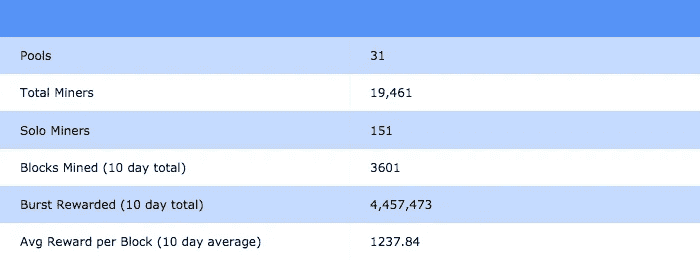
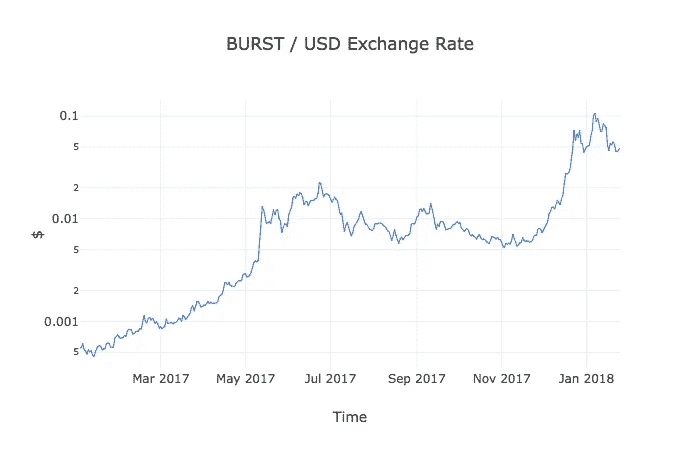

# 突发第 4 部分:网络分析

> 原文：<https://medium.com/hackernoon/burst-part-4-network-analysis-a8c1305a5750>

## 作为投资的突发网络分析和分析其他潜在加密资产的框架。


当从投资者的角度看待加密资产时，除了当前/过去的价格表现之外，还有许多方面需要考虑。在以前的帖子中，我提到过像开发团队、社区、发行结构和技术本身应该在决策中发挥作用，然而这些因素中有许多很难量化。在一个每天都有新硬币出现的世界里，许多硬币很可能注定要失败，良好的分析的重要性怎么强调都不为过。

我最近读了克里斯·伯尼斯克和杰克·塔塔尔的《加密资产》。对于那些已经投资加密货币的人，以及该主题的新手来说，这是一个很好的阅读材料。在后面的章节中，作者就如何在投资前分析不同的项目提供了一些指导。我记住了他们的一些想法，并对其中一些进行了扩展。你可以在这个 [jupyter 笔记本](https://anaconda.org/drownedcoast/burst/notebook?version=2018.01.24.2217)中查看我的计算、一些额外的分析和交互式图表。

我将使用 [burstcoin.cc](http://burstcoin.cc/pool) 、[explore.burst.cryptoguru.org](https://explore.burst.cryptoguru.org/)和 [blocks.fastpool.info](https://blocks.fastpool.info/charts) ，所有 Burst [区块链](https://hackernoon.com/tagged/blockchain)探索者，作为这些计算的来源。我还从其他网站如 [Cryptomiso](https://cryptomiso.com/) 、 [Coin Market Cap](https://coinmarketcap.com/) 和谷歌上获取了更多细节。

**注:本人并非专业投资者，以下分析不应被理解为投资建议或认可。**

*以下要考虑的因素不分先后。*

# 采矿

从网络的安全性和矿工在加密货币上的投资来看，研究加密货币开采的细节可能会令人大开眼界。例如，在 [Cryptoassets](https://www.amazon.com/Cryptoassets-Innovative-Investors-Bitcoin-Beyond/dp/1260026671) 中，作者展示了 2017 年 3 月[比特币](https://hackernoon.com/tagged/bitcoin)网络通过约 6.6 亿美元的硬件投资获得了安全保障。换句话说，这是人们通过挖掘或节点托管在加密货币的支持基础设施上投资的金额。



**矿工总数？**

从我对 burstcoin.cc 的搜集来看，在我写这篇文章的时候，有 19461 名活跃的矿工。不算太寒酸。

**池数？**

Burstcoin.cc 还报道了除了 **151** 个单独矿工之外还有 **31** 个池。


**突发网络总容量**

根据[blocks . fast pool . info](https://blocks.fastpool.info/stats)Burst Explorer，在撰写本文时(2018 年 1 月 24 日)网络的总容量大致为 **184，372** TB 或 184。虽然在过去的几天里我看到这个估计值波动高达 240 PB。举个例子，需要 223，000 张 DVD(每张 4.7Gb)才能容纳 1pb 的数据。因此，目前的网络规模约为 4100 万张 DVD。

**每名矿工的平均产能**

这个数字仍然相当低，为 9.5 TB。这向我表明，尽管有许多大型矿商，但仍有许多小型矿商参与其中。

**硬件投资成本**

我将在这里用非常笼统的数字来说明一个观点。这决不应被视为精确的测量。

```
Average Cost per TB: **$25**
Average Miner Overhead Cost (Computer): **$500**Total Capacity Cost = 25 x 184,372 = **$4,609,300**
Total Overhead Cost = 500 x 19,461 = **$9,730,500**
Total Network Cost = 4,609,300 + 9,730,500 = **$14,339,800**
```


# 供应

**现有供应**

虽然这个数字看起来有一些变化，这取决于你在哪里看，但普遍的共识似乎是，大约 19 亿已经被开采。只有**2158812800 个**突发才会存在。这意味着我们只接近尚未开采的 10%的爆发。目前锻造一个方块的方块奖励是 1220 爆，这个奖励会逐渐减少 5%。然而，只要交易仍在进行，矿商就不必担心这种报酬的降低，因为随着交易量的增加，交易费将成为一种越来越有利可图的奖励。


**富豪榜**

在研究一种加密货币时，看看现有供应的分布情况也是有好处的。例如，如果你在看一种货币，而巨额资金属于相对较少的几方，这可能是一个值得关注的原因。通过下面的图表，你可以看到，虽然有一些鲸鱼，网络的整体财富是相对分布的。


[Balance Distribution](https://blocks.fastpool.info/charts/account-balance-distribution)

# 贸易

**贸易伙伴**

在分析一些新的/不太为人所知的替代硬币时，需要注意的一点是，虽然你可能经常看到这些硬币的价格以美元等值显示。然而，你很少能根据这些数字进行交易。几乎在所有情况下，您都必须使用中间资产；通常是比特币、以太币或交易所专有的某种代币。对于 Burst 来说，主要的交易伙伴是比特币。


**价值随时间的增长**

虽然 BURST/BTC 之间的交易率相当不稳定，但由于去年 BTC 的价值增加，BURST 的美元价值也随着时间的推移而增加。



**贸易额**

由于有多少用户将他们的货币放在 exchange 钱包中，交易量很难跟踪。例如，当两个最大的突发交易所 Bittrex 和 Poloniex 在内部进行买入/卖出时，这些交易不会出现在突发区块链上，因为所有的交易所都不会离开交易所的钱包。然而，我们可以使用交易所的数据来跟踪每日交易量。


**钱包制作**

上个月，新钱包的创建数量增长了近 3 倍。然而，正如你从下图中看到的，它们从 12 月底/1 月初的高点回落。虽然新钱包的创建并不一定对应于新的爆发用户，但这仍然是一个值得关注的好指标。


[Wallet Creation](https://blocks.fastpool.info/charts/new-wallets-per-day)

**市值**

Coin Market Cap 报道的市值为 **$89，308，917.00** ，尽管这个数字与我看到的其他来源相比有点低。根据市值排名，这一估值在 20 世纪 90 年代出现了突破。

# 发展

**开发者活动**

根据 [Cryptomiso](https://cryptomiso.com/) 的数据，Burst 目前在核心开发活动方面排名第 61 位。这使它凌驾于其他更突出的项目之上，如 Stellar Lumens、Dash、比特币现金和 Ripple。根据这一消息来源，在过去的一年里，19 个不同的开发商已经提交了 486 份突发回购协议。值得注意的是，所有活动实际上是从 2017 年 7 月开始发生的，并且[活动似乎在逐渐增加](https://github.com/PoC-Consortium/burstcoin/graphs/commit-activity)。


**技术**

在我看来，Burst 最令人兴奋的一点是容量证明。不仅技术本身是新的和创新的，而且 Burst 开创了 PoC，并将继续推动它。我预见将来会有更多的项目采用 PoC 的优点。

Dymaxion 的宣布也让投机者有理由相信 Burst 将继续创新，并在可伸缩性、可用性和安全性方面取得长足进步。

# 流行

**交易所上市数量激增**

虽然 Burst 没有在所有最大的交易所上市，但它已经在少数交易所上市。虽然可用性的提高有利于吸引新的投资者，但目前的交易所似乎足以满足当前的需求。

[按交易量顺序排列](https://coinmarketcap.com/currencies/burst/#markets):

1.  Bittrex |突发/BTC |＄2，241，130 美元/24 小时
2.  波洛涅克斯 |突发/BTC |＄626，148 美元/24 小时
3.  **Livecoin** |突发/BTC |＄23596 美元/24 小时
4.  **硬币仓** |突发/兹罗提|＄1，566 美元/24 小时
5.  **C-CEX** |突发/BTC |＄567 美元/24 小时

**谷歌趋势**

受欢迎程度的另一个指标是人们尝试查找项目信息的频率。不幸的是，“Burst”在英语中是一个相当常见的词，因此很难提取 Burst 作为加密货币的有机搜索，而不是 Shopify 的[Burst](https://burst.shopify.com/)或[Burst | Mobile Video Platform-Burst](https://www.burst.com/)。


“Burst Cryptocurrency” from [Google Trends](https://trends.google.com/trends/explore?q=Burst%20cryptocurrency)

# 摘要

在我看来，Burst 最有前途的方面是使用容量证明作为差异化技术和分发的基础，Dymaxion 白皮书中提供的开发路线图，以及全面的指标的整体逐步增加。虽然许多硬币在炒作和不可持续的投机基础上飙升到月球，但 Burst 强大的开发团队，稳定的增长和有前途的技术使它成为我的长期赌注。请务必查看我剩下的技术分析和互动图表[这里](https://anaconda.org/drownedcoast/burst/notebook?version=2018.01.24.2217)。

我很想听听你如何评价加密货币投资！请在评论中留下你的想法。

如果你喜欢这个，一定要看看我在 Burst 上的其他系列。

第 1 部分— [什么是 Burstcoin？](/@aclaytonscott/burst-part-1-what-is-burstcoin-d172561aba70)

第 2 部分— [macOS 钱包设置教程](/@aclaytonscott/burst-part-2-macos-wallet-setup-tutorial-2822bb029f54)

第 3 部分— [能力验证](https://hackernoon.com/burst-part-3-proof-of-capacity-the-green-alternative-8e2651211671)

第四部分— [网络分析](https://hackernoon.com/burst-part-4-network-analysis-a8c1305a5750)

Part 5 — [如何购买爆裂](/@aclaytonscott/burst-part-5-how-to-buy-burst-5873b934ab2f)

第 6 部分— [突发动态解释](/@aclaytonscott/burst-part-6-the-burst-dymaxion-90f8e5c69a75)

*捐赠总是令人感激的:*

*突发***突发-Q944–2my 3–97ZZ-FBWGB*

BTC * * * 1 kumjdvx 8 fgtpsz 49 NX MML 9 up wux8g 6k 7