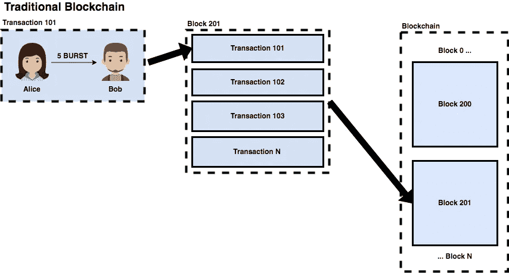
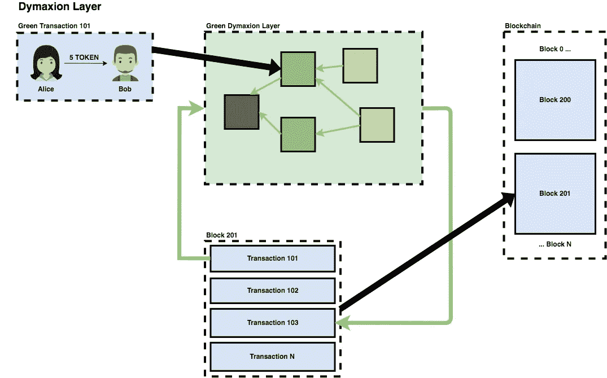

# 爆发第 6 部分:爆发最大值

> 原文：<https://medium.com/hackernoon/burst-part-6-the-burst-dymaxion-90f8e5c69a75>

## 如果你对爆裂做过研究，你可能听说过这个术语——我来解释它的意思。

Dymaxion 这个术语是由巴克明斯特富勒在 20 世纪 30 年代早期写的，作者是 T2。这适用于他一生中的大部分工作。Dymaxion，一个[单词的组合词](https://www.wikiwand.com/en/Portmanteau)***dy****namic*，***max****imum*，以及*tens****ion***；总结了他的工作目标，“以最小的能量投入获得最大的利益。”从某种意义上说，他不仅试图推销他的设计，而且还总结了他的整个设计哲学。

PoC 联盟(POCC)在 2017 年末的一条关于最近更新版本的 Burst 开发路线图的神秘推文中首次提到了与 Burst 有关的“Dymaxion”。POCC 继续在 2017 年 12 月 27 日全面解释了 Dymaxion，发布了[突发 Dymaxion 白皮书](https://www.burst-coin.org/wp-content/uploads/2017/07/The-Burst-Dymaxion-1.00.pdf)和几篇后续博客文章，详细研究了白皮书的部分内容。

简单介绍一下背景，PoC 联盟(POCC)是一群[熟练的数学家、计算机科学家和开发人员](https://www.burst-coin.org/contributors)，他们是 Burst 在技术发展和方向方面事实上的领导者。虽然他们可能会指责被贴上社区领导者的标签，但社区内的大多数人都会同意，该组织的技术专长和发展路线图给了 Burst 新生。

# 那是什么呢？

简而言之，Dymaxion 是 POCC 给他们认为的爆裂计划的第二阶段起的名字。他们还表示，Dymaxion 不是一个特定的功能、增强功能或合作关系，而是支持更强大、功能更丰富的 Burst 版本的基础，这将使它成为合作伙伴和真实世界使用的更有吸引力的选项。

分解到它的组成部分，Dymaxion 可以被认为是两个主要功能集的组合:

*   支付渠道
*   匿名

我将分解这些特性的含义，它们将如何实现，以及为什么这些战略变化使 Burst 作为一个平台更有吸引力。

# 支付渠道

> “尽管加密货币在技术上很优雅，也有很多可能性，但由于两个关键因素:可用性和可扩展性，加密货币缺乏大规模采用。虽然可用性可以通过充分的工程和开发努力来解决，但可伸缩性本身通常是一个理论问题。”— POCC

支付渠道的理念是 Burst 发展的最大推动力。POCC 写道，将近十年前推出比特币时，它是革命性的，因为它解决了分散信任的普遍问题。然而，它(比特币)不是全球数字货币的直接解决方案，部分原因是每秒交易量(TPS)较低，估计每秒交易量为 3-7 次。

虽然新的“第二层”技术，如[闪电网络](https://www.wikiwand.com/en/Lightning_Network)将允许比特币克服其中一些限制，但它们也有自己的包袱，如节点正常运行时间和交易费用。最后，随着比特币越来越被视为更类似于价值的数字存储，而不是日常交易的货币，它的形象可能不再适合作为全球数字货币。

很明显，仍然需要一种高度可扩展的货币，能够支持每秒数千甚至数百万的交易。

Burst 旨在通过使用其他加密货币项目引入的各种技术的新组合来解决这一可扩展性问题。我将在下面逐一探讨。

**纠结**

从 [IOTA 白皮书](https://iota.readme.io/docs/whitepaper)中借来的，Tangle 是他们给有向无环图(DAG)取的名字，IOTA 用它来代替传统的[区块链](https://hackernoon.com/tagged/blockchain)。

> tangle 的主要思想如下:要发布一个事务，用户必须努力批准其他事务。因此，发布交易的用户为网络安全做出了贡献。假设节点检查批准的事务是否不冲突。如果一个节点发现一个事务与该纠纷历史相冲突，该节点将不会以直接或间接的方式批准该冲突的事务。

**雷电网络**

闪电网络(LN)于 2016 年初在[闪电网络白皮书](https://lightning.network/lightning-network-paper.pdf)中首次提出，作为比特币可扩展性问题的解决方案。作者在论文摘要中总结了 LN 背后的基本思想:

> 提出了一种分散式系统，通过该系统，交易通过小额支付通道(也称为支付通道或交易通道)网络发送，其价值转移发生在区块链境外。

**着色**

2012 年末， [BitcoinX 白皮书](https://bitcoil.co.il/BitcoinX.pdf)首次讨论了彩色硬币。基本思想是标记或“着色”比特币地址，以表达关于交易的附加信息，这允许交易表达纯粹交易信息之外的附加细节。

> 彩色硬币是一个旨在置于比特币之上的概念，创建了一组关于正在交换的硬币的新信息。使用彩色硬币，比特币可以被“着色”成特定的属性。这有效地将它们变成了标记，可以用来表示任何东西。— [丹尼·布拉德伯里](https://www.coindesk.com/colored-coins-paint-sophisticated-future-for-bitcoin/) 2013 年

**将所有这些整合在一起...**

那么，这三项技术是如何让 Burst 成为高度可扩展的支付平台的呢？幸运的是，由于上述所有技术都已经存在，并以某种形式投入使用，任务就变成了工程、编排和验证，而不是进行理论研究。

简而言之，每个突发节点将运行一个突发 Dymaxion 守护进程(bdd)实例。这个 bdd 本质上将扮演闪电网络节点的角色。bdd 将参与 Dymaxion 层(DL)的实例化(打开)和定居(关闭),这是给有色缠结的术语。这种设置将允许 tangles 在一个时间段内被打开，并被安排在预定时间后关闭，从而允许独立于区块链的支付通道在短至一个时间段、长至几天或几周的时间段内存在。

节点运营商将有能力配置他们想要参与哪个 DL(即有色缠结),因此运营商将能够在突发区块链之上运行他们自己的支付通道和令牌。因为每个 DL 中的事务将由参与节点而不是突发区块链本身来结算，所以这些事务不会对突发的总 TPS 容量有贡献，从而允许理论上无限的事务容量。

为了形象化这个结果，你可以把 DLs 想象成他们自己的支付网络，每个都允许他们自己的规则和令牌，由更大的突发网络和区块链提供动力和安全保障。一家公司、一群公司，甚至一个个人都可以推出自己的加密货币，而没有启动传统加密货币的技术复杂性、费用和缺陷。这不仅更容易做到，而且由于它依赖于突发区块链和采矿过程，它也将比大多数加密货币更加环保和安全。

**示例突发交易(即传统交易)**

**示例突发事务(Dymaxion 层)**

# 匿名

Dymaxion 计划不仅仅局限于高交易能力和支付渠道，它还将包括新的匿名功能，以加快其他流行的匿名加密货币，如 [Monero](https://getmonero.org/) 或 [Zcash](https://z.cash/) 。

虽然比特币和许多其他加密货币经常(错误地)被认为允许用户匿名消费，但事实上它们实际上充其量只是伪匿名。在任何开放的区块链，虽然钱包的实际主人可能不为人知，但交易本身和财富的流向很难追踪。隐私币旨在通过巧妙使用加密技术来实现真正的匿名。

**戒指签名**

环签名是一种加密技术，最著名的是由 Monero 使用，以提供交易中的匿名性。

> 在密码学中，环签名是一种数字签名，可以由一组拥有密钥的用户中的任何成员执行。因此，用环签名签名的消息是由特定人群中的某个人背书的。环签名的一个安全特性是，确定使用哪个群成员的密钥来生成签名在计算上是不可行的。

**zk-SNARK**

zk-SNARK 的结果类似于环签名，尽管不太容易访问，但它是一种证明结构，被 Zcash 用来提供匿名性。

> 首字母缩写词 zk-SNARK 代表“知识的零知识简洁非交互论证”，并且指的是一种证明结构，其中可以证明拥有某些信息，例如密钥，而不泄露该信息，并且在证明者和验证者之间没有任何交互。

**用于实践……**

实际上，在创建新的 DL (tangle)时，可以选择配置这些匿名技术。这意味着匿名事务在 Dymaxion 层内是可能的，但是真正的匿名事务在突发区块链上是不可能的。

# 我们现在在哪里？

在撰写本文时， [BRS 2.2.0“前 Dymaxion”](https://github.com/PoC-Consortium/burstcoin/releases/tag/2.2.0)版本的 BRS 软件刚刚由 POCC 发布。这一变化包括许多功能，包括支持 PoC2、多输出交易、动态交易费用和增加的块容量。[预 Dymaxion](https://www.burstcoin.ist/2018/05/04/1st-hard-fork-explained-changes-in-transaction-dynamics/) 版本是支持 Dymaxion 的第一个硬分叉，支持上面描述的所有变化。

如果你喜欢这个，一定要看看我在 Burst 上的其他系列。

第 1 部分— [什么是 Burstcoin？](/@aclaytonscott/burst-part-1-what-is-burstcoin-d172561aba70)

第 2 部分— [macOS 钱包设置教程](/@aclaytonscott/burst-part-2-macos-wallet-setup-tutorial-2822bb029f54)

第 3 部分— [容量证明](https://hackernoon.com/burst-part-3-proof-of-capacity-the-green-alternative-8e2651211671)

第 4 部分— [网络分析](https://hackernoon.com/burst-part-4-network-analysis-a8c1305a5750)

第 5 部分— [如何购买 Burst](/@aclaytonscott/burst-part-5-how-to-buy-burst-5873b934ab2f)

*捐赠总是令人感激的:*

*Burst * * * Burst-Q944–2my 3–97ZZ-FBWGB*

BTC * * * 1 kumjdvx 8 fgtpsz 49 NX MML 9 up wux8g 6k 7