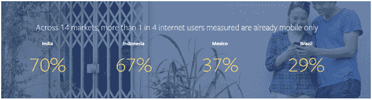
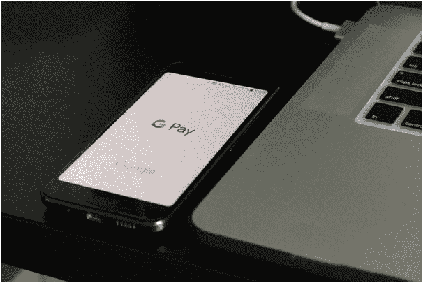
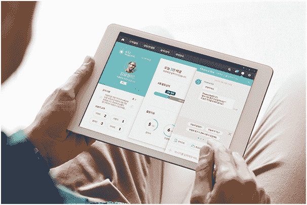
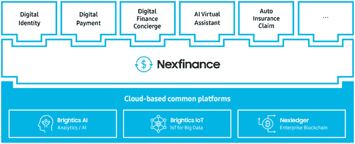
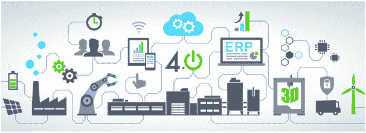

# 商业巨头转向区块链、聊天机器人和识别需求:为什么这对任何规模的企业家都很重要

> 原文：<https://medium.com/hackernoon/business-giants-turn-to-blockchain-chatbots-and-recognizing-needs-why-it-is-important-for-8a6787310b00>

每项技术都有其先驱。有趣的是，不管是什么样的商业领域，每个人都时刻准备着掀起一场革命。这产生了一个悖论:企业家们建议彻底改造某个特定的商业领域，而不是专注于发展——这有点像一张单程票，是一场对所有人都不利的革命。

Source: [https://www.facebook.com/iq/](https://www.facebook.com/iq/)

如果你:独自发展你的业务，没有创新就无法生存，或者只是喜欢冒险，你会对这样的情况感到满意。但对中型甚至大型企业来说，这可能是致命的。

随着创新发展速度的加快，企业采用创新所需的时间也会缩短。消费者比产品和服务制造商转换得更快。预计到 2018 年底，全球 78%的智能手机用户将使用信使。根据 eMarketer 的“手机短信应用用户”调查，这一数字预计将会增长:到 2021 年，全球手机短信应用用户群将增长 23%以上。

这给企业带来了新的挑战。仅仅指出目标受众是不够的。这种情况必须从消费者的角度来看。您的客户每天数百次使用各种各样的数字技术。他们希望企业做好准备，并对这种趋势做出相应的反应。根据“思科视觉网络指数”报告，到 2020 年，一半的人类将使用互联网。此外，智能手机用户群将扩大到 30 亿用户，连接到万维网的设备数量将达到 300 亿件。

用现代标准衡量，你的业务领域有多传统并不重要。即使是卖古董的，也要做好数字化转型的准备。如果你被成为先锋的视角所衬托，也不用担心。这个过程已经对这个星球上最大的公司产生了影响。他们是如何开始适应的？用付款！

Source: [https://unsplash.com/photos/rQRKEu9HnZo](https://unsplash.com/photos/rQRKEu9HnZo)

消费者发现了新的便捷支付方式，例如:非接触式支付(Google Pay、Apple Pay、Paypass)、聊天机器人交易、在线即时支付等。但在这一切的背后，一个庞大的金融行业需要一个重大的更新。

不要简单地在星巴克买一杯拿铁，试着用一张卡或智能手机补偿在中国购买一家工厂。除了法律方面的问题，这样的交易需要几十个甚至几百个金融专家的参与。在任何情况下都不会很快发生。

金融科技初创公司的很大一部分都在致力于促进和加速国际支付。投入大量精力的不仅是开发支付方式，还有投资和融资方式。

大公司每天都面临这些任务。三星 SDS(韩国公司的 IT 部门)正在开发他们自己的[金融平台 Nexfinance](https://www.samsungsds.com/global/en/solutions/off/nexfinance/nexfinance.html) 。这项服务包括区块链的数字识别、资产管理和保险服务交付系统，以及一个虚拟聊天助手。

Source: [https://image.samsungsds.com/global/en/solutions/off/nexfinance/usecases/__icsFiles/afieldfile/2018/06/15/usecase_nexfinance_02.jpg?queryString=20180615041541](https://image.samsungsds.com/global/en/solutions/off/nexfinance/usecases/__icsFiles/afieldfile/2018/06/15/usecase_nexfinance_02.jpg?queryString=20180615041541)

早些时候，三星 IT 部门推出了基于区块链的 Nexledger 平台，目标是降低数字交易执行所需的费用。该系统建立在区块链的基础上，可以监控每年价值数百亿美元的全球出货量。根据 SDS，该系统能够减少 20%的递送费用。

上述两个平台都采用了分布式账本、人工智能和大数据分析技术。Nexfinance 的使用将有助于公司的财务部门更有效地管理金融行业形势。

[https://image . samsungsds . com/global/en/solutions/off/NEX finance/platform/_ _ ics files/afieldfile/2018/06/15/NEX finance _ module _ en _ w . jpg？queryString=20180615041541](https://image.samsungsds.com/global/en/solutions/off/nexfinance/platform/__icsFiles/afieldfile/2018/06/15/nexfinance_module_en_w.jpg?queryString=20180615041541)

装运管理系统意味着与运输公司的互动，包括海运渠道。根据国际机器公司的数据，集装箱运输单据的费用是内陆运输的两倍！区块链技术减少了与港务局协调发送文件所需的时间。因此，相应的费用也减少了。

Source: [https://unsplash.com/photos/McJiW-KuOoA](https://unsplash.com/photos/McJiW-KuOoA)

[SDS 计划在 2018 年处理 488 000 吨](https://www.ccn.com/samsung-electronics-turns-to-blockchain-to-manage-its-global-supply-chains/)空运货物。因此，产品发布和实际发货之间的停机时间将会减少。这将允许更有效地感知和分析竞争产品，并将消费者的胃口转移到发展中市场，如中国市场。

基本上，你的需求预测工作正在进行。一旦产品被展示出来，你就不必像 Kickstarter 的支持者那样等到它出现在商店里。这些技术使得对需求立即做出反应成为可能。无论你生产什么类型的产品，这种方法都会带来很多好处。

与行业瓶颈的斗争涉及技术解决方案(区块链)、新的用户交互方法(信使和聊天机器人)——所有这些都是我们一直在等待的数字转型。

数字化转型不仅仅意味着运输程序和支付流程的改进。这意味着整个业务结构的改革，随着时间的推移，不断改进产品市场引入流程。

你不仅可以在区块链记录所有相关信息。你创造了一个案例，你可以从整个供应链的完全透明中获得反馈。

来自不同合作伙伴的技术生态系统可以相互连接。你的企业将能够挑选出符合你企业目标的合作伙伴。无论是商业、运输、制造、it 公司还是政府机构，任何类型的行业都会从中受益。

如果你一直在等待一个特殊的信号，指出技术在本质上不再是排他性的，并开始定期出现，它肯定在这里。IT 公司将被我们所知的商业所追随——从电子产品制造到街角的自助餐厅。

Source: [https://s1.kaercher-media.com/media/image/file/18797/d0/industry-4-0.jpg](https://s1.kaercher-media.com/media/image/file/18797/d0/industry-4-0.jpg)

没有最大的公司参与，创新者承诺的革命不会发生。他们正致力于开发一种结合物理技术(从 3D 打印到机器人和无人机的一切)和数字技术(人工智能、区块链和大数据)的能力，以创建快速响应系统。反过来，这些将连接工厂工人、合作伙伴和制造方，以创造出最好的产品，然后交付给客户。

工业 4.0 (Industrie 4.0)为基于全球商业物联网和服务网络的智能制造概念铺平了道路。这个概念将产生这样的情况，产品和生产它们的机器将相互交换信息，有时甚至比人脑处理信息的速度还要快。

无论你在企业中处于什么位置，都要为变化做好准备。反过来，我们为各种规模的企业家准备了五条建议:

1.  **成为生态系统的一部分。**如果你只是在媒体上读到别人的整合，你不会真正承认自己的优势。想想区块链如何改变你的公司。不是为了跟上潮流，而是为了让[成为更](https://chatbotsmagazine.com/chatbots-and-blockchain-our-way-to-superintelligence-4ff34fc5b811)的一部分。
2.  让你的客户熟悉机器人。聊天机器人[如今不断被整合](https://www.forbes.com/forbes/welcome/?toURL=https://www.forbes.com/sites/shephyken/2017/12/17/will-ai-take-over-the-world/&refURL=&referrer=#397a860d5401)。不要争论哪种类型的聊天机器人将在未来占据主导地位(语音助手、基于 AR/VR 的聊天机器人或其他)，而是采用现有的人工智能行业最佳实践。这是一个不应该被推迟的时刻。它将向您的客户清楚地展示您是如何跟上未来发展的。机器人将帮助你更好地了解你的目标受众。不要害怕使用这样的能力！
3.  **扩大你的期望。当脸书在 messenger 中集成聊天机器人时，没人知道会有多高的人气增长率。目前，机器人每月进行超过 10 万次对话。社交网络已经成为日常生活的一部分，而没有专用 Instagram 账户的品牌不再“足够现代”。给用户他们想要的。联系他们，推广你的服务。我们生活在可以去太空的时代，而不是谈论通过聊天机器人给最喜欢的品牌写信的能力。**
4.  为革命做好准备。 [想象未来](https://chatbotsmagazine.com/why-revolution-of-ai-bots-blockchain-is-the-future-of-business-e3a50a3bc7e7)。我们正以最快的速度接近奇点，开发人工智能，利用神经网络预测客户需求，并为访问火星做准备。不要错过你成为历史的一部分的机会！
5.  **今天开始。有很多方法可以改变这个世界，同时又不会失去已经获得的信任。创建你自己的聊天机器人公司。开始[通过 Instagram](http://www.flashfunnel.co/) 与顾客互动。考虑整合区块链。帮助拉近未来！**

> [**用白标版大脑创办自己的聊天机器人公司**](https://brn.ai/botfabrik)

[**——亚历克斯·加莱特**](https://www.linkedin.com/in/techfunder/) CEO [大脑(brn.ai)](https://brn.ai/)