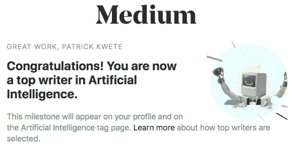
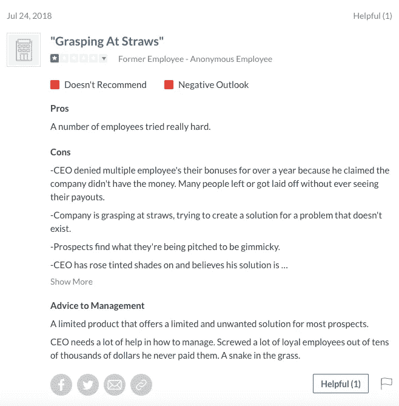

# 与表情符号首席执行官特拉维斯·蒙塔克(Travis Montaque)合作:风险投资毒性，为世界提供表情符号分析

> 原文：<https://medium.com/hackernoon/business-with-emogi-ceo-travis-montaque-venture-funded-toxicity-to-give-the-world-emoji-analysis-2af71f6bf57>

***更新:*** 这是我在加入 [Hackernoon](https://medium.com/u/4a8a924edf41?source=post_page-----2af71f6bf57--------------------------------) 并成为人工智能领域顶级[媒体](https://medium.com/u/504c7870fdb6?source=post_page-----2af71f6bf57--------------------------------)作家的路上的第一篇媒体文章。这是一个影响今天许多人的问题。当时，我选择写下并分享我的故事，因为我确实相信科技行业的好处，但如今这种好处似乎更像是一个古老的神话。当掠食者认为他们的行为永远不会被公众所知时，他们就会利用别人。当时签署了保密协议(NDA)，这让我很难接受，所以我撤下了我的职位，专注于继续我自己公司的工作。从那时起，我的 NDA 过期了，现在所有的文件都可以发布了。如果我们继续让不道德的人登上我们的最高舞台，那么不公正将继续在我们的行业中发生。我很幸运有一个声音&很多选择，但许多发现自己处于类似位置的人没有。我希望 Emogi 在终止我们的合同后决定做正确的事情并做得更好，这有很多原因，但 2018 年 7 月 24 日的 Glassdoor 评论显示并非如此:

Emogi CEO Travis Montaque: “*A snake in the grass.”*

幸运的是，保密协议过期了。

**原帖:**
2017 年 9 月 28 日星期四本应是一个重大里程碑。这是我的[创业公司的](http://www.expatinc.com/)平台 [Market Sensei](http://stockmarketsensei.net/predictions.php) 的 5000 注册用户标志的十字。相反，我花了一年多的时间，在自举(没有接受外部资本)平台的过程中，这个平台成为一家风险投资支持的科技公司的牺牲品，该公司用“表情符号分析”来“让世界变得更美好”。

这家名为[Emogi](https://twitter.com/emogi_inc)的公司欠了我/我的初创公司一万多美元的未偿发票和债务。因为他们在处理以前的付款上的迟缓和许多其他的问题使与他们一起工作变得难以忍受，我已经终止了与他们的合同。在一个多月的时间里，所有从他们的应付款账户和产品副总裁[彼得·埃尔巴奥](https://www.crunchbase.com/person/peter-elbaor)那里获得付款的礼貌尝试都没有成功。我确信这一定是员工的疏忽，而不是公司的运作方式，于是我又发了一份请求，抄送给了公司的首席执行官[Travis monta que](https://www.crunchbase.com/person/travis-montaque)先生。我以为他们的首席执行官会很快解决这个问题，并确保他的公司依法正常运营。令我惊讶的是，他回应说，我接受付款的尝试是“可悲的”。

他说，我的病人试图跟进一万多美元的债务，其中总是包括像“请”和“友好”这样的友好词语，而“不尊重”和“骚扰”。不仅如此，他还抄送给了他们的多位法律代表，并威胁说，如果我坚持的话，他们就会来找我。我非常震惊，因为这是一位首席执行官在我终止合同的前几天要求我花更多的时间为他们提供服务。所有这些人之间完全缺乏同理心让我措手不及。和许多受害者一样，我开始自责，并感到尴尬。尴尬的是，我可能让这种事情发生在我身上，我甚至不知道我能做些什么。我无法相信他们如此确定他们可以这样对待别人，不履行他们签订的合同中的财务责任。他们毫不怀疑，他们可以继续在科技行业做生意，继续在行业视而不见的情况下从投资者那里筹集资金。我认为这很荒谬。但是，当我在网上搜索并看到新闻媒体最近称赞他们与谷歌键盘的新伙伴关系时，我意识到我可能是局外人。我可能是个傻瓜，以为这样一家公司的行为会对一个人产生影响。我很幸运地处于一个财务安全的位置，但我知道有许多努力工作的人甚至可能无家可归地流落街头，如果他们花时间在一家公司选择扣留他们这么多钱几个月。

我一大早就回复了他的邮件。我感谢他抄送给他们的律师和法律团队。我还继续与他们的法律团队分享合同以及我在科技行业的背景。除了我的创业，我的背景还包括:

—成功地从一位非常受人尊敬的投资者那里筹集了资金，这位投资者监管着一家年收入接近 1 亿美元的公司。

Salesforce 收购的产品的早期开发。

—我是一个顶级开发教程网站的常驻作者。为此，我计划在他们的顶级开发者大会上就机器学习的重要话题发表演讲。

我还提供了事件的细节，给了律师一天时间向 Emogi 的首席执行官提出建议，然后告诉我他们是决定处理付款还是扣留它。我还问法律团队，如果他们提供的服务的超过 10，000 美元的付款被扣留，他们会怎么做。我仍然处于震惊之中，一整天都无法工作。我试着花一天时间做一些其他的好事，比如下午在[弹性编码员](http://www.resilientcoders.org/)做志愿者。到那天结束时，我还没有得到 Emogi 的答复，试图通过电话联系他们也没有得到答复。我以为他们决定把它变成一个法律问题，所以我打电话给他们的律师。然而，他们的律师拒绝和我说话，并挂断了电话。然后我看到了一个 gmail 通知，似乎表明他们已经删除或取消了对我在整个合同期间使用的“@emogi”电子邮件的访问，阻止我访问关于我向他们提供的服务的价值的额外证据。幸运的是，我通过我的私人电子邮件提出了支付请求，并且电子邮件链仍然可用。

最糟糕的是，他们知道如果他们可以对我这样做而不受惩罚，我是另一个拥有成千上万用户和持续媒体报道的初创公司创始人，那么他们也可以对任何人这样做而不受惩罚。所以，我开始思考人工智能可以用来帮助处于这种境地的人的不同方法。我会免费提供这个人工智能，并且永远不会收费。如果人们不能获得正义或保护自己，那么法律还有什么用？我反思了我是如何运营我的初创公司的，看看我是否需要改变任何对我的用户、承包商或投资者来说似乎是掠夺性的东西。然后，我重温了与 Emogi 的合同以及纽约州的法律，以了解我现在可以做什么。

我发现纽约市长比尔·白思豪最近颁布了“[自由职业不是自由的法案](https://www1.nyc.gov/site/dca/about/freelance-isnt-free-act.page)”，这不仅赋予我双倍或三倍的扣缴金额。它也保护我免受表情符号的报复。幸运的是，这条法律在我合同生效前两周左右生效了！我仍然希望 Emogi 团队能看到一些曙光，但我知道这只是一厢情愿，所以我会及时让法律系统为我的案件做工作，并验证这是否是 [Emogi](https://www.emogi.com/) 的行为模式。

如果我的合同的管辖法律不是纽约州的法律，一个有这个明确的新法案的州的法律，我就不可能得到任何公正&我甚至不能分享我的故事。有许多人已经并将成为受害者，因为技术行业，从投资者、企业家、公司和媒体一直放任这些事情发展，直到为时已晚。有多少人需要[忍受初创公司和](https://www.susanjfowler.com/blog/2017/2/19/reflecting-on-one-very-strange-year-at-uber)[行业](https://www.nytimes.com/2017/06/30/technology/women-entrepreneurs-speak-out-sexual-harassment.html?mcubz=3)不可原谅的行为，才能清楚地表明，再多的资金也不能让高管凌驾于法律之上？我的人工智能初创公司专注于增强人们的能力和机会，而不是取代他们。因为，至少我相信，毁掉别人的工作一点都不酷。但问题是:如果像 Emogi 这样的公司现在(在别无选择的情况下)乐于恶意虐待人们，那么一旦人工智能足以替代人工智能，他们会对人们做什么？