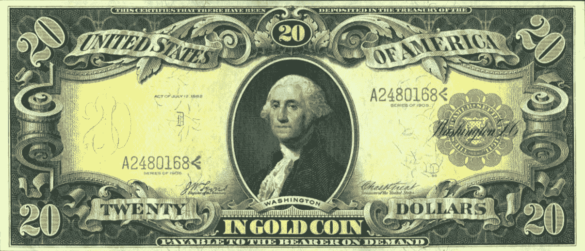

# “但是，它没有任何后盾？”

> 原文：<https://medium.com/hackernoon/but-its-not-backed-by-anything-bafdf968a86d>

反对比特币的一个最常见的理由是，它没有任何东西支持。它的价格只是猜测。但是，对于一项资产或一种货币来说，首先由某种东西支持意味着什么呢？为了找到这个答案，我们首先需要挑战什么是有价值的东西。毕竟，如果一件事要由另一件事来支撑，那件事最好是有价值的。像金子一样。黄金为什么有价值？它有价值是因为你可以用它做珠宝还是因为它有价值而用它做珠宝？你不能吃它，它对人类的其他基本需求也不是很好。那么是什么让它有价值呢？

人们在思考价值时忽略的一个基本事实是，价值总是*主观的。没有一样东西对一个人来说和对另一个人来说价值相同，不管价格是否相同。价格对富人来说是一回事，对穷人来说又是另一回事，因为他们为了得到一样东西所牺牲的时间和精力在两者之间是不同的。债务和复利之类的东西在这里也发挥着巨大的作用。除此之外，用任何法定货币定价的东西的价值会随着时间的推移而变化，因为货币的价值会不断被通货膨胀稀释。某物的价值可以归结为两个不同的变量，供给和需求。对于购买者来说，供应总是*客观的，而需求总是*主观的。对于用来进行交易的交易媒介或货币类型也是如此。金钱只不过是我们用来表达我们对彼此的主观价值的语言。***

那么“被某个东西背”是什么意思？基本上，这是一种保证，即正在使用的令牌将可在以后的某个时间点兑换其他一些已被证明能保持其价值的东西。过去，世界各地的货币都可以兑换一定数量的黄金，但现在，任何法定货币都不能兑换黄金。自 1971 年尼克松总统决定将美元与黄金脱钩以来，美元就不再是当今世界的储备货币了。从那天起，美元的价值就一直得到美联储银行和美国政府(现任总统是唐纳德·特朗普)的支持。

大约 5000 年来，黄金已经被证明是一种很好的价值储存手段。它之所以有价值，是因为很难再生产更多。当一项资产的价格上涨时，生产更多的资产就变得更有利可图。这反过来导致更多的资产被生产出来，增加供给，从而再次降低价格，直到达到平衡。就黄金而言，与尚待发现的相比，已经从地下开采出来的数量是很高的。这意味着，尽管产量增加，黄金价格的上涨不会导致可供销售的黄金总供应量的显著增加。随着时间的推移，正是黄金的高库存与流动比率使其成为如此好的价值储存手段。对黄金的需求在不断变化，但其供应却相对稀缺。

比特币*绝对*稀缺。尽管你不能用比特币制造珠宝或其他任何东西，但它的总供应量是*固定的*。2140 年后，在最后一个比特币被开采出来后，流通中的比特币总量只能*下降*。这种有限的供应是过去的金本位制存在的初衷。不过比特币的局限性要大得多，因为它们会随着时间的推移而消失。由于供应如此有限，所以*当前需求是多少并不重要*。由于这种供求关系，其价值的潜在上升空间实际上是无限的。其他货币拥有的“支持”只是为了向人们保证货币将随着时间的推移保持其价值，而确保这一点的唯一方法是限制供应。比特币在这方面做得比之前的任何东西都好。列奥纳多·达·芬奇的原画极其珍贵，因为只剩下 13 幅了。总有一天，比特币会少于一枚。

比特币不需要任何东西做后盾。相反，任何东西都可以由*支持的最好的东西是*比特币，因为比特币是绝对稀缺的，同时又是完全可编程的。