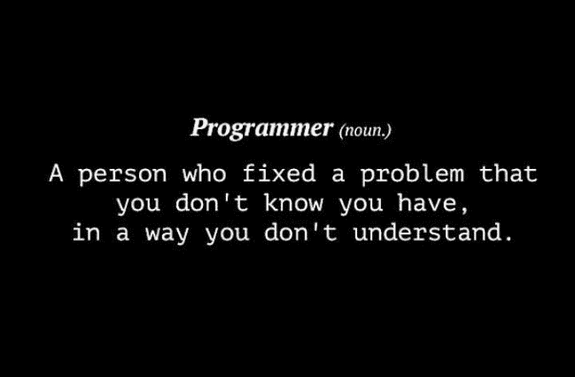

# “但这是你的专业。”那又怎样？

> 原文：<https://medium.com/hackernoon/but-its-your-major-so-what-df5eb280f5d9>

## *大学如何让学生重新审视他们对编程的热爱*

photo by [MochiMagazine](https://www.mochimag.com/mochi-magazine//college-majors-101-how-to-choose-the-right-major-for-you)

自从上大学以来，我已经听了太多遍这句话，我不禁觉得，对于那些试图发现自己激情的人来说，这似乎是一种耻辱。

我目前是纽约大学坦登工程学院大一新生，第一学期，我是一个学计算机科学的亚洲人。我喜欢参加黑客马拉松——不是为了 Soylent，也不是为了免费食物，只是为了学习。我的电脑桌面上堆满了克隆的 GitHub 库，我的 CPU 经常被未关闭的终端窗口、崇高的文本文件和 StackOverFlow 标签占用。我的笔记本电脑外壳贴满了贴纸，这些都是我从黑客马拉松上获得的。

计算机科学学生的经典、真实的教科书示例。或者，正如非 STEM 专业学生可能认为的那样，

> “恶，真讨厌。”

但对我来说，不仅仅是一名硅谷学生。我非常喜欢羽毛球，我喜欢旅游，我喜欢摄影。我在某种程度上紧跟时尚潮流，并且花了大量的时间对最新的食物狂热垂涎三尺。我可能更喜欢晚上出去，享受和朋友在一起的时光，但也喜欢晚上呆在家里，享受属于自己的时间或做我一直想完成的项目。

*Photo by ESB Professional on Shutterstock*

photo by [Stocksy by Lumin](https://www.stocksy.com/347002/programmer-writing-a-computer-code-at-his-office-at-night)

这就是为什么当人们看着我并立即做出假设——无论是关于我的生活方式，还是我的行为倾向——这让我感到好奇。

> 如果我的生活方式不适合计算机科学怎么办？

对于了解或关注我的人来说，他们知道我确实非常喜欢[节目](https://hackernoon.com/tagged/programming)。我经常用两个词来总结过去两年:编程和黑客马拉松。回顾那些年，许多最普遍的时刻主要与之前提到的话有关:看着我自己的[黑客马拉松](https://hackernoon.com/tagged/hackathon)拔地而起并成为国际参与者，和我现在最有价值的朋友之一参加大约许多黑客马拉松，并在 Medium 上学习调谐到我的内心想法。

对你自己来说，就像对许多其他人一样，你的经历可能是相似的。生活可能围绕着编程，但在到达某个点后，我发现许多人会进入一个不确定的时期。虽然各行各业的人都存在这种危机，但我发现对像我这样的人来说尤其糟糕，他们在自己的行业投入了大量时间，并在自己选择的领域拥有丰富的经验。对他们来说，他们已经达到了相当于中年前的危机。

然而，当这些“先进”的学生与这些新发现的思想斗争时，他们的生活突然被大学带来的生活方式的改变打断了。新的责任突然出现，吞噬了他们用来追求技艺的时间。FOMO，或者说是对错过的恐惧爬了上来，突然之间，在闲逛之后小睡一会儿似乎比花更多的时间去追求他们的激情更有吸引力。

me.irl — photo by [SimpleProgrammer](https://simpleprogrammer.com/good-nights-rest/)

每天都充满新的期望的生活开始变得单调乏味。曾经让生活变得激动人心的炽热激情已经变得黯淡无光，只剩下灰烬，未被触及，未被打扰。

对我自己来说，也许我过去的生活方式比我现在更适合社会对程序员的印象。但是现在，除了编程带来的令人上瘾的满足感，我发现了生活中更多的乐趣来源。

这有错吗？**我不知道**。这个问题可能没有单一的、具体的答案。我有许多兴趣，许多未完成的任务还没有从我的遗愿清单上划掉。但是，我觉得进入大学后，我的观点发生了变化。我不再是过去的我，这是否让我成为一个全面发展的人，我不会让任何人来判断，除了我自己。

然而，我知道当我表达我对与我专业相关的课程的不确定性或困难的看法时，我经常会得到不同的反应。有的无动于衷，有的，只把我当程序员看，很迷茫。

> “你不是程序员吗？你难道不知道这一切吗？”

这些评论经常让我大吃一惊。仅仅因为我以前有一些编程经验，我就应该轻松地通过所有与计算机科学相关的课程吗？我不禁环顾四周，看到其他人，没有“经验丰富”的背景，似乎毫不费力地完成任务。因此，冒名顶替综合症很快出现，滋生不确定性，导致频繁的转专业想法。

许多人进入大学时，几乎没有本专业的工作经验，有些人选择仅仅是因为工作前景或“听起来很酷”由于这一决定的自发性，转专业一次，甚至两次的做法并不是闻所未闻。然而，在众多的困惑中，因为我在编程上投入了过去两年的时间，我时常觉得转专业的选择闻所未闻。

*photo by* [*h3x0m4nia on devRant*](https://devrant.com/rants/152202/programmer-noun)

但是不，如果有选择的话，我不想转专业。对我来说，学习的过程本身就像一个谜题，我觉得只有当你遇到这些障碍时，你才是在学习。无论是砸我的键盘，想知道为什么 pip 不能正确安装，还是意识到我完全搞砸了一个实现，当找到解决方案时，多巴胺的冲动比我所知道的任何其他事情都要大。

我的具体案例虽然不适用于许多人，但却让我酸溜溜地盯着程序员身上的期望。虽然许多人可能很容易适应社会对程序员形象的塑造，但我发现，对于那些分享其他兴趣的人，以及那些仍然在寻找自我的人来说，重要的是要知道，仅仅因为我们可能不符合社会的塑造并不意味着我们比那些符合社会的塑造的人差。

> "仅仅因为我是程序员，并不意味着我能修理你的电脑."

虽然我们现在可能无法修复你的键盘，但经过一番努力，一切皆有可能。正因为我在我喜欢的学习领域学习时遇到了阻力，我非常满足于知道我是比昨天更好的自己。

所以，给那些做出上述假设的人一句话:把你的期望留给自己。过你自己的生活，我过我的。不管我是出去玩还是探索世界，我知道我会过上最好的生活，你也应该过上最好的生活。