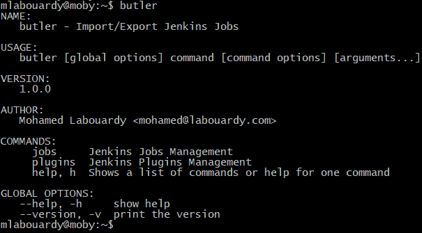
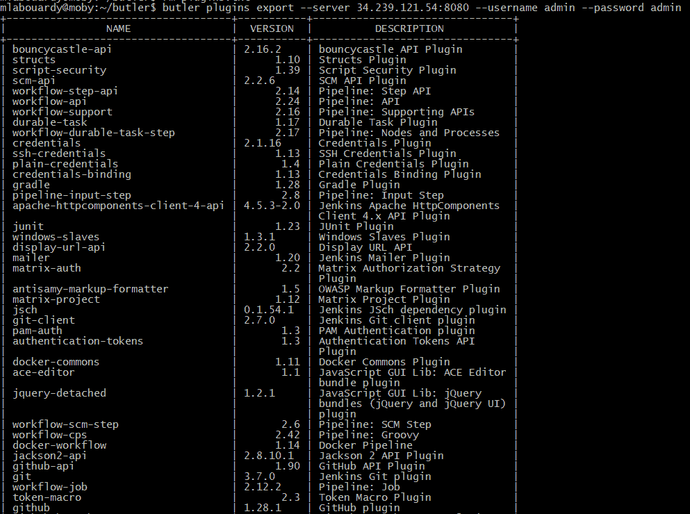
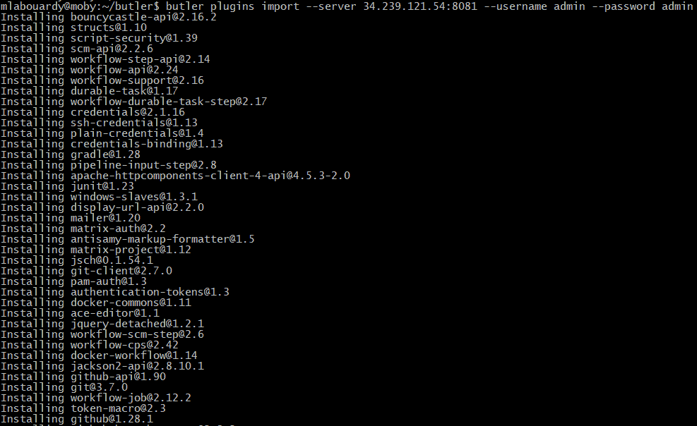
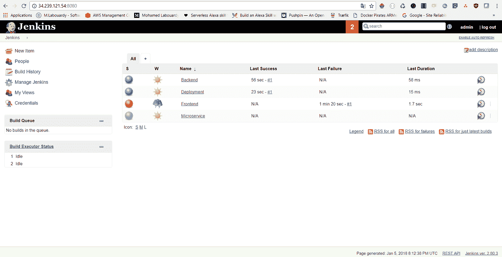
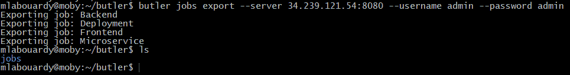
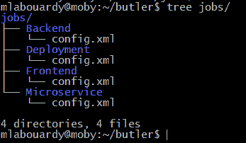
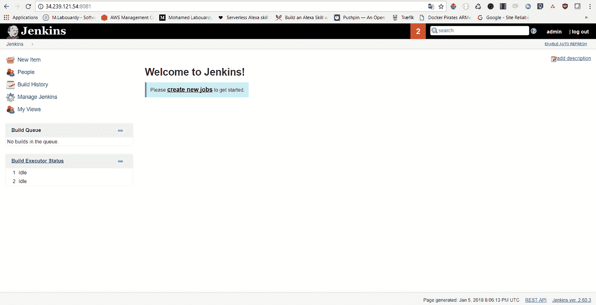
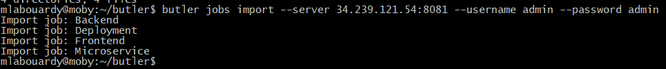
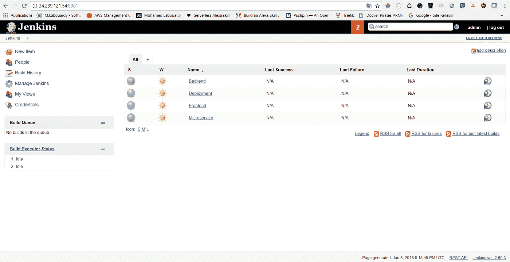

# Butler CLI:导出/导入 Jenkins 插件和作业

> 原文：<https://medium.com/hackernoon/butler-cli-export-import-jenkins-plugins-jobs-c8c16ff51a72>

Butler CLI

不久前，我不得不将詹金斯的工作从旧服务器转移到新服务器上。这就是 [StackOverflow](https://stackoverflow.com/) 发挥作用的地方，下面是我找到的投票最多的答案:

*   [詹金斯 CLI](https://wiki.jenkins-ci.org/display/JENKINS/Jenkins+CLI)
*   复制作业目录
*   Jenkins 远程 API
*   [詹金斯工作导入插件](https://wiki.jenkins-ci.org/display/JENKINS/Job+Import+Plugin)

尽管有这些优点，这些解决方案也有其缺点，尤其是如果您有大量的**作业**要移动或者没有对服务器的根访问权限。但是，你猜怎么着？我没有就此止步。我想出了一个 **CLI** 来让你的生活变得更简单，不仅可以像老板一样进出口**詹金斯乔布斯**还有**插件**。

首先，找到适合您系统的[软件包](https://github.com/mlabouardy/butler)并下载。对于 linux:

> wget[https://S3 . us-east-1 . Amazon AWS . com/butler CLI/1 . 0 . 0/Linux/butler](https://s3.us-east-1.amazonaws.com/butlercli/1.0.0/linux/butler)
> chmod+x butler
> mv butler/usr/local/bin/

注:对于**窗口**，确保**管家**二进制文件在**路径**上可用。[本页](https://stackoverflow.com/questions/1618280/where-can-i-set-path-to-make-exe-on-windows)包含在**窗口**上设置**路径**的说明。

完成后，通过打开一个新的终端会话并检查 **butler** 是否可用来验证安装是否有效:

> 管家帮忙

**1 —插件管理**

要导出**詹金斯作业**，需要提供源**詹金斯**实例的 **URL** :

> butler 插件导出—服务器本地主机:8080 —用户名管理—密码管理

如上图所示， **butler** 会将已安装的插件列表转储到 stdout，并生成一个新文件 *plugins.txt* ，其中包含已安装的 **Jenkins 插件列表**，名称*为*和*版本*对:

现在，要将**插件**导入到新的 Jenkins 实例，使用下面的命令，并将 Jenkins 目标实例的 **URL** 作为参数:

> butler 插件导入—服务器本地主机:8080 —用户名管理—密码管理

**Butler** 将通过发出 **API 调用**在目标 Jenkins 实例上安装每个插件。

**2 —作业管理**

要导出 **Jenkins 作业**，只需提供源 **Jenkins** 服务器的 **URL** :

> butler 作业导出—服务器本地主机:8080 —用户名管理—密码管理

将为 **Jenkins** 中的每个作业创建一个新目录 *jobs/* 。每个作业都有自己的配置文件 *config.xml* 。

现在，要将作业导入到新的 **Jenkins** 实例，发出以下命令:

> butler 作业导入—服务器本地主机:8080 —用户名管理—密码管理

Butler 将使用之前创建的配置文件向目标 **Jenkins** 实例发出 API 调用来创建作业。

完成后，检查 **Jenkins** ，您应该会看到您的工作已成功创建:

希望有帮助！CLI 仍处于早期阶段，因此欢迎您为 Github 中的项目做出贡献。