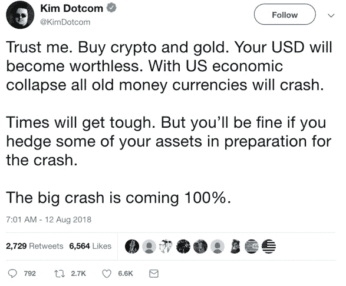
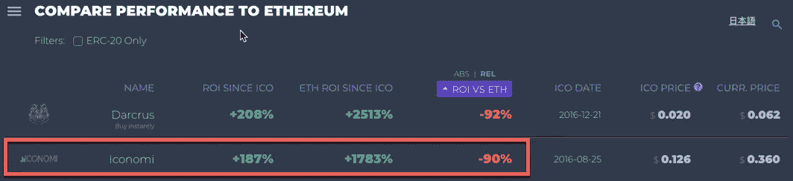
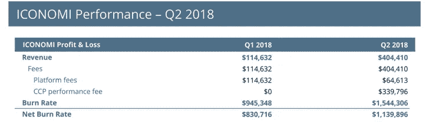
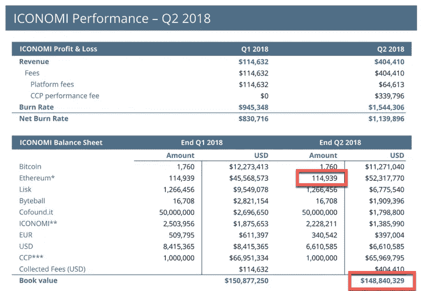
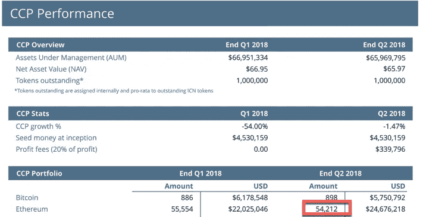
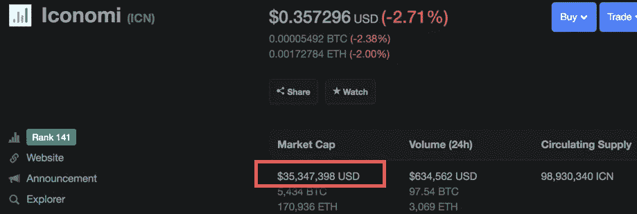
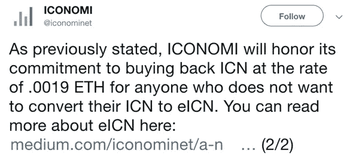

# 现在以低于 0.0017 以太的价格购买 ICONOMI，下个月以 0.0019 以太的价格出售

> 原文：<https://medium.com/hackernoon/buy-iconomi-for-under-0-0017-ether-now-and-sell-for-0-0019-next-month-31f3ceaced28>

## 有什么条件？

当我写这篇文章时，精明的交易者有机会在交易所以略低于 0.0017 以太的价格购买 ICN 令牌。下个月，作为重组的一部分，ICONOMI 将以 0.0019 英镑回购自己的代币。

> 这意味着几周内利润约为 11-12%。

那么有什么问题呢？为什么这种套利机会仍然存在？

要回答这个问题，我们需要把事情分解开来，从各个方面来看。尽管 Iconomi 已经存在了一段时间，但它并没有被广泛谈论，也没有大量的在线追随者。自从 ICN 跌出了 coinmarketcap 排名前 100 的硬币之后，没有多少人关注它的进展。我相信，由于目前市场上的恐惧和不确定性，人们也对已经发布的公告采取了更加谨慎和怀疑的态度。

当许多著名的加密倡导者和风投说比特币将达到 10 倍、20 万美元、2 万美元，或者加密市场的市值将达到数万亿美元时。你相信谁，相信什么？

“Trust me” — Kim Dotcom

每个领域将被分析，最终将由我们每个人来决定这是一个好机会还是骗局。

1.  **Iconomi 背景**
2.  **平台开发与进展**
3.  **管理资产**
4.  **回购要约**

# 1.Iconomi 背景

ICN 是以太坊上较早的 ICO 之一，从 2016 年 8 月 25 日到 2016 年 9 月 26 日持续了 5 周。他们筹集了超过 1000 万美元。

这个团队由真实的人组成:

*   蒂姆·m·扎加尔——联合创始人兼首席执行官
*   jani Valjavec——联合创始人
*   马特伊·托马津-首席运营官
*   米哈·维德马尔——首席技术官

我知道是因为我在他们的一次路演中遇到了他们中的一些人，聊了聊他们的计划，问了他们几个问题。

该团队成员此前运营了一家名为 Cashilla 的比特币交易所公司，这是一家获得全面许可的欧元和比特币支付处理器。自 2014 年以来的运营表明，该团队拥有加密方面的知识和背景。

# 2.平台开发和进展

这是 Iconomi 在加密社区中没有得到足够信任的一个领域。与许多排名前 100 的 crypto 不同，Iconomi 实际上早在 2017 年 10 月就发布了他们的平台。他们花了大约一年的时间开发他们的加密基金管理平台。自那以后，他们通过与 30 多家基金经理签约，稳步发展了自己的生态系统。

然而，ICN 代币价格表现不佳，目前比国际货币组织公布的 ETH 价格低 90%。你只是抱着乙醚会做得更好。

Taken from icostats.com

Iconomi 的另一个积极因素是，该平台已经证明了创收。在他们最近的财务报告中，Q2 2018 的总收入约为 40 万美元。

ICN Financial Report Q2 2018

这对持有者来说是好事，但对美国公民来说却是一团糟。ICN 处于加密的灰色地带，不清楚它是否作为一种证券交易。因此，ICN 不应该提供给美国公民。西方媒体不报道偶像崇拜的另一个原因。

在 Q2，他们实现了平台的 [EUR Fiat Gateway](/iconominet/iconomi-fiat-gateway-eb4fa8be0d09) ，这是另一个里程碑。加密交易所要具备这一功能以满足严格的银行反洗钱/KYC 政策，需要克服许多障碍。Iconomi 做到了这一点，这应该表明一个强有力的合规程序已经到位。

该团队也非常积极地与社区沟通。定期发布发展进度报告。许多其他项目消失了很长一段时间，当你听到他们的消息时，通常是一些关于合作关系的简短推文，没有多少实质性内容。

# 3.管理的资产

Iconomi 发布季度财务报告，突出全 AUM。在他们的上一份 Q2 报告中，我们可以看到他们在**持有大量乙醚 114，939。**

Ether holdings and Book value of ICN

如果这还不够，他们在 CCP 基金下还有更多。

那总共是**114939+54212 = 169151 以太。**

> 有趣的事实:ICN 的总市值为 3500 万美元(2018 年 10 月 18 日)，而 Q2 2018 年末的账面价值为 1.48 亿美元。

ICN Market Cap from coinmarketcap.com

加密市场已经崩溃，但账面价值仍然比目前的市值高出一大笔，即使你假设一个理论上 80%的崩溃场景。

哦，是的，没必要相信他们的话。他们的账本是由 [**四大会计师事务所德勤**](https://cryptovest.com/news/iconomi-gets-thumbs-up-in-deloitte-audit/) **审计的！**

# 4.回购要约

Iconomi 最近宣布改变 ICN 令牌的结构。

从他们的[中等职位](/iconominet/a-new-chapter-for-iconomi-transformation-of-corporate-governance-and-issuance-of-equity-tokens-dc603df2272b):

> ICN 代币持有人将能够用他们的 ICN 代币换取一家股份公司的代币化股票，作为 eICN 代币。这一新结构为所有利益攸关方带来了法律上的明确性。

作为该计划的一部分，对于不希望参与和转换为 eICN 的持有人，他们还宣布将以 0.0019 乙醚的固定利率回购您的 ICN。

来自他们的 [eICN FAQ](/iconominet/eicn-frequently-asked-questions-part-i-3adba6de27e4) 帖子:

> 即使交易所不让 ICN 退市，你会在 0.0019 买入 ICN 吗？哪个交易所会让 ICN 退市，你才会在那个价位买入？
> 
> 是的，即使交易所不将 ICN 退市，也可以以 0.0019 的价格将你的 ICN 卖给 ICONOMI。该选项不需要在 ICONOMI 平台上验证。

[推特](https://twitter.com/iconominet/status/1049591313161707520)安抚:

考虑到 ICN 在大多数交易所的交易价格低于 0.0017，这个报价相当合理。那些希望回购的人不必以当前价格出售，可以等到下个月，了解如何以 **0.0019 以太**的价格向 Iconomi 出售的细节。这部分现阶段未知。很可能你需要一个他们平台上的账户。

对于机会主义交易者，你可以在 ICN 市场以低于 0.0019 乙醚的价格买入，然后在下个月卖回给 Iconomi。这样做的利润相当于 11-12 %,当前 ICN 的价格为 0.0017 以太网。

**警告**:请不要把这当成理财建议。自己做研究，看看这个套利机会是否真的存在，自己拿主意。如果你最终自愿这样做，但没有成功，请不要纠缠我或诅咒我。Iconomi 有可能不会按照他们宣布的那样去做。只有你能决定你对团队的信任程度，以及他们是否会坚持到底。币安最近将 ICN 除名，但没有说明原因。这可能是因为 eICN 将成为一种安全措施，而币安不想让事情复杂化。也可能是别的原因。

Iconomi 真的能在 0.0019 回购 ICN 吗？如果你看一下 Iconomi 的市值 3500 万美元，按目前的价格计算总共是 17 万英镑。从他们公布的财务报告来看，他们已经表明他们的战争资金中有大致相同数量的乙醚。这意味着他们可以买下 ICN 几乎所有的流通供给。考虑到会有人接受对 eICN 的出价，他们有足够的时间来完成购买。

# 结论

最终归结为信任。相信 Iconomi 团队，他们会做他们公开宣布的事情。如果你在权衡是否参与，那么你必须首先决定风险是什么。我现在买入 ICN 的可能性有多大，Iconomi 会在 0.0019 从我这里买回它们吗？卖回 ICN 代币涉及哪些后勤工作？Iconomi 团队尚未公布这些细节。这是加密的，风险很大。许多人赚了大笔钱，但更多的人亏损了。做你自己的研究，祝你好运。

作者参加了 Iconomi 的 ICO。自从 ICO 以来，我交易了 ICN。比特币上月球之前我卖了一些换比特币。我仍然还抱着 ICN。他们宣布这个优惠后，我买了更多。如果 ICN 的价格上涨，那将对我有利。我不是在试图兜售偶像主义，但它可能会像我一样。你决定吧。自己做研究。