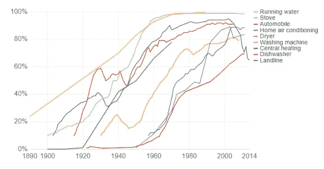
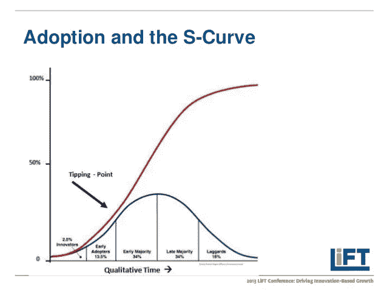
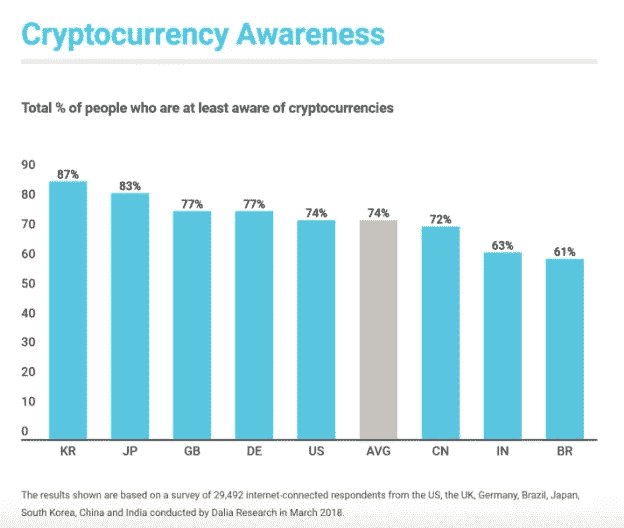
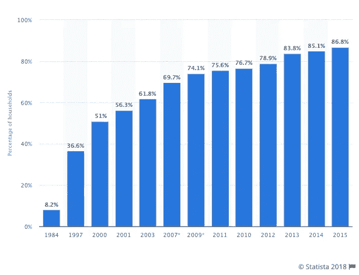

# 购买和使用加密货币对山姆大叔来说仍然很难

> 原文：<https://medium.com/hackernoon/buying-and-using-cryptocurrency-is-still-hard-for-uncle-sam-a1d356e48aeb>

## 但历史证明，随着我们接近大规模采用，这将变得更容易

让我们从一开始就搞清楚这一点。大多数美国人不像我们一样在媒体上阅读帖子，他们可能从未听说过它。他们不是你的技术早期采用者，他们没有在 iPhone 刚出来时得到它，他们可能仍然需要他们的计算机的帮助，我确信我们可以提出许多其他案例来证明人类采用技术的不同层次和难度。

总的来说，人类在采用新技术方面很慢。回溯到 1876 年，当电话被发明的时候，我们可以看到美国的每个家庭花了将近一个世纪才拥有一部电话。同样，汽车、洗碗机、烘干机以及更多的创新产品也出现了这种趋势(如下图所示)，所有这些如今都被认为是必不可少的。这些“重要的”技术进步都经历了它们自己的一系列问题、批评、怀疑和不确定的时刻——形成了它们自己独特但**相似的采用路径**。

Adoption Rate vs. Time — [Visual Capitalist](http://www.visualcapitalist.com/rising-speed-technological-adoption/)

# **比特币和加密货币正走在一条与以往技术创新相似的道路上。**

我不是密码学或区块链技术方面的专家。我们在这里看到的不是他们高度复杂的密码系统和发展，而是人类眼中的技术，他们经历的不同阶段，以及他们的采用率——特别是在美国人口中。

大约在 1975 年，第一台个人电脑在美国问世，但是直到 20 世纪 80 年代末，像 T4 戴尔 T5 和 T6 网关 T7 这样的公司出现后，普通大众才接触到它们。在这一点上，他们仍然没有被认为是一个巨大的成功。然而，在 20 世纪 90 年代后期，当 PC 变得更便宜，处理能力变得更快时，它们在早期采用者和某些行业中取得了巨大的进步。

很长一段时间，他们被认为是一个暂时的时尚。但在 21 世纪初，互联网已经存在了几年，计算机变得越来越强大，消费者能够播放音乐、玩游戏、与他人在线聊天、创建社区等等——使个人电脑成为家中必备和“酷”的东西。

**The statistic shows the percentage of U.S. households that have a computer from 1984 to 2015**

正如我们所看到的，在美国，个人电脑被消费者大规模采用后，花了将近 25 年的时间。事后看来，就像每一个足够迅速成熟的创新一样，一段时间的采用对于技术的发展和人类将其融入日常生活都是至关重要的。

技术从专业人士和精通技术的人专用，发展到几乎每个人都使用的主流技术。

## **这就是加密货币目前的情况**

历史和那些研究技术运动重大转变的人告诉我们，如果一项创新成功扩散(阅读[巴斯扩散模型](http://citeseerx.ist.psu.edu/viewdoc/download?doi=10.1.1.460.1976&rep=rep1&type=pdf))，或者正确分布，那么在几乎无限的时间内(比如 100 年)的累积采用率通常呈现 S 形函数。但是这和加密货币有什么关系呢？

嗯，一些东西如何传播很大程度上取决于所谓的“认知优势”，或者特定社区接受新创新的能力。通过确定某个群体的这种认知优势，我们可以估计这种创新在该群体中建立的潜力，以及它在群体中传播的速度。

一个群体中具有相同思维过程和已有想法的人的累积数量可以决定一项创新的命运，只需加快他们与其他群体分享知识的速度。类似地，其他社区如何与新社区分享，等等。加密货币目前的采用数字证明(见下文),该技术正在遵循与其他先前技术相同的采用路径，这些技术是由一组特定的预先存在的信念推动的。

此外，为了理解初始群体中的人是谁，我们必须首先解构他们先前存在的信仰和价值观。就加密货币而言，我注意到早期对该技术感兴趣的人分享了一些预先存在的想法/问题。

**第一组用户相信或者已经(并且可能仍然)受到以下问题的影响:**

1.  对政府和央行越来越不信任
2.  不确定的地缘政治气候
3.  对财务独立越来越感兴趣(即独立于持有你财富的银行)
4.  对创建高度可信的(不可变的和不可替代的)事务的兴趣—“数学的极致”
5.  对隐私的兴趣

可能还有几个我在这里没有提到(请随意评论，我会更新列表)，但这 5 个符合支持加密货币的标准。分享这 5 个基本信念的第一批人过去是，现在仍然是向其他社区介绍比特币和加密货币的最重要群体。

因此，为了让加密货币在美国和其他国家被采用，这些信念在任何时候都仍然成立，新的团体以自己独特的方式创造和调整它们，这是很自然的。加密货币的叙事已经开始从“这只是一种怪异、愚蠢和晦涩的互联网时尚”演变为新的群体，他们有新的兴趣和动机来理解这一现象并参与其中。

接下来的事情高度依赖于创建易于使用和理解的平台。这种技术通过新产品和其他事件的共享叙述和分发越好，随着信念从一个社区转移到另一个社区，并随着时间的推移而成熟，采用率将越快。

# 网络趋势

> [因网络理论工作而闻名的罗马尼亚物理学家阿尔伯特-拉斯洛·巴拉巴希](https://en.wikipedia.org/wiki/Albert-L%C3%A1szl%C3%B3_Barab%C3%A1si)说:“网络思维准备入侵人类活动的所有领域和人类探索的大多数领域。它不仅仅是另一个有用的视角或工具。网络本质上是最复杂系统的结构，节点和链接深深地融入了所有旨在接近我们联锁宇宙的策略。”

除了预先存在的社区信念，我们还有这些社区分享信息的比率。这是人类在传播信息方面发挥更大作用的地方，因为他们天生就有分享的**。分享是我们社会结构复杂系统的一部分，它是我们社交、交流和表达情感的方式。当我们分享时，我们倾向于发展某种内在的“积极的”因果报应和接受。**

## 作为节点的人类和作为思想扩散的灾难现象

人类是任何网络的核心——主要节点——因为我们是一切的起点。我们可以深入研究人类的连通性和网络理论，但是这个想法背后的概念是“采用”是非常抽象和主观的，但是非常简单。很多时候，采用率只是一种分配现象的产物，如发生的灾难或世界事件(有时被称为“灾难现象”)，或者也可能是触发这种反应的特定压抑感，产品是**有用性**的出口或载体。

“灾难现象”的一个例子是 1978 年发生在康涅狄格州塔里夫维尔的火车相撞事故——这场灾难使电话闻名于世。故事是这样的:

> 火车相撞后，附近城市哈特福德的前瞻性医生安装了贝尔的“语音电话”。一位警觉的当地药剂师能够打电话给当地整个社区的医生，他们赶到现场给予援助。这场灾难，就像其他灾难一样，引起了媒体的强烈报道。这部手机已经证明了它在现实世界中的实用性。摘自[《黑客严打》。](http://martin.hinner.info/crackdown/english/crashing.htm)

(另一个例子可能是社交媒体在[阿拉伯之春](https://en.wikipedia.org/wiki/Social_media_and_the_Arab_Spring)中的影响，及其后来的扩散，这给脸书、推特和其他巨型公司带来了巨大的增长)

加密货币在美国没有经历过类似塔里夫维尔坠机事件中电话所经历的事情，但灾难无疑引发了加密货币在世界其他地区的流行，比如在[委内瑞拉](https://www.forbes.com/sites/realspin/2017/02/03/why-venezuelas-currency-crisis-is-a-case-study-for-bitcoin/#3e4ca27d19b2)，那里的[年通胀率飙升至近 27，000%](https://www.forbes.com/sites/stevehanke/2018/05/31/venezuelas-inflation-breaches-25000/#29e58696d57e) ！委内瑞拉人正在尽快将他们剩余的玻利瓦尔兑换成比特币，这是他们不需要银行就能获得的最容易获得的货币。

我希望没有一群人不得不遭受或经历一场灾难来推动加密货币的普及，但历史已经清楚地表明，它以前有过帮助。

# 这对比特币和加密货币意味着什么？

在我看来，就比特币和加密货币而言，我相信我们正处于“现金牛”时期的头几年，消费者开始快速采用这种货币。[位于柏林的 Dalia Research](https://daliaresearch.com/about-us/) 是一家专门了解全球受众的公司，该公司在 8 个最大的加密货币市场(美国、英国、巴西、德国、日本、韩国、印度和中国)进行了[广泛调查](/daliaresearch/how-many-people-actually-own-cryptocurrency-4ff460301520)，试图了解有多少人实际上拥有任何加密货币。

他们的发现很有趣。在美国，大约 74%的人至少知道加密货币。这是一个巨大的数字，但考虑到全球媒体对加密货币的报道，这并不奇怪。**然而，根据他们的研究，只有大约 9%的美国人真正拥有加密货币。**如果我们用数字来表示，大约有 2900 万美国公民至少拥有一种加密货币。其中大部分发生在 2017 年下半年，当时比特币价格达到了天价。

> 在美国，大约 74%的人知道加密货币，但只有 9%的人拥有加密货币。

现在，如果我们与 1984 年左右(个人计算的最初几年)个人电脑的采用情况(在我看来，这是生活从实物到数字的最接近的技术转变)进行比较，我们会看到大约 8.2%的家庭拥有个人电脑，这相当于大约 3%的人口(见下图)。让我们假设在这个分析中 1984 年是个人电脑的原点。如果我们将这个数字加上下一个关于个人电脑采用的数据点，我们会看到图表显示大约 36.6%的家庭拥有个人电脑，当转换成人口数字时，我们看到大约**1997 年 14%的人口拥有个人电脑**。

如果我们接着比较比特币的零起点，2009 年，当时大约 0%的采用率，直到现在的 2018 年，我们看到在短短 9 年内人口采用率与 PC 的 13 相比，非常接近比特币的 9%与 PC 的 14%。我们可以说，再过 4 年，我们将看到加密货币的采用率与同期 PC 的采用率相同，14%或更接近。

现在，如果我们试着比较一下从 1984 年到 2001 年这 17 年间个人电脑的采用率，我们会发现在这段时期结束时，大约有 20%的人口拥有个人电脑。对于加密货币，**在未来 8 年内美国市场采用 20%的最差增长率**，这将意味着到 2026 年将有 7000 万人拥有某种形式的加密货币。从今天开始，这将增加大约 4100 万人。

我个人认为，随着正确用例的出现，加密货币的拥有量将在同期增长两倍。

**US Household Personal Computer Adoption Rates from 1984–2015**

**Comparison of Personal Computer Adoption vs. Cryptocurrency Owners**

# 加密货币发展迅速

个人电脑和加密货币之间的主要区别在于，加密货币在世界其他国家的采用率与美国相同，甚至更快。美国在加密领域的许多方面都处于领先地位，但在采用方面并不领先。这是积极的，因为它表明**加密货币在美国仍处于早期阶段，我们可以看到未来不可避免的增长路径**。

> **“加密货币在美国仍处于早期阶段，我们可以看到未来不可避免的增长道路**。”

# 技术采用的不同阶段

## **金色汽艇**

第一阶段，根据布鲁斯·斯特林著的《黑客镇压(很棒的一本书！)，被称为“**金色汽灯**阶段。我引用他的话:“*在这个早期阶段，这项技术只是一个幻影，仅仅是发明者眼中的一道闪光。一位名叫亚历山大·格雷厄姆·贝尔的语音教师兼电气修理工就是这样的发明家。*”他还指出“*大多数金色蒸汽设备技术都没有进展。*“真实，但不是事实。

你可以说比特币在其早期经历了这个阶段，当时中本聪发布了[比特币白皮书](https://bitcoin.org/bitcoin.pdf)，2010 年用 [10，000 BTC 购买了披萨](https://twitter.com/bitcoin_pizza?lang=en)(事后看来很疯狂)。

## **后起之秀**

第二阶段被称为**后起之秀或愚蠢的原型**，斯特林先生说，“处于愚蠢的原型阶段的技术很少能很好地工作。它们是实验性的……原型可能很吸引人，很新颖，而且看起来确实应该对某样东西有好处。但是没有人，包括发明者在内，十分确定是什么。发明家、投机者和专家可能对它的潜在用途有非常坚定的想法，但这些想法通常是非常错误的。

这个阶段可以和《T21》第一次上映时相比。或者几年后，佩佩·卡什从一个迷因变成了区块链上可交易的收藏品。

## **摇钱树**

第三阶段的技术被称为“**摇钱树**阶段。在这个阶段，一项技术在世界上找到了自己的位置，变得成熟，稳定并富有成效。Sterling 扩展道:“*电话是关于语音的——个人的、个人的语音、人类的声音、人类的对话以及人类的互动。他补充道，*

> 当你拿起电话时，你不是在吸收机器发出的冰冷声音——你是在和另一个人说话……电话不是电话本身打来的，而是另一个人打来的

布鲁斯试图告诉我们的是，技术是建立在一套信念之上的(就像之前讨论的那样)，它被玩弄、被打击、被批评，直到它通过人类网络(主要是作为游戏或玩具)经历一个早期采用的过程，然后它成为 ***必不可少的*** 到人类。随着它的发展和消费者找到新的使用方式，它会适应人类的需求。

眼下，2018 年，比特币已经作为“*黄金汽船*”、[莱特币](https://en.wikipedia.org/wiki/Litecoin)和 Dogecoin 作为“*后起之秀/高飞原型*”。这些带来了第三阶段，并允许其他技术出现，如[以太坊](https://www.ethereum.org/)。以太坊反过来为技术发展提供了一个新的机会，它能够在其区块链之上创建新的项目。以太坊可能是"**摇钱树**"

# 帮助美国采用加密货币的项目

有许多项目和公司正在致力于开发这项技术，并让美国和世界其他地区的消费者能够使用加密货币。

我在下面列出了一些在帮助采用加密货币方面做得很好的公司，或者准备在未来一两年内这样做的公司。我增加了一个“难度分数”,从简单、普通到困难。

**难度分数考虑了我对非技术人员设置和使用每个产品/平台的难易程度的主观看法。**因此，没有需要编码才能开始的产品。

他们在这里:

*(ps:记住，想象一下非技术通的人试图使用这些产品。)*

## 钱包、交易所和金融产品:

1.  [凯西](https://www.abra.com/):(易)比特币和加密货币钱包 app
2.  [比特币基地](https://www.coinbase.com/):(轻松)购买、出售、转移和存储数字货币
3.  [双子座](https://gemini.com/):(普通)购买、出售和存储数字资产
4.  币安:(硬)数字资产交易所
5.  [Square](http://squareup.com) / [Cash](https://cash.me/bitcoin) :(易)接受信用卡随处 pos /接受现金随处 app
6.  [Balance.io](https://balance.io/) :(待定，尚未推出)以太坊钱包，支持所有 [ERC-20](https://en.wikipedia.org/wiki/ERC20) 代币

## **专柜产品:**

1.  用信用卡购买加密货币入门套件(它们从神秘盒子变成了真正的冷藏钱包入门套件)
2.  [Coinmama](https://www.coinmama.com/) :(轻松)用信用卡买比特币和以太坊

## 硬件:

1.  [账本](http://ledgerwallet.com/):(中型)你的比特币的硬件钱包
2.  [Trezor](https://trezor.io/) :(中)最原始最安全的比特币钱包

## 休闲:

1.  CryptoCribs :(简单)类似于 airbnb，但是你可以用 crypto 支付
2.  SV 的 Coupa café:(易)硅谷的咖啡爱好者

## 购物:

1.  Fancy.com:(简单)一个发现和购买由他们的全球社区策划的令人惊奇的东西的地方
2.  [Overstock.com](http://Overstock.com):(易)像亚马逊一样，是首批接受比特币的零售商之一

## **游戏:**

1.  [数码猫](http://cryptokitties.co/):(易)收集和繁殖数码猫

## **创意空间:**

1.  (容易)购买、出售和发现独特的加密资产

## **媒体:**

1.  [CoinTelegraph](https://cointelegraph.com/) :(易)比特币和以太坊区块链新闻
2.  [Coindesk.com](http://coindesk.com)(轻松)区块链新闻领袖

这些只是我想到的一些当前平台或产品的例子。如果你有更多想添加的，请在评论中告诉我，如果它们对加密货币初学者有用，我会很乐意添加。

如果你想用你的比特币或加密货币买东西，去看看一些已经接受它们的商家:[这里](https://99bitcoins.com/who-accepts-bitcoins-payment-companies-stores-take-bitcoins/)。

# 美国的加密货币何去何从？

不管你怎么看，仍然很难理解这项技术将如何被使用。但互联网是一个很好的例子，说明加密货币会带来什么，因为它在过去 30 年里已经发生了多次变化。这种现象是全球性的，并且发展迅速，可能比之前的任何技术都要快。

一些进入的障碍也存在，比如规章制度。但是，随着新的政府和机构开始在他们的组织内集成这种新技术，这些已经存在了。当工作用个人电脑成为一件东西时，类似的转变也发生了，同样，当互联网有助于在工作场所和家里获取信息和分布式通信时。

**对我来说很清楚的是，总体来说，美国购买和使用加密货币仍然很复杂，但我们几乎会在未来 2-3 年内大规模采用加密货币。事实上，仅在美国，至少有 4100 万人将在未来 8 年内加入这项技术。**

不同的社区和一系列不同的公司有一股巨大的集体推动力，致力于提高意识和创造下一代创新产品，以推动技术的采用。美国几乎已经准备好大规模采用。

我对涉及加密货币的未来感到兴奋！

***如果你觉得这篇文章有帮助，请分享。此外，如果您对如何改进它有任何建议，请随时在下面发表评论。***

## ***我是拉蒙，一名对网络、市场、设计，当然还有密码感兴趣的企业家和成长型营销人员。*** [***上打招呼***](http://twitter.com/ramoncacho) ***！***

本文仅供参考，绝不作为投资或法律建议。所有观点都是我自己的。