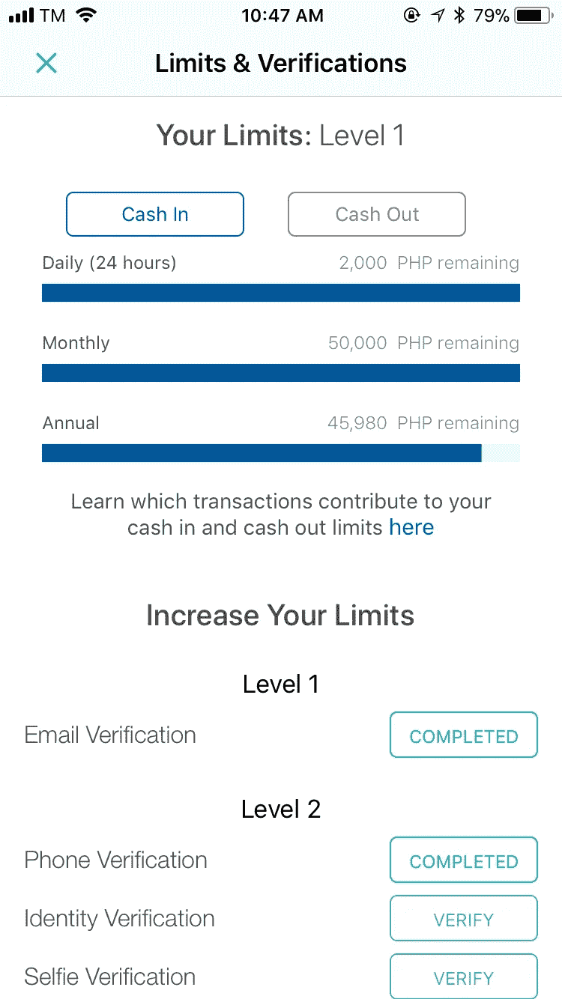
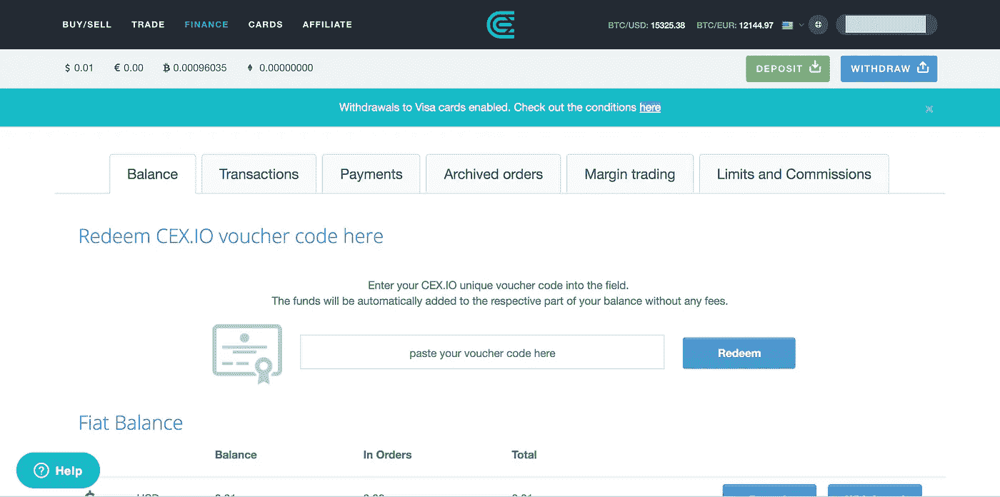

# 在菲律宾购买/销售/交易加密货币

> 原文：<https://medium.com/hackernoon/buying-selling-trading-cryptocurrency-in-the-philippines-8a8c014e4f2a>

*更新:CoinsPH 和凯西部分已过时。他们已经增加了其他加密货币。*

在菲律宾有很多关于加密货币[的炒作。上一届敌无双峰会(2017 年)的主题之一是关于区块链，这是](https://hackernoon.com/tagged/cryptocurrency)[比特币](https://hackernoon.com/tagged/bitcoin)和其他加密货币背后的技术。

我刚接触加密货币的时候(2017 年 9 月左右)，只持有比特币。在意识到由于高昂的费用和缓慢的处理过程，像货币一样使用是不实际的之后，我对其他加密货币感到好奇。我在投资组合中添加的第一个东西是莱特币。它被称为比特币之银。交易费用更低，速度也快了很多。我用 ShapeShift 把我的比特币转换成 Coins.ph 到我在比特币基地的 Litecoin 地址。当时我不知道有任何其他方法可以做到这一点，并且花了很大的努力才知道如何才能交易其他加密货币。

本帖分为两个:买/卖和交易。在这些部分中，我将向您介绍我已经使用过的方法。

这样做的目的是帮助初学者在菲律宾购买加密货币以及如何套现。这将帮助你开始。我假设你已经有一些关于加密货币的背景知识，唯一的问题是你不知道如何以及在哪里购买。记住只投资你愿意失去的东西。加密货币市场非常不稳定。

# **购买/销售**

**在菲律宾，你只能买卖比特币(BTC)和以太坊(ETH)。**我所知道的选项是通过**凯西**、 **Coins.ph、**和 **CEX。IO** 。

## 1.凯西

**网址:**[https://www.abra.com/](https://www.abra.com/)
**安卓:**[https://play.google.com/store/apps/details?id = com . plutus . wallet](https://play.google.com/store/apps/details?id=com.plutus.wallet)
**iOS:**[https://itunes . apple . com/ph/app/abra-bit coin-wallet-buy-BTC/id 966301394](https://itunes.apple.com/ph/app/abra-bitcoin-wallet-buy-btc/id966301394)

> 凯西是一种基于比特币的数字货币钱包。—凯西网站

你在凯西应用中拥有的是一个 **PHP 余额**、**比特币余额**和**以太坊余额**。我将风格在**粗体**我已经在凯西应用程序中使用。

PHP Balance

你有四种选择来平衡你的 PHP。

1.  **加钱** —使用你的银行账户，你可以给你的 PHP 账户加钱。我试过用银联的 EON 卡。根据您尝试添加的金额，您可能会收到一封电子邮件，要求您确认您的身份，尤其是在金额较大的情况下。
2.  **兑换**——当我加载完我的 PHP 余额后，我所做的就是把它兑换成比特币。你可以在这里把你的 PHP 换成比特币或者以太坊。*在兑换以太坊之前，请注意以太坊没有发送/撤回选项*。
3.  发送或接收—您可以向凯西用户或通过您的电话联系人发送资金。
4.  取款—取款中的*转账到银行*选项允许您的钱添加到您的银行账户中。我没有用这个来撤回(我用 CEX。IO 提取)但我要说，它的工作，因为我的朋友正在使用这种方法来兑现。

Bitcoin Balance

你的比特币余额也有四种选择。

1.  购买比特币— *从 PHP 余额添加货币*和*从比特币余额购买比特币*具有相同的用户界面。
2.  PHP Balance 的 Exchange*Exchange*和比特币 Balance 的 *Exchange* 也有相同的用户界面。你可以在这里把你的比特币转换成 PHP 和以太坊。
3.  发送或接收——它有相同的 PHP Balance 用户界面。
4.  **撤销** —如果你想将你的比特币发送到一个外部比特币地址，即不是凯西，你可以在这里完成。这是我用来将我的比特币转移到另一个交易所的工具，比如波洛涅克斯、币安和 Kucoin，在那里我可以交易我的加密货币。

只能兑换你的以太坊。这意味着您不能从以太坊外部地址(即非凯西)发送和接收信息。你也不能直接把它提取到你的银行账户。

**我如何使用凯西的总结:**

1.  使用银联银行的 EON 卡向 PHP 余额中添加资金。
    我在用银联的 app: **银联在线**。
    支付账单- >选择开票人(凯西)- >输入开票人信息(手机号码)- >选择用于支付的账户- >输入金额- >审核并发送支付。

出于显而易见的原因，我模糊了我的账号、手机号码和金额。

2.*兑换* PHP 到比特币。

3.*提现*比特币，送到波洛涅克斯/币安/库币。

我不会让我的余额停留在凯西。我只是用它来购买比特币，我可以在波洛涅克斯、币安或库币中发送比特币，在那里我可以交易我喜欢的加密货币。

## 2.硬币. ph

**网址:**【https://coins.ph/invite/wd8fx7】
*我在包括我的推荐链接
**安卓:**[https://play.google.com/store/apps/details?id = Asia . coins . mobile](https://play.google.com/store/apps/details?id=asia.coins.mobile)
**iOS:**[https://itunes . apple . com/us/app/coins-ph-load-bills-bit coin/id 972324049](https://itunes.apple.com/us/app/coins-ph-load-bills-bitcoin/id972324049)

如果你今天想注册并且觉得亲切，可以用我的推荐链接:
[https://coins.ph/invite/wd8fx7](https://coins.ph/invite/wd8fx7)

我的推荐代码:wd8fx7

> 节省日常服务的金钱和时间，如账单和预付费。你甚至可以开始买卖比特币！——coins . ph 网站

与凯西相比，Coins.ph 具有买卖比特币之外的功能。正如他们的网站上所说，你可以用它来支付账单和预付费。

你会有一个**比索钱包**和**比特币钱包**。您可以兑现和提取的金额限制取决于您的帐户验证。

Peso Wallet

Bitcoin Wallet (I have some 41 PHP left. I was not able to transfer everything because Bitcoin’s price is actively moving. Haha)

**现金入**

为了能够通过法定货币给你的账户充值，你需要兑现。你有很多选择来赚钱。我用的是他们的银联银行选项，他们会向你提供你必须存入的账户的详细信息。

使用硬币兑换现金。ph 比凯西更灵活。以下是您可以选择的所有选项:

**转换**

在你能够兑现之后，你现在可以在你的比索钱包和比特币钱包之间进行转换。

**套现**

如果你想从钱包里提现回法定货币，你需要使用的是提现。

Coins.ph 的提现也比凯西灵活。以下是您的选择:

**限制和验证**

以下是取决于您的验证状态的限制:

**我如何使用硬币的总结. ph:**

我的帐户没有得到验证，因为我更经常使用凯西。再说一遍，我用的是银联的 EON 卡。虽然我还没有用它来兑现，它应该工作得很好。和在凯西一样，我的一些朋友用这种方法套现。我想我们有不同的品味。

## 3.CEX。超正析象管(Image Orthicon)

**网址:**【https://cex.io/r/0/up115119371/0/】
*我在包括我的推荐链接
**安卓:**[https://play.google.com/store/apps/details?id = io . cex . app . prod](https://play.google.com/store/apps/details?id=io.cex.app.prod)
**iOS:**[https://itunes . apple . com/us/app/cex-io-bit coin-exchange/id 1047225016](https://itunes.apple.com/us/app/cex-io-bitcoin-exchange/id1047225016)

如果你今天想注册并且觉得亲切，可以用我的推荐链接:
[https://cex.io/r/0/up115119371/0/](https://cex.io/r/0/up115119371/0/)

> 你可以信任的比特币交易所——CEX。IO 网站

**签证在 CEX 有效。所以我的银联 EON 卡可以用了。我用它来存钱和取钱。我主要是用这种方式来提现，因为你这里可以发的加密货币选项比较多。**

***警告:你可以在 CEX 使用 PayMaya。IO 要存款但取款不起作用。***

你可以在这里阅读签证撤回的条件(请阅读):[https://blog.cex.io/news/visa-withdrawals-16897](https://blog.cex.io/news/visa-withdrawals-16897)。TLDR:这里需要注意的是，如果你想提取美元，你必须为你的 CEX 提供资金。最低 20 美元的 IO 帐户。 还有一个限制国家名单，菲律宾不在名单内。因此，如果你正在阅读这篇文章，即使它只针对菲律宾，请首先在这里检查你的国家:[https://cex . io/finance/limits-commissions #/direction/取款](https://cex.io/finance/limits-commissions#/direction/withdrawal)。

在 CEX.IO 中，你将拥有一个**固定余额**和一个**加密余额**。

你可以在下面看到，菲亚特没有 PHP。虽然列表中没有 PHP，但是你可以用你的 VISA 把钱存入你的 fiat balance。我使用美元。

与凯西和硬币相比，你的加密余额要多得多。交易后，我使用 CEX。IO 退出，因为我不想通过比特币的交易费转移回凯西和 Coins.ph

**我如何使用 CEX 的总结。IO:**

我只用 CEX。IO 兑换回菲亚特(美元)并退出。我所做的是通过 Ripple (XRP ),因为交易费用较低。

1.  从波洛涅克斯、币安或库科恩，我将把我的加密货币兑换成 XRP。
2.  将我的 XRP 从另一个交易所发送到我在 CEX.IO 的 XRP
3.  把 XRP 交易到 CEX 的 BTC。木卫一，既然你不能直接套现 XRP。
4.  在 CEX 出售转换 BTC。IO 对美元。
5.  使用 VISA 卡提取美元。

# 贸易

购买、出售或交换的行为

还有很多其他的加密货币，例如 Ripple (XRP)，Stellar Lumens (XLM)，Litecoin (LTC)。你可以在 https://coinmarketcap.com/的[查看顶级加密货币。](https://coinmarketcap.com/)

如果你想持有凯西、Coins.ph 或 CEX 不存在的不同加密货币。木卫一，你有两个选择。您可以使用**shape shift**https://shapeshift.io/将您的加密货币转换成另一种加密货币，或者将您的加密货币发送到您在交易平台的账户，然后在那里进行兑换。我只使用过**波洛涅克斯**、**币安**和**库币**进行交易，但是你在这里有很多选择。我将只讨论这三个，因为这是我试图存入和取出的。

虽然你不能直接提取法定货币，但你可以将你的加密货币寄回凯西、Coins.ph 或 CEX。木卫一，并交换成菲亚特。我建议你使用 CEX。IO 提取，因为他们有更多的加密货币选项，你可以存款。如果你想使用凯西和 Coins.ph 来提现，你唯一的选择就是通过比特币，这将在交易费用上花费巨大的成本。

我再重复一遍，**只投资你愿意失去的。**您正在使用的交易所可能会因为您无法控制的原因而关闭，您可能会失去您的资金。

## 1.波洛涅克斯

**网址:**[https://poloniex.com/](https://poloniex.com/)
**安卓:**无官方 app
**iOS:** 无官方 app

> 我们是一家总部位于美国的数字资产交易所，提供最大的安全性和先进的交易功能。— Poloniex 网站

波洛涅克斯是我第一个用来交易的。首先，注册后验证您的帐户。你将被要求用身份证拍照，然后你必须等待，直到他们验证它。如果你不喜欢，用币安。即使未被验证，它也有 2 BTC 的取款限额。

在 Poloniex 中获得验证后，这将出现在您的个人资料中。
*提款限额:每天 25，000 美元等值*

如何给我的账户充值？

要转移你在凯西购买的比特币或 Coins.ph，你需要你的**比特币地址**。*请记住，这将需要交易费，所以不要指望你会得到与你转移的金额相同的金额*。要在 Poloniex 获取您的比特币地址，请进入:
余额→存款&取款→搜索比特币并点击存款

在 Poloniex 获得比特币地址后，你现在可以从凯西或 Coins.ph 发送你的比特币

**如何买卖其他加密货币？**

所以现在你在 Poloniex 已经有比特币了。您可以通过进入“交换”选项卡开始交易。

如果你对你所看到的感到困惑，这也是我的第一印象，我建议你从 USDT 标签开始交易。

USDT 是一种加密货币，声称是美元的系绳，这意味着 1 美元= 1 美元。

在“市场”部分的“USDT”选项卡下，单击“BTC”。向下滚动，你会看到:

首先，您可能只想在这里使用 BUY 和 SELL。为了把你的 BTC 卖给 USDT，你需要使用第三个写着“卖掉 BTC”的盒子。单击 BTC 旁边带下划线的金额。如果您这样做，价格、金额和总额将自动填写。这意味着你想把你的 BTC 以标明的价格卖给 USDT。按一下「出售」继续。请注意，您的卖单可能不会马上被执行，因为市场正在积极地改变价格。如果发生这种情况，向下滚动并转到我的未结订单。如果尚未完成，它将在那里列出。您可以等待或取消它，然后再次尝试最新的价格。

将 BTC 兑换成 USDT 后，你现在可以在 USDT 选项卡中购买其他加密货币。

**我如何退出？**

将您的加密货币从 Poloniex 转移到其他交易所，如凯西、Coins.ph 和 CEX。IO 如果您可以兑换为菲亚特，请转到:
余额→存款&取款→搜索您想要提取的加密货币，然后单击提取。

## 2.币安

**网址:**【https://www.binance.com/?ref=13335816】
*我在包括我的推荐链接
**安卓:**[https://play.google.com/store/apps/details?id = com . binance . dev](https://play.google.com/store/apps/details?id=com.binance.dev)
**iOS:**App Store 上没有，但他们有一款面向企业的应用。我是一名 iOS 开发者，我可以说这是一款官方应用。iOS 应用可以这样分发。按照这里的说明:[https://support . binance . com/HC/en-us/articles/115001507811-How-to-Install-币安-iOS-APP](https://support.binance.com/hc/en-us/articles/115001507811-How-to-Install-Binance-iOS-APP)

如果你今天想注册并且觉得亲切，可以用我的推荐链接:
[https://www.binance.com/?ref=13335816](https://www.binance.com/?ref=13335816)

我的推荐人 ID: 13335816

你可以在币安购买不在波洛涅克斯的其他加密货币。

注册后，您将拥有:
*24 小时取款限额:2BTC*

您可以验证您的帐户以提高限额。

就像在 Poloniex 一样，你可以在交易所选项卡中进行买卖。我推荐这个，因为它有一个 Android 和 iOS 应用程序，你有更多的选择来购买和出售。

## 3.库科恩

**网址:**[https://www.kucoin.com/#/?r=7Qv2dN](https://www.kucoin.com/#/?r=7Qv2dN)
*我在包括我的推荐链接
**安卓:**无官方 app
**iOS:** 无官方 app

我的邀请码:7Qv2dN

我最近刚用过 Kucoin。我在波兰和币安找不到的大部分加密货币都在这里，这太棒了！如果你能在波洛涅克斯和币安之间导航，使用 Kucoin 应该没问题。

**总结一下我是怎么做每一件事的:**

1.  在凯西购买比特币或 Coins.ph
2.  将购买的比特币发送到波洛涅克斯、币安或 Kucoin。
3.  贸易。购买。出售。等等。
4.  转换成 CEX.IO 中可用的加密货币。
5.  在 CEX.IO 中发送加密货币。
6.  在 CEX 交易加密货币。IO 到比特币。
7.  在 CEX 兑换比特币。IO 对美元。
8.  用我的 VISA 卡提取美元。

在这里，我添加了一些提示和常见问题的答案来帮助你坚持下去。

1.  **在哪里可以关注加密货币社区？**大家都活跃在 Reddit！https://www.reddit.com/[。通常加密货币都有自己的子货币。作为开始，你可以跟随这个子编辑:【https://www.reddit.com/r/CryptoMarkets/】T4](https://www.reddit.com/)
2.  **我不想在交易所持有我的加密货币，哪里是最安全的存放地点？在这篇文章中，我们没有谈到冷藏，但这是你可以使用的最安全的方法。**
3.  **应该投资多少加密货币？你要对你的钱负责！我要说的是，不要投入你不愿意失去的东西。是的，它可以加倍快，但它也可以疯狂崩溃。**
4.  **应该投资什么加密货币？**研究并找到你所信仰的加密货币。没有人能预测市场。
5.  **大多数交易平台都在推荐双因素认证，我为什么要使用它，什么是 Google Authenticator？这一点很重要。如果您的密码已被泄露，双因素身份验证将拯救您。你会得到一个密码，你必须把它保存在安全的地方。写下来。你将需要谷歌认证这个代码。这将允许 Google Authenticator 生成一个每 30 秒更改一次的密码。这将为您的帐户增加一层安全保障。如果您启用此选项，每当您登录时，系统都会要求您输入密码以及 Google Authenticator 生成的密码。**

如果你觉得很慷慨，想感谢我发了这个帖子，你可以随时给我发一些加密货币。以下是我的一些地址:

lite coin(LTC):lqxfn 7 ujy 3y 9 vznfep 2 UMD 59 zas 6 mzbhv

比特币(BTC):1 dla 1 yqsuh 8 fy 2 aqwjscxucut 4 imk 34 wye

以太坊(ETH):0x 61 C4 AE 6 c 411d 80995 ab 98 CCA 4966 ca 8 fa 2e 8516 b

谢谢！😄 😄 😄

PS:这里列出的方法是我自己已经尝试过的，在我写这篇文章的时候还在使用。发送邮件时，一定要注意地址。这里没有银行可以指责，你也不能撤销交易。发送到无效地址就像把你的钱烧成灰烬。你要对你的钱和交易负责。如果你不能像那样，就不要投资于这个动荡的市场。祝您好运，交易愉快！😎 😎 😎