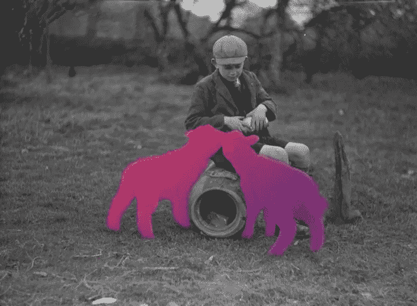

# 关于虚拟现实的讨论正在减少，但虚拟现实正在增长

> 原文：<https://medium.com/hackernoon/buzz-about-vr-is-dwindling-but-vr-is-growing-22f723a56551>

苹果的脸红渐渐褪去，批评家们开始质疑虚拟现实是否已经死了。然而与此同时，虚拟现实在医药、教育和军事等行业的发展越来越强劲[。](https://hackernoon.com/tagged/growing)

嗡嗡声正在消失，但取而代之的是有强大后盾和真正市场潜力的实际技术。

我们都记得虚拟现实将要改变世界的太平日子。我们戴上耳机，凝视着新地平线，我们知道这不会消失。毕竟，我们是福音传道者。任何仍在急切地阅读每一条身临其境的新闻的人都不需要被说服。我们掉进水里，走过星星，知道宇宙中没有这样的东西。尝试意味着把它带进你的心里，仅仅用语言来解释它永远不会真正做到。

我们想重温我们的记忆。我们想从我们的起居室探索宇宙。我们希望每个人都尝试它，像我们一样热爱它，让它接管媒体并取代它，让它成为新的黄金标准。

我们可能已经达到了一点点高。但我们很兴奋，好吗？

事实是，新技术几乎永远不会取代以前的技术。我们是习惯性的生物，就像视频不能完全杀死电台明星一样，我们也不应该期望虚拟现实能够横扫所有其他媒体。虚拟现实成功的标志不是视频游戏、电影和手机的死亡。

它的成功只是人们继续使用它。他们确实是。

## 赌博

它可能不会像福音传道者所说的那样统治游戏。我们可能不是都生活在一号玩家里。但是耳机仍然在被买卖。开发人员每天都在创造新的游戏，并且进步仍然很普遍。无线功能必然会使耳机更受欢迎，舒适程度也在不断提高。小而稳定的使用使得胶片相机被搁置。虚拟现实也是如此，谁会在乎这不是一个十亿美元的产业呢？它会留在这里。

## 医学

医疗行业是 it *占主导地位的行业，并且继续变得越来越受欢迎。每天都有一篇关于新医院首次使用虚拟现实的文章，无论是治疗病人的疼痛，使手术更安全，还是在新的程序中培训医生。医学虚拟现实足够令人兴奋，它应该出现在每本医学杂志的头版，那些声称虚拟现实没有发挥其潜力的反对者显然没有注意到这一点。*

## 教育

啊，学校。资金不足，不断寻求新的解决方案，但总是落后几步。虚拟现实在教育方面有着不可思议的潜力，但我们资金不足的学校可能还要等一段时间才能利用这项技术。但是在小学和高中之外，训练正在从 VR(和 AR)中获得巨大的推动。随着人们意识到在模拟环境中训练要便宜得多，我们可能会继续看到这方面的巨大进步。

那么，它是不是让我们大吃一惊，改变了一切？好吧，不，不是真的。但是，每天都不辜负我们倾注的爱和热情，这是不是酷得令人发狂？真的是。它正在超越宣传机器，变成真实的东西。一项我们都将与之互动的基础技术，一项将以稳定、合理的速度发展的技术。

试着让它自己成长。我们的发现会非常惊人。

*由鹪鹩 Handman 为***所写。**