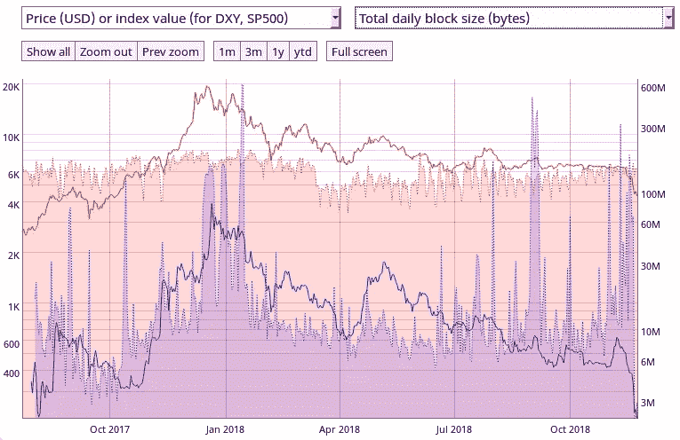

# 拜拜卡什:坏演员的解脱

> 原文：<https://medium.com/hackernoon/bye-bye-bcash-good-riddance-to-bad-actors-71dd926eb38b>

## 对区块链的硬性指标分析预示着狗屎硬币及其衍生品末日的开始。

## BCash 链简单拆分

最近不可避免的是，BCash(自称“比特币现金”)的主要发起人 Roger Ver、Wu 和(Faketoshi)在他们非常公开和自我强加的遗忘之路上陷入了新的历史低点(ATL)。

罗杰·韦尔，连同·吴及其公司，已经查封了(买？)对 BCH 股票首字母缩略词的明显所有权——因为大多数最大的交易所(那些仍然在 BCH 上市的交易所:以后还会有更多)都将“BCH”首字母缩略词授予他们的连锁店。与此同时，法克托什用一记硬叉将 BCH 与 BSV 分开。有趣的事实:许多人误解了代表[比特币](https://hackernoon.com/tagged/bitcoin) Satoshi 愿景的缩写，而实际上它代表的是狗屎愿景。

老实说，我不在乎在这里谈论更多的细节，因为我根本不在乎骗局的政治，也不在乎他们之间的内讧。而政治正是 BCH 一直以来所关注的:失败的政治家、罪犯、移居国外的罗杰是真正的耶稣吗？自吹自擂、引人注目、想成为真正的聪吗？吴先生下一次劫持整个网络的失败企图会是什么？抱歉，我他妈的不在乎！但是对于那些戏剧妓女:[在这里得到你的修复](https://bitcoinmagazine.com/articles/when-fork-forks-what-you-need-know-bitcoin-cash-goes-war/)。

至于所谓的技术争议:块大小是 32MB 还是 128MB 真的重要吗？因为这两种大小不仅荒谬，而且对网络具有破坏性。说够了。

## 行李掉落

很能说明问题的是，绝大多数交易所甚至没有在第一时间加入对 BSV 的支持，而且[正在放弃对 BCH](https://twitter.com/Excellion/status/1065774392913858561/photo/1?ref_src=twsrc%5Etfw%7Ctwcamp%5Etweetembed%7Ctwterm%5E1065774392913858561&ref_url=https%3A%2F%2Fcoingape.com%2Fbitcoin-cash-war-loss-millions-dollars-mining%2F) 的支持和上市，就像狗屎一样。显然，没有人想成为最后一个收拾烂摊子的人；去想想。但是 BCH 真的那么糟糕吗？是的。它自己的衡量标准正写在墙上(有人告诉我，是用狗屎手指画的)，预示着 BCash crock-chain 及其相关子分支的消亡。

## 一袋袋粪便

由于交易所和指标分析来源完全忽略了它的推出，BSV 的数据很少甚至没有——想浪费你宝贵的时间去调查，请便。

至于主要的 BCH 链，下面的数字讲述了一个价格暴跌(*图 1* )、交易量下降(*图 1* )、交易和支付数量大幅减少(*图 2、3* )、活跃地址激增(*图 4* )、可忽略的区块大小(*图 5* )、粉尘水平的费用(*图 6* ，至少这是他们的一件事，哈哈)，以及挖鼻孔采矿

**Figure 1.** Bitcoin price (solid red), BCash price (solid blue), Bitcoin adjusted transaction volume (dashed red), and BCash adjusted transaction volume (dashed blue). Source [coinmetrics.io](http://coinmetrics.io)

**Figure 2.** Bitcoin transaction count (dashed red), and BCash transaction count (dashed blue). Source [coinmetrics.io](http://coinmetrics.io)

**Figure 3.** Bitcoin payment count (dashed red), and BCash payment count (dashed blue). Source [coinmetrics.io](http://coinmetrics.io)

**Figure 4.** Bitcoin active addresses (dashed red), and BCash active addresses (dashed blue). Source [coinmetrics.io](http://coinmetrics.io)

**Figure 5.** Bitcoin total daily block size (dashed red), and BCash total daily block size (dashed blue). Source [coinmetrics.io](http://coinmetrics.io)

**Figure 6.** Bitcoin fees (dashed red), and BCash fees (dashed blue). Source [coinmetrics.io](http://coinmetrics.io)

**Figure 7.** Bitcoin average mining difficulty (dashed red), and BCash average mining difficulty (dashed blue). Source [coinmetrics.io](http://coinmetrics.io)

**Figure 8.** Bitcoin block count (dashed red), and BCash block count (dashed blue). Source [coinmetrics.io](http://coinmetrics.io)

## 指标不会说谎

在上面的图中，相应的比特币指标包括在上下文中。公平地说，一些比特币指标也出现了同步下降——最明显的是 BTC 价格和交易块数。然而，BTC 采矿难度(*图 7* )和块数(*图 8* )的同时下降，最有可能是由于比特币矿工完全关闭，因为最近价格下跌使他们的运营变得不经济。BCH 采矿难度的同时骤降(*图 7* )和 BCH 区块数的下降(*图 8* )表明，比特币矿工不会转移到 BCH 去支持假设的 BCH 连锁战争。

但是，交易计数是自然死亡，还是竞争对手通过开采 51%的空区块来攻击 BCH 链，就像 Faketoshi(怀疑他是否有能力这样做)和 Sharkpool 公开威胁自己做的那样？多亏了公众的魔力，区块链，我们可以明确地得出结论，到目前为止，没有一个个体矿工甚至增加了他们对空矿块的开采。

迄今为止，[所有 BCH 街区](https://blockchair.com/bitcoin-cash/blocks?q=time(2017-08-01..2018-11-26),transaction_count(0..1)&s=time(desc)#)(自 2017 年 8 月 1 日开始以来，[总共 79700 个街区中的](https://blockchair.com/bitcoin-cash/blocks?q=time(2017-08-01..2018-11-26)&s=time(asc)#)[3123 个](https://blockchair.com/bitcoin-cash/blocks?q=time(2017-08-01..2018-11-26),transaction_count(0..1)&s=time(desc)#))的近 4%已经完全空置，只有最近略有上升。因为大量的矿池继续挖掘空块，所以最近的上升几乎肯定是由其他指标的崩溃引起的，而不是对网络的任何故意攻击。

有趣的事实:截至本文撰写时，自 2017 年 8 月 1 日从比特币中分离出来以来，BCH 区块中高达 46%的区块[(总共 79700 个区块中的 36754 个)包含的交易少于 50 次。我猜他们并不真的需要所有的额外空间！](https://blockchair.com/bitcoin-cash/blocks?q=time(2017-08-01..2018-11-26),transaction_count(0..50)&s=time(desc)#)

无论如何，两个模拟链的矿工已经损失了数百万美元。展望未来，预计上述灾难性趋势将会继续，甚至恶化。

不，正如一些人猜测的那样，BCH 分叉并不是最近价格全面下跌的主要驱动力。抱歉，无论是狗屎硬币还是他们自封的权威人物都没有那么大的权力。更有可能的是，这只是一个迟到已久的价格调整的好借口。

同样非常重要的是，与 BCH 相反，在最近的价格调整中，上述数字中的所有 BTC 指标(可能除了与采矿经济因素相关的区块数)沿其长期轨迹保持完全稳定。

## 吸取的教训(拜托亲爱的上帝？！):

*   不要理会对权威的诉求。
*   避开任何推动比特币集中化的投机势力。
*   不要如此草率地改变比特币的基本协议和共识规则。
*   硬分叉的狗屎硬币不会增加 BTC 的供应量:更确切地说，在他们的头头骗子把任何愚蠢到买他们的狗屎的人都吸干并甩了之后，它们接近于零。
*   不要试图踩灭一袋燃烧的大便；你只会把屎弄到自己身上。
*   感谢你身边的一位比特币核心开发者，强烈坚持上述原则，并继续朝着更强的比特币协议努力！

## 那现在怎么办？

所有这些是否意味着 BCash shitcoins 将会完全消失？不太可能，因为似乎总是有足够多的惩罚傻瓜愿意将宝贵的计算能力花费在完全没有价值的区块链上——还记得以太坊被那些可爱但显然邪恶的小密码猫搞垮的时候吗！

然而，以太坊也继续蹒跚地走着它的不同步节点…至少现在是这样。不过，我个人不会打赌它会持续一年而不陷入现在在 BCash 流行的同样的废弃和抛弃。

现在，拜拜。嘲笑你的愚蠢很有趣。感谢你们坚定了我们在 BTC 的决心，感谢你们给比特币极小主义者上了一些艰难的课，感谢你们创造了更多的比特币最大主义者。

也发表在[https://green hacker . dev/bye-bye-bcash-good-riding-to-bad-actors/](https://greenhacker.dev/bye-bye-bcash-good-riddance-to-bad-actors/)