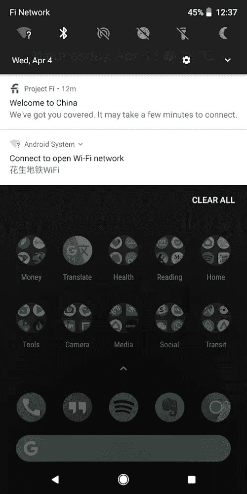
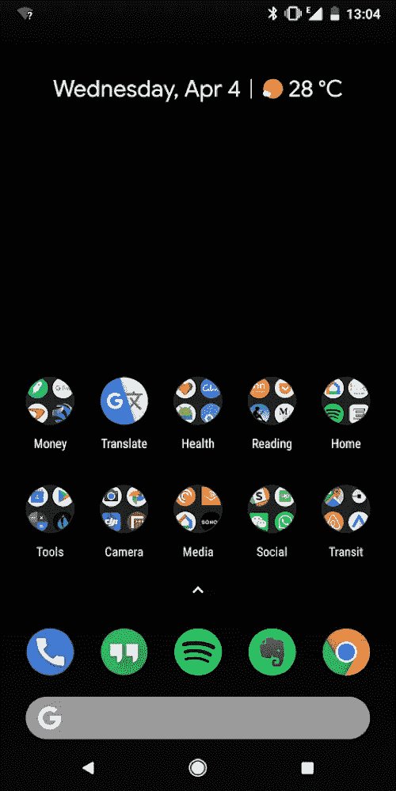
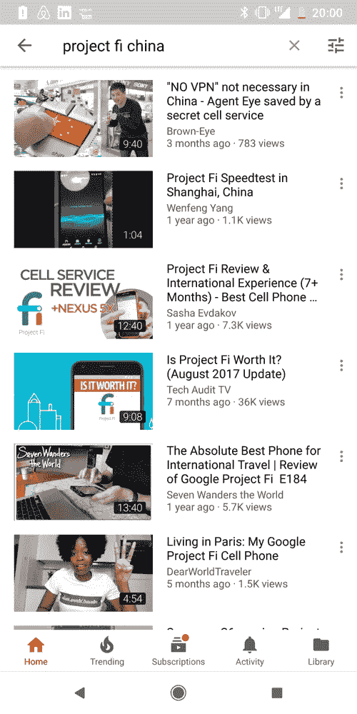

# 用项目 Fi 绕过中国的防火长城

> 原文：<https://medium.com/hackernoon/bypass-chinas-great-firewall-with-project-fi-14b58b90fab5>

Photo by [Hanson Lu](https://unsplash.com/@hansonlujx?utm_source=medium&utm_medium=referral) on [Unsplash](https://unsplash.com?utm_source=medium&utm_medium=referral)

Project Fi 是谷歌提供的一项令人难以置信的电话服务。对于出国旅行的美国人来说，它可以比传统的航空公司节省一大笔钱。

以下是国际旅行者的一些优势:

*   在 170 多个国家进行高速数据漫游—通常是 3G 或 4G
*   国际数据使用费用与美国相同。
*   无论你在哪里，都可以无限制免费发短信

有了 Project Fi，您再也不必在到达目的地时寻找并购买 SIM 卡，或者支付高昂的漫游费用。只要出现在几乎任何一个国家，像平常一样使用你的手机。

但有一个功能对 Fi 用户来说是锦上添花:绕过中国的防火长城的能力。这意味着您可以访问通常被阻止的网站，如 Medium、YouTube 和脸书，而无需设置 VPN。

Watch my video [on YouTube](https://www.youtube.com/watch?v=51an_XaLWk4). Subscribe to [my channel](https://www.youtube.com/c/gregyeutter?sub_confirmation=1).

# 它是如何工作的

通常，当您在国外漫游时，来自您设备的所有数据流量都会被路由到您本地运营商的服务器。对美国人来说，这不仅包括 Project Fi，还包括所有主要运营商(威瑞森、美国电话电报公司、T-Mobile 和 Sprint)。

这也适用于在其他国家和地区发行的 sim 卡。例如，香港的 SIM 卡通常能够访问 mainland China 被屏蔽的网站，因为流量被路由到香港的服务器。

Gmail, Medium, and YouTube are all blocked by China’s Great Firewall. As an alternative to a VPN, you can access them on a Project Fi phone or a tethered device, such as a laptop.

那么，如果其他运营商在漫游时也可以绕过长城防火墙和其他当地限制，那么是什么让 Project Fi 与众不同呢？事实是，它可以在 170 多个国家以具有竞争力的速度高速访问被屏蔽的服务。

# Fi 项目的对比

项目 Fi 的[费率结构](https://fi.google.com/about/plan/)非常简单:

*   在美国，每月 20 美元的基本费率可无限制拨打电话和发送短信
*   高达 6 GB 的高速数据，包括海外数据，每 GB 10 美元
*   从 6 GB 到 15 GB，高速数据无需额外付费(基本上是 80 美元/月的无限数据计划)，包括海外
*   超过 15 GB 后，无需额外付费，但您的速度可能会受到限制，包括海外
*   未使用的预付费数据将作为点数退款，超出部分按相同的费率收费
*   无限制免费向海外任何号码发送短信
*   打国际电话每分钟 0.20 美元。然而，在许多国家，假设有良好的 Wi-Fi 连接，您可以通过 Wi-Fi 免费接听电话，并以优惠费率通过 Wi-Fi 拨打电话
*   多达 9 张免费的数据专用 SIM 卡，可用于附加设备，只需为附加数据付费
*   免费共享—只需为额外的数据付费
*   在少数几个没有无线网络覆盖的国家，你可以连接无线网络打电话和发短信

在 Project Fi 上工作的手机支持广泛的频段，这意味着 Fi 手机可以跳到世界上任何地方的几乎任何网络上。

The Project Fi app sends a notification upon arrival in a new country. The network is displayed as “Fi Network” no matter where you are in the world.

以下是美国主要航空公司的不足之处:

*   T-Mobile:许多计划提供无限制的短信和国际数据，但仅限于 2G 速度和 140 多个国家。有特定计划的客户可以以每月每条线路 10 美元的价格添加 T-Mobile ONE Plus，以获得略高的速度(对于 3G 来说仍然非常慢)。通话价格因国家而异，起价为 0.20 美元/分钟。您需要确保您的设备支持您计划访问的国家的频段。[更多信息](https://www.t-mobile.com/coverage/roaming)
*   威瑞森无线:TravelPass 选项提供无限通话和文本，但在 130 多个支持的国家中的大多数国家，每条线路的费用为 10 美元/天。高速数据限制为每天 0.5 GB。你必须有一个 4G LTE World 设备。[更多信息](https://www.verizonwireless.com/solutions-and-services/international-travel/)
*   美国电话电报公司:国际日通票提供无限通话和短信，但它只在 100 多个国家有效，每天 10 美元。数据和速度许可符合您的家庭限制。或者，美国电话电报公司护照每月 60 美元，可以无限制地打电话和发短信，但它只包含 1GB 的数据。您的设备必须支持您计划访问的国家的频段。[更多信息](https://www.att.com/offers/international-plans/europe-caribbean-country-more.html)
*   Sprint: Sprint 全球漫游包含在所有计划中，包括 185 个以上目的地的无限短信和国际数据，但仅限 2G 速度。在大多数目的地，可能以 5 美元/天或 25 美元/周的价格购买更高的速度，但在中国等一些目的地，可能以 10 美元/天或 50 美元/周的价格购买。通话价格因国家而异，起价为 0.20 美元/分钟。仅限于某些设备。如果主要在海外使用，服务可能会被终止，并且 Sprint 对数据限制不透明。[更多信息](https://www.sprint.com/en/shop/services/international.html)

如果你计算一下，对于大多数国际使用案例，Project Fi 比其他运营商更有价值。

# 我的经历

我成为 Project Fi 的用户已经两年了，到目前为止已经在六个国家使用了这项服务。我最近在亚洲花了一个月的时间，带着谷歌 Pixel 2 XL 去了香港、深圳、东京、京都和大阪。我还带了一部 iPhone 7 Plus，带有 Project Fi 纯数据 SIM 卡。

在香港和日本，我大部分时间都有 4G 服务，包括在地铁里。这款手机在抵达东京时最初没有连接到网络，但重启后问题得到了解决。在东京和京都之间的新干线上，有好几个时期我的设备没有服务。除了这些小问题，服务很好。

带有纯数据 SIM 卡的 iPhone 在香港和日本也运行良好。它的网络连接速度没有 Pixel 快，但一般都能达到 3G 或 4G 的速度，这种体验还是可以接受的。

我通过香港和日本的手机网络打了几个电话，每分钟收费 0.20 美元。请注意，我必须使用正确的本地拨出代码才能拨打美国号码。

In the Shenzhen subways, I was only able to get 2.5G (EDGE) service, as indicated by the E next to the signal strength icon.

在中国，Pixel 从香港跨境到深圳时，大约需要 10 分钟才能连接到网络。速度一般是 4G，有时是 3G，尽管我在地铁里只有 2.5G 的速度(尽管一些运营商在地下提供 4G)。我可以访问 Pixel 上正常情况下被屏蔽的网站，我还可以通过笔记本电脑访问这些被屏蔽的网站。

如果 Pixel 同时连接到无线网络和酒店的无线网络，我就无法访问受限网站。

装有纯数据 SIM 卡的 iPhone 无法连接到中国的受限网站。此外，它似乎并不经常在地下工作。似乎 Fi 数据专用 SIM 卡并不连接到美国的服务器，而是连接到当地运营商的服务器。

# 一个潜在的交易破坏者

Project Fi 非常棒，除非你需要用 iPhone 作为你的主要手机。它也无法与一加、三星和华为的最新 Android 旗舰产品 100%兼容。你可以让这些手机在 Fi 上工作，但体验[往往不是最理想的](https://www.androidauthority.com/psa-project-fi-phones-792301/)。

然而，Project Fi 为您提供的有限设备选项相当不错。我一直在享受我的[Pixel 2 XL](https://store.google.com/product/pixel_2)——这是目前最顶级的手机之一，拥有可以说是最好的相机。更小的 [Pixel 2](https://store.google.com/product/pixel_2) 也很棒， [Moto X4](https://www.motorola.com/us/products/moto-x-gen-4) 是一个不错的预算选择。Pixel 2 手机采用 eSIM，这意味着可以为高级用户插入额外的本地 SIM 卡。

Using YouTube in China on the Fi Network with LTE speeds.

也就是说，你可以给任何其他手机设备添加一个免费的纯数据 SIM 卡。这可能是一台 iPad，一台笔记本电脑，甚至是上面列出的非 Fi 手机之一。虽然您不能使用这些设备在蜂窝网络上打电话或发短信，但您可以通过 Wi-Fi 或数据连接使用 Google Hangouts 应用程序来实现这一目的。

# 判决

谷歌的 Project Fi 是一项面向国际旅行者的高级手机服务。透明的成本结构、在 170 多个国家漫游的能力以及快速的海外数据速率使其成为移动用户的绝佳选择。只要你习惯使用顶级 Android 手机，你就应该好好看看这项服务。

如果你使用[这个链接](https://g.co/fi/r/D9J4H0) *注册了 Project Fi，你可以获得 20 美元的积分。

**感谢阅读。**如果你喜欢这篇文章，请点击上面的拍手按钮，并与你的朋友分享。我也鼓励你订阅我的 [YouTube 频道](https://www.youtube.com/c/gregyeutter?sub_confirmation=1)来获取更多类似的内容。

*本文未经 Google 或 Project Fi 认可，此处表达的观点仅代表我个人。[推荐链接](https://g.co/fi/r/D9J4H0)赋予新用户 20 美元的服务信用，最多 10 个用户。如果你选择使用这个链接注册，我的帐户可能会收到 20 美元的信用。有关更多信息，请参考[推荐计划条款](https://fi.google.com/about/referral-tos/)。