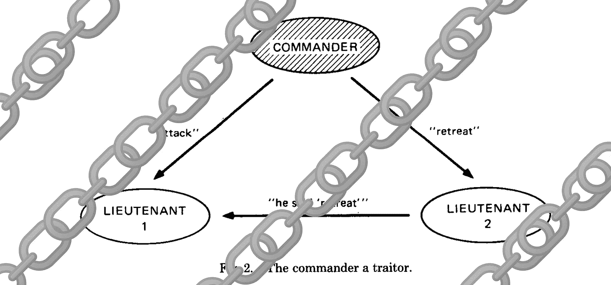

# 利害关系证明协议中的拜占庭容错

> 原文：<https://medium.com/hackernoon/byzantine-fault-tolerance-in-proof-of-stake-protocols-ab9746521b24>

## 一个基本的介绍，使最新和最伟大的卡斯帕研究有意义

Proof-of-stake meets decades old research literature.

如果您正在关注以太坊基金会的 Casper 研究，您将会听到很多类似“可问责的安全性”和“异步计时模型中的容错阈值”这样的术语。我想概述一下拜占庭容错理论中的重要概念，这样你就有更多的背景来了解今天在 Stake 空间的证明中一些最激动人心的工作。

当在学术文献中讨论分布式共识算法时，我们使用一个基础模型，该模型假设了一些关于时间的属性(“这个消息需要多长时间到达？”)和一些关于故障类型的属性(“协议中的节点怎么会做错事？”).我们这样做是为了能够非常精确地了解我们正在谈论的事情的类型，从而能够反过来创建被研究的算法的各种保证的形式证明。这些正式的证明是有用的，所以我们可以说服自己和其他人，我们认为会发生的事情会真的发生。一台计算机可能进入的状态的数量是如此之多，更不用说由许多状态组成的网络了，以至于在构建真正的系统时，拥有一些来自数学的漂亮工具是一个巨大的帮助。

# 协议的安全性和活性

让我们快速回顾一下什么是协议，这样我们就有了相同的背景。然后我们可以讨论活性和安全性，以及当这些东西中的任何一个有“失败”或“错误”时意味着什么。我们可以把一个协议想象成一个游戏——有一组玩家和一些规则。这些规则规定了玩家应该如何应对游戏中的各种事件。这种“要做的事情”通常会导致玩家改变他们拥有的一些数据，比如目前为止的最高分之类的。如果我们的共识协议运行良好，那么所有的玩家都遵守所有的规则，这意味着在任何给定的时间，每个玩家对于他们的本地状态都有相同的值。这一结果在分散式协议中变得非常重要，在这种协议中，你通常会在互联网上遇到一群陌生人，他们只是试图对世界的本质做出最好的猜测。

活性指的是我们的共识算法不会被“卡住”的事实，这意味着只要足够多的节点(“参与者”)仍在参与，就可以朝着共识取得进展。“活跃度失败”指的是这样一个事实，我们从某个状态(如 genesis 块)开始，然后运行协议——处理我们从对等方“离线”看到的消息，并相应地更新我们对全局状态的本地视图——然后“卡住”。卡在这里意味着您的计算机可以愉快地等待更多的消息，但事实上没有任何人(或某些情况下的某个子集)可以向您发送消息，让您继续计算全局状态。你认为这就像玩跳棋，除了你卡住了(可能永远！)瓦片 7 和 8 之间的中间跳跃。

安全性是一个关键的共识属性，这意味着一旦一个节点决定了某个共识值(根据协议),那么该决定也将在参与者集合中的所有节点上做出。换一种更简单的说法，如果你没有安全感，那么你就没有共识。如果我们中的一半人认为当前状态是数字“1000 ”,而另一半人认为是“1234 ”,那么我们的协议就失败了。一个重要的微妙之处是，节点可以避免产生共识值——也许它们需要更多的时间来从它们看到的所有消息中找出共识状态——但如果节点正确地安全地遵循协议，那么它只会在确定遵循规则的其他人也这样做时才提交特定的值。

# 计时模型

通常使用的三种主要类型的定时模型是同步模型、异步模型和部分同步模型。这些模型中的每一个都对在协议执行的给定回合中节点之间的消息交换之间可能发生的时间长度(“等待时间”)做出一些保证。这种分类很重要，因为在分布式设置中，单个节点无法区分失败的对等节点和花费很长时间响应的对等节点。考虑到这一事实是为分布式共识设计健壮算法的核心。

举一个更熟悉的例子，让我们想象我们和你的朋友坐在一张桌子旁玩电话游戏。一个玩家开始对下一个玩家耳语一个词，然后我们都围着桌子对序列中的下一个玩家耳语这个词。最后一个玩家在游戏结束时向每个人展示他们听到的单词，每个玩家可以将他们的单词与开始的单词进行比较。笑声通常接踵而至。我们实际上可以在这里区分两种类型的延迟:1)一个玩家一旦听到这个单词，就向下一个玩家耳语这个单词所花费的时间；2)单词在玩家之间传播所需的时间。第一种延迟对我们的分布式计算环境很重要——想象一下，一个“领导者”节点由于其本地代码中的错误而陷入无限循环，并且从未“传递火炬”,以便组中的“追随者”可以在没有失败的领导者的情况下继续形成共识——然而，第二种延迟通常会得到更多的分析，因为它通常在绝对意义上占主导地位(也许是因为作者假设我们可以编写无错误的代码？).要在电话游戏中传递信息，你只需对你的邻居耳语，这似乎不会花很长时间。在分布式计算环境中，您可能试图联系世界另一端的一台计算机，此时传输一条消息所需的时间开始增加。现在让我们来看看每一种定时模型。

在同步模型中，从一个节点发送消息到您可以确定接收节点听到消息之间的时间有一个最大值(“上限”)。对于节点之间的相对速度差，您也有一个上限 P(因此您可以考虑处理器速度较慢的机器)。我们可以想象一些理想化的场景，其中我们只有少数几台计算机(可能都在同一个房间里)，它们通过完全可靠的链接进行信息交换。在这种情况下，我们期望现代机器能够在不到一秒钟的时间内通过电线发送信息；这个值就是我们的 t。假设我们使用现代机器，假设所有机器都使用直接来自晶圆厂的同一种处理器，那么我们将在一定的容差范围内跨节点拥有相同的速度；我们的 P 值。

在异步模型中，我们删除了上限 T 和 p。消息可能需要任意长的时间才能到达对等节点，每个节点可能需要任意长的时间来响应。当我们说“任意”时，我们包括“无限”,这意味着某个事件永远不会发生。这种模型很重要，因为它更准确地捕捉了公共互联网，在那里网络上的节点(包括中间路由器)发生故障并且消息一直被丢弃。

两者混合的部分同步模型:T 和 P 存在上限，但协议设计者不知道它们，任务是设计根据这一事实仍然达成共识的机制。在实践中，给定现代网络/机器的现实特征(消息通常到达它们要去的地方)和使用诸如超时之类的策略来指示节点何时应该重试发送消息，协议实现者可以实现类似这种模型的系统。传统 BFT 文献中有几类算法(例如 Paxos 和较新的 Raft)利用了这种洞察力。

# 这一点在卡斯帕身上的应用

鉴于 Casper 的目标是成为以太坊区块链的一个去中心化的一致协议，上述所有内容都与 Casper 密切相关。我们不仅有典型的问题——错误的节点和不稳定的网络——我们现在还有节点行为不端的实际动机。对 Casper consensus 的成功攻击可能会让某人执行双重支出攻击，或者我喜欢称之为*索罗斯攻击*(参见乔治·索罗斯和黑色星期三)，攻击者做空 ETH，然后在 Twitter 开始传播以太坊共识失败的消息时引发大规模恐慌抛售。

关于在分散化环境下达成共识的细节还有很多要说的，鉴于加密货币涉及的经济激励，攻击空间变得更大。我建议从这里开始深入研究:[https://blog . cosmos . network/understanding-the-basics-of-a-proof-of-stage-security-model-de 3 B3 e 160710](https://blog.cosmos.network/understanding-the-basics-of-a-proof-of-stake-security-model-de3b3e160710)如果你想喝消防水管里的水，你可以加入对[https://ethresear.ch/](https://ethresear.ch/)的研究。