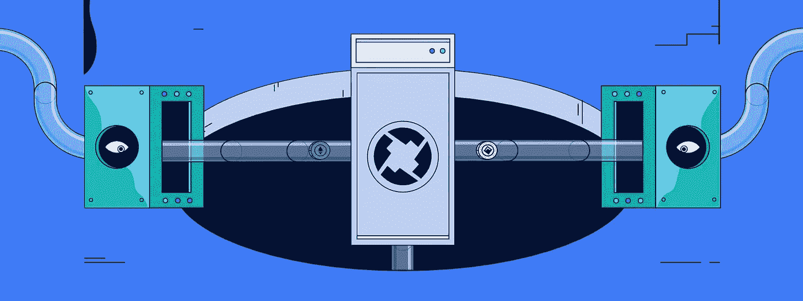
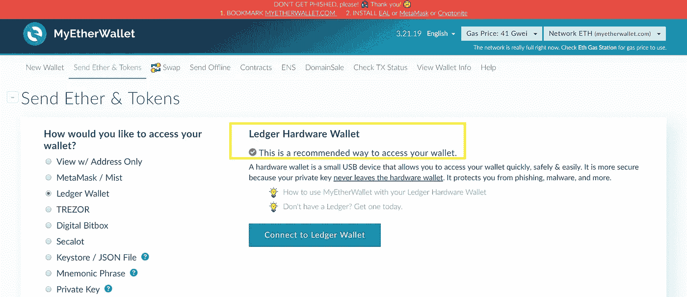

# bZx 网络 ICO 评论第 1 部分:把你的 ERC20 库存变成一个“银行账户”

> 原文：<https://medium.com/hackernoon/bzx-network-ico-review-part-1-turning-your-erc20-stash-into-an-unbank-account-31ce7c06510>

Make HODL’d ERC20 Tokens Work Even Harder for You

[**bZx 网络**](https://b0x.network/) 正在为任何选择整合的分散式交易所(DEX)建立分散式保证金借贷协议。

该平台增强了安全性，降低了费用，并提高了整个 DEX 市场的流动性。

在这个由多个部分组成的系列中，我们将了解 bZx 协议以及它给保证金交易者和 BZRX 令牌持有者带来的好处。

现在，在我们开始之前，让我在这里喷一些数字空气清新剂…

***免责声明*** *:这不是投资或理财建议。无论如何我都不是金融专家。本文中的大部分信息都是推测性的，仅仅是我个人的观点。在参与任何创业项目之前，一定要进行自己的研究。*

永远记住，你用你的资金做什么是你自己的决定。如果这个决定对你一个人来说太难了，向金融专家寻求指导。

*我可能会收到创建此内容的少量令牌分配。也就是说，我会尽我所能保持公正和公平。我尽量避开所有的 FOMO 和 FUD，也绝不希望把这些情绪传染给我的秘密首脑伙伴们。*

# 老派的 HODL

你还记得银行为储蓄账户支付可观的年利率吗？如果你在 2008 年金融危机前持有菲亚特，你可能会获得 5%或更多的存款利息。

具有讽刺意味的是，享受着多余奖金和奢侈生活方式的肥猫央行行长们正骑在这些存款的背上。

> *大家都想年化 5%？拿着！我们会在你的菲亚特上至少赚 20%。*

然后银行变得有点太大了。他们花钱有点太肆无忌惮了。在欺诈者有机会从贪婪的失误中恢复过来之前，污水击中了众所周知的粉丝。

在屈服于自身的重量之前，贪财和腐败只能持续这么久。

这个流氓网络再次证明，他们并没有把储户的最大利益放在心上。

他们说需要孕育发明。由此开始了货币进化的新篇章…

# 新学校 HODL

今天的法定储蓄账户利率简直可笑。

让我直截了当地说吧——你想让我把菲亚特存入银行，然后获得不到 1% 的年息？不用了，谢谢。诚然，我们在某种程度上被困在矩阵中，无法避免菲亚特。至少现在是这样。

你看，既然我相信技术，热爱区块链业界对开源未来的愿景，我就选择 HODL 代币，而不是菲亚特。

而且，有一些项目，我觉得绝对会在未来几年价值爆炸。比任何菲亚特都要多。

我近期不打算出售或交易某些 ERC20 代币。我有一个安全的地方保存它们…

## 你自己的私人账本

每个 DEX 的一个重要组成部分是私钥的自我保管。DEX 用户不容易受到集中式交易所面临的一些缺点的影响。

也就是说，集中操作持有您的私钥，有时会被黑客攻击，并且可能会由于不可预见的“钱包维护”停机时间而锁定您的个人硬币。

为了避免所有这些废话，今天的霍德勒夫妇使用私人钱包。最安全的类型是硬件设备。Ledger Nano S 是一个受欢迎的选择，我们看到越来越多的解决方案进入市场。

Keeping your ERC20 tokens on lockdown

现在，即使是 [**MEW**](https://www.myetherwallet.com/) 本身也容易遭受黑客攻击和网络钓鱼欺诈。并且，他们建议你不要在登录他们的网站时输入你的私人密钥。

这使得在硬件中保护您的 ETH 和 ERC20 令牌变得非常重要，它充当您的加密和互联网领域的安全中间人。

你可能不愿意把你的加密地址提供给互联网的窥探者，但我不会。我对我的硬件绝对有信心。

来，让我证明给你看…

> *因为我的私人密钥从不离开设备，所以你唯一能做的就是用这个 ETH 地址存款:*
> 
> 0x 625634 e 6004d 9 EB 5 CAAC 9 ab 570 FB 00 a 362 a 909 b 7
> 
> *来啊，挥挥手，我三狗谅你也不敢！*

不过，说真的，如果你有一大袋 ETH 和/或 ERC20 代币，你应该买些硬件。

而且这个分类账并不局限于以太坊网络——你也可以用它来存储某些非以太网的代币，比如$KMD 和$NEO。

当你作为自己的银行时，对安全性保持警惕当然是符合你的最佳利益的。

# 未来派的 HODL

既然我们已经介绍了旧的和当前的资产存储方法，那么让我们来看看未来几个月的发展方向。

管理 bZx 的团队使我们的 HODL 技能更上一层楼。

与其采取一劳永逸的方式将代币存入你的私人 ETH 钱包，你可以将你的 ERC20s 借出，并获得利息。

现在，有息硬币的想法并不新鲜。上述硬币，以及像$ECA 和$ONT 这样的硬币——以及更多的硬币——为代币持有者提供奖励。

> **这里的关键区别在于，bZx 平台允许霍德勒将他们的 ERC20 代币借给保证金交易商。这大大扩展了你的 HODL 硬币的奖励承载能力。**

潜在的价值增长仍然活跃，因为一旦贷款期限结束，你会得到硬币回来。到那时，你的代币袋就会变大。

您可以将您的 ERC20 令牌中的任何一个*转换为 iTokens，而不是像 bZx 网络的原生 BZRX 那样受限于特定令牌。*

*一旦你拥有 iTokens——在未来的文章中会有更多关于它们的内容，不，它们与苹果无关——你就有资格因为借出它们而获得奖励。*

*现在，我还没有找到具体利率的细节，但我的猜测是，他们绝对会粉碎今天的中央银行可以提供的任何优惠。没有臃肿的中间人可言。*

*此外，由于加密领域的某些硬币已经提供了超过 5%的年利率，bZx 团队应该至少达到这个数字。*

*现在市场上有很多——甚至可能太多——代币期权。bZx 团队需要提供一个令人信服的理由来使用他们的网络。*

# *最后的想法…*

*DEX 行业发展迅速。但是这个概念还没有从中央集权的对手那里接过缰绳。*

*我们知道现在加密领域需要 dex。今年已经有太多的数百万和数十亿美元被从知名交易所抽走。我想这足以让一些人完全远离这个行业。*

*此外，在我们看到广泛采用 DEX 之前，流动性和用户友好性是需要克服的两大障碍。bZx 团队正在努力解决这两个障碍。*

*bZx 计划通过设计吸引铸币者和非铸币者的磁铁来改善 DEX 的前景。被动收入作为自由的最终推动者具有普遍的吸引力。*

*让资金朝你的方向前进——不需要你做任何进一步的努力——让你专注于对*你最重要的事情。**

*如果你能让你的被动流足够多，比尔·兰伯格就不会支配你的日常安排。*

*这种愿景，有点浪漫但可以实现的，在你睡觉的时候获得报酬的想法，是如此的诱人。老实说，这是我决定挖掘更多关于 bZx 项目的原因之一。*

*相信我，兔子洞比被动收入更深。*

*我一定会和你分享更多我的发现。但是你得等等。内容很多，我打算将这些概念分成独立的文章。*

*但是如果你赶时间，可以去 bZx 网站 了解更多关于这个项目的信息。如果你想阅读更长的内容，可以在这里找到 [**bZx 白皮书**](https://b0x.network/pdfs/bZx_white_paper.pdf) 。*

*最后，这里有一些额外的 **bZx 项目资源**:*

***电报**:[https://t.me/b0xNet](https://t.me/b0xNet)*

***推特**:【https://twitter.com/b0xNet】T2*

*GitHub:[https://github.com/b0xNetwork](https://github.com/b0xNetwork)*

***邮箱** : team@b0x.network*

***Mainnet dApp**:[https://portal . bzx . network](https://portal.bzx.network/)*

***BZRX 令牌预售申请**:[https://b0x . network/Token sale/](https://b0x.network/tokensale/)*

## *顺便说一下…*

*如果你喜欢你在这里看到的，并且需要帮助把你的加密信息传递给大众，我很想听听你的项目。*

*请随时联系我:blockchainauthor 作者在 gmail*

*** * * BountyOx username = block chain author * * ***