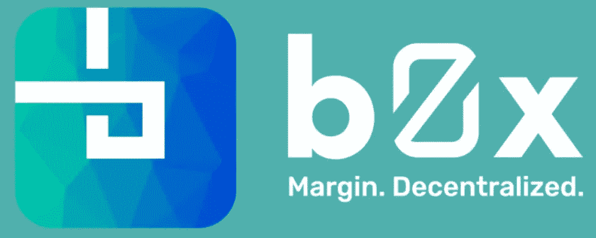
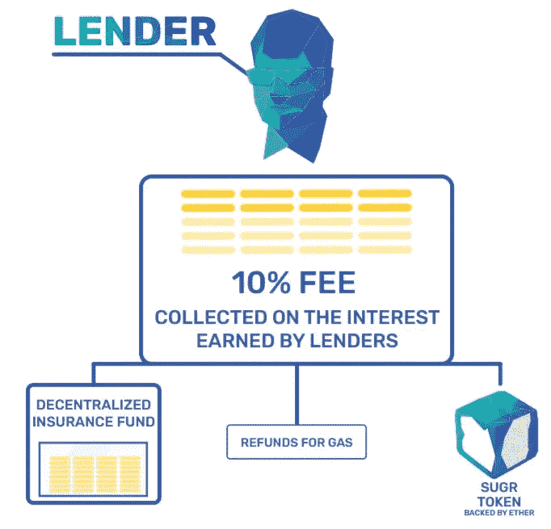

# bZx 网络 ICO 回顾第 2 部分:备份您的 ERC20 存储

> 原文：<https://medium.com/hackernoon/bzx-network-ico-review-part-2-backing-up-your-erc20-stash-8635aad660dc>

Growing & Protecting Your ERC20s

bZx 网络 正在创建一个分散的保证金借贷协议。任何分散交易所(DEX)都可以与 bZx 集成，并在其平台内享受额外的流动性。

尽管该项目的 ICO 仍处于预售阶段，但他们的 MainNet DApp 已经上线。如果你想尝试一下，请随意访问 [**bZx 门户**](https://portal.bzx.network/) 。

在之前的 bZx Network 文章 中，我们讨论了如何让您的 ERC20 令牌发挥作用。你的包不必闲置在你的以太坊钱包里——让它们走出去，赚取它们的费用。

在这篇文章中，我们来看看该项目的区块链供电保险。bZx 平台将降落伞基金融入了他们的令牌经济学。

在你阅读的时候，一定要记住这一点…

***免责声明*** *:这不是投资或理财建议。无论如何我都不是金融专家。本文中的大部分信息都是推测性的，仅仅是我个人的观点。在参与任何创业项目之前，一定要进行自己的研究。*

永远记住，你如何使用你的资金是你自己的决定。如果这个决定对你一个人来说太难了，向金融专家寻求指导。

*我可能会收到创建此内容的少量令牌分配。也就是说，我会尽我所能保持公正和公平。我尽量避开所有的 FOMO 和 FUD，也绝不希望把这些情绪传染给我的秘密首脑伙伴们。*

# 艰难的选择

任何加密货币的任何互换都发生在两种类型的交易所之一:集中式或分散式。每种风格都有自己的优点和缺点。

集中交易提供了便利、速度和流动性。至少目前，集中交易所的交易量比分散交易所高得多。

但是这些舒适的设施也伴随着风险。交易所定期被黑已经不是什么秘密了。大多数尝试都失败了，但 2018 年出现了更多高调的数百万美元的黑客攻击。

> 当你每天都在用密码处理数百万甚至数十亿美元的交易时，你的操作对小偷来说是非常有吸引力的。

现在，声誉良好的交易所倾向于补偿客户被黑的资金。不过，你不会想经历这种麻烦。

不在集中的交换中心保存大量的密码是一种常见的做法。出于交易目的持有少量代币是可以的，但是最好把代币放在你拥有私人钥匙的钱包里…

## 成为你自己的银行

保持对钥匙的拥有可以说是使用 DEX 的最好部分。你总是能控制你的代币的命运。

但是现在我们已经获得了安全，我们将需要处理低容量和较慢的交易时间。

除了失去速度和流动性，DEX 用户还面临着无法进行保证金交易的弊端。

不管你是做多还是做空，你都必须使用一个集中的交易所，因为基于 DEX 的保证金交易还不存在。

这就是 bZx 项目的全部意义。

# 当平台用户成为输家

问题头寸是保证金贷款系统的主要组成部分。这是制造美元的地方。

你看，赌一项资产会升值或贬值，你就在冒险，市场不会同意你的假设。

如果出现对你不利的剧烈波动，你的整个账户都会被清算，你可以把名字改成 Rekt。

就像乐透一样，所有的输家都喂赢家和系统运营商。

但有时，头寸没有及时平仓。在这种情况下，与乐透不同，输家可以提取剩余资金。他们赌博输了，但可以部分退出赌局。

此外，不稳定的加密市场容易受到 FOMO 和 FUD 的影响——通常是非理性的——并且可能在任何给定的时刻遭遇整体价格混乱事件。在这些事件发生时，整个平台都会受到影响。

现在，bZx 项目已经制定了应对潜在资金损失的计划。强制平仓——由以太坊智能合约、区块链神谕甚至赏金猎人支持——是主要的防御方法。

但是这个团队在这个组合中增加了另一个安全网…

Lenders fund the bZx network’s decentralized insurance program

# 保护您的代币

bZx 网络上的贷方是获利最多的。

借款人也是如此。但是他们承担了最大的风险，因此他们输的比赢的多。

同样的概念也适用于赌场。他们仍然是有利可图的业务，因为他们经营的游戏有很高的胜算。

有人要 21 点吗？

为了维持和保护收益不受损失，该项目创建了 DIF 分散外汇基金。该基金以以太网和网络的 BZRX 令牌命名。

需要注意的是，治理在这里扮演着重要的角色。

你看，随着网络收费，一些以 SUGR 代币的形式返还给贷方和借方。这些代币赋予持有者投票决定整个网络如何运作的权力。

如果一些重大事件扰乱了加密市场，SUGR 持有者将需要在 DIF 启动之前就条款达成一致，以恢复原则平衡。

还有一个小问题需要指出…

令牌持有者有权执行资格要求。结果很可能是，那些在头寸上使用大量杠杆的人在需要时将无法使用保险。

然而，等式中有很多“如果”。我觉得没什么好过分担心的。别的不说，借款人只能在最高可保金额内使用杠杆。

# 最后的想法…

bZx 项目旨在提供一个两全其美的——集中式和分散式——加密交换解决方案。

用户在获得高流动性和保证金交易的同时，获得了保持其私钥私有的安全性。

通过创建网络的分散保险基金，该项目为 ERC20 霍德勒提供了更多的激励，以将他们的代币借给借款人。

bZx 不仅为那些持有“非银行”账户的人增加了代币功能，该项目还提供了传统银行市场中的一项服务:存款保险。

作为任何交易所的用户——无论是否集中——你都需要对资金的安全性感到放心。您需要确信，下次登录时，您的资金会在那里等着您。

bZx 允许在任何 DEX 内进行保证金交易，并为其提供定制的、由社区管理的保险政策支持，这使得交易员可以始终将资金置于自己的控制之下。

因此，我对任何分散式交换机的运营商的问题是:为什么*不想*将 bZx 协议集成到您的网络中？

**DYOR**

希望更深入地了解该项目？访问 [**bZx 网站**](https://plentix.io/) 了解更多信息。

如果你正在寻找一些额外的阅读材料，这里有一个链接指向 [**bZx 白皮书**](https://b0x.network/pdfs/bZx_white_paper.pdf) 。

最后，这里有更多的项目资源可供研究:

**电报**:[https://t.me/b0xNet](https://t.me/b0xNet)

**推特**:[https://twitter.com/b0xNet](https://twitter.com/b0xNet)

**GitHub**:[https://github.com/b0xNetwork](https://github.com/b0xNetwork)

**邮箱** : team@b0x.network

**Mainnet dApp**:[https://portal . bzx . network](https://portal.bzx.network/)

**BZRX 令牌预售申请**:[https://b0x . network/Token sale/](https://b0x.network/tokensale/)

## 顺便说一下…

如果你喜欢你在这里看到的，并且需要帮助把你的加密信息传递给大众，我很想听听你的项目。

你可以在这里找到我:gmail 的 blockchainauthor

**** BountyOx 用户名= blockchainauthor 作者****