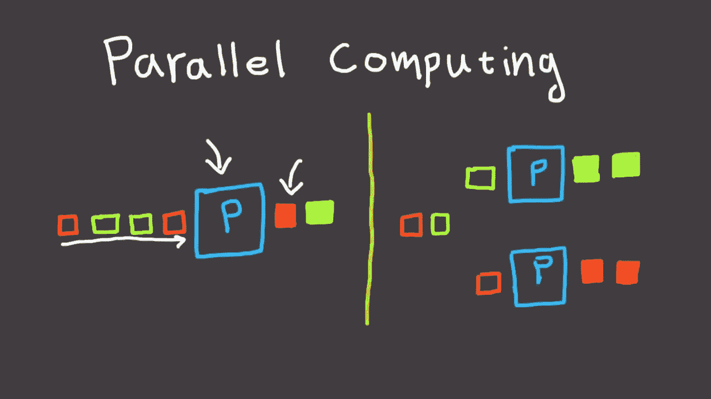

# C#异步 API:缺失的部分

> 原文：<https://medium.com/hackernoon/c-async-api-the-missing-parts-2229a2b3732>

许多年前， **C#** 介绍了一种运行异步操作的方法，这种方法真正改变了我们编写并发代码的方式。 **C#** 异步 API 用于推动并发执行的许多方面。`async / await`的引入，以及类似 API 的*一元*，使得这种美丽的语言( **C#** )在编写多线程工作负载时非常受欢迎。然而，时过境迁，其他语言在不断更新其 API 的同时。NET 保持不变。

在这篇文章中，我们将探索一些 **C#** 异步 API 特性，同时将它们与现代 **Java** 提供的特性进行比较。这并不是要批评这些特性，而是通过编写一些小代码来分析它们，这些代码可能会真正改进这些 API。

# 运行任务

下面的代码显示了如何在 **C#** 中运行一个简单的任务。

注意，我们使用`.Result`来获取任务返回的值。如您所料，该操作将一直阻塞到值可用，换句话说，它将一直阻塞到任务完成。

在 C# 中，一种流行的非阻塞操作方法是使用`async / await`，这是这种语言中最有趣的特性之一。

通过使用`await`，我们可以指定计算的下一步(`.WriteLine`)，而不用考虑回调，最重要的是，不用阻塞。`await`关键字后的代码通过编译器为我们做的一系列转换成为回调。

最新代码的等价物(在 **C#** 中)如下。

请注意，`.ContinueWith`中的*λ*与上例中的`await`代码相同。事实上，这就是编译器在将一个转换成另一个时所做的事情。在这两种方式中，计算都是在没有任何阻塞的情况下执行的，最大化了异步执行。

我们刚刚看到的这两个选项展示了我们在 **C#** 中链接计算阶段的唯一方法，在大多数情况下，它们就足够了。

在 **Java** 中，前面的例子看起来几乎一样。

请注意，它们基本上是相同的，只是在每个平台上改变了 API 结构。

一个有趣的区别是，在 **Java** 中，`.thenApply`函数接收前面计算的结果，而在 **C#,** `.ContinueWith`接收一个任务，然后我们要从中提取`.Result`。

在 **Java** 中，我们也可以像*艺电* ( **EA** )提供的那样，通过 [***库***](https://github.com/electronicarts/ea-async) 来使用`await`。

请注意，`await`不是 **Java 中的保留关键字，**而是一个被调用的函数。不过使用方法和 **C#** 完全一样。 **EA** 库执行一些字节码操作，以便获得由 **C#** 编译器生成的相同结果。

# 链接阶段

当在 **C#** 中链接计算阶段时，我们仅限于上面看到的构造，但是让我们更深入地看看它们。

注意`.ContinueWith`提供了返回不同类型的重载函数，比如`Task<T>`和`Task`。换句话说，它可用于链接阶段，其中该阶段返回新值，或者该阶段仅*运行*某个*副作用*操作并且不返回任何值( **void** )。

在 **Java** 中，这是通过使用不共享相同名称的不同一元运算来完成的。 **Java** API 减少了重载函数的数量，并根据它们的功能按名称分组。

让我们看看同样的例子是如何在 **Java** 中完成的

除了命名上的变化，这是完全相同的功能。然而，注意`.thenApply`和`.thenAccept`有不同的含义，其背后的意图在它们的名字中被清楚地标记出来。在 **C#** 中情况并非如此，这里`.ContinueWith`是唯一使用的方法。

# 内部异步操作

现在，我们来看看 **C#** 落后了一点。

假设我们有这样的东西。

然后，我们想把这两个操作结合起来。下面是一种自然的方法。

但是，`final`是一个`Task<Task<string>>`肯定不是我们想要的值。

问题是`.ContinueWith`没有**拉平**它的结果。

为了做到这一点，我们将不得不以下面的方式写另一个函数。

即使这样，我们也不能继续连锁经营，打破我们从一开始就遵循的模式。此外，它非常具体，所以我们可能想以某种方式推广这个函数(继续阅读)。

另一方面，Java 有各种合适的函数可以使用。

注意`.thenCompose`是如何拉平`str`获得的结果`CompletionStage<String>`，这是我们期望的值。

# 改进 C#？

事实上， **C#** API 的设计早于其他 API。即使它有一个非常简单的方法，并且扩展使用了`async / await`，它也可能需要一些改进才能赶上。

对我们来说幸运的是， **C#** 有*扩展方法*，实现这个缺失的功能只需要理解所有这些需要一起工作的部分。

我们将在现有 API 的基础上添加三个函数。`Map`、`FlatMap`和`ForEach`。

*   `Map`基本上与`.ContinueWith`相同，但我们将使用这个新名称，因为它与其他人使用的名称很匹配。
*   `FlatMap`展平之前任务的结果，所以它相当于 **Java 中的`.thenCompose`。**
*   `ForEach`将用于链接不返回值的任务。这是一个已经存在的功能，但是拥有一个独立的功能可以让意图更加清晰。

注意，我们扩展了`Task<T>`，但是我们使用`await`来链接操作。

现在，我们实现`FlatMap`。

这是使用我们之前的`flatten`的通用实现的另一个扩展。注意`fn`返回`Task<Result>`而不是`Map`中的`Result`。然后使用`await`展平内部任务。

最后我们加上`ForEach`。

`ForEach`用于副作用和**无效**操作，`fn`不返回值。`ForEach`相当于 **Java** 中的`.thenAccept`。

现在，我们可以使用这个结构来编写前面的例子，如下所示。

# 结论

C# async API 足够强大和简单，可以在几乎 11 年的时间里保持不变。然而，通过使用 **C#** *扩展方法*，可以简单地填补一些空白，而无需修改现有的构造。

**另一方面，Java** 可以重载许多不同的方法来做同样的事情，但是它的 API 涵盖了所有种类的用例。在像 Scala 这样的语言中可能会找到一种平衡的方法，在这种语言中，大多数构造，比如我们看到的这种，被用于整个语言，以便在不同的 API 之间维护一些标准。

关键是我们应该能够识别这些错误，然后努力用最少的努力来纠正它们。C# 已经提供了简单的工具来整合新特性，所以让我们使用它们。

*快乐编码……*