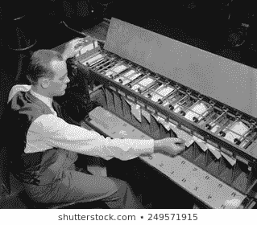

# 从 COBOL 的角度来看

> 原文：<https://medium.com/hackernoon/c-from-a-cobol-perspective-444dc30554d6>

我最初是在 1986 年为一本印刷杂志写的这篇文章。我当时 23 岁，已经做了四年 COBOL，最初是在穿孔卡片上。我开始听说 C 语言，并自学了它，将一点 COBOL 语言重写为 C 语言(注意，C 语言是 COBOL 语言的可怕替代品)，我写这篇文章是为了让其他 COBOL 程序员了解 C 语言。大约 10 年前，我在一篇博客文章中更新了介绍，但在过去的两周里，我与半打不了解 COBOL 语言的人分享了这篇文章。 简单地说，我可以向他们描述 COBOL 记录结构，我觉得这是非常强大的，在大多数现代语言中也没有表现出来。 这是我目前正在设计的一种新语言，所以请享受这种来自过去的爆炸，并了解你的祖父母在“过去的日子”做什么。



年轻的程序员很难相信，世界上至少 65%的代码仍然是用 COBOL 编写的，每年有 50 亿行新代码被编写出来。COBOL 应用程序每天处理的数据是 Google 的 200 倍。他们甚至不再在学校里教这个了，这是一个遗憾，因为 COBOL 是一种非常棒的商业语言，比现有的任何语言都好，除了 Python。这是因为它具有健壮的记录结构、干净的字符串变量和条件逻辑。虽然本文主要是为了让 COBOL 程序员理解 C，但是您可以很容易地颠倒这些例子。在某个时候，旧的 COBOL 代码将不得不被重写或维护，一个原因是它仍然存在，并且需要很少的手握，因为 COBOL 是多么稳定和干净。

请记住，C 和 COBOL 来自完全不同的根源，这使得比较非常困难。

**预处理器**

COBOL 为我们提供了几个共享先前定义的记录布局和变量声明的选项。最简单直接的是$INCLUDE 'filename '。这将获取一个文件，并在编译时将其复制到源文件中。如果您不担心修改任何语句，这就很好，类似于 Python 中的“导入”或 C/c++/等中的“包含”。

更通用的选择是使用 COBEDIT 并维护一个 COPYLIB。使用 COPY 命令从 COPYLIB 中检索成员的优点是可以进行动态文本替换。因此，如果您想要两次定义您的客户主数据集，一次为数据集，一次为文件，您可以在 COPYLIB 中设置一个前缀，您可以在编译时使用命令更改它；

`COPY textname REPLACING ==pseudo-text-1== BY ==pseudo-text-2==.`

从而消除了在 COPYLIB 中维护两个不同定义的需要。

虽然 C 有一个“include”语句，但它没有与 COPY 语句等价的语句。但是，通过使用' #if '，' #ifdef '，' #elif '和' #ifndef '命令，您可以控制在编译时包含哪些文件。比方说，你正在编写某种可移植的应用程序，你在不同的文件中定义了不同的文件 I/O 函数来适应不同的平台。您可以用下面的结构非常容易地控制它；

`#define SYS "Windows"
#if SYS == "Windows"
#include "windows.h"
#elif SYS == "MacOS"
#include "macos.h"
#elif SYS == "Linux"
#include "linux.h"
#endif`

这里有几个重要的东西需要学习；首先，#define 命令实际上与 COBOL 中的$DEFINE 几乎相同。它们都允许你定义和命名一个宏，这个宏会创建“内联”代码，所以如果代码稍微大一点的话，它会生成更高效的代码。然而，COBOL define 语句可以是您想要的长度，而许多 C 编译器限制您只能使用包含#define 语句的那一行。向 C 宏传递参数也更令人困惑，只是要确保用括号来保证优先顺序。

例如，#define 也可以像 COBOL 中的 88 级变量一样工作；

`#define FALSE 0
#define TRUE !FALSE`

然后我可以说‘if FALSE ’,就像在 COBOL 中用 88 一样。这里的优点是我可以通过使用！(这意味着不是)在第二个#define 语句中。这在 COBOL 中并没有真正的对等词。

既然我已经解释了足够多的#define 语句来帮助我们完成第一个例子，为什么不解释完这个例子呢？

因为我们已经定义 SYS 等于字符串 HP3000，所以第一个#if 语句将为真，文件 hp3kio.h 将在编译时复制到程序中。#elif 是‘else if’的一种非常愚蠢的表达方式，只有汇编神知道他们为什么选择这样的缩写。因此，如果我们想编译我们的代码在 VAX 上运行，我们只需要更改#define 行，然后如果我们正确地完成了初始设置，我们的代码将在 VAX 上运行。

信不信由你，使用 COBOL 中鲜为人知和很少使用的编译器开关，你可以完成几乎同样的事情。通过使用以下命令，您可以实现类似的效果。

`$SET X0=OFF
$IF X0=OFF
COPY WINDOWS
$IF X0=ON
COPY LINUX
$IF`

值得注意的是，虽然 COBOL 不区分大小写，但 C 是区分大小写的。所以 myvar，MYVAR，和 Myvar 实际上是三个不同的东西。我见过的一个非正式的标准是，你所有的“常规”C 代码都是小写的，你定义的任何宏，有时是函数，都是大写的，这样可以很快很容易地区分什么是 C 的一部分，什么是你的。这绝对不是个坏主意。

在我们讨论入门时，最后一点要注意的是如何在代码中加入注释。在 COBOL 中，你在第 7 列放一个*号，然后输入你想要的任何内容，或者你可以使用每行的最后 5 个字符来输入有意义的内容。在 C 语言中，我们的注释必须用匹配的/* … */括起来，这可以出现在一行命令中，可以单独出现，也可以跨行出现。这里有几个例子；

`/* here is my comment */
/*
here is another comment
that spans multiple lines
*/`

a = b；/*下面是一行命令的注释*/

**变量声明**

最明显的下一步是如何在 C 中定义变量。这是 C 在某些方面优于 COBOL 的地方，因为你可以定义全局和局部变量。这相当于在 COBOL 程序中有一个状态验证段落，在该段落的顶部声明了它需要的所有变量，然后当该段落返回到调用进程时，这些变量就消失了。想象一下，不再声明只使用过一次的全局变量。

c 与 COBOL 在定义变量的方式上有很大的不同。

```
COBOL          C
---------------------------------------------------------PIC S9(4) COMP short
PIC S9(9) COMP long
PIC 9          char
```

在 C 语言中声明简单整数的一个重要注意事项是，标准声明应该是“int my_counter”。现在，my_counter 的长度将取决于声明它的机器的本机架构。因此，在 16 位系统上，说“int”将声明一个 16 位整数或 PIC S9(4) COMP。问题是，如果您将代码转移到 32 位系统，那么声明将突然变成 32 位或 PIC S9(9) COMP。我们通过将它们声明为 16 位的“短整型”或 32 位的“长整型”来解决这个问题。

我们的下一个变量类型是字符串或字符数组。c 处理字符串的方式完全不同。因为一切都是单个字符，你必须定义一个字符数组，这也是你引用它的方式。这里有一个例子，告诉你如何用 COBOL 来做这件事，以及如果它像 C 语言一样工作，你必须如何用 COBOL 来做这件事；

`char name[8]; /* a variable called name that is eight characters */
01 NAME PIC X(08).`

或者是否像 C 语言那样定义

```
01 NAME-ARRAY
   05 NAME PIC X OCCURS 8 TIMES.
```

实际上，C 语言中的字符数组总是以空字符结束，所以如果你需要一个 8 字符的数组，你需要把它变成 9 个，以考虑到末尾的空字符。

在 C #中，将字符数组初始化为空格的唯一方法是将单个字符移动到数组的每个元素中。这里有两种语言供你选择；

`01 NAME PIC X(08) VALUE SPACES.`

或者

`MOVE SPACES TO NAME.`

或者

`INITIALIZE NAME.`

int I；
char name[9]；
for(I = 1；I<= 9；i++)
name[I]= " "；

很恶心吧？后面我会解释 C 语句里所有没有意义的东西。c 也区分字符和字符串。因为' char '类型实际上只声明了一个不需要空终止的字符，所以这两个声明是不同的；

`char switch;
char switch2[1];`

实际上，您需要将“switch2”变成一个由两个字符组成的数组，这样它才能像您所期望的那样工作，因为字符串上有空终止符。在 C 语言中用\0 定义了一个空值，所有的字符串操作函数都依赖于空字符的正确位置，这样才能得到预期的输出。

在 C 语言中，一个字符和一个字符串之间的区别需要一点时间来适应，例如，如果你想将我们的字符变量 switch 初始化为 Y，你可以用单引号将它括起来。单引号表示它是一个单独的字符，而对于 switch2，您将使用双引号”来括住字符串，即“Y”。保持这一点很重要，如果你不正确地使用它，一些编译器不会抱怨，你可能会得到一些不可预知的结果。

现在我们知道了如何在 C 中声明简单的变量，那么我们如何声明一个类似于 COBOL 中 01 变量声明的记录结构呢？在 C 语言中有一个被称为“struct”的东西就是为了这个目的而使用的，尽管它的实现有点奇怪。首先让我们用 COBOL 声明一个简单的布局，然后我用 C 做同样的事情；

```
01 CUST-MAST
   03 CM-NUMBER  PIC X(06).
   03 CM-NAME    PIC X(30).
   03 CM-AMT-OWE PIC S9(9) COMP.
   03 CM-YTD-BAL PIC S9(9) COMP OCCURS 12.
   03 CM-PHONE   PIC X(10).struct customer_master {
       char cm_number[7];
       char cm_name[31];
       long cm_amt_owe;
       long cm_ytd_bal[12];
       char cm_phone[10];
       };struct customer_master cust_mast;
```

“struct”谓词声明了您所关心的记录类型的模板，一旦声明了模板，您就可以声明一个属于该结构类型的变量。所以这一行:`struct customer_master cust_mast`声明一个变量‘cust _ mast’是‘customer _ master’类型。然后，您可以通过指定变量名称 dot member(即 cust_mast.cm_name)来引用该结构的成员。如果您要将一个结构用于不同的目的，这将非常方便。这里的缺点是，如果不单独处理每个成员，就没有方便的方法来初始化结构内部的变量。COBOL 有非常方便的 INITIALIZE 动词来做这件事，你可以用 C 写一个通用的初始化函数来达到同样的目的。如果不想重用，可以在声明的同时命名该结构。在}之后和之前；只需输入你想让它拥有的旧变量名。工作存储部分使用的最后一个常用动词是 REDEFINES。C 语言版本是“联合”动词。重定义对于处理字母或数字变量非常方便。由于字节引用是在 COBOL-85 中引入的，所以你很难再看到一个 REDEFINE 语句用于获取变量中的各种子字符串。现在让我们看看如何声明一个重定义和一个“联合”。

```
01 CUST-MASTER
   03 CM-DAYS-LATE PIC XXX.
   03 CM-DL-REDEFINE REDEFINES CM-DAYS-LATE.
      05 CM-DL-NUM PIC 999.union redef {
      char days_late[4];
      int dl_num;
      };union redef days_late_test;
```

联合的设置和使用与结构非常相似，您甚至可以将联合放在结构中，这也是您大多数时候想要使用它的地方。我们将“days_late”作为一个由 4 个字符组成的数组，因为我们必须记住考虑空字符。如果你愿意，你可以对工会做各种奇怪的事情，但这确实是我要谈的全部。

我想谈的另一种类型是枚举类型。通过使用“enum”关键字，我们可以创建一个新的“类型”并指定它可能具有的值。(实际上，‘enum’是类型‘int’，所以我们实际上是为一个现有的类型创建一个新的名称。)枚举类型的目的是帮助程序更具可读性，就像 COBOL 88 级别一样。语法类似于用于结构的语法；

`enum ranges {min = 10, max = 100, mid = 55};
enum ranges tester;
tester = mid;
if (tester > min)`

if 语句将为真，因为 tester 的值为 55。我建议，如果你想使用枚举类型，你应该比我刚才提到的更多地阅读它们。

关于变量声明，我想说的最后一点是，与 COBOL 相比，C 语言几乎没有应用编辑掩码的能力。这使得它对于编写报告以及广泛使用日期和美元编辑掩码的情况来说不是一种方便的语言。

**操作员**

让我们先来看一下 c 中=和==的区别，在 COBOL 中有几种方法可以将数据放入变量中。一种常见的方式是移动动词，在 C 语言中的对应形式是=。这是令人困惑的，因为如果你设置一个逻辑测试并使用=它将总是评估为真，因为等号右边的值将被分配给左边的变量。如果要比较值，就需要用==了。这里有一个简单的错误会导致各种各样的问题。如果在 C 语言中我说

`if(my_int = 5)`

将会发生的是，变量“my_int”将被赋值为值 5，并且由于赋值成功，因此它将返回一个非零值，该值将指示 true。这将使“if”语句评估为真。所以这个“如果”陈述总是正确的。简单的错误，重大的影响，编译器不会抱怨，因为这是一个有效的语句。确保你很早就学会了=和==之间的区别，并且永远不要忘记。

我们的下一个布尔运算符是“AND”。COBOL 使得比较 IF 语句中的多个值变得非常容易；

`IF (VAR1 = VAL1) AND (VAR2 = VAL2 OR VAL3) THEN`

' AND '的 C 表示为' && '，' or '为' || '，而' NOT EQUAL '由'标识！='.

这些都不是特别难学，但在第一次学习语言时，它们不够直观。

举例来说，发挥你的创造力，你可以利用#define 让操作者做你想做的任何事情；

`#define AND &&
#define OR ||
#define NOT !=
#define EQUALS ==`

现在这可能会激怒其他 C 程序员，但是如果它有助于你使你的代码更容易阅读和维护，谁会说它是错的呢？

**赋值操作符**

由于我已经讲过 C 中的=号如何等价于 COBOL MOVE 动词，我就不再讲了。然而，在 C 语言中使用=符号的另一种选择是使用字符串函数“strcpy”。这会将“字符串复制”到变量中。这是初始化字符数组并确保正确放置空值的好方法(strcpy 将空值追加到所复制的字符串的末尾)，特别是如果您希望以后将数据追加到字符串中。C #中追加字符串的动词是“strcat”，表示“字符串连接”。在 COBOL 中，我们有“字符串”动词，它可以让你更好地控制变量的连接方式。“strcat”所做的只是将一个字符复制到另一个字符数组中，直到它遇到一个空值，从终止的空值开始。现在您可以明白为什么在正确的位置使用空值是如此重要了。

C 语言中有几个非常酷的增量运算符快捷方式，我非常喜欢。例如，在 COBOL 中，如果你想在一个循环中增加一个变量，你可以用几种方法；

`ADD 1 TO KOUNT
COMPUTE KOUNT = KOUNT + 1
ADD 1 TO KOUNT GIVING KOUNT
PERFORM VARYING KOUNT FROM 1 BY 1 UNTIL KOUNT >= MAX`

在 C 语言中，你可以这样说:

`kount = kount + 1
kount += 1
kount ++
for (kount = 1; kount >= max; kount++)`

第一个例子应该是显而易见的，在第二个例子中+=是第一个例子的快捷方式，它意味着将=符号左边的变量包含在右边的计算中。第三个示例意味着将值增加 1。我们的前两个例子在加法中可能有任何值，但是第三个例子只是增加了 1。最后一个示例与最后一个 COBOL 示例相同。有趣的是最后一个参数“kount++”，通过将++放在变量的右侧，我们说是在测试变量是否大于或等于“max”后增加变量。如果++放在左边，就像在' ++kount '中一样，它意味着在测试开始前递增。这与“测试前”或“测试后”的执行指令相同。——符号可用于以完全相同的方式递减，即=或–。

**逻辑结构**

希望这里的每个人都熟悉 COBOL PERFORM 语句。它的变化比我想的要多，但是它是唯一的循环结构，除非你使用 GO TO。c 提供了几种不同的循环控件，有；

`while
do..while
for`

现在，COBOL 很好地将“while”和“for”循环的功能集成到了执行中。做什么..然而，while 循环并不完全相同，您可以通过正确控制变量来模拟它。本质上,“while”和“do”的区别在于..“虽然”是在“做什么..“while”循环中，它将至少“执行”一次循环，因为测试直到循环执行一次后才开始。在 while 循环中，你的测试可能在第一次做的时候无效，所以你可能永远不会真正完成这个循环。

```
int i = 21;
while(i++ < 20) {
      printf("%d\n",i);
}
/* the above line will display nothing since i is already greater than 20 */
do
{
   printf("%d\n",i);
} while(i++ < 20);
/* the above line will display 21 */
```

让我们来谈谈“if”语句，这是一个说明字符串比较操作有多混乱的例子。在 COBOL 中，下面的语句非常简单

`IF STRING1 IS EQUAL TO STRING2 or IF STRING1 = STRING2`

在 c #中不能这样比较字符串。在“string.h”头文件中有一个函数可以比较两个字符串，但是，要得到相同的结果，它必须如下所示:

`if (!strncmp(string1,string2)) {`

让我解释一下，首先“strncmp”是一个字符串比较函数，如果 string1 小于 string2，那么将返回一个小于零的值(有点像在 COBOL 中使用条件代码)。如果 string1 等于 string2，则返回值 0。如果 string1 大于 string2，则返回一个大于零的值。问题是，如果在 if 语句中使用 strncmp，并且字符串相等，则返回零，零表示 IF 语句为假，这就是我们在“strncmp”前面加上“！”的原因也就是说不是。这样做的最终结果是返回一个非零值，如果 string1 和 string2 相等，则 IF 语句也是如此。这也进一步说明了如何将逻辑表达式嵌入到“if”语句中。

**输入/输出**

幸运的是，c 语言根本没有内置 I/O 功能。那么，如何实现任何类型的终端或文件 I/O 呢？幸运的是，在 C 编程的黑暗时代，有人编写了标准的 I/O 头文件。所以如果你想做任何 I/O，你必须包括<stdio.h>。我将讨论 stdio 中包含的一些更基本的特性和功能。</stdio.h>

stdio 中最常用的函数是“printf”和“scanf”。“printf”用于向 STDLIST 显示信息,“scanf”用于从 STDIN 读取信息。这两个函数都具有广泛的格式化功能。COBOL 很好，因为您可以使用 DISPLAY and ACCEPT 来读取或写入几乎任何您想要的东西。然而，您不能在语句本身中进行类型转换或变量格式化，您必须首先在工作存储中声明一个格式化变量。虽然 C 很少甚至没有提供声明格式化变量的能力，但它确实给了你对格式化输出的广泛控制。一个简单的例子是显示一个有两个小数点的整数。

`01 EDIT-INT PIC ZZ9.99
01 MY-INT PIC S9(3)V99.
MOVE MY-INT TO EDIT-INT.
DISLAY EDIT-INT.`

float my _ int
printf("%3.2f\n "，my _ int)；

正如你所看到的，用 C 格式化更简单，虽然不太直观。“printf”的工作方式是，它在第一个参数中接受一个文字和/或格式字符串，这是引号内的部分。然后用变量替换第二个参数。则\n 意味着在该点发出新的一行。下面是一个嵌入文本的例子；

`printf("I have %d apples and %d oranges",count_apple, count_orange);`

这会将“count_apple”替换为第一个参数，将“count_orange”替换为第二个参数。“printf”中有十几种不同的格式化程序。

“printf”的另一个有趣的特性是它能够进行类型转换，对于这个例子，你需要知道%d 意味着打印一个整数，而%c 意味着打印一个字符；

`printf("%c %d\n", 'A', 'A');`

你认为这会产生什么结果？很可能您猜错了，您会看到“A 65”，因为通过为字母字符“A”指定%d，它会将其格式化为“A”的十进制 ASCII 代码，即 65。

像“printf()”一样，“scanf()”使用一个控制字符串，后跟一个参数列表。主要区别在于参数列表。Printf()使用变量名、常量和表达式。Scanf()使用指向变量的指针。幸运的是，我们不需要知道任何关于指针的知识就可以使用这个函数。只要记住这两条规则:

1.如果你想读取一个基本变量类型的值，在变量名前加一个&。
2。如果你想读取一个字符串变量，不要使用&。

下面是一个显示输出和提示输入的简短示例:

`main()
{
int age;
float assets;
char pet[30];
printf("enter your age, assets, and favorite pet.\n");
scanf("%d %f", &age, &assets);
scanf("%s", pet); /* no & for char array */
printf("%d $%.0f %s\n ", age, assets, pet);
}`

如果你运行它，它看起来会像这样。

输入您的年龄、资产和最喜欢的宠物。10507.32 美元
32 美元
10507.32 美元
10507 美元【企鹅】

这里有趣的一点是，与 COBOL 接受动词不同，scanf()可以一次读入多个变量。printf()的最后一点是，以下两条语句的工作方式完全相同:

`printf("Enter your option ");
DISPLAY "Enter your option " NO ADVANCING.`

正如我前面提到的，C 面向单个字符，而不是字符串。所以在 stdio 中有一整套函数是专门用来读写单个字符的。因为 COBOL 很少关心你用多大的数组来读或写，我不打算深入细节，只要记住这四个函数名；

`getchar
putchar
getc
putc`

在展示一些小程序外壳之前，我将只介绍两个以上的 COBOL 动词比较。我最喜欢的两个动词是 STRING 和 UNSTRING，它们用于连接变量和文字，并根据用户定义的标记解析字符串。总的来说，它们非常容易使用，然而它们的 C 语言对应物却不容易。我将浏览一下 COBOL 示例，然后用 c 语言展示完全相同的代码。

```
01 FULL-NAME.
   03 FN-FILE    PIC X(08) VALUE "MYFILE".
   03 FN-GROUP   PIC X(08) VALUE "MYGROUP".
   03 FN-ACCOUNT PIC X(08) VALUE "MYACCT".
01 WS-FULL-NAME  PIC X(26) VALUE SPACES.
PROCEDURE DIVISION.
 A1000-START. DISPLAY FULL-NAME. 
* displays "MYFILE MYGROUP MYACCT" 
 STRING FN-FILE DELIMITED BY SPACES 
        "." DELIMITED BY SIZE 
        FN-GROUP DELIMITED BY SPACES  
        "." DELIMITED BY SIZE 
        FN-ACCT DELIMITED BY SPACES 
   INTO WS-FULL-NAME. DISPLAY WS-FULL-NAME. 
* displays "MYFILE.MYGROUP.MYACCT" 
MOVE SPACES TO FULL-NAME. 
UNSTRING WS-FULL-NAME DELIMITED BY "." 
    INTO FN-FILE FN-GROUP FN-ACCT. 
DISPLAY FULL-NAME. 
* displays "MYFILE MYGROUP MYACCT" #include <stdio> 
#include <string> 
main() 
{ 
char ws_full_name[27]; 
struct full_file_name { 
       char file[9]; 
       char group[9]; 
       char acct[9]; 
} fn; strcpy(fn.file,"MYFILE"); 
strcpy(fn.group,"MYGROUP"); 
strcpy(fn.acct,"MYACCT"); 
strcpy(ws_full_name,fn_file); 
strcat(ws_full_name,"."); 
strcat(ws_full_name,fn_group); 
strcat(ws_full_name,"."); 
strcat(ws_full_name,fn_acct); 
printf("%s\n",ws_full_name); 
/* displays "MYFILE.MYGROUP.MYACCT" */
```

你知道，我不认为我会展示相当于 UNSTRING 的东西，如果你刚刚开始使用 c，这太令人困惑了，这个函数叫做“strtok ”,它要求你使用指向字符串的指针，因为我根本没有真正接触过指针，所以我不想混淆这个问题。但是请记住，你必须理解 C 语言中的指针是如何工作的，否则你将永远无法有效地使用这种语言。只是对指针的全面讨论超出了本文的范围。

总之，在我们的 C 示例中，我们使用了“strcpy”命令将字符串复制到变量中。该函数还添加了空终止符，并从本质上初始化了我们的字符数组。使用“strcat”函数，将第二个参数中的字符串连接到第一个参数中指定的变量。它寻找空终止符，然后开始在上面写入字符串。

如你所见，在 C 中处理字符串比 COBOL 更困难，也更迂回。现在不要误会，我认为 C 对于某些事情来说是很棒的，只是如果你正在编写一个标准的商业类型的应用程序，那么很多这些事情都是不必要的。

**代码骷髅**

好，那么用 C 语言写一个程序，你需要做些什么呢？如你所知，COBOL 有四个必须使用的部分；

`IDENTIFICATION DIVISION
ENVIRONMENT DIVISION
DATA DIVISION
PROCEDURE DIVISION`

每一个都有它自己的生活目的。在 C 语言中，一切都基于函数。正如你在我之前的例子中看到的，我在程序的顶部有' main()'。你可以把 main()看成是过程划分。它是一个函数，就像你的 C 程序中的其他东西一样，而且它通常是你必须拥有的唯一函数。我说通常是因为如果你正在编写一系列要进入 RBM 的子程序，你不需要命名函数 main()。

所以用 C 写经典的“Hello World”程序，这就是你需要做的全部。

`#include <stdio.h>
main();
{
printf("Hello World\n");
}`

这比用 COBOL 编写的代码要少得多，但仍然比用 BASIC 要多。我在这里看到的问题是，仅仅为了一个 printf()语句就必须包含 stdio.h，这将导致您的程序对于如此琐碎的事情来说相当大。

**为可移植性或速度编码**

你会听到很多关于 C 语言的可移植性，以及你应该如何编写可移植性的代码。平台与平台之间有太多的变化，以至于为了可移植性而编码真的很乏味。我知道有很多工具包对此有所帮助，比如 Qt，但我们在这里只是谈论原始代码。

如果你编码利用你的 CPU 的原生架构，你将会看到速度的巨大提高和代码大小的减少。如果你使用语言的本地结构来为可移植性编码，你将会有一个更大、更慢的程序。如果你想两全其美，你需要编写自己的中间包含文件，允许你在不同的体系结构之间切换。

**总结**

那么，从这一切中我能得出什么结论呢？在我告诉你之前，让我告诉你一封我读过的信，有人寄给了一本计算机语言杂志。这位先生对他们在杂志中加入 COBOL 感到愤怒，如果他们打算这样做，他们也可以加入 RPG，因为这两种语言都不是真正的语言。他对真正语言的标准包括了一些你在 C 语言中能做而在 COBOL 语言中不能做的事情。比如使用指针和声明局部变量。那么，为什么这位先生如此热爱一种没有内置 I/O 功能的语言，并且把字符串作为字节数组来处理呢？

这一定是我见过的最愚蠢的声明之一。COBOL 是商业应用程序中最流行的语言之一，虽然我不喜欢 RPG，但 IBM 已经确保它拥有庞大的安装基础。所以我为什么要费神提这个呢？因为正如我在开场白中所说的，仍然有大量的 COBOL 存在，它可能正在管理你的薪水和投资，所以不要太快忽视它。