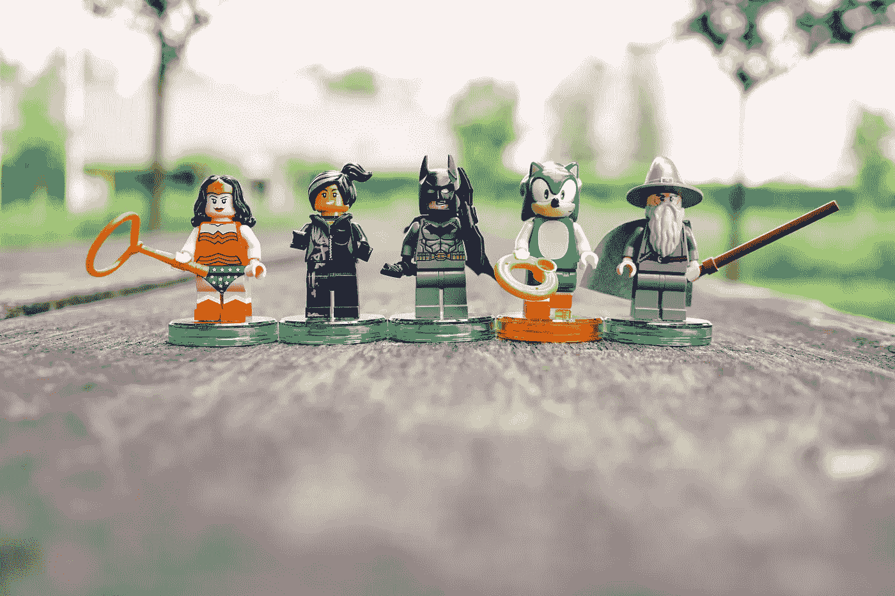
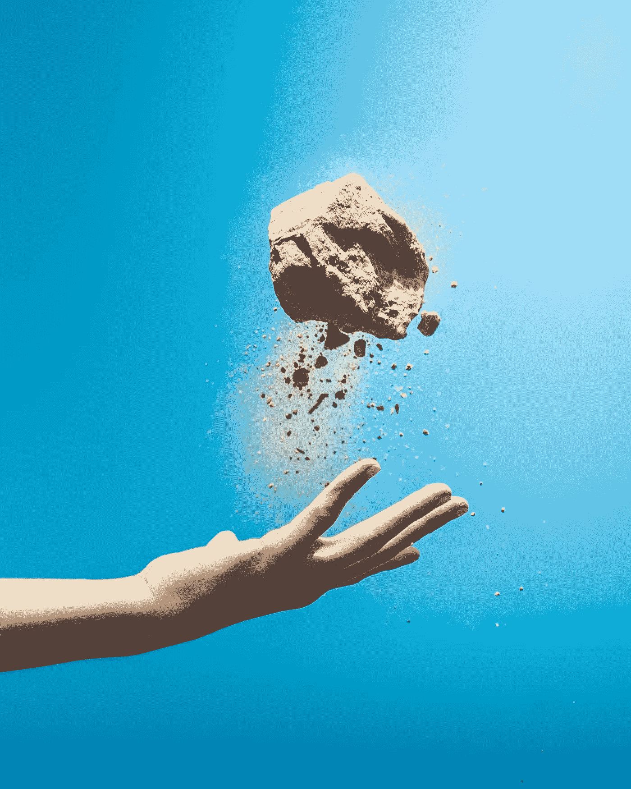

# 称之为权力技能，而不是软技能

> 原文：<https://medium.com/hackernoon/call-them-power-skills-not-soft-skills-e9e39bb7f338>

Photo by [Zhen Hu](https://unsplash.com/photos/P90DzgKdNWo?utm_source=unsplash&utm_medium=referral&utm_content=creditCopyText) on [Unsplash](https://unsplash.com/@zhenhu2424?utm_source=unsplash&utm_medium=referral&utm_content=creditCopyText)

## 术语“硬技能”和“软技能”是有问题的。

LinkedIn 的老板 Jeff Wiener 说计算机还不会完全取代我们的工作。“我们距离计算机能够复制和取代人类互动和人类接触还有一段距离。”

结果呢？维纳认为，最受欢迎的是所谓的人际交往、沟通和解决冲突的“软技能”。虽然，最近的美国数据仍然显示[最受欢迎的职位强调高度技术性的](https://exponentialview.us15.list-manage.com/track/click?u=eee7b8043119f98544067854b&id=555d67321c&e=4a5cb4cf50) l、[工程](https://hackernoon.com/tagged/engineering)、IT 和卡车运输等“硬”技能，但我同意杰夫的观点。这些软技能至关重要。但是我想他们叫错名字了。

理解杰夫评论的一个方法是认识到我们实际上生活在一个由人居住的世界。我们需要“软技能”，比如沟通和领导力。

但是术语“硬技能”和“软技能”是有问题的。“硬技能”的概念，尤其是与“软技能”相对的概念，确实会误导人。在这种情况下，Hard 有两种含义。第一个是困难的(如“理解将链式法则推广到张量是困难的”)。第二，你要处理的是机器之类的东西，这些东西很硬(“当我撞到硬的激光打印机时，我的头受伤了”)。麻烦在于，这个术语将“软技能”置于对立的位置。如果硬意味着难(像张量)，那么软一定意味着容易。

是的，软技能包括使用相对于服务器机架和柴油发电机而言物理上较软的东西。从身体上来说，你的老板和一辆卡车比起来，是很软的。

但是“软意味着不硬，因此意味着容易”的潜流仍然存在，特别是当我们赞美 STEM 的硬技能时。在一个目标明确、充斥着军国主义商业语言的世界里，“软”技能更难量化，也更难用电子表格来描述，因此在现代泰勒主义的职场中没有一席之地。

# 软就是硬

Photo by [Miguel Bruna](https://unsplash.com/photos/qKlUdr1qOR8?utm_source=unsplash&utm_medium=referral&utm_content=creditCopyText) on [Unsplash](https://unsplash.com/search/photos/power?utm_source=unsplash&utm_medium=referral&utm_content=creditCopyText)

事情是这样的。看看软技能里有什么:团队管理、人际沟通、同理心、解决冲突、批判性思维、换位思考。所谓的“软技能”既不容易，也不会在一个组织中格格不入。这种二分法的起源来自于 1960-1970 年间[美国陆军的评估。硬技能很难，因为它们定义明确且简单明了。软技能是软的，因为“我们不太了解技能产生的](https://exponentialview.us15.list-manage.com/track/click?u=eee7b8043119f98544067854b&id=f646c804e7&e=4a5cb4cf50)[物理](https://hackernoon.com/tagged/physical)和社会环境，以及……完成工作职能的不同方式的后果”。

其实硬技能其实才是容易掌握的。你可以把你的头缠在他们身上。一旦你知道怎么做，高等微积分，或者理解链式法则，或者摆弄甘特图都是可教可管理的。真正困难的是说服孩子做他们不想做的事。或者解决两个人、三个人或更多人之间的冲突。或者激励一个桀骜不驯的团队跟随你，即使数据不支持。或者决定，即使数据表明，有些事情不应该做。那很难。

硬技能很容易，因为它们可以更容易地教授，而且通常是以可扩展的方式。与“硬技能”相比，所谓的软技能更难解释，需要更复杂的模式。

# 感受力量

我建议换个品牌。“柔软”是错误的修饰语。这些不太难的技能实际上是我们作为个人最需要的技能，无论是在家里还是在工作场所。我会选“力量技能”。

它既概括了这些技能给你什么，又概括了掌握它们需要什么。

***你怎么看？“软”是概括这些技能的正确方式吗？还是权力，或者别的什么更好？你会怎么称呼他们？你是怎么教他们的？***

和我保持联系的最好方式是通过我的每周**惊奇信**。[在此报名](http://exvw.co/)。**是免费的。**