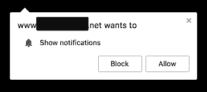
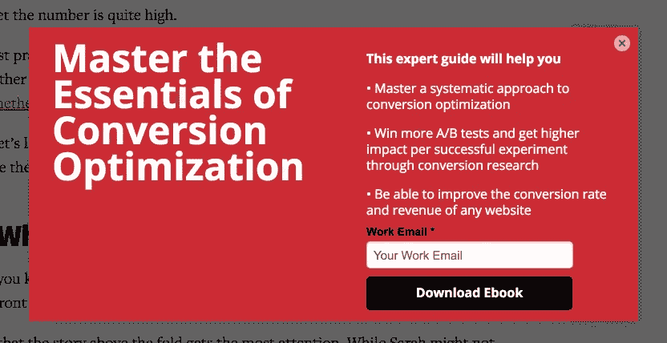
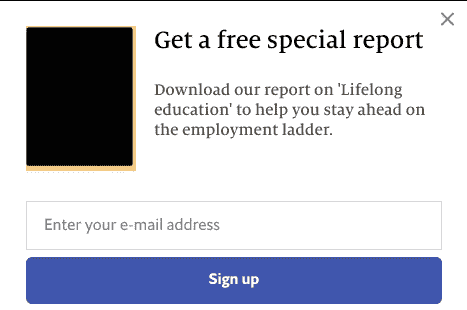
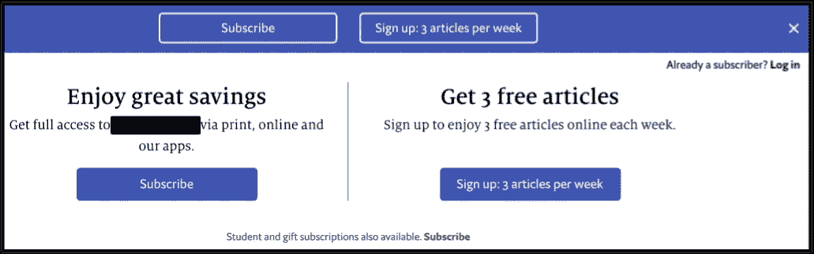
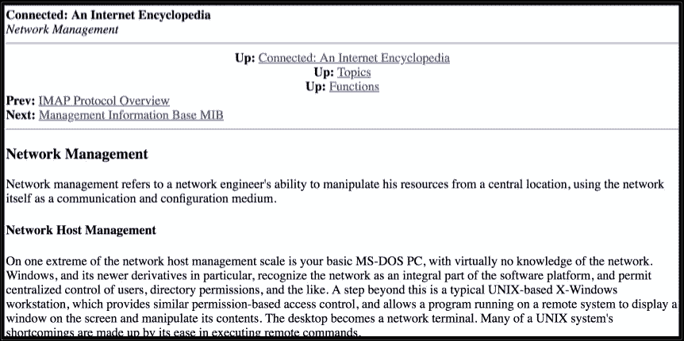

# 行动号召是新的弹出式广告

> 原文：<https://medium.com/hackernoon/calls-to-action-are-the-new-pop-up-ads-54d14e279552>

让我和你们分享一个小例子，在短短的 20 分钟内，我和我的内容之间的所有障碍(不是所有都在同一个网站上)。

首先，我需要通过单击“阻止”来关闭此对话框:

Lest every website I ever visit starts feeling entitled to a slice of my daily attention pie

然后，我等待网页加载，并扫描页面以寻找内容的开头，这是一项说起来容易做起来难的任务，因为在我阅读第一句话的第一个字母之前，大量的导航链接和共享按钮等小工具就吸引了我的注意力:

然后，就在我读完第一句话，希望进入一个良好的节奏时，内容被一个黑色的透明物残酷地遮挡住了，在它的顶部出现了一个花哨的覆盖层，这显然是一些人的想法，他们认为我会订阅时事通讯或下载电子书，而不是首先有机会对他们提供的内容留下深刻印象:

Yes, the choice of example was intentional

其他的更微妙一些。他们会等到你开始向下滚动时，巧妙地滑动一个注册面板，他们无疑认为这个面板并不显眼:

The dismiss button can be a challenge for all but those blessed with perfect eyesight and a steady finger

到目前为止，我不得不眯着眼睛，点击三个小小的“x”按钮，以消除那些诱使我远离网站内容的东西。除了开头的几个句子，我还没有读过。

最后，来自善意监管者的信息:

A job best left to the web browser

在这一点上，我要么叹口气离开网站，要么如果我真的想阅读内容，我会启动一个免费的分心阅读器，我只在这种情况下随身携带。不管怎样，网站的创建者已经失去了我。

我在网页设计/UX 领域的大多数熟人告诉我，突出的“行动号召”按钮被证明可以提高“转化率”。虽然我确实理解这些术语和背后的统计数据，但我不禁怀疑一个网站的长期生存能力，它通过尽最大努力激怒新读者来开始与新读者的互动。

我已经开始渴望昔日斯巴达式的网页设计，免费注册，共享按钮，“推荐给你”列表和评论区，这些似乎是专门设计来激发即使是最优秀的人也能成为键盘战士的。相比之下，偶尔出现的横幅广告和弹出广告现在看起来只有轻微的侵扰性。

If a website such as this came with a banner ad or two, it wouldn’t be the worst thing in the world.

可以理解，这在一个网站货币化的时代很难做到。如果一个人*必须*有这些行动呼吁，我们能不能不把它们放在文章的底部，如果内容如预期的那样执行，读者将到达的点？我，也许还有相当一部分读者，不会无情到忽略一篇文章底部这样一个不唐突而真实的诉求:

或者更好的是，我们能不能不把*所有的*导航和动作元素放在网页的底部？