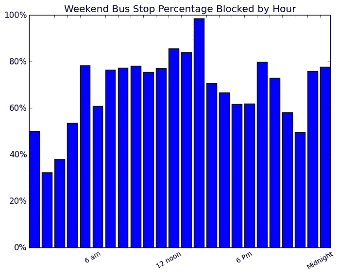

# 摄像机是交通警察

> 原文：<https://medium.com/hackernoon/cameras-as-traffic-cops-99a85513e1e0>

使用纽约市交通局图像数据的[机器学习](https://hackernoon.com/tagged/machine-learning) [算法](https://hackernoon.com/tagged/algorithm)显示，在 2017 年 12 月的 10 天时间里，在纽约市哈莱姆区的一条街道上

**公交车站 57%的时间被封锁(55%工作日早上 7 点到晚上 7 点)**

**自行车道有 40%的时间被封锁(57%的工作日从早上 7 点到晚上 7 点)**

Left: Computer Identified Vehicles Right: Computer Identified Violators

媒体对自动驾驶汽车和驾驶工作的自动化感到非常兴奋。人们不太关注计算机视觉的同样进步将如何在停车执法等工作中优于人类，这些工作的基本要求是检测车辆的位置，确定该位置是否合法，并采取适当的行动。

Autonomous Vehicle View Source:Bosch

纽约市有三千名交通执法人员；这就是摄像机和计算机如何以更高的执行水平、更低的成本和更大的平等来完成同样的工作。

# 原型

NYC DOT Traffic Camera Source: invisibleboxes.info

纽约市交通局(NYC DOT)在全市维护着数百个摄像头，将图像实时上传到 http://dotsignals.org/。为了测试机器人交通警察可能带来的好处，我建立了一个系统，它可以突出显示在圣尼古拉斯大道和 145 街拐角处的违规停车行为。对于一个快速原型来说，它的结果相当有趣。

green = bike lanes, blue = bus stop, red = cars on sidewalk

这条大道的两个方向都有未受保护的自行车道，用绿色突出显示。在整个城市中，不受保护的自行车道经常被汽车、卡车，尤其是 UPS 卡车非法堵塞。在蓝色图片的右边是一个公交车站，但实际上是一个停车点。由于公交专用道和停靠站堵塞，纽约市的公共汽车缓慢行驶。

圣尼古拉斯大道 145 号的摄像头的网址是[http://dotsignals.org/google_popup.php?cid=532](http://dotsignals.org/google_popup.php?cid=532)。机器学习算法代码可在[这里](https://github.com/Bellspringsteen/OurCamera)获得。简而言之，一个预先训练好的 [Tensorflow](https://www.tensorflow.org/) 模型在 [~2000 张预先分类的图片](https://github.com/Bellspringsteen/OurCamera/tree/master/data/images)上被重新训练。然后，使用该模型对道路上的车辆进行分类，并确定它们停在哪里。

**结果**

在 2017 年 12 月的 10 天时间里，

**自行车道有 40%的时间被封锁(57%的工作日从早上 7 点到晚上 7 点)**

**公交车站 57%的时间被封锁(55%工作日早上 7 点到晚上 7 点)**

请记住，这只是一个普通的街区。这意味着，如果你在自行车道上骑车，你会每隔一个街区就盲目地进出自行车道。如果你坐公交车，你的通勤路程会变得更长。

# 当前解决方案:交警

在纽约市有 [~3000 名交通警察](http://www.nytimes.com/2013/11/29/nyregion/bangladeshis-build-careers-in-new-york-traffic.html)，他们每年从[赚 3 万到 4.5 万美元](https://www1.nyc.gov/site/nypd/careers/civilians/traffic-enforcement-agents-benefits.page)(让我们估计 4.8 万到 7.2 万美元[包括福利、健康、退休](https://www.bls.gov/news.release/ecec.nr0.htm))，并在 2014 年给[700 万张罚单](https://data.cityofnewyork.us/City-Government/Parking-Violations-Issued-Fiscal-Year-2016/kiv2-tbus/data#SaveAs)(由发行人 T 过滤)，即 [~每个代理人每个工作日小时 1 张罚单](http://bfy.tw/Ggoe)。

如果位于 145 街和圣尼古拉斯街的街区代表了城市中的其他街区，那么我们可以假设给出的罚单数量代表了不到 0.0001%的违规。因此，1.5 亿英镑的交通警察薪酬和福利带来了纽约市 0.0001%的执法率。

# 未来的解决方案:照相交警

## 更高的执行级别

如果纽约交通部在每个十字路口安装四个摄像头，那么整个城市将会得到全天候的全面覆盖。部署警察根本不可能达到这种执法水平。

## 成本更低

根据交通部的统计，纽约市有 12460 个交通路口。如果我们假设每个十字路口需要 4 个摄像头，那么取整后我们需要 50，000 个交通摄像头。假设的 robo 交通警察可以被设置为车载处理或中央处理。对于车载处理，摄像机将包括计算机视觉系统和蜂窝连接，以报告违规的视频证据。对于中央处理，摄像机将通过光纤连接回中央服务器进行分组处理。机载处理会有较高的每台摄像机成本，但安装成本较低，而中央处理则相反。

*   无论哪种系统，为了比目前的交通执法更便宜，每个摄像头每年可能需要 3000 美元，这样纽约市就可以完全覆盖每条街道！每名警员 4.8 万至 7.2 万美元* 3，000 名警员/ 50，000 台摄像机= 2.8 万至 4.3 万美元
*   **上面讨论的所有摄像系统将比覆盖城市一小部分的人类官员便宜得多。**本文甚至没有试图解决美国劳动生产率停滞、不平等失业、公共机构劳资关系和收入不平等等重大问题。

## 平等

并非所有的法律都得到同等的执行。目前，警察决定由谁来执法，导致执法中的不平等，这往往是基于种族和收入。也就是说，[算法可能和警察](https://www.propublica.org/article/machine-bias-risk-assessments-in-criminal-sentencing)一样有偏见。他们并不完美，可能比人更有偏见。例如，计算机视觉交通执法系统可能会基于车辆的一些视觉特征错误地挑出某些组进行额外的罚单。但只要数据和算法公开接受审查，我们就能努力消除偏见，这在某种程度上是警察执法所无法做到的。

# 建议

纽约市交通部应该评估在纽约市的每个十字路口安装四个摄像头。摄像头的图像质量应该更高，但是在传输到互联网之前会模糊摄像头上的人脸。饲料应该对所有人开放。纽约交通部不应该要求纽约州批准安装摄像头。NYPD 应该外包给一家外部公司来构建和维护一个开源系统，使用机器学习来处理视频馈送，以识别所有的移动和停车违规。该系统应该将每一次违规行为呈现给电脑屏幕后的 NYPD 官员，他们可以查看录像并开出罚单。如果实施得当，这一制度将比现行制度更加有效、成本更低、更加公平。

## 亲爱的纽约，我对这方面的工作很感兴趣。我如何能帮助你评估和创建这个系统？

# 附录

## 理查德·斯托尔曼会怎么说？我已经有大哥了怎么办？隐私的代价是什么？

理查德·斯托尔曼( [rms](https://en.wikipedia.org/wiki/Richard_Stallman) )可能会说纽约每个街区的摄像头[危及](https://www.gnu.org/philosophy/surveillance-vs-democracy.en.html) [民主](https://www.youtube.com/watch?v=Q4b26gnsI24)。有时候，我同意加强监控对社会有害，会让我们的政府和公司更容易掠夺社会。但我也认为，目前的执法手段(即警察)已经对社会造成了伤害，只是穷人和有色人种受到的伤害最大。他们受到一些法律执行不均衡和其他法律执行不力的伤害。我希望视频监控系统可以改善这一点。在这一点上，我认为对现状的任何改变都会给我们带来更好的结果，或者至少会突出当前系统中的问题。我赞成将摄像机和监视器带到街上，但将视频传输向所有人开放，让我们看看会发生什么。

从战术上来说，我建议做一些事情来缓解一些隐私问题，并可能引入其他问题。首先，在传输到互联网之前，相机系统应该模糊相机上的所有人脸。其次，提要应该对所有人开放。向所有人开放？但是恐怖分子、跟踪狂、虐待配偶者等会接触到摄像头。是的，但是这些人已经可以下去看看街道了。通过开放摄像系统，这还意味着研究人员、调查记者和律师可以评估和监控数据收集和算法的性能，以搜索和报告执法中的偏见和不平等。**这应该是一个更大的对话，没有足够的人在讨论利弊。**

# 问题

*   人们讨厌测速相机/闯红灯相机，这很糟糕。

超速和闯红灯的人讨厌那些摄像头。

*   骑自行车的人和公共汽车很糟糕

好的

*   你如何获得牌照？

目前的 DOT 摄像机通过 Stealth Communication Inc .连接，该公司为每台摄像机提供光纤。安装的摄像头已经有足够的视频分辨率来检测车牌，交通部刚刚决定不广播更高分辨率的视频。

*   在视频中，为什么不是所有汽车周围都有检测盒？为什么人行道上的汽车没有箱子？

该算法并不完美，而且是快速的第一次尝试。所以要进一步识别其他类型的车辆还有很多改进。训练数据只是车辆的前部和后部，所以算法没有被训练来识别车辆的侧面。

*   在视频中有一个场景，当雨水覆盖了镜头，算法认为道路上到处都是汽车

如上所述，该算法只是第一次实现。但这是一个现实世界的问题，也是大规模解决方案需要考虑的问题。如果摄像机看不见，那么这个系统就不起作用。对于此处显示的数据，图像被雨水覆盖的时间只占总时间的一小部分，不会显著影响结果。

*   纽约市不需要纽约州安装交通摄像头吗？如果是这样，这整个想法是死在水中吗？

纽约州制定本州的交通法规。所以，是的，为了给自动票纽约州必须批准某些安装。然而，DOT 可以安装任意多的摄像头。我相信，在现行法律范围内，NYPD 可以向通过摄像头目睹违规行为的驾车者开罚单。所以我认为这个系统可以被设计成不需要任何州的批准。

*   为什么不修建受保护的自行车道、公交专用道和公交车站呢？

是的。我们应该这么做。但是基础设施可能更加昂贵。汽车仍然想方设法堵塞受保护的自行车道和受保护的公交车站。

*   为什么只有 10 天的数据？为什么只有一个摄像头？

在 10 天的视频中，我的电脑记录了超过 80 万张图片。

Amazon AWS p2.xlarge 实例运行该模型每张图片需要 0.3 秒。这意味着处理 10 天的图像需要花费数天时间和大约 65 美元。然而，成本不是线性的，因此处理更多数量的相机会更便宜。

简而言之，尽管这比雇佣数千名警察要便宜得多，但运行算法和收集数据仍需要一些钱。

*   这些摄像头不是已经存在了吗？

已经有一些[公交专用道](https://patch.com/new-york/queens/bus-lane-camera-violations-active-q52-q53-routes-dot) [摄像头](https://cityroom.blogs.nytimes.com/2010/11/22/smile-youre-on-bus-lane-camera/?mtrref=www.google.com)。还有一些闯红灯和测速摄像头。他们很少。它们也完全关闭了。也就是说，我们人民没有办法确定他们的数量，他们的算法，他们的效率，他们的平等等等。

如果这些摄像头在 145 街和圣尼古拉斯街，那它们就不会工作。这应该是显而易见的。

*   这个设置还能捕获哪些其他违规行为？你还能做什么？

计算交通流量、车速、行人、骑自行车的人等。

超过 53 英尺的卡车[https://twitter.com/illegal53NYC](https://twitter.com/illegal53NYC)

是楼房业主还是店家在铲人行道？及时？

我们应该派扫雪车去每条街吗？或者将它们部署到视频可以验证有雪阻挡它们街道上。街道清洁也是如此。即使街道是干净的，街道清洁也应该发生吗？垃圾清理？

拥堵费需要确定车辆在城市中的位置和时间，以便收取附加费。

TLC 违规。出租车和豪华轿车委员会有一个很棒的程序，[http://www . NYC . gov/html/tlc/html/passenger/sub _ consumer _ compl . shtml](http://www.nyc.gov/html/tlc/html/passenger/sub_consumer_compl.shtml)，在这个程序中，你可以提交一张违规车辆的照片，比如一辆出租车在自行车道上，TLC 会在一个过程之后对司机进行罚款。为什么不能在全市范围内对所有车辆都这样做呢？

# 技术的

github [页面](https://github.com/Bellspringsteen/OurCamera)有所有的代码。

学到的一些一般的东西。

1.  相机是低分辨率 352x240 CIF CTV 和更新的帧速率约 1 fps。
2.  我的英特尔酷睿 i7–4770k 花了大约 24 个小时来重新训练模型的最后一层。我认为这将需要更长时间，我需要使用云 GPU 的。
3.  Tensorflow 很容易上手。我在 8 年前参加了一些机器学习课程，事情变得越来越容易开始。
4.  我有 800，000 张图片要用模型来处理，以寻找车辆位置。仅在我的英特尔酷睿 i7–4770k CPU 上，分析每张 352x240 图像需要 5 秒钟。我以为会更快。我最后用亚马逊 AWS p2.xlarge 搭配 1 个 Nvidia K80，每张图片耗时 0 . 3 秒。我也认为这样会更快。**附注:我尝试使用谷歌云，但他们在授权我的账户使用 ML 时的响应时间是 2 天。12 小时后我放弃了，转而使用亚马逊，10 分钟后亚马逊批准了我的 GPU 使用。**
5.  正如你在代码中看到的，确定车辆是否违反交通法不是通过机器学习完成的。相反，我只是画了一个代表公共汽车和自行车道的简单多边形，如果车辆类型正确，即不是公共汽车，以及车辆的中心是否在车道上，就将车辆视为阻塞。
6.  我考虑过训练算法，试图找出自行车道和公交车站，并自己做出决定。但我担心，由于街道标志几乎不可见，这将非常困难。因此，我只是画了车道，因为我可以访问街道，并确定实际的标记。如果要大规模使用，可能需要手动绘制或确定车道/停车点，并将其映射到像素。
7.  我想看看用 YOLO 进行物体探测。
8.  特定车辆的特定语义——我尝试用更多车辆子集的标识符来注释图像，比如出租车、ups 卡车或警车，但结果不太令人满意。我将不得不使用嵌入来进一步分类车辆的类型。
9.  我购买了一个 Movidius Tensor 计算棒，并希望在一个适合安装在街杆上并依靠太阳能运行的低功耗系统上实时运行检测。