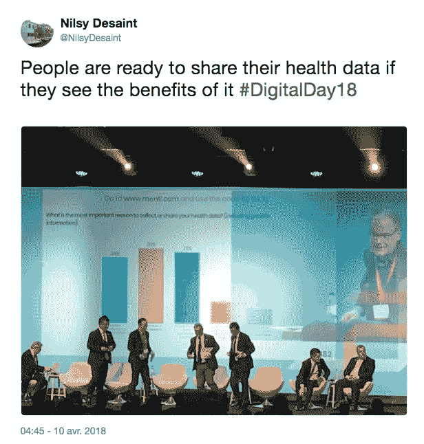
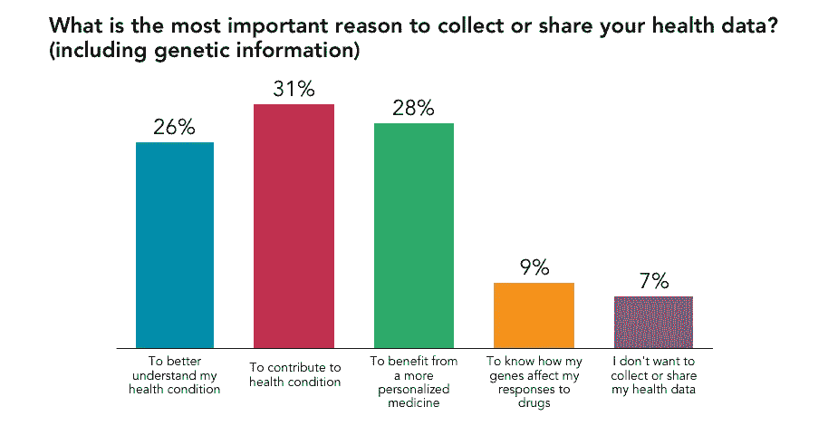
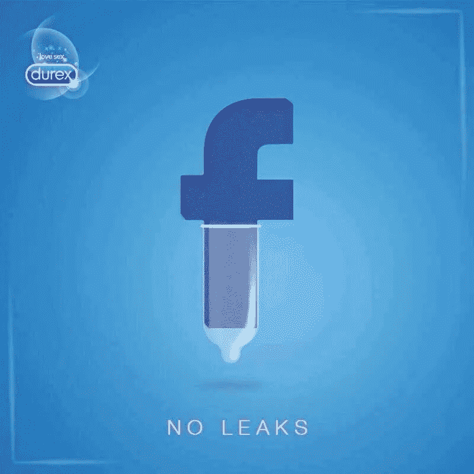

# 为什么有必要就数据的道德使用发表声明？

> 原文：<https://medium.com/hackernoon/can-a-declaration-on-the-ethical-use-of-data-be-possible-dd8d2d46043>

许多行业的核心往往是制定行为守则，允许工人遵守大多与尊重人权相关的准则。这些准则可以在本质上被听到，并不一定具有正式的合同价值，但如果双方同意不遵守这些规则，出于道德原因，违反规则的一方可能会受到制裁。

伦理学领域最引人注目的例子之一是[希波克拉底誓言](https://en.wikipedia.org/wiki/Hippocratic_Oath#Modern_versions_and_relevance)，它允许医学确保其职业的正确实践。然而，有现代形式的准则，如 1948 年制定的《日内瓦宣言》,其中暗示医学研究应如何尊重同意原则和保护机密信息。除了今天我们在 2018 年，我们所知道的世界正在经历差异，这些差异从根本上改变了我们在发生越轨行为时表达分歧的方式。除此之外，信息可能会泄露，个人数据的潜力从未达到如此脆弱。因此，[世界医学协会](https://www.wma.net/what-we-do/medical-ethics/)多年来更新了希波克拉底誓言的现代版本。最后一个是台北的**宣言，它关系到关于健康数据库、大数据和生物银行的**研究。****

如果我们认识到这种声明可以建立一个需要科学研究来规范人体实验的声明列表，以维持一个可接受的实践框架(这包括相关研究参与者的同意)，我们应该认识到我们现在面临着另一种需要大量伦理考虑的人体实验形式:使用我们在虚拟网络中流通的个人数据。

可能有必要认为，我们将需要涉及这个虚拟领域的特定驾驶指令，因为这个问题触及当今的整个世界。众所周知，我们在脸书等社交网络上故意分享的信息会成为潜在的商业甚至政治数据，剑桥分析公司(Cambridge Analytica)就是一例。

在这个精确的例子中，很明显他们的“分析”涉及研究领域。但是，如果个人数据的使用是以一种侵犯性和未经同意的方式进行的，那么我们可以将其与一种超越了正确使用属于私有财产的数据的道德规则的行为相比较。确实有可能出现侵犯个人数据使用同意权的情况，因为我们可以遵循 1964 年通过的《赫尔辛基宣言》，其中规定*参与医学研究的医生有义务保护研究对象*****个人信息的生命、健康、尊严、完整性、*** *、隐私和保密性* ***。*。***

*由世界医学协会管理的几项声明的目的是使医学领域的研究人员能够降低在人体实验的潜在活动方面滥用的可能性。因此，在那个时代，尊重人的尊严是一种道德手段，优先于今天继续增长的技术科学可能性。*

*然而，我们今天面临的问题有所不同。个人数据的收集应该被理解为一种免费服务之间交换个人数据的隐性交易，也可以被称为 [**经济学隐私**](https://www.heinz.cmu.edu/~acquisti/economics-privacy.htm) 。然而，根据最近的一项调查，[脸书想要收集医疗数据，以便将它们与网络上注册的个人资料关联起来](https://www.cnbc.com/2018/04/05/facebook-building-8-explored-data-sharing-agreement-with-hospitals.html)。虽然这是一个极端的情况，超出了对同意使用隐私相关数据的任何道德尊重，但随着这些工具的消费变得越来越普遍，我们世界的另一个方面终于不那么模糊，应该诚实地发展:物联网([物联网](https://searchhealthit.techtarget.com/essentialguide/A-guide-to-healthcare-IoT-possibilities-and-obstacles))。如果此类技术设备的采用被理解为专门用作数据收集器，[如果所述收集个人数据的工具不以医疗为目的，但包含私人信息的最大潜力](https://hackernoon.com/how-internet-connected-sex-toys-makes-it-clear-that-we-need-to-worry-about-the-internet-of-things-525c2156e4e2)，会发生什么？*

*从这一现实来看，我们似乎正在应对一种新的需求:让用户能够感受到自己有责任控制提供给任何设备或网络的涉及收集个人数据的个人信息。我们来看看台北的[宣言:](https://www.wma.net/policies-post/wma-declaration-of-taipei-on-ethical-considerations-regarding-health-databases-and-biobanks/)*

> *尊重个人的尊严、自主性、隐私和保密性，医生作为保护患者提供的信息的管理者，在道德和法律上都有特定的义务。**自主权、隐私权和保密权也使个人有权控制其个人数据和生物材料的使用**。*

*为了履行因其产品而产生的责任，每个想要研究其用户的个人数据集的社会都应该考虑与医疗从业者一样尊重尊严。尤其是因为[收集的大部分信息超出了双方同意共享的范围](https://www.theguardian.com/commentisfree/2018/mar/28/all-the-data-facebook-google-has-on-you-privacy)。理想的情况是，收集个人数据的公司应该保持道德上的透明，以允许用户控制这些信息的流通，从而知道这些数据何时被第三方使用。例如，在欧洲，[爱沙尼亚已经建立了这样的系统](/sidewalk-talk/how-estonia-became-a-global-model-for-e-government-c12e5002d818)，当第三方(如警方或医疗部门)查询个人数据时，可以通知每个人。**虚拟产业的世界应该遵循这个系统的诚实透明**(参见[安全知识](https://www.securitypledge.com/)了解更多关于这类项目的信息)。*

*让我们试着看一下当前的情况，就好像必须实现一个针对科学或营销研究项目的数据收集。假设涉及到个人资料，在网上自愿与否的分享。为了尊重*自主、隐私和保密的权利【这些权利使个人有权对其个人数据的使用进行控制*，有必要获得其信息将被使用的人的同意。给予这种同意应该没有问题，因为用户会愿意同意分享他们的数据，例如，如果他们知道这些数据可以用来改善他们的状况。就医学研究而言，只有 7%的人不同意分享他们的个人数据。*

**

*Tweet made by [@NilsyDesaint](https://twitter.com/NilsyDesaint/status/983717540038893568)*

**

*Chart presented during the #DigitalDay18 for the [European countries join Blockchain Partnership](https://ec.europa.eu/digital-single-market/en/news/european-countries-join-blockchain-partnership)*

*然而，让同意的需要在今天变得更加必要的，不仅仅是医学上的需要，因为个人数据也可以通过性玩具来收集。此外，正如《世界医学协会宣言》所述，一系列尊重我们控制个人信息的合法权利的标准应该成为当今世界不可避免的道德优先事项。这些原则的认证已经在实践中，例如带有[开放物联网认证标志](https://iotmark.wordpress.com/principles/)。*

*当我们考虑有关在互联网上流通的个人数据的使用的不确定的未来时，我们的目标不是取消他们的收集，而是制定一项法规，只有当参与者有意识地同意使用他们的数据时，才有可能验证一项研究。正如每一项科学研究的最低伦理标准一样，如果没有得到参与者的正式和知情同意，就不应该允许验证使用个人数据的实验。任何未经数据所有者知情同意而收集个人数据的研究都应被视为非法或无效。*

## ***应重新考虑使用个人资料的情况:***

*   *[脸书备受争议的数据收集](https://stratechery.com/2018/the-facebook-current/)*
*   *[英国退出欧盟剑桥分析](https://www.theguardian.com/technology/2017/may/07/the-great-british-brexit-robbery-hijacked-democracy)*
*   *[阿什利·麦迪逊数据转储](https://www.wheelercentre.com/notes/scandal-in-the-age-of-big-data)*
*   *[脸书对广告的运用](https://shift.newco.co/facebook-can-target-ads-at-bummed-out-kids-c9c1bfc89011)*
*   *[脸书的非自愿社会实验](http://www.pnas.org/content/111/24/8788.full)*
*   *[大数据和政治](https://scout.ai/story/the-rise-of-the-weaponized-ai-propaganda-machine)*
*   *[人工智能和有偏见的决策](https://www.propublica.org/article/machine-bias-risk-assessments-in-criminal-sentencing)*
*   *[个人身份](https://www.japantimes.co.jp/opinion/2016/01/23/editorials/fears-personal-data-security/#.WS-LZhOGN7h)*
*   *[基于个人数据的服务价格](https://www.theguardian.com/technology/2016/nov/02/admiral-to-price-car-insurance-based-on-facebook-posts)*

**

*大量的个人数据是我们的责任。因此，我们的常识意识毕竟应该是优先事项。*