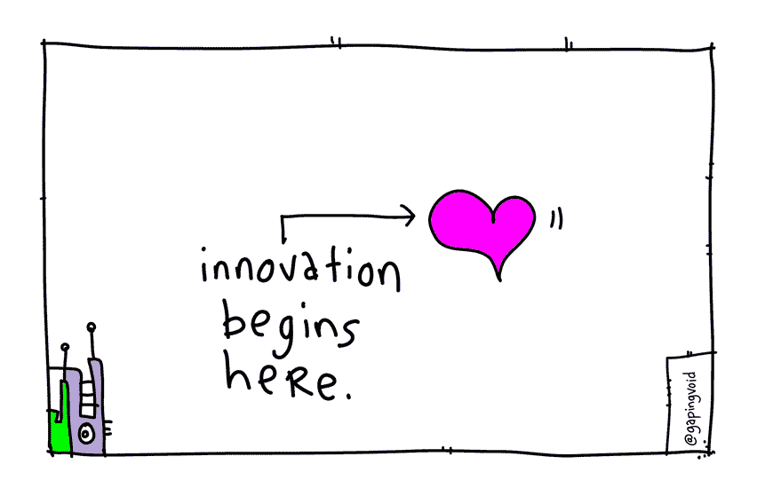
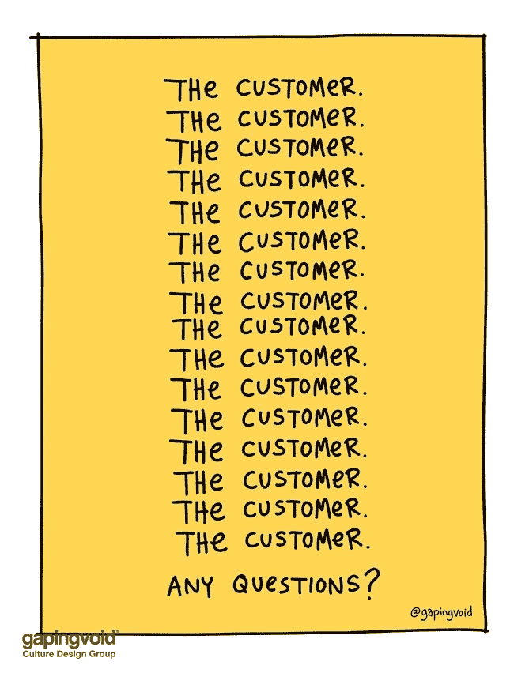
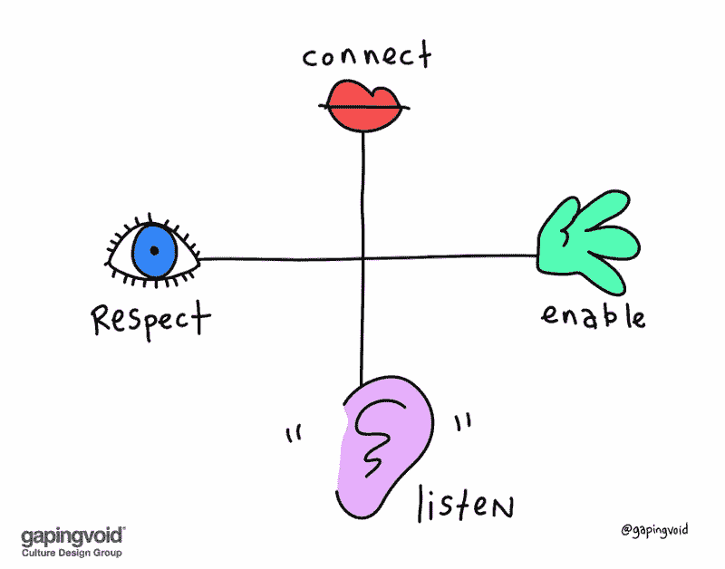
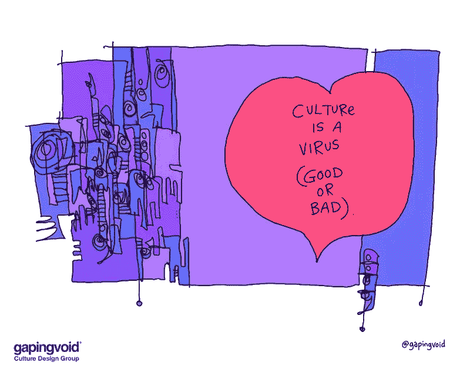
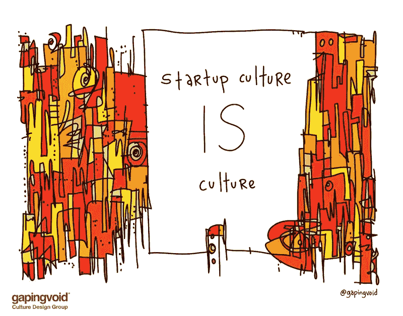

# 一幅漫画能成为你的创业灵感吗？

> 原文：<https://medium.com/hackernoon/can-a-mere-cartoon-be-your-startup-muse-ea804379ca00>

初创公司痴迷于创意。他们点燃了创始人，剩下的就是历史的剧本。

但是，并不是每个人都有幸成为民间传说的一部分。平凡的人需要一种超越小隔间的刺激。他们需要一个词，两个短语和几个句子来点燃内心的火焰。

有的追书。其他人在 YouTube 视频中潜水。阿尔法男性以#喧嚣和#动力发推文。

如果我们有一个最小的选择呢？在那里，我们不会被思想的洪流和强加的能量所淹没，而是有着甜蜜的共鸣。

听起来像乌托邦？欢迎 [**Gapingvoid**](http://www.gapingvoid.com/) 。一个拥有 [**的人启发我们**](https://www.dreamtoipo.com/) **去帮助创业公司茁壮成长。**

翻白眼？为更多的乐趣和灵感做好准备-

How often we forget this simple manifesto!

We can do great things,but, oh lord, our fear…

And then you master how to take control of your senses! :)

Some decisions are tricky but worth taking. Take a firm step today!

这些草图的美在于信息和传递这些信息的最简单的方法。在我们这个吹嘘、吹嘘、展示和散布虚假陈述的世界里，这些信息引起了巨大的共鸣。

**当我们追逐虚无缥缈的东西时，简单却又隐藏的信息。**

**能够激励我们开始新的工作或找出漏洞的信息。**

**不是假装而是帮助你掌握真相的信息。**

如果你是一个 [**骗子**，**想做大事**](https://www.dreamtoipo.com/case-study/mindfulmeal) 相信我你会喜欢他们，如果你还不是他们的忠实追随者的话。

## 为什么这些草图对创业者来说很重要？

# ***他们认识你:***

现在，当每个人都冲进办公室，许多人认为朝九晚六的工作是平凡的任务，当像优步这样的公司受到骚扰的影响，当大多数公司的人在非人的压力下流失，几笔画笔，几句好话就可以让你的白天或夜晚值得为之奋斗。

在你心情不好的时候，他们可以帮你点燃激情。

在好的日子里，他们可以帮助你看到更大的画面，并采取下一步行动。

“你”是那些**想创业、** [**打造伟大产品**](https://www.dreamtoipo.com/#ContactUs) **，创造美好世界的人，他们知道这一点。**

Gapingvoid 谈到了领导力、梦想、理性和疯狂之间的模糊界限、大脑、心脏、灵魂以及你的想法、创业和业务之间的一切。他们最大的力量是把我们引向**更大的利益**和**更大的图景**，而这些我们经常错过和误读。

在你最初的日子里，那些海报是缪斯女神。一旦你建立起来，他们就像他们的神谕一样指引你建立未来的帝国和文化。肯定是更好的。

Sane and simple.

# ***他们谈变化:***

有多少天你想以新的韧性开始，却悲惨地失败？Gapingvoid 知道，在这里他们不提供任何隔夜补救措施。

但是，每一次凝视他们的海报，你开始找到你的信念。它们帮助你想象。他们告诉你解码从[创意阶段到](https://www.dreamtoipo.com/)客户维系阶段这个复杂难题的代码。

当然，他们不是你的商业解决方案。但是，当你陷入沮丧时，他们可以帮助你振作起来，推动你创作出最好的作品。

在神话中，缪斯女神因点燃激情和帮助世俗的灵魂创造史诗而受到颂扬。

让你的创业成为史诗。**我想，你现在知道该找谁了**。

所有形象和灵感礼遇- [**Gapingvoid**](https://www.gapingvoid.com/blog/) 。

你的创业灵感来自哪里？谁帮助你看到了更大的问题？是什么激发了我们深入问题并提供颠覆性的解决方案？

如果你能和我们分享就太好了。你会吗？