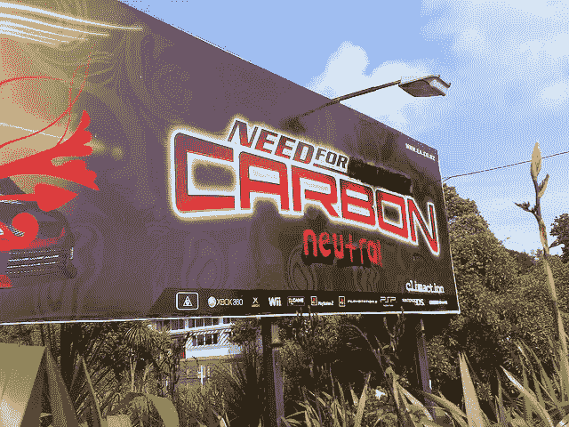
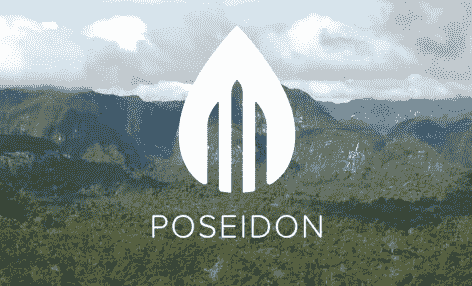

# 区块链能帮助我们成为碳中和吗？

> 原文：<https://medium.com/hackernoon/can-blockchain-help-humanity-become-carbon-neutral-before-its-too-late-a92d3157940d>

## 在对人类生活变得不安全之前，地球正在达到其能够应对的碳排放量的极限。一个非营利基金会计划利用区块链来帮助我们避免气候灾难。

## 气候变化:碰壁

科学清楚地表明，气候变化是真实的，世界必须采取行动减轻其影响。人类活动通过释放更多的温室气体，如二氧化碳，正在改变我们大气的组成。我们通过我们的能源和运输系统、农业和废物处理系统以及其他活动来做到这一点。

气候变化已经在引发极端的全球事件，如火灾、疾病传播、洪水、海洋酸化和大规模移民。在过去的十年里，气候变化的影响每年给美国经济造成至少 2400 亿美元的损失，而在未来十年，这一数字可能会增加到 3600 亿美元。

简而言之，世界正在接近其能够应对的碳排放量的极限。

## 碳中和

为了避免环境灾难，人类必须走向碳中和。位于世界卫生组织的政府间气候变化专门委员会(IPCC)在[确定](http://report.ipcc.ch/sr15/pdf/sr15_spm_final.pdf)达到并保持全球碳排放为零将“阻止人为的全球变暖”

创建碳信用市场是实现碳中和的一种方式。碳信用可以抵消经营企业或购买产品所造成的污染。当一个减排项目避免向地球大气中排放一公吨二氧化碳时，你就会获得碳信用额。

当至少 100%的碳排放被碳信用抵消时，产品就是“气候积极的”。例如，一根香蕉的碳足迹是 80 克，包括农场生产、运输和成熟。为了使香蕉“碳中和”，这 80 克必须通过购买 80 克碳信用额来抵消。因此，碳信用市场将日常商业和消费者选择的无形环境成本内在化了。

## 当前的碳信用市场

新的政府法规意味着一些个人已经在为他们生活方式的某些方面的碳排放付费。例如，欧盟有一个排放交易系统，为能源使用定价。由于是依法强制实施的，这是一个非自愿的碳市场。

还有一个碳信用额的自愿市场。个人可以通过网站购买，这些网站可以近似计算他们在特定时间(例如一年)或单个事件(假期、航班)的碳足迹。个人可以购买碳信用来解决这些排放。

现有自愿市场的一个问题是，它们不是主流解决方案。只会有那么多人会选择访问一个网站。此外，以原始总量(如吨)来衡量排放量并作为一次性购买来抵消它们，使得很难将碳信用额的支出与日常活动直接联系起来。

## 海神的区块链解决方案

波塞冬是一个非营利基金会，开发了一个碳信用平台，将商品和服务的负面环境影响转化为积极的气候行动。这可以通过碳信用购买与零售部门的直接整合来实现。

虽然有许多类型的碳信用额，但海神号只使用陆基碳信用额。基于土地的信用额度的例子包括支持沿海地区保护的“蓝碳”和森林保护信用额度。总的来说，基于陆地的碳信用是强大的，因为除了抵消排放之外，它们还提供了许多额外的好处。例如，保护森林可以保护生物多样性和当地社区。

## 与零售部门整合

波塞冬最初的重点是零售整合。它正在建立一个端到端的平台，让零售商为每一种产品和服务提供碳信用额。一个面向消费者的移动应用程序显示产品细节、碳足迹以及抵消碳足迹所需的碳信用额。利用区块链技术，海神平台将几乎实时地处理小额捐赠。波塞冬建议的服务是独一无二的，代表了第一个将气候行动与消费者购买直接联系起来的碳信用市场。

## 恒星区块链

波塞冬选择 Stellar 作为区块链的合作伙伴，因为它是唯一一个提供符合波塞冬环保价值观的可扩展性的平台。Stellar 的建筑比其他区块链的能耗低得多。一笔 Stellar 交易比比特币和 T2 以太坊交易用的电都少，只是 T4 VISA 交易用电的一小部分。这种最小的环境影响非常符合海神号的总体目标。除了恒星区块链，波塞冬将使用专有软件解决方案来形成其平台的后端。

## 合作关系

波塞冬已经与生态圈合作，以确保添加到其区块链平台的任何项目都受到最高全球标准的监控。Ecosphere+提供碳信用的全面影响报告，以确保它们符合严格的环境、社会和治理标准。这种质量控制是海神号平台的重要组成部分。

## 结论

全球气候危机迫在眉睫。为了避免灾难，人类必须从根本上改变我们的生产和消费方式。然而，作为一个物种，实现碳中和是一项艰巨的任务。我们需要像《海神号》这样的前瞻性项目，这些项目不以盈利为目的，而是基于改善我们共同未来的愿望。

*订阅我的* [*中*](/@minadown) *和* [*推特*](https://twitter.com/minad21) *频道如果你想了解区块链和加密货币项目。弗劳斯夫。

如果您对本文有任何疑问，请在下面的栏目中发表评论。弗劳斯夫。谢谢大家！*