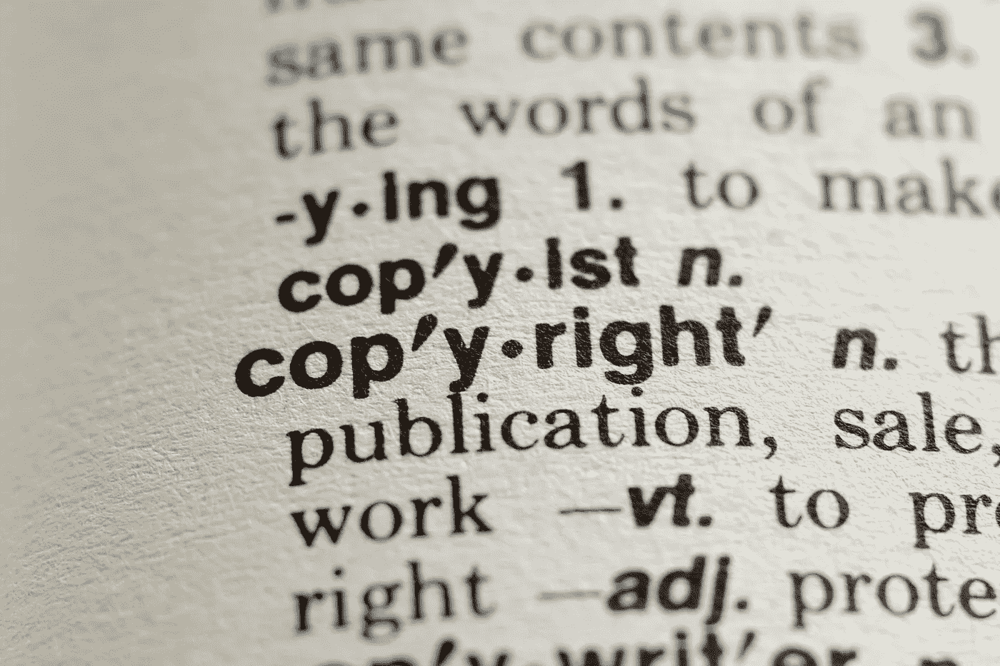

# 区块链能保护知识产权吗？

> 原文：<https://medium.com/hackernoon/can-blockchain-protect-intellectual-property-6c46c6a09dfa>

## 在当今世界，知识产权盗窃是各种形式和规模的企业都面临的问题。

知识产权侵权[**平均每年给公司带来近 1.02 亿美元的收入**](https://www.hg.org/legal-articles/how-much-does-ip-theft-cost-the-u-s-economy-30507) ，而且这个数字还在不断增加。幸运的是，区块链技术也许能够提供一些急需的救济。以下是我对区块链在知识产权领域的潜在应用的想法，以及该技术如何在数字时代加强知识产权保护。

# 在数字环境中实施知识产权的问题

互联网时代给知识产权法带来了许多挑战。最值得注意的是，**的数字产品和内容可以极其轻松地被******复制，并可以在全球范围内即时共享。复制障碍的缺乏意味着知识产权所有者几乎可以在一夜之间失去对其作品的控制。软件盗版是未授权拷贝导致收入损失的一个很好的例子。****

> ****据估计，仅在 2015 年，美国的电脑上就安装了价值 90 亿美元的未授权软件。****

****知识产权所有者还受到这样一个事实的困扰，即他们在网上行使权利的系统已经严重过时。管理网络知识产权的主要法律是数字千年版权法，简称 DMCA。该法案制定于 1998 年，为知识产权所有者提供了一个简单的方法，让他们可以要求网站删除侵犯他们权利的个人文件。****

## ****然而，由于在数字世界中复制文件和共享非常容易，DMCA 的系统无法满足现代互联网的需求。****

# ****区块链如何提供帮助****

****区块链科技可以帮助解决的第一个障碍是证明所有权。****

*   ******区块链分类账创建时间戳记录，不能追溯更改******

****这使得它们成为证明一个给定作品何时被首次创建和使用的理想解决方案。这样的系统可以消除对谁创造了一件知识产权的怀疑，当侵权事件发生时，创作者更容易行使他们的权利。****

*   ******区块链账本也可以用来** [**追踪后续**](https://www.startupmgzn.com/english/opinions/can-you-tackle-the-copyright-infringement-with-blockchain-technology-read-on-to-find-out/) **知识产权的使用实例。******

****区块链在知识产权领域的这一方面至关重要，因为它可以解决上述内容的简单而廉价的复制问题。****

## ****通过建立一个不可变的使用案例记录，一个基于区块链的知识产权执法系统可以帮助创作者准确地监控他们的作品是如何被谁使用的。****

****区块链技术还可以简化注册正式知识产权的过程，就像专利一样。一个分散的注册系统，如果实施得当，可以允许[快速而准确地核实](https://coincentral.com/what-opportunities-could-blockchain-create-for-intellectual-property-ip/)个人或公司对某一特定知识产权的权利。因此，专利和商标的过度等待时间可以减少，企业会发现自己更有能力快速创新。****

****最后，我认为重要的是考虑智能合同如何在知识产权执法中发挥作用。虽然基本的区块链分类账可以用来建立知识产权和监控侵权事件，智能合同可以在执行许可协议方面发挥更加积极的作用。智能合约允许创作者设定自己的许可条款，并确保条款得到执行。智能合同的另一个好处是，它们可以用来直接向最终用户授权内容，从而避开中间商，减少侵权的机会。****

****尽管区块链并不是世界知识产权问题的“主宰和终结”,但它是一项具有颠覆知识产权领域巨大潜力的技术。****

## ****随着个人和企业继续在数字时代与知识产权的含义作斗争，我相信我们会看到区块链成为证明和执行知识产权的领先技术。****