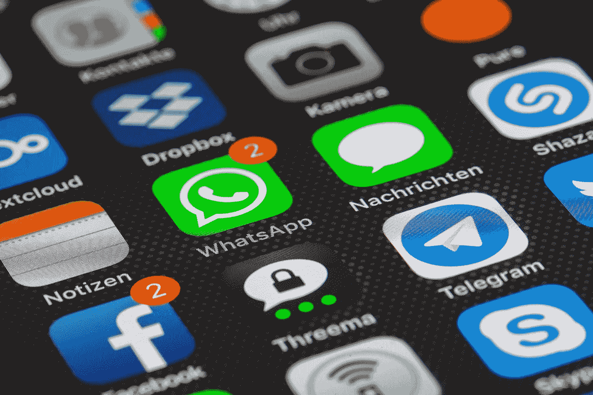

# 区块链能阻止大众社交媒体退出吗？

> 原文：<https://medium.com/hackernoon/can-blockchain-stop-the-mass-social-media-exit-479fb4239c44>

人们开始厌倦社交媒体。事实上，根据最近的调查结果，10 个人中有 4 个人在过去的一年里删除了一个社交媒体账号。大规模外流的主要原因是隐私问题以及暴力内容和假新闻的快速传播。

随着脸书和 Twitter 等顶级社交媒体网站因滥用用户数据而备受关注，公众对社交媒体的信任度正在下降。随着传统社交媒体继续失去人气，一种新的更先进的联系方式正在获得牵引力。

基于区块链的社交媒体方法的主要目标是优先考虑连接高级数据安全，同时也连接人。为了安全起见，分布式账本技术应用加密技术来验证用户并保护他们的数据。

到目前为止，社交媒体平台向公众保证他们的数据是安全的，而在私下里，经常使用这些数据，甚至将其出售给第三方。一个很好的例子是最近涉及脸书和剑桥分析公司的丑闻。[据《卫报》报道](https://www.theguardian.com/news/2018/mar/17/data-war-whistleblower-christopher-wylie-faceook-nix-bannon-trump)，脸书非法收集了其用户和非用户的个人数据，并将其出售给剑桥分析公司，后者又将这些数据用于自己的目的，具体细节尚未曝光。

脸书的案例并不是一个孤立的案例，因为通常情况下，集中式社交媒体平台通过向企业提供广告平台来获取收入，为企业提供用户数据以产生营销见解。另一方面，用户被允许免费使用社交媒体平台，以换取他们的数据。这种模式总是让社交媒体用户处于不利地位，因为他们无法控制自己的数据如何被使用。

image source: pixabay.com

有了区块链的社交媒体平台，用户不仅可以获得免费和安全的服务，还将有机会赚钱。例如， [Ask.fm](https://askfm.io/) ，世界上最大的社交问答平台，目前拥有 2.15 亿活跃用户，平均每天注册 50 万用户，已经决定进军区块链。他们正在建立一个平台，根据用户在平台上发布的答案的受欢迎程度来奖励他们。

使用区块链，Ask.fm 平台将以 ASK token 的形式奖励用户，ASK token 可以交换其他密码或菲亚特或在平台上交易信息，用户分享的信息的准确性将由独立的版主验证。这种模式不仅会吸引专家的回应，鼓励准确性，而且在某种程度上还会远离垃圾邮件发送者。

Steemit 也在利用区块链来确保高质量的内容和锁定中间商。该平台采用了一种类似于 Reddit 的模式，主要区别在于出版商能够根据他们帖子的受欢迎程度直接赚钱。用户还会因为评论帖子和投票支持帖子而获得奖励。

另一个大力支持区块链的主流社交媒体平台是消息应用 [Telegram](https://telegram.org/) 。该平台使其超过 2 亿的活跃用户能够发送信息，交换照片，音频信息，视频，大小文件和贴纸。有了区块链，用户将能够使用电报应用程序来交换价值。

随着区块链继续获得主流社会的接受，那些因隐私问题而离开社交媒体的人将会放心地回来，因为他们知道这项新技术将会更好地保护他们的数据。毫无疑问，在不久的将来，这个领域还会有更多的解决方案，甚至脸书和 Twitter 也已经开始探索区块链的创新。我们只能希望他们将成为该领域的积极创新者，为他们的用户开发更好的安全解决方案。