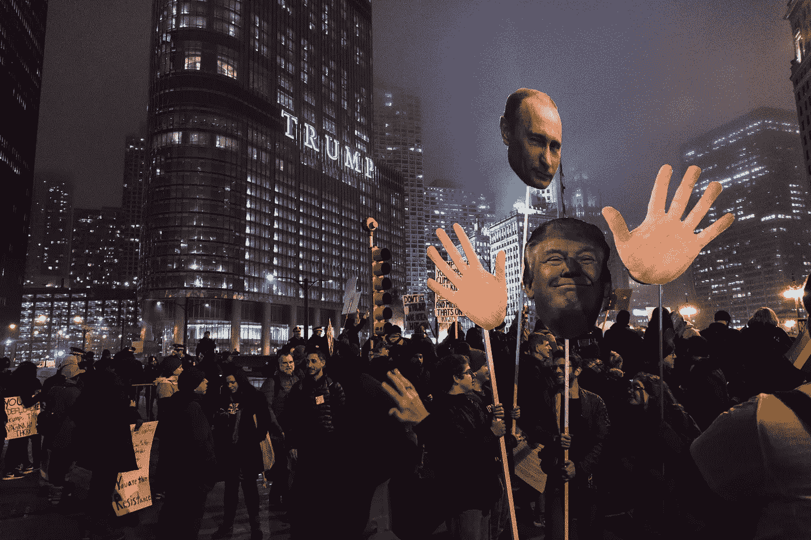

# 区块链能在核战争中幸存下来吗？

> 原文：<https://medium.com/hackernoon/can-blockchain-survive-a-nuclear-war-ecb5081660b4>

未来人类面临的最大威胁掌握在富人和权贵手中，看起来他们并不在乎是否为了解决一些小问题或他们的贪婪而消灭所有的人类。我们所有人都需要意识到，仅仅是美国和苏联就有能力在弹指间消灭全部人口。

Photo by [rob walsh](https://unsplash.com/photos/_KeC-qyKLPY?utm_source=unsplash&utm_medium=referral&utm_content=creditCopyText) on [Unsplash](https://unsplash.com/search/photos/nuclear?utm_source=unsplash&utm_medium=referral&utm_content=creditCopyText)

世界各地的紧张局势正在上升，如果任何核武器被用于即将到来的战争，这将是我们人类的末日。贪婪者手中的核弹头能够毁灭我们在宇宙中的存在，在这样的事件中，我们能把保存我们信息的赌注押在区块链技术上吗？

如果你仍然不确定你需要了解区块链技术的哪些内容，你可以在两分钟内通过'[对区块链进行全面的介绍。这是一个 2 分钟的介绍，以了解正在发生的事情和区块链实际上是什么。](https://hackernoon.com/an-extensive-introduction-to-blockchain-in-just-2-minutes-db13ac854826)

区块链目前正在提供最简单和有益的分布式账本数据库，这些数据库几乎是不可腐蚀的，能够在世界各地系统的每个节点上存储数据的多个副本。但这就是我们在灾难中所需要的一切吗？

我们已经看到了区块链如何将社会重新定义得更好，每个人都可以获得资源，这一次他们甚至会意识到需要互相帮助，分享我们有限的食物、水和战后剩下的任何东西，以让人类生存下去。

Photo by [Edgar Perez](https://unsplash.com/photos/kTBJmeRbAbo?utm_source=unsplash&utm_medium=referral&utm_content=creditCopyText) on [Unsplash](https://unsplash.com/search/photos/half?utm_source=unsplash&utm_medium=referral&utm_content=creditCopyText)

即使我们一半的人口被消灭，我们中的一些人幸存下来告别战争，少数贪婪的人会成倍增加，并可能利用互联网操纵和获取利润。只有在一个分散的系统中，每个人都可以分享资源和我们物种的生存手段，这才能避免，这正是区块链适合的地方。

区块链在这样一个社会中的用途将是巨大的，这个世界最终会变得更好，人会更少，每个人都在权衡其他同等地位的人。没有一个中央管理机构能保证没有贪婪的人能统治我们剩下的人，我们最终会获得自由。

从技术上来说，区块链有能力重新定义世界，但即使它可以，它能被用来让我们核辐射星球上的剩余生命变得更好吗？我们能希望长期生存吗？