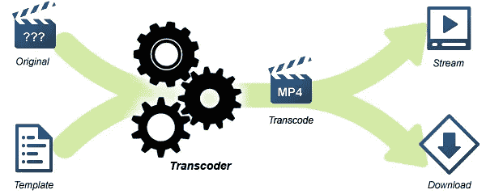
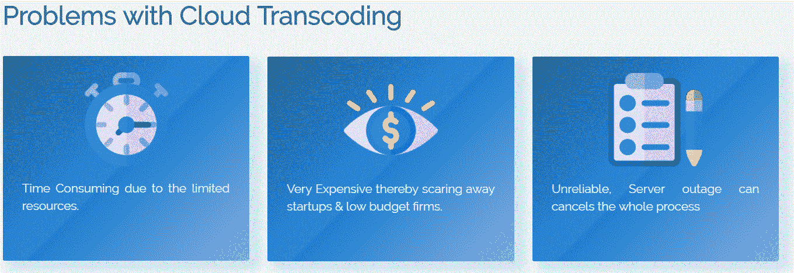
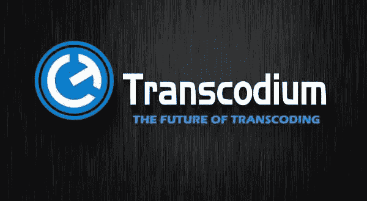
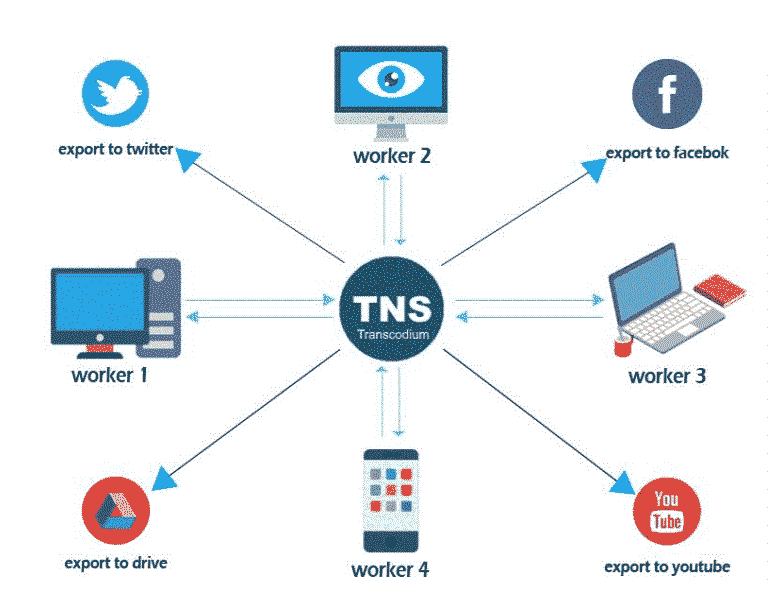

# 区块链科技和 trans code 能革新转码市场吗？

> 原文：<https://medium.com/hackernoon/can-blockchain-technology-and-transcodium-revolutionize-the-transcoding-market-43bb821abec8>

这里有一个问题给你，你花多少时间看视频？回忆一切，网飞，Youtube，脸书，Instagram..很多，对吧？

你有没有想过这些公司是如何在你的每台设备上为你提供流畅的流媒体体验的？嗯，这是因为他们检测设备和互联网速度，并向您提供正确的文件。

[转码](https://en.wikipedia.org/wiki/Transcoding)是将一种文件格式转换成另一种合意且兼容的格式的过程。在你最喜欢的社交媒体平台或流媒体网站，如 [YouTube](https://www.youtube.com/) 、[网飞](https://www.netflix.com/)、[脸书](https://www.facebook.com/)、 [Instagram](https://www.instagram.com/) 和 [Twitter](https://twitter.com/) 向你提供视频之前，他们需要将视频转换为多种格式，以支持不同的设备，如智能手机、笔记本电脑和台式电脑、电视等，因为它们都有不同的功能。一些视频甚至可能无法通过慢速互联网连接播放，这些类型的视频也需要转换为更轻的格式，以实现流畅的流媒体播放。

将文件转换为不同文件格式或帧大小的过程称为代码转换。复杂的媒体编码、解码和转码是资源密集型的，需要多台服务器进行大规模处理，这在目前非常昂贵。这是像 YouTube 这样的免费公共流媒体网站竞争对手减少的主要原因。

据 worldstream.com[报道](https://www.wordstream.com/blog/ws/2017/03/08/video-marketing-statistics)全球视频流媒体软件市场规模预计将从 2017 年的 32.5 亿美元增长到 2022 年的 75 亿美元

Transcodium Logo

有一家名为 [Transcodium](https://transcodium.com) 的公司，声称提供市场上最便宜和最快速的转码服务，该公司表示“基于云的转码需要庞大的服务器，这些服务器价格昂贵且排队时间长，Transcodium 将提供一个平台，以分散的方式处理文件，这意味着将不再需要集中式云服务器，这将大大降低过程的成本。”

Transcodium 旨在以非常实惠的价格提供第一个基于点对点区块链的分散式媒体转码、编辑和分发平台，该平台具有高质量和可靠的计算能力。这将为用户创造一个全球市场，用户愿意租用他们的闲置机器作为工人(矿工)。此外，在代码转换过程结束时，工作人员(处理器)将获得 TNS 令牌奖励

这就是 transcode 的工作方式，主节点将接收文件代码转换请求，然后将文件分成小块。这些小片段将被发送给小工人，然后他们将处理这些文件，这些片段非常小，即使是慢速的互联网或移动电话也能够处理它们。一旦处理完成，文件将被发送回主节点，在那里它将连接小片段并将其交付给客户端。

The image above explains the operation of a master node and workers on the Transcodium network.

工人们只不过是愿意租用他们设备的矿工，他们将获得 TNS 代币，以换取他们将共享的处理能力。与其他网络相比，Transcodium 中的挖掘是不同的，在这里，矿工不需要随机猜测，他们将获得一个文件，他们只需处理它们，因此不会有任何困难或散列率。

该公司已经开始开发他们的产品，并与 NVB(原生视频盒)等公司合作提供代码转换。这里的竞争很激烈，因为像亚马逊这样的巨头已经占领了市场。如果 Transcodium 能够提供他们所说的东西，它可能会帮助依赖媒体文件的初创公司或小企业蓬勃发展。

关于 Transcodium，另一件有趣的事情是，英美计算机程序员兼商人[约翰·迈克菲](https://news.bitcoin.com/pr-john-mcafee-joins-decentralized-coding-platform-transcodiums-advisory-board/)早在 2018 年 1 月就加入了顾问团队。根据 McAfee 的说法，Transcodium 是小型企业在大型市场中竞争的一种方式。“Transcodium 是解决创建流媒体网络成本的方案，是第一个 [ICO 机会](https://thinklab.com/content/1529292)投资者参与这一领域”

同时，该公司还推出了一种名为 TNS 的代币，将被用作支付手段，TNS 的代币销售将于 4 月 30 日结束。代币销售对 Transcodium 有利，使产品变得可行。

作为一个令牌化的公司和使用分散化技术的结合使得 Transcodium 独一无二，同时也是对团队的一个挑战，这是需要关注的所有属性。

链接:

 [## 37 2018 年惊人的视频营销统计

### 随着数字营销的发展，我们继续看到有利于视频的趋势！以下是一些快速简单的统计数据，可用于…

www.wordstream.com](https://www.wordstream.com/blog/ws/2017/03/08/video-marketing-statistics)  [## Transcodium ICO -现已上线(44%) | ICO 观察列表

### 所有关于现场传输 ICO 和 TNS 令牌。首次硬币发行将于 2018 年 5 月 31 日 23:59 结束。投资…

icowatchlist.com](https://icowatchlist.com/ico/transcodium) 

[https://icobench.com/ico/transcodium](https://icobench.com/ico/transcodium)

 [## 中转令牌台

### 编辑描述

www.tokendesk.io](https://www.tokendesk.io/ico/transcodium/)  [## 欢迎-第一个分散转码平台-trans code 有限公司| Thinklab

### 欢迎-第一个去中心化转码平台-trans code 有限公司。

| Thinklab Welcome -第一个去中心化转码平台-trans code Ltd.thinklab.com](https://thinklab.com/content/1529292)  [## 欢迎-第一个去中心化转码平台-trans code 有限公司。

### trans code 旨在提供第一个基于对等区块链的分散媒体转码、编辑和…

transcodium.com](https://transcodium.com/)