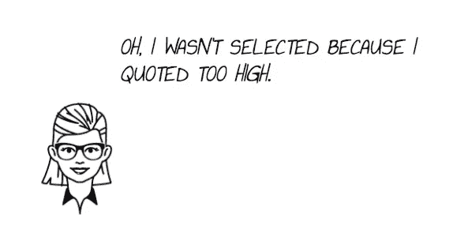
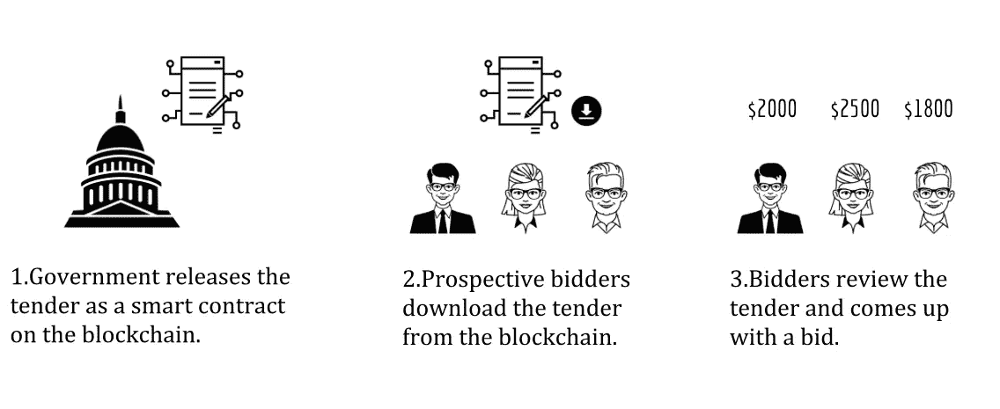
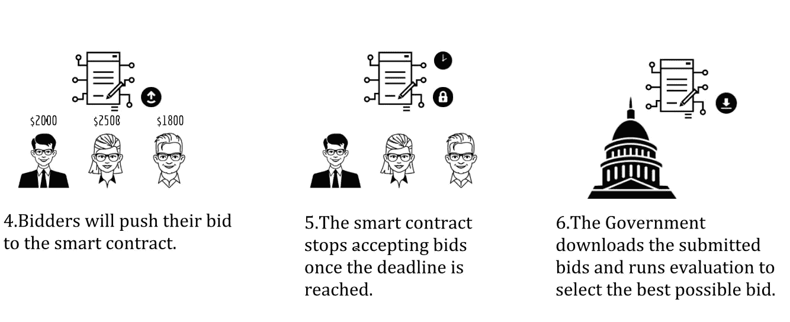
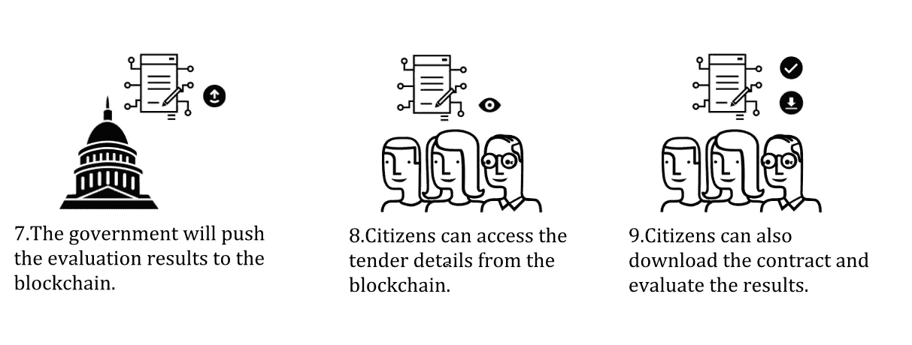

# 区块链技术能否用于改善开放治理？

> 原文：<https://medium.com/hackernoon/can-blockchain-technology-be-used-to-improve-open-governance-2bddb63561fb>

开放治理不是在他们喜欢的基础上发布信息。但是，拥有一个真正透明的系统。

在区块链之前，我们有各自组织拥有的集中式系统或计算机。数据存储在这些计算机上，很少向人们透露。

组织不拥有区块链上的计算机。在这里，由世界各地的人们贡献的计算机一起工作来执行程序。数据和代码被复制到网络中的每台计算机上。根据设计，区块链上的信息是公开可见的，并且不能更改。

*由于区块链固有的透明和不变性，它能被用于治理吗？*

立即将整个政府搬到区块链是不切实际的。但是它的某些部分是可以移动的。

**来自伦敦大学 Holloway 的研究人员利用区块链** **为一个** [**公平透明的政府招标过程做了一个概念证明。**](https://arxiv.org/pdf/1805.05844.pdf)

招标是政府和金融机构对必须在限定期限内提交的大型项目进行招标的过程。

研究人员建议以下这些条件，以确保公平和透明的招标过程。

*1。一旦政府开启了具有特定描述的招标，他们就不能改变它。每份标书都包括评估标准，以选出最佳标书。政府改变标准以偏袒某个特定的商业组织是不公平的。*

*2。在投标截止前，投标必须保密。投标不被篡改。组织不应该知道其他人是否出价。*

*3。政府只能在投标截止后公布标书。投标可以公开，这样失败的组织、公民和利益相关者可以评估整个投标过程。*

*4。政府不应该拒绝基于他们偏见的提议。该流程应确保机密性、隐私性和完整性。投标过程应该是可审计的，决策应该有证据支持。*

# 那么，如何让它实际工作呢？

研究人员已经开发了他们的概念证明，使用了区块链的关键功能之一，智能合同。

智能合同是自动执行的计算机化合同。在正常的合同中，我们有写在纸上的条件。智能合同的条件是用计算机代码写的。

智能合约的关键特征是，当条件失败或成功时，我们可以告诉它做什么。例:如果投标截止，那么就公开招标。

让我们看看如何使用智能合同进行招标。

*1。智能合同将包含关于如何进行评估的计算机代码形式的指令。这是在区块链上发布的，一旦代码被部署就不能被修改。*

*2。投标人可以从区块链下载智能合同形式的标书。*

*3。投标人可以查看代码并生成投标响应。由于投标是加密的，投标人将无法看到对方的出价。*

*4。当投标人将他们的投标推入区块链时，他们使用他们的认证签名密钥对其进行数字签名。这项措施防止未经授权的投标。*

*5。智能合同将拒绝在截止日期后发送的投标。*

*6。政府下载标书并进行评估，以选出可能的最佳标书。这里的评估不是手动的，而是由计算机运行评估。但是，只有政府有权启动智能合同的评估流程。*

*7。* *评估结果现在与投标人的密钥一起被推送到区块链，以便人们可以解密投标和评估代码。*

*8。市民可以随时访问智能合同，因为区块链上的数据会永久保存在那里。*

*9。市民可以下载智能合同，自己进行评估，并检查评估过程是否公平。*

虽然我们有一个概念证明，但当您在区块链上部署真实世界的招标时，会有一些挑战。然而，在区块链上实现公平透明的招标过程并非不可能。

你可以看看他们的研究论文了解更多细节，它包含了发起招标、投标和评标的算法。

请鼓掌👏，谢谢你😊。关注我们[**hacker noon**](http://hackernoon.com)**和我(**[**Febin John James**](https://medium.com/u/75a616711f4e?source=post_page-----2bddb63561fb--------------------------------)**)了解更多故事。**