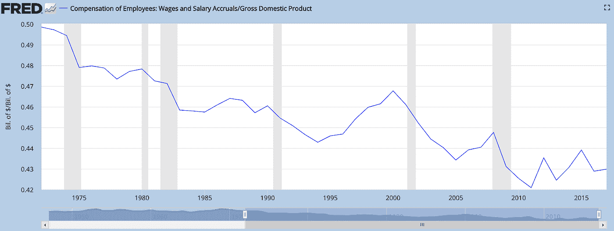
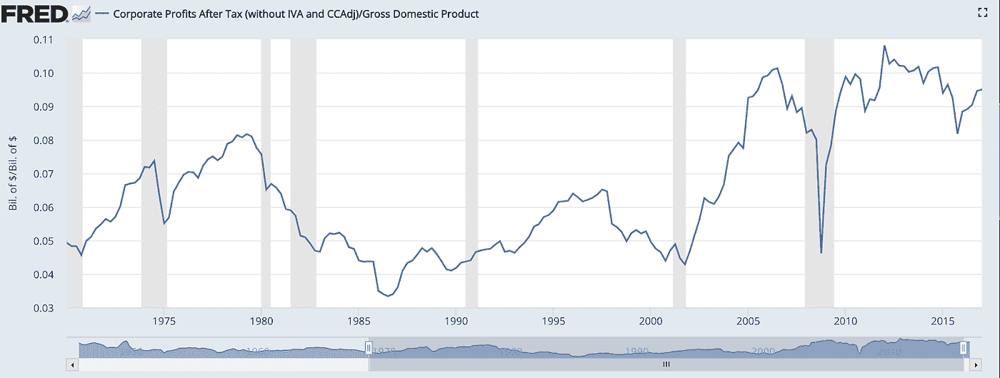

# 区块链科技能阻止工资下降吗？起源协议认为它可以

> 原文：<https://medium.com/hackernoon/can-blockchain-technology-stop-declining-wages-origin-protocol-believes-it-can-11729d565ca2>

馅饼可能在变大，但显然不是每个人都在变大。自 1971 年美国采用纯纸币体系以来，员工工资占国内生产总值的百分比大幅下降:

而公司利润份额几乎翻了一番:

一些经济学家说这种转变是全球化的结果。其他人会指向[自动化](http://www.nber.org/papers/w23285)，还有人会指向[纸币](https://mises.org/library/how-money-production-can-worsen-income-inequality)本身。虽然这些都是令人信服的解释，但另一个不太为人所知的是反垄断执法力度的下降，这在里根政府时期加速了，在现代美国工人贫血的谈判地位中发挥了作用。

整个 20 世纪中期，国会反复颁布立法来限制掠夺性定价。掠夺性定价被视为一种策略，资本雄厚的公司可以用它来使竞争对手破产、消除竞争和集中控制。因此，掠夺性定价法的目的是在整个经济中分配权力和机会。[交叉补贴](http://onlinepubs.trb.org/onlinepubs/sp/Competition_Policy_for_US_Freight_Railroads_Pittman.pdf)，一家盈利的公司在无竞争区收取垄断价格，以补贴有竞争区的低于成本价格(意图使其破产)，这通常被视为反竞争和非法的。

但是在几十年的过程中，法院开始减少对市场结构的关注，更多的关注消费者的影响。只要消费者没有被收取过高的价格，法院就越来越倾向于接受主导市场活动的大型企业。预期结果的一个现代例子是优步 Lyft，这是一家国内双头垄断企业，已经筹集了大量风险资本，能够向乘客收取远低于传统经济竞争对手的费用。

[https://www.taxifarefinder.com/newsroom/2015/08/27/which-one-uber-vs-lyft-vs-taxi/](https://www.taxifarefinder.com/newsroom/2015/08/27/which-one-uber-vs-lyft-vs-taxi/)

这张图表看起来不错，对吗？作为一名消费者，我可以从一家已经知道如何更有效地满足我需求的公司购买更便宜的车。但是这张图表没有显示工人们的情况。麻省理工学院刚刚发布了[打车经济学:司机收入、支出和税收](http://ceepr.mit.edu/publications/working-papers/681)显示优步& Lyft 司机在扣除保险、折旧和其他成为零工经济司机的费用后，每小时的利润仅为 8.55 美元。不幸的是，由于缺乏讨价还价的能力，零工经济工人的命运常常掌握在他们无法控制的市场力量手中。这些市场力量将把工人劳动产生的价值转移到支持垄断或双头垄断市场的风险资本家的口袋里。

司法部有没有采取任何措施来阻止它？也许吧。该部门最近起诉了[美国运通](https://www.pymnts.com/antitrust/2018/supreme-court-amex-antitrust-case-two-sided-market/)，声称他们不公平地利用其双向市场地位，对其商家如何向顾客提供各种支付选择进行非法控制。然而，地方法院对美国运通的最初判决被第二巡回上诉法院推翻，该案件将一直上诉到最高法院。[除非最高法院推翻第二巡回法院的判决](https://www.nytimes.com/2018/03/02/opinion/the-supreme-court-case-that-could-give-tech-giants-more-power.html)，否则这很可能意味着双向市场反竞争行为的门槛将会提高，从长远来看，几乎肯定会导致零工经济工人受到的保护减少。

所以你是说工人们过得很糟糕，而且只会越来越糟？不一定！对于零工经济的工人来说，要想过上合理的生活，他们需要有权决定自己的工资和价格。虽然大多数现有的大型平台不会将这一权利完全转让给供应商，但许多分散的组织会这样做。接下来的挑战是建立和扩大这些分散的市场，以便工人和供应商能够重新控制工资和价格的设定。

Origin Protocol 是一家由两位厌倦了被大型集中市场摆布的技术专家创立的公司，它已经开始应对这一挑战。Origin 明白零工经济员工的恶劣工作条件并不是因为一两个坏人的恶劣行为，而是市场参与者之间权力系统性失衡的结果。因为他们不认为问题的解决方案是“新优步”或“新 AirBnB”，他们实际上正在创建一套全面的开发者工具[T1，任何希望建立一个分散市场的团体都可以使用它们来加速和促进他们的产品发布。](https://hackernoon.com/tagged/tools)

分散市场有独特的挑战和好处。虽然它们为参与者提供了更大的自主权和可能更低的费用，但市场往往比更大的集中式交易所小得多，资源也更少。因此，不要浪费资源重复发明轮子，像 Origin Protocol 这样的市场专家必须负责支持大多数或所有分散市场的共同需求，如身份解决方案、支付工具和社区发展。Origin Protocol 有效地吸收或抵消了这些共同成本，是奠定 21 世纪经济基础要素的最前沿，可以极大地增强目前被剥夺权利的零工的权能，这些零工的生活因不断变化的市场力量、资本集中和法院剥夺反垄断解释的权能而面临多年的挫折。

超过 25 个[分散式市场](https://www.originprotocol.com/en/partners)致力于提供分散式拼车、房间列表和许多其他商品和服务，并承诺与 Origin 合作建立他们的市场。许多这种分散化的交易所资本相当充足，并且正在努力发展他们的乌托邦式的无忧商务，没有寻租的中间人。尽管乌托邦愿景和实际执行之间存在明显差异，但功能分散市场的简单出现应该给垄断者、双头垄断者和卡特尔带来竞争压力，让它们以更人道的方式对待供应商和员工。由于这些因素，Origin Protocol 和区块链社区的许多其他人认为，去中心化和去中心化交换是 21 世纪劳动力生存和发展的关键。