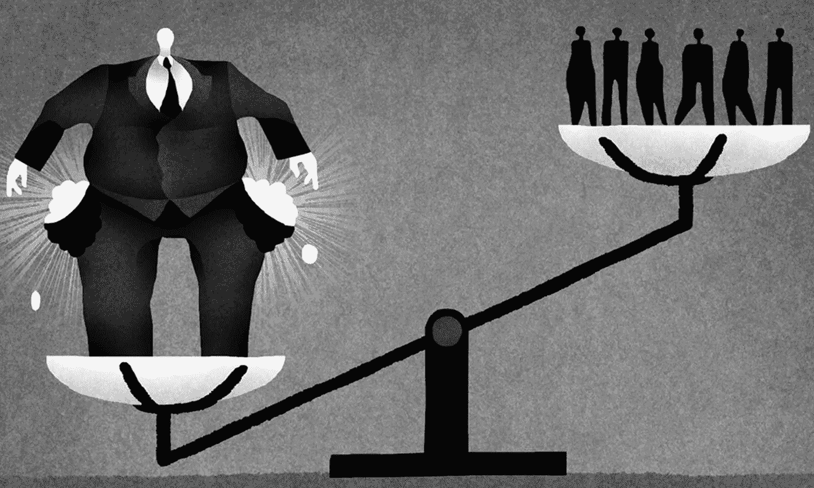

# 区块链能减少社会不平等吗？

> 原文：<https://medium.com/hackernoon/can-blockchains-reduce-social-inequality-792653bc3623>

Image from [The Politics of Poverty](https://politicsofpoverty.oxfamamerica.org/2015/04/extreme-inequality-and-oligarchy/)

没有其他技术能在如此短的时间内引起如此大的全球轰动。就在十年前，[中本聪](https://en.wikipedia.org/wiki/Satoshi_Nakamoto)阐述了如何使用加密保护的区块链来驱动数字货币——T2 比特币。从那以后，[区块链](https://hackernoon.com/tagged/blockchain)技术及其应用吸引了企业家、经济学家、银行家、风险资本家和普通大众的想象力。

不可避免的是，加密狂潮也吸引了大批机会主义者和骗子——在某种程度上损害了整个加密空间的声誉。然而，这仅仅是对更大图景的一个小小的干扰:技术可以带来的价值、颠覆和社会影响。

在今年的达沃斯论坛上，主题为*在分裂的世界中创造共享的未来*，来自世界各地的领导人一致认为，全球化对社会是一个净积极因素，但需要更强有力的措施来确保它所产生的财富得到更公平的分配。

令人担忧的是，由于世界更加全球化而产生的大部分财富都流向了那些已经很富有的人——这进一步加剧了社会不平等。根据乐施会国际的一份报告， [*奖励工作而不是财富*](https://www.oxfam.org/en/research/reward-work-not-wealth)*去年创造的所有财富的 82%都流向了最顶层的 1%。*

*让我们看看配备区块链的组织如何影响社会和不平等。*

## *区块链教导致了全球化吗？*

*可以有把握地认为，区块链技术及其不断发展的无边界网络，如比特币和以太坊，将推动世界走向更加全球化。然而，我认为，区块链推动的全球化如果实施得当，将会带来一个更加公平的世界，减少不平等。*

*更平等的财富分配的潜力在于技术核心的一个重要属性:去中心化。例如，比特币和以太坊是加密货币，没有中央权威机构或中央银行监管其运作。它们在分散在世界各地的数千台机器上自主运行。*

## ***任何人都可以成为投资者***

*区块链对采用它的行业有去中心化和民主化的影响。例如，投资行业的一项创新——首次公开募股(ICOs)在 2017 年风靡全球。*

*ICO 是区块链公司通过出售加密令牌筹集资金的一种新方式。与众筹不同，在众筹中，参与者捐款以换取额外津贴或产品，在 ICO 期间出售的代币代表公司的股份，它们更像是普通公司的股票。*

*在 ICOs 出现之前，要投资早期创业公司，你需要成为风险投资家、天使投资人或银行。今天，你不再需要成为一个有资格的投资者，拥有数百万美元才能投资。亚美尼亚一个村庄的人可以在缅甸投资一家初创公司。*

*通过 ico 筹集的资金数额表明了对投资机会民主化的现有但未得到充分满足的需求。2017 年，通过 ICOs 筹集的资金总额超过 50 亿美元。这是通过传统融资机制投资金额的五倍。*

*在某种网络效应中，一个区块链提供资金的机制——ICO——为区块链企业提供资金，这些企业将进一步分散和扰乱其他行业，如[金融](https://getwala.com/)、[能源](https://wepower.network/)、[云存储](https://filecoin.io/)和[媒体](https://steem.io/)。*

## ***社会影响***

*由 ico 资助的去中心化产品，可能会带来更平等的财富分配。让我们看一个例子来看看这是如何工作的。*

*[Filecoin](https://filecoin.io/) 是一家 ICO，在 2017 年筹集了创纪录的 2.57 亿美元，允许用户在云中存储文件，如 Dropbox、iCloud Drive 和亚马逊 S3。然而，Filecoin 不是将文件存储在大公司拥有的数据中心，而是将数据存储在其他人拥有的普通个人电脑网络上。*

*这种分散化将通过利用以前未充分利用的资源(空磁盘空间)来创造价值。然而，更重要的是，Filecoin 网络产生的价值将被分配给成千上万的个人，而不是用[可笑的现金](http://money.cnn.com/2017/02/01/investing/apple-cash-overseas/index.html)填满大型科技寡头的账户。*

*首先，网络产生的财富将会被全世界共享磁盘空间的人们所分享。其次，成千上万的投资者将通过出售他们在 ICO 期间获得的加密令牌来获得投资回报(而不是像传统融资那样只有几个风险资本家)。*

*这种模式与许多其他区块链产品类似:摆脱中间商，将产品产生的财富分配给比传统公司多得多的人。*

## ***未来的组织***

*这给我们带来了一种新的组织结构，称为[分散自治组织](https://en.wikipedia.org/wiki/Decentralized_autonomous_organization)或 DAO。这仍然是一个未来的想法，但从长远来看，它具有影响社会的巨大潜力。*

*DAO 不需要管理结构或任何类型的层级，因为它由运行在区块链网络上的智能合约提供支持。网络作为一种基础设施，让世界各地的不同个人以对等的方式一起工作。*

*想象一下连接司机和乘客的区块链。任何人都可以连接到这个公共区块链，成为司机或乘客。没有一个组织有首席执行官、经理或销售部门，因此司机使用智能合同供电的网络将支付接近零的费用。*

*在未来，这种网络可以将人们与世界范围内的无领导组织联系起来，绕过中间人，保证更公平的财富分配。*

## ***未来的挑战***

*通过区块链进行全球合作的自组织网络似乎是一剂灵丹妙药。然而，区块链技术和整个加密生态系统还处于起步阶段，需要几十年的时间才能成熟。*

*区块链系统仍然极其缓慢和笨重。例如，比特币每秒钟最多只能交易七次，消耗的电力比整个爱尔兰的电力还要多。相比之下，Visa 每秒可以处理多达 50，000 笔交易。*

*更重要的是，仅仅说区块链产品能够使产业民主化，并有可能实现更公平的财富分配是不够的。为了赢得竞争并获得大规模采用，他们必须在经济上比他们的中央集权对手更有效率。*

*用户不会仅仅因为优步是一个分散的地方就使用一个点对点的拼车平台。但是，如果更便宜、更容易使用，他们可能会更换。*

## *概括起来*

*想象一个由对等的区块链组织驱动的世界是很有趣的，在这个世界里，世界上的每个人都有平等的机会创造价值，并且他们的贡献会得到公平的回报。*

*即使技术专家、企业家、监管者和秘密经济中的每个人都面临巨大的挑战，人类似乎已经准备好探索未来几十年更加分散化的世界的可能性。*

> **感谢阅读！有反馈或想法要分享吗？在* [*Twitter*](https://twitter.com/vrepsys) *或* [*LinkedIn*](https://www.linkedin.com/in/vrepsys) 上与我联系*