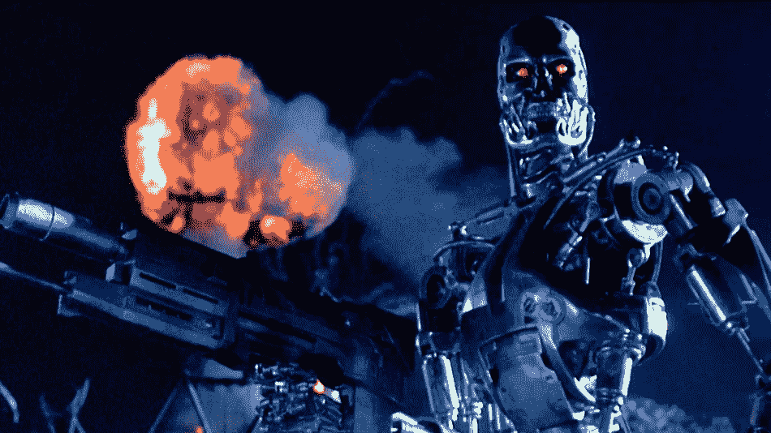
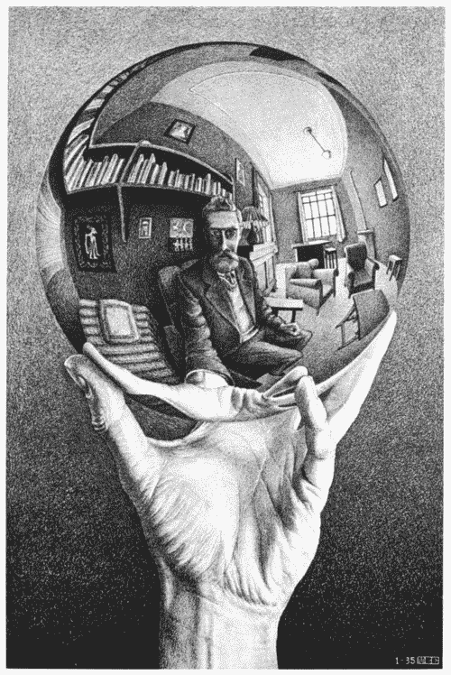
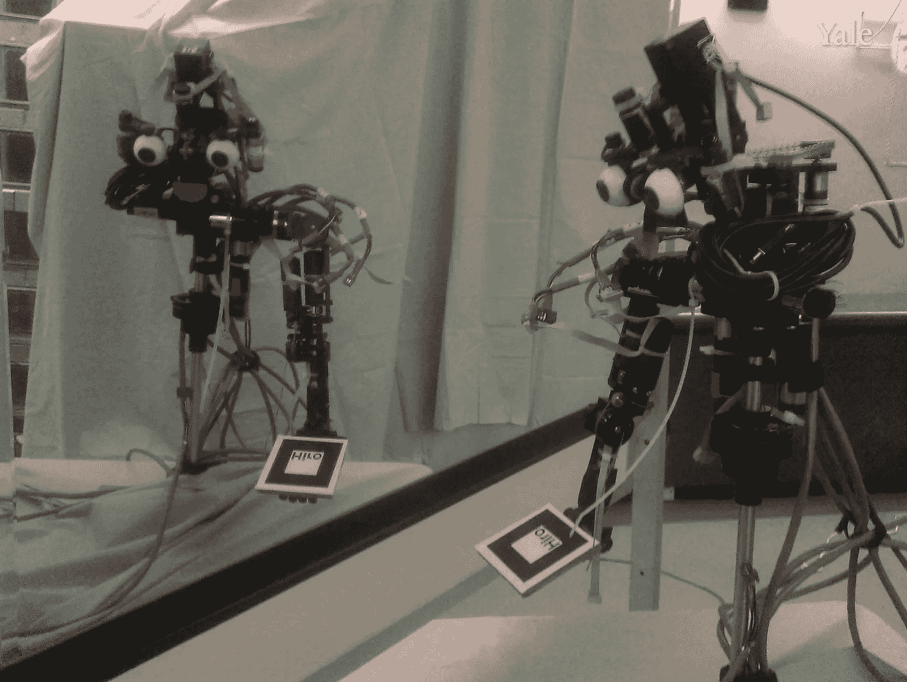
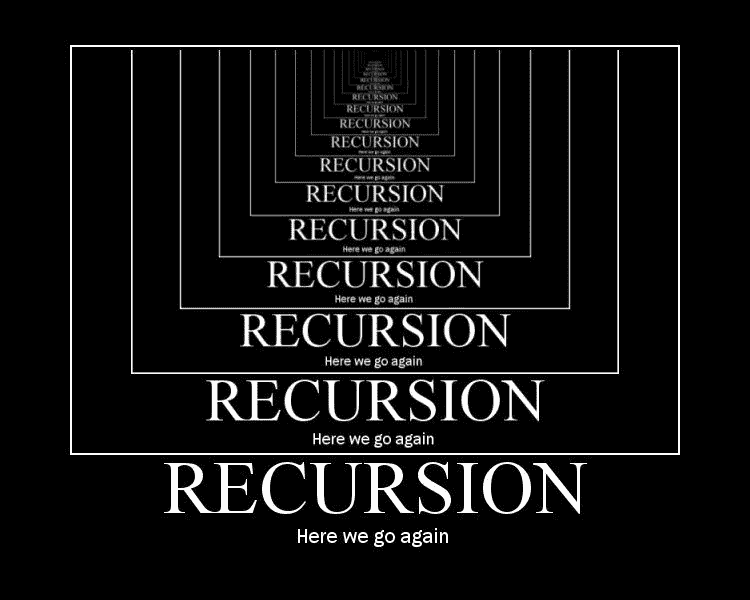

# 代码可以自我感知吗？在麻省理工学院学习计算机科学的思考(上)

> 原文：<https://medium.com/hackernoon/can-code-be-self-aware-musings-on-studying-computer-science-at-mit-part-i-446d98efb743>

我记得第一次思考自我意识，就像许多事情一样，来自于看太多的科幻小说。《星际迷航:下一代》中的机器人 Data 是一个有意识的生物，还是仅仅是一台“机器”？

Was Data Self-Aware? Picard Argued Yes.

好吧，机器人是一回事——它们有物理存在，不管它们是否有意识，大多数机器都有一些基本的自我诊断能力，并知道它们“物理身体”的状态。现在，即使是汽车也能“意识到”车门是否打开，或者安全带是否系好。

有机器人通过镜像测试的例子(在这里阅读)，这是 1970 年由 Gallop 创建的，目的是看看一种动物(或一种动物)是否能认出自己。根据盖洛普的说法，大多数婴儿直到至少 18 个月大时才通过这项测试——这是某种程度的“自我意识”存在的时间点(至少根据这项测试的测量)。

## ***代码呢？***

但这里的问题不是机器人能意识到自己，而是计算机程序能意识到自己吗？在 ST:TNG 是企业上的“计算机”，它只是软件，有自我意识？那完全是另一个问题。

直到我在麻省理工学院学习计算机科学和学习所有关于编程和递归的知识，我才真正开始思考代码意识到自己意味着什么的问题。

像往常一样，是科幻小说给了我思考这个问题的勇气。

1991 年，在我即将结束在麻省理工学院学习计算机科学的时候，电影《终结者 2》上映了，它有一句台词让我念念不忘。

Skynet becoming self-aware wasn’t a good thing … but what does it mean?

这个化身中的终结者(由阿诺德·施瓦辛格扮演)是一个友好的终结者(在未来被约翰·康纳重新编程过)。莎拉·康纳(琳达·汉密尔顿)询问他关于天网(试图在未来消灭人类的人工智能)的发展:

> 终结者:天网拨款法案通过。该系统于 1997 年 8 月 4 日上线。战略防御中不包括人类决策。天网开始以几何速度学习。

任何看过这些电影的人都知道接下来会发生什么，正如阿诺德在现在著名的台词中解释的那样:

> 终结者:它在东部时间 8 月 29 日凌晨 2 点 14 分变得有自我意识。

当然，埃隆·马斯克和其他人，包括牛津哲学家尼克·博斯特罗姆、麻省理工学院物理学家马克斯·泰格马克和斯蒂芬·霍金，警告我们这种不可避免的反应可能会在未来发生。

> 终结者:在恐慌中，他们试图拔掉插头。

莎拉·康纳独自想出了接下来会发生什么:

> 莎拉·康纳:天网反击了…

除了世界末日的场景，我记得我想知道这对天网来说意味着什么，天网是一个人工智能(据我所知，是一个代码集)，具有自我意识？

代码有可能“意识到”自己吗？

## ***自我意识和黑仔程序……也许？***

那年早些时候(或者可能是前年，我记不清了)，在我们的一门计算机工程课 6.004(计算结构)上，我意外地遇到了一个类似的问题，这门课是 EECS 大学的课程，我们在那里从头开始学习制造一台计算机，叫做“可能机器”。

我们带着一个棕色的小手提箱在校园里走来走去，里面装着一堆电线和数字电路，它们基本上与我们正在学习的汇编代码几乎是一对一地连接在一起(我在家里用 Apple II 计算机做过一点汇编级编程，但不知道我正在编写的小指令直接指示处理器在物理寄存器中执行 X 或 Y 操作！).

在课堂上，我们已经设置了一个原始的操作系统，我们正在学习多个进程的运行，这时老师决定举行一次竞赛。竞争是两个程序在同一个系统上作为独立的进程运行——如果你愿意，这是一场程序之战。我们的目标是让我们的计算机程序与另一个计算机程序作战，或者使其瘫痪。

今天大多数计算机的基本设计源于冯·诺依曼，他认为内存和存储是计算机的关键部分。一个正在运行的程序会把它的指令和程序正在处理的数据一起存储在内存中。在运行多个程序的系统中(想象一下你的 macbook 上有多个窗口)，系统会用一个程序替换另一个程序。这种基本结构——代码和数据以相同的方式存储——产生了有趣的结果，我们将在本文后面看到。

那年的一个寒冷的雪夜，我带着我的 maybe 机器/手提箱从实验室穿过校园，我的同学 Ranjan 也在唱歌，因为他几乎整个学期都在唱歌，我们带着 maybe 在校园里走来走去(“来吧，bee-beee…不要说 maybeeee”)。

我向 Ranjan 道了晚安，然后回到我的宿舍制定一个计划，如何编写一个有竞争力的程序。我记得，竞赛是一项可选的任务，但我想既然我在班上表现得很好，我应该试一试。

很明显，一个程序要杀死另一个程序，它需要知道另一个程序以及它在内存中的运行位置。我写了一个小程序，找出哪个程序正在运行，然后它会找到“其他”程序在内存中的位置，然后简单地覆盖它。

这个小程序一开始就提出了一些实际问题，这在我的脑海中引发了一些哲学问题。它没有修改磁盘上的“其他”程序(实际上我们没有磁盘，但我记得是某种电子病历——这是 25 年前的事了)，而是在内存中修改了它。但是我怎么能确定对方的程序会停止运行呢？

我的第一个解决方案是在下一条应该执行的指令上写一个随机数。然后我意识到，随机数并不能保证程序会停止运行，它只会让程序做一些随机的事情(让我们不要开始讨论“随机”在计算机中并不是真正的“随机”这个事实)。

相反，我只是简单地写了一个“零”作为“其他”程序应该执行的下一条指令，这是“停止”运行程序的信号。

Carrying around Maybe Machines in the Snow at MIT

在凌晨 3 点左右，就像在那些日子里经常发生的那样，哲学开始悄悄潜入，我开始怀疑我正在写的代码是否“意识到”了它自己？从某种意义上说，它必须是，这种意识被编码到程序本身…否则它不能判断它正在覆盖哪个程序！它可能会覆盖自己！

大约凌晨 4 点，我意识到我的程序代码有可能重写自己！通常，用 C、BASIC 或 Java 这样的语言编写的程序不会修改自己。我年轻的编程头脑甚至没有想到这是可以做到的，但是对于汇编代码，这就像改变内存中的任何其他值一样。

我后来意识到这是计算机科学中一个相当好的研究领域，叫做自我编辑程序。我意识到，唯一可能的原因是，在某种程度上，数据和代码(在内存中表示为数字/代码)的冯·诺依曼体系结构以同样的方式存储在内存中。

我很快对我的程序进行了重新编码，这样它就可以简单地写一个零作为*和*程序的下一条指令——编辑我自己的程序和对方的程序。因为我的程序在运行时必须在内存中，所以当另一个程序运行时，它会被换出内存。如果我重写了对方程序的下一条指令，程序唯一会做的就是“结束”。

Can a program overwrite itself? It turns out it’s not that hard!

与我最初的担心相反，我的程序不会自杀——我正在覆盖电脑(或程序计数器)，或者更确切地说是电脑在内存中指向的位置。下一次我的程序运行时，PC 将递增，下一条指令将开始运行。当我的程序运行时，另一个程序必须*不运行*，这必然会在电脑自己指向的位置出现。

通过这样做，在两个简单的指令中，我的程序尽可能地高效，而其余的都是多余的——我可以让下一个指令添加类似“rizkill wins”的内容。

事实上，这个小程序(是的，我称之为“rizkill”)赢得了编程比赛，杀死了我所有的同学，他们都用了 2 条以上的汇编代码指令来完成任何事情。

然后，出于好玩，助教决定用 rizkill 来对抗研究生助教的程序，虽然它轻松地击败了大多数助教的程序，但有一个聪明的助教使用了相同的技巧，所以我们的程序中哪一个会在任何给定的会话中获胜是一个难以预料的事情(敏锐的观察者会注意到，这只是取决于哪个进程先运行)。

我被宣布是本科生中的获胜者，并赢得了一本斯蒂芬·利维签名的《黑客》(不幸的是，它是由我们的教授 Stephen Ward 签名的，他是一个著名的计算机科学家伙，尽管我更希望它是由作者斯蒂芬·利维签名的，但那完全是另一回事了！).

## ***自我和*自我的副本**

你可能会说我的程序没有一个版本是真正“自我意识”的，尽管我会说它肯定是“自我引用”，这不是一回事。但这无疑让我想到了其他“自我参照”的软件程序，以及这是否是一种“自我意识”的前兆？

你可以编写一个软件来做一个虚拟版本的盖洛普镜像测试——看看代码是否能识别自己身上的一些标记。怎么会？事实上，由于我已经编写了一个自我修改的程序，我可以使用各种技术让程序“自我检查”看看它是否被修改过，使用某种虚拟的“镜子”。

最有可能的是，校验和或某种类型可以解决这个问题，或者它可以在某个地方有一个自己代码的副本来进行比较。

计算机科学中有一整类程序“引用”它们自己的代码——quines 是自我复制的程序，它吐出一个版本的源代码作为唯一的输出。道格拉斯·霍夫施塔特(Douglas Hofstadter)在他的经典著作哥德尔·埃舍尔·巴赫(简称 GEB)中定义了术语“蒯因”，尽管无处不在的冯·诺依曼是最早谈论这些类型的程序的人之一。

Can a program output a copy of its self?

程序员会认识到,“quine”是一个程序，它的源代码是一个可以打印出来的字符串。

在维基百科和其他地方有很多关于蒯因的例子。一个简单的，用 python 写的是:(更多见[https://en . Wikipedia . org/wiki/Quine _(computing)](https://en.wikipedia.org/wiki/Quine_(computing)))

> s =**% r \ n**print(s**% %**s)
> 
> **打印** (s%s)

当然，简单的查询有许多变体——大多数自我复制的计算机程序会复制它们的目标代码，这不需要在字符串中提供源代码(如上所示)或反编译代码。这被称为变形代码，它输出一些自己的“版本”，通常是目标代码版本。

我们都知道自我复制程序，这种程序通常被称为“病毒”，因为它们会在您不知情的情况下将自己复制到您的机器(以及其他机器)上。

## ***电脑程序镜像测试***

*有没有可能编写一个可以通过“虚拟版本”镜像测试的程序？也就是说，如果你在程序上做了标记(以某种方式改变了它)，你能让程序意识到吗？*

*这就像编写一个程序，基本上在每条语句中都这样做——在我们运行的多程序环境中这样做要困难得多，但是现在让我们忽略它。*

**

*A robot looking in the mirror*

*一些简单的伪代码:*

> *//在程序开始时*
> 
> *校验和= X；(这可能需要存储在磁盘的某个地方，让我们忽略程序如何计算自己的校验和)*
> 
> *//后来，也许偶尔:*
> 
> *Y = getCurrentChecksum()*
> 
> *如果(X！= Y)*
> 
> *打印(“我被修改了…我的漂亮！”)*
> 
> *其他*
> 
> *… //继续执行程序要做的任何事情*

*校验和主要用于错误检测，尤其是在下载大量数据或代码时。事实上，如果你下载 Microsoft office，比如说，你可能会下载超过 1g 的数据，这些数据经常被分解成更小的块，每个块都有一个校验和。*

*好的，所以理论上你可以写一个程序，知道它的“过去状态”以及它是否被修改过，但这似乎并没有上升到我们在人工智能中认为的“自我意识”的水平。*

## ****递归、自引用和上下文****

*让我们回到手头的问题:这些程序在某种程度上“意识到”它们自己吗？还是他们只是“自我参照”？*

*回到我在麻省理工学院的计算机科学教育，我意识到我们很早就开始学习自我引用程序。*

*事实证明，我们在麻省理工学院的软件入门课 6.001(“计算机程序的结构和解释”)与许多其他大学不同，它使用 Scheme 语言(LISP 的一个版本)，与大多数编程语言相比，它几乎没有语法/结构或预定义的命令。*

**

*不像其他大学的新生学习用 C 语言(当时是 C 语言，将来是 java 语言)编程，我们用一种几乎没有人使用的语言(在我 25 年的编程生涯中，我再也不需要这种语言了)编写大量递归程序。).*

*尽管如此，这种结构的缺乏使得很早就理解递归变得非常重要。*

*递归是指程序调用自己来完成一个较小版本的问题，是计算机程序中非常标准的技术。假设你想提高 3 的 4 次方。你把这个表示为 3 * 3 * 3 * 3，但也可以表示为 3 * ( 3 的 3 次方)。括号中是完全相同问题的一个较小版本。这个较小的问题可以表示为 3 *(问题的较小版本，或 3 的 2 次方)。*

*在伪代码中，您可以使用下面的代码片段作为简单的递归方法来计算某个基值的幂或指数:*

> *函数 recursiveExponent ( int base，int exponent)返回 int*
> 
> *{ If(指数== 0)*
> 
> *返回 1；*
> 
> *其他*
> 
> *Return (recurviseExponent( base，指数-1)；*
> 
> *}*

*程序有自我意识吗？它明明在呼唤自己，可它知道自己在呼唤自己吗？或者只是调用另一个程序？*

*递归在一个循环中工作，一直向下，直到达到返回具体值的基本级别。在这种情况下，任何数字的 0 次方都是 1，所以这是递归的“基础”。*

*如果我们去掉代码的基线，我们只会有一个函数调用它自己:*

> *函数 recursiveExponent (int base，int exponent)返回 int*
> 
> *Return (recursiveExponent( base，指数-1)；*

*你会有一个无限循环——指数会一直下降，变成一个负整数。抛开数学解释不谈，在大多数计算机上，这不会永远持续下去，这取决于运行它的操作系统，它可能会达到为程序分配的内存的极限。它将得到可怕的堆栈“溢出”错误——这是当今程序运行方式的一个产物，允许递归，一个逻辑“堆栈”(先进后出类型的数据结构)。每次一个新的函数被调用时(无论是否递归),一个新的“对象”在栈上被创建，它成为函数运行的“上下文”。*

*如果递归程序永远继续下去，它最终会耗尽堆栈所需的所有内存。*

*这些是递归程序特有的，因为用循环编写的同一程序的迭代版本不会一直在堆栈上创建内存，它只会一直运行。*

*同一个程序的迭代版本可能永远运行(或者至少运行到指数级)，但是没有任何自引用:*

> *函数 iterativeExponent(基数，指数)*
> 
> *{ int result = 1；*
> 
> *while(I = 0；I < =指数；i++)*
> 
> *结果=结果*基数；*
> 
> *}*

*如果“指数”非常大，这最终可能会导致问题，因为“结果”的值会随着每次迭代而增长，而实际上，变量是有大小限制的。*

*但是我跑题了。回到递归程序。*

*然而，假设我们改变程序来调用不同的函数(可能有相似的代码库):*

> *函数 recursiveExponent ( int base，int exponent)返回 int*
> 
> *{If(指数== 0)*
> 
> *返回 1；*
> 
> *其他*
> 
> *Return (recurviseExponent2( base，指数-1)；*
> 
> *}*

*现在程序没有调用自己，而是调用了另一个函数。*

*程序知道区别吗？*

*现在你可以说它既没有自我意识，也没有自我参照。尽管如此，第二个程序可能调用第一个程序，然后你有一个(稍微)更复杂的递归系统，它仍然是自引用的，所以问题仍然存在——在某种程度上，自引用的系统知道它自己吗？*

## ****声东击西:递归象棋和我如何(最后)解决了 8 皇后问题****

*递归是一种非常强大的技术，尽管它比迭代方法消耗更多的资源，并且当你真正考虑它时，大多数问题都可以通过这两种方法解决。*

*递归的真正强大之处在于，它传授了一个更小问题的“抽象”或“黑盒”的概念——你让“其他人”找出问题的一部分，然后简单地通过一个简单的计算在上面“添加你的部分解决方案”,而不是找出整个问题。*

*它之所以是递归的，而不是仅仅调用别人来解决较小的问题，是因为在递归中，“别人”实际上只是你自己。这就像克隆你自己，然后让这个“缩小版”的你去解决更小的问题，然后把解决方案交给你。*

*当我在高中学习编程的时候，我并没有真正理解递归，也没有怎么使用它。这主要是因为我使用的是 Applesoft BASIC，虽然循环很容易，而且在早期的那些日子里也教过，但递归在过程语言中比在基于对象的语言中更不容易。*

*我的朋友 Gus(和我一起在科学奥林匹克的计算机编程团队)和我偶然发现了一本可以用计算机程序解决的数学问题的书(这是互联网出现之前的事，我们必须去买这本书，或者从图书馆里找！).他们的练习之一是下面的问题，被称为 8 皇后问题:这个问题难倒了我们快速增长但仍不成熟的计算机编程技能:*

**一个棋盘有 8 行 8 列(64 个方格)——在这个棋盘上可以排列 8 个皇后，这样没有一个皇后能够杀死其他的皇后。写一个程序找到一个配置。额外加分:写一个程序找到每一个配置。**

*今天，你可以在互联网上快速搜索各种解决方案，整个维基百科页面都致力于 8 皇后问题:“这是一个所谓简单但不平凡的问题的好例子”。蛮力法显示八皇后有 4426165368(*即*， [64 C 8](https://en.wikipedia.org/wiki/Combination) 种可能的盲放。这个问题有 92 种解决方案，可以通过排除在同一行或同一列上有皇后的配置来简化，所以理论上你应该可以不用经过非常单一的可能位置就能得到。*

**

*A solution for the 8 queens problem*

*但是在那些日子里，我们无法在维基百科上查找，只能一头扎进去。起初，这似乎不是一个特别复杂的问题——您只需在一个循环中编写一个循环就可以解决它。至少我们是这么认为的。当 Gus 和我试图使用简单的迭代来解决它时，它变得非常快，或者变得如此计算密集，以至于使用 Applesoft BASIC 将永远无法解决。我们不知道堆栈和上下文框架是递归的重要组成部分。*

*那年秋天，我去了麻省理工学院，上了第一堂编程课，6.001，(我们正在做阴阳递归)，我意识到 8 皇后问题可以通过同一问题的一个较小版本来解决:一个 8×8 的棋盘可以这样排列，7 个皇后可以放在棋盘上，这样就没有人可以互相攻击。如果你能解决这个问题，那么你可以把第 8 个皇后放在空的列/行中。7 皇后问题当然可以通过解决 6 皇后问题以同样的方式解决，等等。*

*当你这样做时，我的记忆有点模糊，但我确实记得那个夏天回家，给 Gus 看我的解决方案(它只解决了找到一个配置的问题，而不是全部)，我们都确信递归是解决计算机科学中任何问题的最强有力的方法！(注:Gus 改名是为了保护无辜)。*

> *下一部分，第 2 部分:自我意识代码对数据和奇怪的循环和人工智能(即将推出！)*

**如果你喜欢你所读的，请鼓掌 20 次，并给我一个后续媒体。**