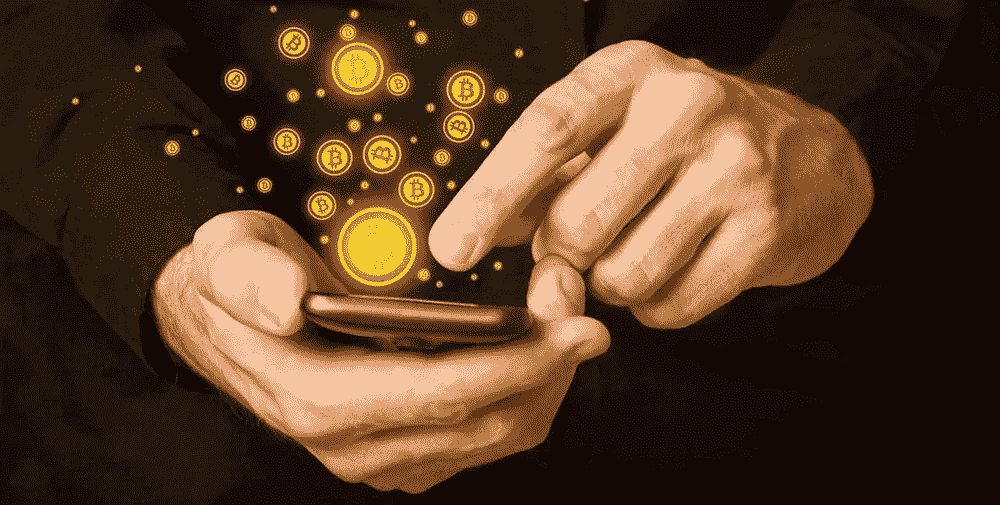
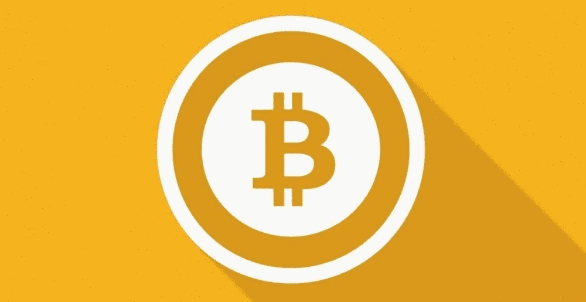

# 加密货币能成为真正的货币吗？

> 原文：<https://medium.com/hackernoon/can-cryptocurrencies-become-real-currencies-addde1db21d>

今年传出的关于加密货币的积极消息数量令人鼓舞，因为它发出信号，表明人们和机构看到了区块链的未来:技术进化的下一步，最终将影响人类努力的方方面面。

最近，像美国国际集团这样的知名保险公司宣布，他们正在制定“量身定制”的政策，以保护在加密空间内运营的企业。区块链创业公司现在有购买保险的选项，如果保险行业将计算这些类型的风险，那么这意味着合法性标尺上的指针正在向上移动。

区块链科技的另一个积极举措是，超过 100 家主流媒体汇聚香港。他们的唯一目的是推广区块链，他们打算通过只提供高质量的信息让公众参与这项新兴技术，旨在让他们了解情况，并与一些政府和私营部门推动的错误信息进行斗争。

世界著名经济学家道格·凯西(Doug Casey)说，“所有生物的首要指令是生存，”加密货币和区块链技术肯定也是如此，因为它们正在努力摆脱目前在世界舞台上的地位，并在公众眼中变得合法。现在有一些三星商店将接受加密货币支付，如果你是那些最终希望看到加密作为一种支付方式在全世界被完全接受的人之一，这是一件好事。

凯西将区块链技术比作汽车的发明，他最近表示，当汽车问世时，人们不需要马上成为司机或拥有一辆汽车，就能理解这项技术将改变世界。他还认为，区块链技术是自互联网本身以来登上世界舞台的最重要的东西。

比特币及其所有衍生品正试图成为一种可行的货币，因为它正在努力满足所有的“规则”，这些规则不是别人，正是亚里士多德在 4 世纪制定的，他说货币需要耐用、可分、方便、一致，并具有内在价值才能被认为是“好的”。亚里士多德还说，货币是普遍接受的支付商品和服务的任何东西，货币的主要用途是交换、记账单位和价值储存。那么，加密货币会达到这个标准吗？

加密货币仍然需要一些工作来满足这些先决条件，才能成为一种可行的长期货币。然而，一旦它解决了当前的一些问题，其背后的技术将使加密货币成为主流，这些硬币成为第一种世界货币的可能性将会爆炸。

货币的耐久性，也就是说，如果世界范围内(甚至当地)发生了某种事情，像战争或政府不稳定一样，使货币发生天翻地覆的变化，货币的生存能力应该是任何可行货币最重要的品质。

考虑到它只存在于网络空间，人们不得不问，一场全球性的灾难(如来自太阳的磁脉冲)有多大可能会摧毁存放这种货币的网络。尽管可能性看起来很小，但还是有可能发生的。那么，这是真正的耐久性吗？

可分性不是一个问题，因为可以说加密货币在网络空间很容易分离和重组，符合规则没有问题。某种程度上，它也是便携的，但访问问题和无法轻松地将加密货币转换成可以在地面上使用的法定货币使其难以满足需求；然而，区块链技术正在迅速发展，很快这个问题将不复存在。这也与便利性因素有关，到目前为止，加密货币使用起来并不方便，但这一切都在改变，很快导致该领域问题的问题将成为过去。

加密货币没有一致性问题，因为每枚硬币都和其他硬币一样，但内在价值呢？作为一种转移工具，它具有巨大的价值，并被凯西称为“私人”法定货币，不同之处仅在于它不受任何政府支持，其价值仅由市场条件控制。

所有货币都有半衰期，在此期间它们的活力达到顶峰，然后随着影响这些货币的环境的变化，它们会随着时间的推移而失去活力。由于政府控制内外的因素，非洲货币的半衰期可能为 5 至 10 年，而英镑的半衰期可能更长。在每一种情况下，可预测和不可预测的情况都决定了这些货币的生存时间，发行当局将在某个时候销毁大部分货币。那么，加密货币的半衰期是多少呢？现在没有人能真正回答这个问题，也没有人能预测不知道的含义。

自 1913 年美联储创立以来，美元已经贬值约 96%，如果这一趋势继续或加速，美国等富裕国家和其他与美元价值相关的国家可能会发现自己陷入严重困境。然而；如果一个人把他们的财富存放在一个不受那些创造或破坏传统货币(如美元)的环境控制的系统中，当任何灾难性的金融危机在他们的祖国发生时，这些人可能会很容易地安然度过这场风暴。

凯西曾预言了近期历史上一些最严重的金融灾难(请注意，远在灾难过去之前)，他认为，此时此刻，一场新的灾难正笼罩在我们的头上。当这种事情发生时，加密货币可能会找到它的位置吗？

虽然这一消息可能令人不安，但它也可能为加密货币提供所需的推动力，使其成为一种世界货币，因为人们知道拥有一个分散的货币系统的价值，这种货币系统与任何世界政府都没有联系，可以轻松跨境转移，而监管机构无法捕获或摧毁你的任何财富。

那么，这一切意味着什么呢？也许人们不应该再紧紧抓住以前的做事方式，因为早期的适应者会看到一笔意外的财富。目前世界上只有不到 1%的人拥有加密货币，所以这还为时尚早。现在为这些变化做准备将有助于一个人在世界舞台上的动荡中生存下来。如果你选择一种策略来创造和保存你的财富，并牢记这一点，你可能会从另一方面得到更好的结果。

—

找出哪种加密硬币即将被突破— [点击此处](https://cryptoinvestinginsider.com/cryptocurrency-to-invest-in/?utm_source=hn&utm_medium=article&utm_content=realcurrency)获取我们的免费报告。