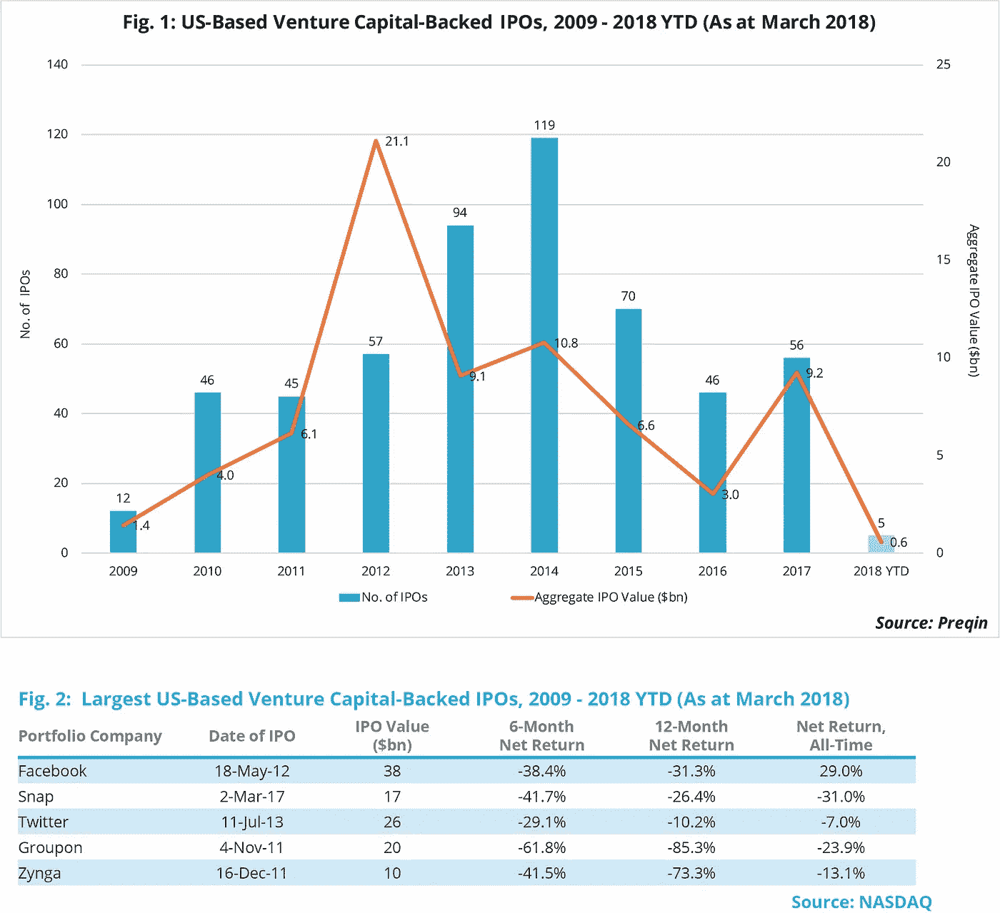

# Dropbox 和 Spotify 能启动风险资本首次公开募股市场吗？

> 原文：<https://medium.com/hackernoon/can-dropbox-and-spotify-jump-start-the-venture-capital-ipo-market-bff749b95ba2>

在过去的一个月里，两家最大的独角兽公司 Dropbox 和 Spotify 申请了首次公开发行(IPo)。Dropbox 遵循传统路线，寻求在 3 月 23 日的首次公开募股(IPO)中筹集 7.56 亿美元，预计估值为 82 亿美元。这将使其成为 Snap 以来最大的 IPO，也是自 2009 年以来由 T2 风险资本支持的 10 大 IPO 之一。与此同时，Spotify——可能以 Dropbox 两倍的规模上市——于 4 月 3 日启动了股票直接上市。直接上市不是为公司筹集资金，而是为其当前的股东提供流动性。这两家公司上市后的表现如何还有待观察，但这两次首次公开募股，加上 3 月 16 日首次公开募股的同行独角兽 Zscaler 第一周的强劲表现，是近年来相对平静的市场的可喜发展。

历史上，首次公开募股市场是周期性的，与公共股票市场同步。这在全球金融危机之后得到了证明，当时美国的首次公开募股活动大幅下降，只是为了慢慢重建自己，并在 2014 年创下了互联网热潮，119 家美国风险资本支持的公司举行了首次公开募股。然而，尽管自那时以来标准普尔 500 指数表现强劲，但在过去三年里，IPO 活动逐渐减少，如图 1 所示。这在目前的独角兽公司中是一种趋势，它们选择在更长一段时间内保持私有化，因为它们在等待完美的市场条件来申请首次公开募股。自 2009 年以来，脸书、Snap、推特、Groupon 和 Zynga 是唯一申请 IPO 估值超过 70 亿美元的美国风险投资公司。查看他们每一次 IPO 后的表现(图 2)就能明白为什么其他大型独角兽公司不愿向公开市场开放，因为只有脸书的表现空前乐观。

对计划退出 IPO 的公司进行投资通常是一项长期投资:在过去 10 年里举行过 IPO 的获得风险资本支持的公司中，从首次风险投资到 IPO 日期之间的平均和中位时间长度都是 7 年。这些投资者经常受到 IPO 后的锁定，这使他们在 3 至 6 个月内无法出售股票，并使他们面临公开交易股票的风险。在过去五年里，新企业协会(New Enterprise Associates)和 OrbiMed Advisors 一直是申请首次公开募股的公司中最活跃的投资者，他们最近的老式基金表现强劲，达到了第一或第二个四分位数，证明了首次公开募股可以提供可行的退出机会。

*   *访问更在*[*【www.preqin.com/blog】*](https://www.preqin.com/go.aspx?lid=25524)
*   *特别感谢 Jesse Fahy 和 Justin Hall 的贡献。*
*   *在 twitter 上关注我* [@felice_egidio](https://twitter.com/felice_egidio)