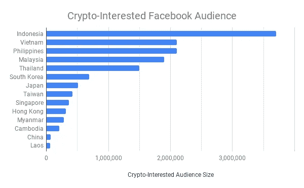

# 脸书能告诉我们哪个亚洲国家的加密最疯狂吗？

> 原文：<https://medium.com/hackernoon/can-facebook-ads-tell-us-which-asian-country-is-most-crypto-crazy-6dc4b9c2c6d5>

作为一名加密/区块链领域的营销人员，我对加密营销和“传统”数字营销的相似和不同之处非常着迷。我一直对亚洲对加密热潮的反应特别感兴趣，所以当脸书向我扔了几美元免费广告积分时，我想:“我怎么能利用脸书来测试亚洲对加密的兴趣呢？”带着这个目标，我最近推出了一篇关于去中心化交易所的文章— [“去中心化交易所的悖论:很多项目，很少用户”](/sesameopen/the-paradox-of-decentralized-exchanges-many-projects-few-users-650b1b0c01c3) —针对中国、韩国、日本、新加坡、越南、香港、印度尼西亚、马来西亚、老挝、柬埔寨、泰国、台湾、菲律宾和缅甸的 18 岁以上人群，他们对加密货币这个话题感兴趣。

Facebook Ad promoted in East Asia

# **估计使用脸书广告的受众**

幸运的是，脸书让定位变得非常容易，事实上，简单地创建广告就可以提供大量关于哪些国家对加密最感兴趣的信息，使用对“加密货币”、“比特币”、“以太坊”、“莱特币”或“涟漪”类别的兴趣作为对加密整体兴趣的代表。

一些有趣的要点:

*   东亚总共有超过 1400 万人对加密感兴趣，可以通过脸书广告网络找到他们。东亚 23 亿人口中，约 17.5%的人可以在脸书上联系到，其中 3.5%的人对加密感兴趣。
*   印度尼西亚有 370 万人(占东亚受众总数的 26%)，是你在脸书上能接触到的对加密感兴趣的最大受众，但该国对加密感兴趣的比例一般。
*   马来西亚和新加坡对加密感兴趣的脸书观众比例最高，均为 8.6%。我觉得新加坡作为一个加密中心比马来西亚更出名，所以这种平等让我感到惊讶，特别是考虑到两国之间的相对人口差异。
*   考虑到政府的限制，中国是脸书最难接触到的，只有 7.3 万人对加密感兴趣，主要是因为只能接触到 0.2%的人口。
*   香港和韩国对加密有很高的兴趣，分别为 5.7%和 4.3%，与每个国家的加密项目和加密基金的数量一致
*   台湾和日本的加密兴趣低得惊人，分别为 2.2%和 2.0%

# **下一步是什么？**

在我看来，即使不在平台上投放广告，脸书也能告诉我们很多关于加密的兴趣和参与度。虽然东亚的一些国家还没有采用加密技术，但显然该地区的许多地方对加密技术有着浓厚的兴趣(新加坡、马来西亚、香港、韩国、越南和印度尼西亚)。有了正确的内容，加密项目可以通过脸书接触到亚洲的受众，尽管该平台仍然不接受明显宣传 ICO、代币销售或其他金融工具的广告。

对于下一步，我个人感兴趣的是:

*   母语广告，以确定英语广告或用户母语广告的表现更好
*   不同的行动号召，看看各国之间是否存在差异(鉴于 WhatsApp 在一些国家的高使用率，我对测试相对较新的 WhatsApp 集成特别感兴趣)
*   内容测试，以确定哪些主题最能吸引亚洲和其他国家的特定受众

如果你在脸书或其他平台上运行过加密广告，请分享你的结果和收获，以及你下一步的计划。我绝对有兴趣在评论中或我们的电报组继续这个话题:[https://t.me/SesameOpen](https://t.me/SesameOpen)