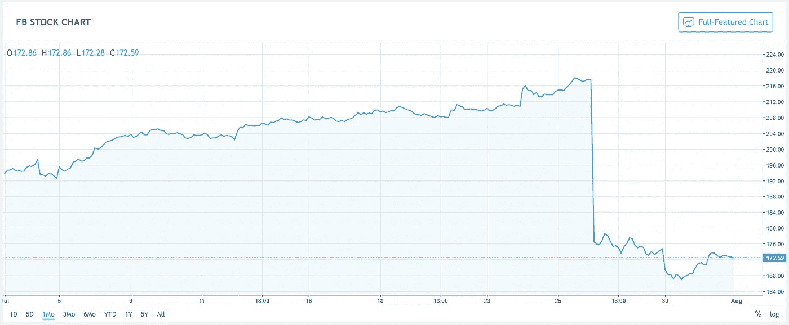
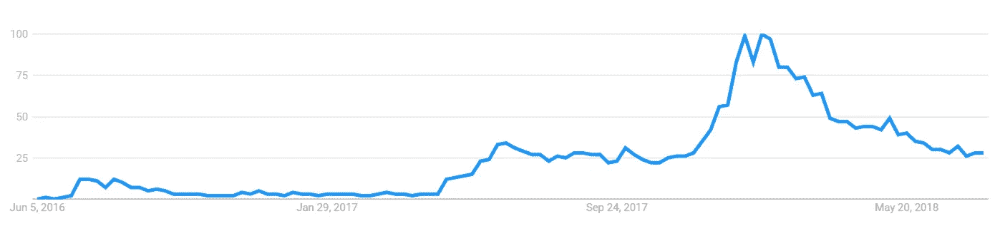

# GDPR 和脸书的损失能促进分散的社交媒体吗？

> 原文：<https://medium.com/hackernoon/can-gdpr-and-facebook-losses-boost-decentralized-social-media-70b4f581ee4e>

当欧盟的 GDPR(通用数据保护条例)于去年 6 月生效时，分析师预计该条例将影响社交媒体巨头，如脸书。在 GDPR 之前，脸书曾有更好的法律依据来收集用户数据，并将其用于定向广告。目前，脸书几乎所有的巨额收入都来自广告。尽管很明显 GDPR 将影响脸书的收入，[脸书在他们的 Q1 收入电话会议中试图淡化这些预期](https://www.recode.net/2018/4/25/17282612/facebook-gdpr-europe-user-growth-impact)。然而，快进 3 个月，在 Q2 收入电话会议中，脸书首席财务官告知投资者，他们预计脸书的收入增长率将大幅下降。预期的下降是由于一系列因素[的综合作用](https://www.marketwatch.com/story/facebook-stock-crushed-after-revenue-user-growth-miss-2018-07-25)，比如数据安全费用的增加，剑桥分析公司隐私丑闻以及由于 GDPR 病毒导致的欧洲用户数量的下降。

这些消息导致脸书股价立即下跌 20%，公司市值蒸发超过 1000 亿美元。这一损失标志着美国股票市场历史上最大的单日损失。

Facebook stock 20% drop after Q2 earning call(source: TradingView)

当然，脸书和其他社交媒体巨头有望找到解决问题的方法。然而，这里的问题是，伴随着主要社交媒体平台收入下降的新发现的隐私问题是否有助于分散化替代方案的增长。最近的这些事件会促使投资者考虑社交媒体去中心化的新趋势吗？此外，去中心化的平台准备好从当前形势中获益了吗？

要回答这些问题，我们首先需要了解去中心化平台带来了哪些优势，它们在实现主流采用方面面临哪些挑战，以及需要进行哪些变革来吸引投资者和客户/广告商。

# 去中心化的社交媒体能提供什么优势？

去中心化的社交媒体是围绕一种理念建立的，这种理念以抵制审查、改善隐私和用户拥有自己的内容为中心。这种理念使得公司很难收集用户数据，并将其用于有针对性的广告或政治活动。用户可以参与分散的社交媒体，而不必担心他们的信息被泄露给付费公司。另一方面，如果用户决定与广告商或市场研究公司分享他们的一些数据，它可以让用户获得财务回报。如果高质量的内容创作者允许广告出现在他们的内容上，他们也可能会获得一些广告费。

基于这一理念， [Steemit](https://steemit.com) 是第一批建立分散式社交网络/博客平台的公司之一。Steemit 于 2016 年 3 月推出，由 Steem [区块链](https://hackernoon.com/tagged/blockchain)支持，该区块链还支持其他去中心化的媒体应用，如 [dTube](https://d.tube/) 。为了鼓励用户参与，Steemit 使用一种货币系统来奖励使用平台令牌 Steem Token 的内容创作者。Steemit 及其创新的货币模型已经引起了越来越多的兴趣，特别是在 2017 年和 2018 年初，这可能是受加密货币流行浪潮的影响。Steemit 目前每月有大约 3000 万的访问量，这对于一个两年前的平台来说是一个巨大的成功。然而，这只占脸书每月 22 亿次访问量的 0.1%。

Steemit interest over time (Google Trends)

其他有趣的平台正以抵制审查为主要目标不断被开发。例如，PeepEth 是一个建立在以太坊区块链之上的去中心化 Twitter。你的微博将永久保存在以太坊公共区块链，不能被审查。有趣的是，新项目已经认识到无缝用户体验的重要性。他们正努力让新用户尽可能容易地使用这项服务。除了可能的财务激励外，这可以通过设计精美、直观的用户界面来解决。

# 去中心化社交媒体要取得成功面临哪些挑战？

到目前为止，去中心化社交平台的主要挑战是用户体验。对于新用户来说，加入和使用这些平台有很大的教育和技术障碍。现在所有的去中心化平台都基于区块链，需要一些关于加密货币以及如何使用它们的知识。例如，注册使用 Steemit 需要支付一笔 Steem 代币费用，或者等待两周由 Steemit 团队验证。注册后，用户在理解 Steemit 财务奖励系统如何工作以及如何从中受益方面存在很大障碍。其他平台，如 PeepEth，需要用户拥有以太坊才能使用这项服务。此外，用户需要一些 Web 3.0 基础设施，如 MetaMask，以便能够注册该服务。与当前社交媒体平台使用的电子邮件注册方法相比，这些障碍对新用户来说是巨大的障碍。

另一个主要障碍是经济障碍。**分散的社交媒体平台没有来自广告商的现金流**。当前的平台不允许广告，即使用户愿意接受他们发布内容上的广告。在像 Steemit 这样的平台上，好的发布内容通过供给膨胀产生的原生代币得到奖励。每一年，Steem 代币的供应量都会以一定的百分比膨胀。创建的代币用于奖励代币归属(赌注)、内容创建以及管理内容的用户。然而，这种基于通货膨胀的经济模式可能会有一些副作用。如果网络不能吸引新的用户，整个网络的价值就不会增加，从而导致供给膨胀导致的象征性贬值。换句话说，对于相对固定的网络价值，整个 Steem 社区通过代币价值的缓慢贬值来支付奖励资金。在这种情况下，平台的用户不会像广告收入那样通过使用新的收入来获得回报。相反，活跃用户通过所有用户都经历的代币贬值获得报酬。令牌保持其价值或累积价值的唯一方式是通过吸引新用户到平台，这创造了对平台令牌的额外需求。

# 去中心化的社交媒体平台准备好了吗？

在目前的状态下，分散的社交媒体平台似乎没有准备好从脸书、推特和其他社交媒体平台面临的问题中受益。投资者不会跳脸书的船，把他们的投资资金用在微小的分散平台上。广告商“目前”没有办法在 Steemit 或其他类似平台上做广告，并且可能认为这样做无利可图。分散平台需要想办法为平台增加价值，并创造对原生平台令牌的需求。

另一方面，这些平台正在缓慢但持续地建立人气，吸纳用户，改善用户体验，教导用户隐私和拥有其内容的重要性。当这些概念获得临界质量时，去中心化的平台将准备分走脸书和 Twitter 的部分收入。此外，GDPR 很可能会加速分散式社交媒体和区块链技术的普及。