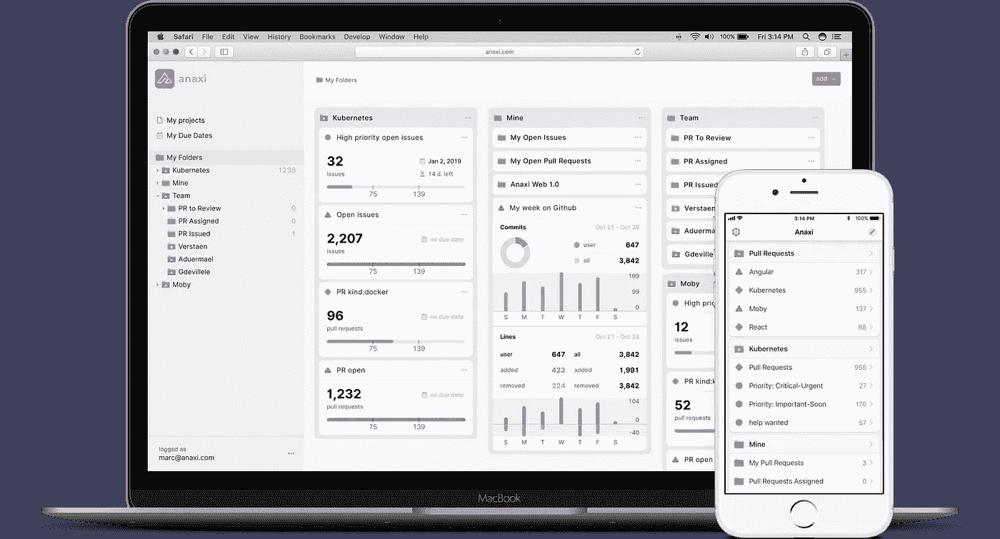

# GitHub 能成为强大的项目管理工具吗？

> 原文：<https://medium.com/hackernoon/can-github-be-a-powerful-project-management-tool-7ff750463234>

每个大公司都是[软件公司](https://hackernoon.com/tagged/software-company)——世界已经被软件蚕食。几乎每个软件公司现在都在使用 Git。当你认为 [GitHub](https://hackernoon.com/tagged/github) 是 Git 回购的领导者时，难怪它的平台上有[210 万个组织](https://octoverse.github.com/)！

然而，GitHub 在项目管理功能和界面方面有一些缺点，正如对 129 家公司进行的[净发起人得分(NPS)](https://www.medallia.com/net-promoter-score/) 调查所表明的那样，该调查评估了他们对工程组织处理项目和优先事项的方式的满意度。GitHub 确实受到了贡献者的好评，但是管理人员(得分-22)更少，高管就更少了(得分-50)。

这解释了为什么高管和经理(通常是产品经理)引入问题管理工具，如 Atlassian 的吉拉，以弥补 GitHub 在项目管理中的不足。

但是，如果 GitHub 可以得到增强，成为一个更好的管理问题和跟踪项目进展的界面，会怎么样呢？这就是由苹果和 Docker 的连续创业者和退伍军人共同创立的初创公司 Anaxi 通过其新推出的网络应用提供的服务。

# 修复与项目管理相关的缺点

对 GitHub 最大的抱怨之一是它提供的浏览任务的终端用户界面。事实上，GitHub 允许你以文本形式输入标签。虽然它提供了很大的灵活性，但你必须知道所有标签的结构，没有标签类别使它们更容易理解。您也不能监视与标签相关联的任务，或者轻松地从一个任务浏览到下一个任务。这对于大型项目来说是一个很大的问题，这在企业和开源领域都很常见。

Anaxi 确实为 GitHub 项目提供了这一切。虽然用户最终可以根据他们的标签过滤他们的任务，并轻松地从一个任务切换到另一个任务，但他们也可以通过标签的分类以新的角度来看待这些任务。 ***区域/联网*** 成为一个类别 ***区域*** 带值 ***联网*** 。你不需要再了解他们来管理你的项目。Anaxi 使 GitHub 用户能够充分受益于其标签的灵活性。需要注意的是，Anaxi 不会修改 GitHub 中的任何数据，也不会创建其他隐藏数据。Anaxi 正在通过增强用户界面和导航来修复 GitHub 的一些缺点。

You can track the filters that matter to you too

# 了解和提高团队产出的指标

[Anaxi](https://anaxi.com?utm_source=hackernoon&utm_medium=post&utm_content=making-github-most-powerful-ticketing-tool) 根据更改的代码行数、更改的文件数、代码更改的性质(重构、新代码或其他)，添加了一个复杂性指标来提取请求。用户现在可以更容易地选择如何分配他们的代码审查时间。Kubernetes 有 1，000 多个拉动式请求等待审查。因此，拉式请求评审优先级已经成为这类项目的一个重要问题。

[Anaxi](https://anaxi.com?utm_source=hackernoon&utm_medium=post&utm_content=making-github-most-powerful-ticketing-tool) 还计算过去一周每个项目、每个用户或每个用户组添加和删除的代码行数、代码变动和重构工作量。这有助于用户理解他们团队的工作模式，以及支付多少技术债务，这是企业世界中需要掌握的一个重要指标。

# 您的多个项目缺少的高级视图

GitHub 和吉拉用户面临的一个共同问题是一次管理几个项目的困难。Anaxi 通过使用户能够添加几个项目并将其过滤器/指标(他们称之为“报告”)组织到文件夹中来解决这个问题。根据当前情况的状态，报告和文件夹都有可配置的颜色指示器，例如，红色表示警报。用户可以一目了然地获得项目状态的高级视图。

# 您需要的移动应用程序

开发人员一直在寻找一款 GitHub 移动应用程序。Anaxi 带有一个 iPhone 应用程序，允许您访问您的报告和文件夹，管理您的问题和请求。Android 应用程序仍在开发中。

# 数据保密性

Anaxi 的创始人了解访问 GitHub 问题的保密性，因此 Anaxi 应用程序被设计为无需连接到任何 Anaxi 服务器即可工作。它直接连接到用户的 Github 存储库，并从应用程序本身构建报告。所有数据都是安全的，不可访问的，即使是来自 Anaxi 本身。

用户可以自由使用 Anaxi，而无需要求队友也使用它。您在 Anaxi 上执行的任何操作都会被写回到 GitHub 上，因此您可以管理您的 GitHub 问题并直接从 Anaxi 拉取请求，而您的队友则继续使用他们喜欢的任何工具。

—

Anaxi 针对企业和开源世界。该公司宣布，其服务将对开源项目保持免费，其目标是使社区能够更好地管理他们的开源项目，以造福整个生态系统。通过这个第一版，Anaxi 旨在帮助团队更好地管理他们的 GitHub 项目。

# 在你走之前…

你觉得这篇文章有趣吗？请按住👏说“谢谢”并帮助别人找到它！
如果您对关于**我们在** [**Dataline**](http://dataline.io) **用我们所有的知识**打造世界级组织的旅程的文章感兴趣，请订阅我们的时事通讯！

你也可以看看我的最新文章:

 [## 破坏开发人员生产力的 12 件事

### 许多文章都提到了技术领导和工程经理的角色。我们经常遇到的一个常见主题是如何…

hackernoon.com](https://hackernoon.com/top-12-things-that-destroy-developer-productivity-2ddf0abc190)  [## 独角兽 20x 工程师的特质

### 我们都听说过 10x 工程师这句话，不是吗？你知道在 20 世纪 60 年代最初的研究…

hackernoon.com](https://hackernoon.com/how-to-be-a-20x-engineer-instead-of-a-10x-975eedd306b2)  [## 如何使评估最终对开发人员有用

### 请任何开发人员估计他们完成一个项目需要多长时间。你会看到他们的厌恶…

hackernoon.com](https://hackernoon.com/the-good-the-bad-and-the-ugly-about-estimates-d07252952860) 

你也可以在 Twitter 上关注我，保持联系。谢谢大家！

*原载于 2018 年 12 月 12 日*[*anaxi.com*](https://anaxi.com/blog/2018/12/12/making-github-the-most-powerful-project-management-tool/)*。*