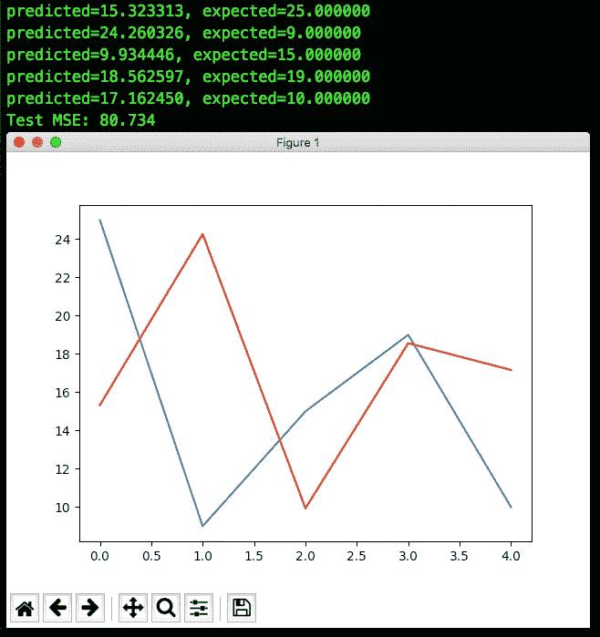

# 我能打盹吗？建立一个图像识别系统来多睡一会儿

> 原文：<https://medium.com/hackernoon/can-i-snooze-building-an-image-recognition-system-to-sleep-a-little-longer-a1fedb367c5d>

“raccoon lying on tree branch with black bucket on its back” by [Successfully Canadian](https://unsplash.com/@successfullycanadian?utm_source=medium&utm_medium=referral) on [Unsplash](https://unsplash.com?utm_source=medium&utm_medium=referral)

# TL；速度三角形定位法(dead reckoning)

这是一个我经历的旅程的故事。我想设计一个机器学习系统，它可以告诉我是否可以在早上小睡一会儿，然后准时上班。

我在这篇文章中确实有一点技术性，所以我在这篇文章中添加了一些更高级术语的链接

如果你想学习如何建立图像识别系统，有更好的文章。但是如果你想要一些有趣的东西，看看让类似机器[学习](https://hackernoon.com/tagged/learning)的东西开始运行是多么容易，那么这篇文章就是为你准备的。

# 背景和问题定义

在刚刚完成 ng 教授的[机器学习课程](https://www.coursera.org/learn/machine-learning)之后，我一直在寻找具有挑战性的问题，以便很好地运用这些新学到的算法。

我想出了很多好玩有趣的点子。但最终，这些都不是真正的问题。是的，太空探索听起来很有趣。但是让我们现实一点，我只是为了在一个复杂的项目中工作而考虑这个。不是因为我有强烈的愿望去发现新的恒星群。

后来有一天早上，我再次做出了一个不明智的决定，在闹钟上打了个盹。由于交通堵塞，我满身大汗地赶到了工作地点，*有点准时..*

There’s nothing like a morning at work after a good run

以这种方式开始新的一天是令人讨厌的，但它让我意识到这是我应该努力的。我其实没什么可抱怨的。但是如果我有超能力自信地断言是否按下那个诱人的贪睡按钮，生活将真的很美好！

问题的轮廓相当清楚。最终，我们希望有一个系统能够提前告诉我们路线是否清晰，再睡 10 分钟不会有什么坏处。对我来说幸运的是，我碰巧住在新加坡，在那里我们可以访问大量的公共数据，包括交通摄像头图像。

# 设计系统管道

考虑到这一点，我为我的机器学习系统设计了以下管道:

1.  获取交通摄像头图像
2.  构建[工具](https://hackernoon.com/tagged/tool)来分类图像子部分
3.  分类很多例子有车/没有车
4.  从原始图片中裁剪选区并调整其大小
5.  构建自己的深度神经网络
6.  训练神经网络来检测汽车
7.  检测实际交通图片中的汽车路段
8.  数数图片中有多少辆汽车
9.  专门为我上下班的时间和地点收集图像
10.  用多少辆车、在什么时间、在什么地方建立时间序列
11.  估计明天是否会有交通
12.  安静地打盹😴😴😴

从此开始了我的数据科学之旅。男孩，哦，男孩，这是一个怎样的旅程！

# 1.获取交通摄像头图像

令人惊讶的是，这是最简单的部分之一。Data.gov.sg 在他们的[API](https://www.upwork.com/hiring/development/intro-to-apis-what-is-an-api/)上做得很好。几乎没有使用 json、csv 和 request Python 库的经验，您可以快速、灵活地下载大量的[交通摄像头图像](https://data.gov.sg/dataset/traffic-images)。

我决定随时从全国各地下载数据。尽管最终我们只需要在早上 9:00 左右检测我公寓前的汽车。我这样做是为了训练一个更加通用的图像识别系统，然后可以很容易地应用到其他地方和时间。

**现在我们有了一堆交通摄像头图像，让我们开始检测汽车**

# 2.分类图像的子部分

获得交通图像是很棒的，但不幸的是，can 不能仅仅把它塞进神经网络，并期望它在计数汽车方面做得很好。(也许我们可以，但这可能不是处理问题的最优雅、最准确的方式)。

所以我开始仔细检查每张图像，试图记录每辆车的坐标，以便稍后将它们剔除，来训练我们的汽车检测神经网络。我很快意识到这已经失控了。所以我写了一个剧本，让我的生活更轻松。

这也是我当初爱上编程的原因之一:**我们有能力让我们的工作工具变得更好**。我们使用程序来编程，所以我们可以编程一个程序，这样它会编程得更好，而我们不必编程那么多！

我使用 Tkinter 库制作了一个程序，在这个程序中，我只需点击几下鼠标和按键就可以选择图像。

**我们写了一个脚本来对图片中的汽车进行分类，现在是时候使用它了**

# 3.对有车/无车的示例负载进行分类

Labelling traffic camera images

即使这是枯燥、重复的工作，我还是在不到一个小时的时间里，在 30 多张图片上给近 200 辆汽车和 1500 多种非汽车选择贴上了标签。我作出了行政决定，这是足够的数据，以继续下一个(我很无聊)。

# 4.裁剪和调整选区大小

这部分也很简单。我为第 3 部分编写的脚本将图像选择相关信息存储在一个整洁的 [csv](https://www.computerhope.com/issues/ch001356.htm) 文件中。我只需要跟踪选择是否是汽车，左上角的坐标，选择的大小。了解了所有这些，我使用了 [Pillow](https://pillow.readthedocs.io/en/5.2.x/) 库(我知道，它非常适合我们的小项目)来裁剪出汽车和非汽车选项。

# 5.编写代码来构建、训练和测试我自己的深度神经网络

就是这样，我们正在建立我们自己的神经网络。哦，男孩，我是在享受。我决定从头开始建造它，这样我就能更深入地了解引擎罩下发生了什么。神经网络背后的概念并不难理解(除了更新函数的导数)。但是实现这一切又是另一回事了。

对于初学者来说，如果你不是一个白痴，这真的很有帮助。我实现了不同的组件，所有的逻辑在我看来都很好..然而，我的节点权重都没有正确更新。经过几个小时的调试，我的头皮上少了几克头发，我发现我一直在使用 Python 2，而不是 Python 3。所以我所有的系数在某一点上会变成 0(结果是`0 + a = a`，所以网络根本不会自我更新。

我还花了很多时间尝试网络的各种超参数，因为我发现它的性能不够好。我很困惑，我在 9 个完整的训练示例上训练我的 3 层每层 5 个单元的神经网络，而*不知何故*，算法在猜测第 10 个示例时做得不好。我基本上是一个 50/50 的网络得到它的权利。我一直都在撒谎吗？难道神经网络不是**高性能、最先进的预测分类器**吗？幸运的是，我意识到你可以更新你的神经网络 100，000 次，但是*也许*你需要比 9 个数据点多一点的数据来得到一个接近有用的算法。

所以我使用了一个真实的数据集，也就是来自 scikit-learn 的[虹膜数据](http://scikit-learn.org/stable/datasets/index.html#iris-plants-dataset)集。为什么特别是这个？你看，我们在我大学最喜欢的课堂作业中使用了特定的数据集(我们必须建立一个 [ID3](https://en.wikipedia.org/wiki/ID3_algorithm) ，如果你正在寻找一个有趣的数学问题，去看看吧)。

该算法现在做得更好了(比我们以前的 50/50 算法更好，耶！).然而，它仍然表现得有点奇怪。不管算法运行了多少次，或者它执行更新的速度有多快，我最终总是得到 60%或 40%的准确率。我感到非常沮丧。即使它做得更好，如果它甚至不能区分哑花，这样的算法怎么能区分汽车和路标呢？？？我正打算放弃编程，追随埃德蒙·黑爵士的脚步。

不过为了好玩，我决定至少看看标准库中的神经网络有多好。所以我将数据集与 scikit-learn 的[神经网络分类器](http://scikit-learn.org/stable/modules/generated/sklearn.neural_network.MLPClassifier.html#sklearn.neural_network.MLPClassifier)进行了对比。我很惊讶。不仅结果与我期望的 99%的准确度相差甚远，而且结果也几乎总是与我使用我的实现得到的结果相同。因此，不管我们的代码有多丑陋和低效，我们必须至少做对一些事情。万岁！

我们低于标准的 60%或 40%实际上并不是因为我们糟糕的实施，而最有可能是因为我们的数据集仍然太小。但是，我们终于有了设计和训练深度神经网络的工具。对我的书来说够好了，必须继续前进！

# 6.汽车图像的神经网络训练

多么令人兴奋啊，我们终于可以使用我们花在设计上不必要的时间的神经网络了！ *Errrr 错了，下次再试！*可悲的是，我们的算法无法处理太多的输入和逻辑单元。虽然对于一个 5 输入和大约 7 个逻辑单元的网络，它仍然与 scikit-learn 算法不相上下，但当试图处理图像时，它完全崩溃了。(作为参考，我在图像输入中使用 32px 乘 32px，3 个颜色通道，因此输入具有`32 * 32 * 3 = 3072` 特征，比 5 多很多)

Goodbye custom Neural Network :’(

更准确地说，实际上是我定制的[激活函数](https://towardsdatascience.com/activation-functions-neural-networks-1cbd9f8d91d6) (sigmoid 和 ReLu)以及它们的衍生函数开始尝试用 0 除东西(我不建议尝试用 0 除)。

这是令人心碎的，但我们有一个问题要解决:我仍然需要知道我是否可以打盹！所以我让步了，使用了一个库的实现。只有傻瓜才会改变一个获胜的团队，所以我选择了优秀的 ol' scikit-learn 神经网络分类器。

该算法实际上做得相当好，开箱后我在测试集上获得了稳定的 88%的准确率。然后我进行了[超参数微调](https://en.wikipedia.org/wiki/Hyperparameter_optimization)。我为我的网络规模、我的学习速度和要经历的迭代次数寻找最佳值。我设法将准确率提高到 91%，所以我保存了神经网络模型，并就此收工。

**我们最终训练了一个准确率超过 90%的神经网络，让我们看看它对原始交通图像的效果如何**

# 7.检测图片中的汽车部分

很棒的是，我们的算法在预先裁剪的汽车/无汽车图像上工作良好。现在我们需要在交通摄像头图像中找到那些车。我选择使用[滑动窗口技术](https://www.pyimagesearch.com/2015/03/23/sliding-windows-for-object-detection-with-python-and-opencv/)。本质上，我看左上角，看它是不是一辆车，如果是，我跟踪那辆车。然后我向右滑动，当我到达线的末端时，我回到左边并向下移动。

毫无疑问，我认为这种方法是最可怕的方法之一。但是猪在清水上不会长胖。在这种情况下，我们是猪，我们需要一些脂肪粥。也许将来我们会变得更加复杂，我们会使用非常清晰的特征检测方法..但不是现在。我要结果，而且要快！

结果……很有趣。它做得还可以，但是我可以预见的许多一致的错误会损害我们的流量检测算法。

First run on an actual traffic image

正如你所看到的，它确实很好地检测到了一些汽车，而且还有指示道路目的地的箭头。更重要的是，它检测到右边和底部有很多车…

结果是，我试图检测右边和底部图片之外的汽车。我在两个方向都做了太多的滑动..当时，这条推文令人痛苦地感到相关:

玩笑归玩笑，在解决了这个问题并优化了参数之后，我们得到了一些还不错的东西，我很高兴。

Labels and lane dividers are still an issue, but it s good enough to get something to work.

既然我们已经很好地检测到了汽车，现在该是我们数一数一张图片中有多少辆汽车的时候了。

# 8.清点汽车

所以我们的滑动门技术和汽车识别系统配合得非常好。但是现在，我们怎么知道有多少辆车呢？？我们不能只计算我们的汽车算法检测到汽车的次数。正如您在前面的图像中看到的，一辆汽车可以被检测多次，一些非汽车部分被检测到，但只有一次，可能应该被忽略。

这看起来有点像一个集群项目，所以，当然，刚刚学习了 [k 最近邻](https://www.analyticsvidhya.com/blog/2018/03/introduction-k-neighbours-algorithm-clustering/)技术，我就开始为我们的问题实现它。不过有一点，这项技术实际上需要您知道有多少个邻居(在我们的例子中，有多少辆车)。啊？？但这正是我们正在努力寻找的..但这一切都很好，我们将对 1 到 30 之间的所有数字运行 k-NN，看看哪个是最正确的*。令人惊讶的是，它确实起作用了。但上帝是缓慢的。*

然后，有一天当我在杂货店购物的时候(这和故事一点关系都没有，但是我一直在思考)，我意识到我在没有好的理由的情况下把事情复杂化了。我问自己，一个 3 岁的孩子如何解决这个问题。嗯，他们可能会对任何相连的斑点进行着色，然后对图片中的所有斑点进行着色，并计算他们对一个斑点着色的次数。

My outsourced team, counting cars for me while I take a nap

所以我就这么做了，用一个 3 岁孩子的着色算法，对照我们心爱的交通摄像头图像。这肯定是丑陋和不准确的，但事情是这样的:我们不需要知道有多少辆车。我们需要的是，当实际汽车数量很高时，检测到的汽车数量显著上升，反之亦然。幸运的是，我的算法就是这么做的。耶我！

We detected 13 cars, top left is the image with the detected cars, bottom left is the neighborhood heights, top right is the normalized neighborhoods, one of them colored in, bottom right is the same as top right but we removed the colored neighborhood (so we don’t count is again)

We detected 20 cars here. While there probably aren’t 20 cars, it s a higher number than what we detected on the previous image, and there is significantly more traffic

**我们终于可以估计交通流量了，剩下我们要做的就是建立交通历史数据，这样我们就可以推断未来的日子。**

# 9.上午 9 点在我的公寓里收集图像

Ezpz，这只是第一步，但我不需要看政府允许我看的任何和所有照片，我只需要看上午 9 点左右来自 6703 号摄像机的照片，因为最终这是我所关心的。嘣，进入下一步！

# 10.建筑交通时间序列

Ezpz 平方！我们只需获取上一步中得到的汽车数量和时间戳，并将它们存储在某个文件中。该死的，我们真的要冲过这些阶段了，不是吗？

# 11.从我们的时间序列推断

让我们回顾一下，我们有过去 20 天的"*汽车数量*"。现在让我们来猜猜明天会怎么样！更好的是，让我们来猜猜接下来的 5 天！

起初我想用一种 LSTM 算法，因为它是最先进的，在应对季节性趋势时表现很好，这可能是流量的问题。通过进一步阅读，我了解到 LSTM 实际上依赖于递归神经网络架构。只有 20 个数据点，我不想重复第五步的灾难，白白浪费无数个小时。所以最后，我选择了 [ARIMA](https://www.kdnuggets.com/2018/03/time-series-dummies-3-step-process.html) 方法，这种方法也能很好地处理季节性趋势，但它使用了一种更多的统计方法，可以处理更少的数据点。

我们得到了这样的东西:

Blue is actual data, red is prediction

不算太寒酸，是吧？考虑到我们在 15 个例子上训练模型来猜测接下来的 5 个。你知道吗，我发货了！

**万岁！我们收集了足够的数据来预测未来！诺查丹玛斯会很骄傲的。**

# 12.安静地打盹😴😴😴

我现在每天晚上都检查明天是否会打盹。从那以后，我上班再也没有迟到过。从那以后，我和我的项目幸福地生活在一起。

*Errrr 又错了，下次好运！*

尽管我们对汽车数量的估计相当不错，对明天的交通状况的预测也相当不错，但仍有需要改进的地方。当然，我们有很多地方可以进行优化。但更大的问题是，我们的基本假设不够准确。是的，交通确实在决定我上下班时间的长短上起了很大的作用，但是上下班本身也起了很大的作用。你看，我先乘公共汽车，然后乘火车去上班。而错过一趟火车只会给我的早晨旅行增加两分钟。如果我运气不好，在我到达之前有三辆公共汽车从我身边经过，我可能会在我 40 分钟的旅程中再等 20 分钟..

# 从那里去哪里

正如我刚才提到的，利用实时的公交车到站更新，看看它能在多大程度上改善我们当前的系统，这将是很有趣的。

当然，我们总是可以通过输入更多带标签的数据来改进我们的汽车识别神经网络。我们还可以改进我们简单的滑动门和邻居计数技术

最终，无论如何，前一天检查交通并不是最实际的。因此，理想情况下，我们有一个脚本，在我们睡觉时自己运行，并实时计数汽车。基于此，它迟早会敲响警钟。

# 离别的思绪

哇，说来话长，我很高兴你能走到这一步。

总而言之，从零开始建立整个系统是一场爆炸。我很惊讶事情竟然变得如此简单。这主要是因为我强迫自己每天一点一点地做这件事。一旦你想出了如何把大问题分解成小问题，天空就是极限。

所以，要有野心！去解决复杂的事情吧！只要你喜欢做，你需要做的就是坚持下去，最终你会有值得骄傲的事情。

你可以在这里找到所有代码[。代码并不是真正的即插即用，但我很乐意回答你的任何问题。](https://github.com/pierrekarpov/can-i-hit-snooze-today)

干杯！