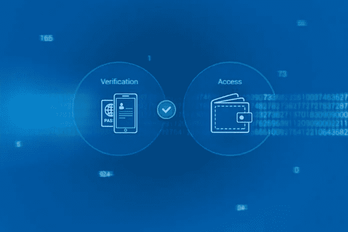

# 虚拟钱包的钥匙能恢复吗？

> 原文：<https://medium.com/hackernoon/can-keys-to-virtual-wallets-be-restored-fba86e210c64>

**数字资产可以继承吗？**

密码术确保了个人数据的完整性和对第三方访问的高度保护，这无疑是适用于人类生活的许多领域的有用特征。提供数据机密性和完整性的方法被广泛实施，加密货币是它们在现代世界中使用的一个很好的例子。在购买任何加密货币后，用户都会创建一个数字钱包，用来存放购买的硬币。每个钱包都有一个唯一的私钥，允许其所有者访问他/她的资金。由系统生成的代码由一长串不重复的数字字符组成，这些字符不能更改。任何人都必须检查数百万甚至数十亿个关于这种数字序列的选项，这使得即使使用特殊程序，黑客攻击也几乎是不可能的。然而，这种保护级别也有不好的一面，这让许多用户感到困惑。如果忘记或丢失了密钥，恢复对虚拟账户的访问几乎是不可能的。

**如何恢复访问比特币或以太坊钱包**

现在最流行的两种加密货币比特币和以太也有这样一个弊端。这些平台的私钥无法恢复。在 Chainalysis crypto 项目的背景下，进行了一项研究，该研究表明，用户已经无法挽回地失去了对他们的区块链钱包的访问权，其中约有 200 亿美元。原因是无法恢复数字帐户的访问代码。但也有一些人成功打破了加密货币应用的这一障碍，并在密钥丢失的情况下帮助恢复对钱包的访问。Simcord 团队已经开发出一种方法来恢复其分散 Bitbon 系统中的访问代码。这是通过客户验证程序实现的，而不会降低其个人数据的保护级别。只要加密社区认为硬币监管是一个缺点，用户因无法恢复访问码而造成的损失将仍然是一个重要问题。通过解决这一重大问题，Bitbon 系统开发商成功地将分散平台管理、与监管机构的互动以及多级个人数据保护结合起来。

**数字钱包与传承**

在 [Bitbon 系统](https://www.bitbon.space/en/home?utm_source=InvestItIn&utm_medium=article)中的用户验证也使得继承数字资产的产权成为可能。这比恢复比特币、以太坊或任何其他加密货币钱包要容易得多。有许多网站提供恢复代码的方法，但是，在现实中，这些方法证明是无效的。私钥是一种复杂的数学机制，几乎不可能猜测或伪造。考虑到许多用户在他们的虚拟账户中有资金的事实，应该注意的是，完成验证过程是确保他们的数字资产的可靠和安全的方式。在 Bitbon 系统中，用户必须提供相关文件，并按照该流程所在国家的法律行事。

经验表明，人们不再认为加密货币监管是坏事。监管当局不会限制数字产业，而是在法律领域促进用户之间的互动。

*原载于 2018 年 8 月 15 日*[*【www.investitin.com*](https://www.investitin.com/can-keys-to-virtual-wallets-be-restored/)*。*