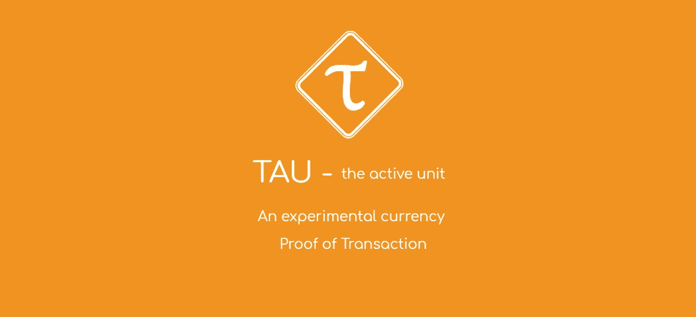

# TAU Exchange 的交易证明能胜过 PoW 和 PoS 吗？

> 原文：<https://medium.com/hackernoon/can-proof-of-transaction-trump-proof-of-work-and-proof-of-stake-55a75361f62d>

每种加密货币都有一种共识机制，即网络同意将哪些交易添加到其分布式账本中。在比特币中，这种机制是有效的证明，但其他加密货币提供了一些令人信服的替代方案。Peercoin 是第一个引入利害关系证明机制的，尽管是在一个混合的工作证明系统中。此后，Lisk 和 EOS(委托股权证明)等加密货币以修改后的形式广泛采用了股权证明，而 NXT 则使用随机版本的股权证明。

在任何情况下，工作证明和利益证明都被证明是非常受欢迎的共识机制，都有强烈的拥护者。现在，一种名为 [**TAU**](https://www.taucoin.io) 的实验性新货币正在提出一种全新类型的共识机制。TAU 将这种独特的解决方案称为交易证明(PoT)。

自 2018 年 10 月 18 日推出以来，自动化 TAU 交易所(TAU-X)将使用户能够无缝交换 TAU 和 BTC。用户可以将 BTC 币或陶币汇入 TAU-X 币池，按照硬币池中硬币总数的比例进行兑换。

每隔 360 个街区就会发生一次硬币交换。对于每次硬币交换，TAU 基金会将向 TAU-X 池中投入 60，000 TAU，用于代币分发。如果还有剩余的 TAU，它们将被带入下一次硬币交换。这将允许 TAU 和 BTC 持有者无缝交换价值，无需任何中间人。

**TAU 的团队决定跳过 ICO，留下来做社区币。**

TAUCOIN 的创始人吴大维在他的博客中解释道:

> ICO 是一种获得资源的既定筹资方法。然而，它并没有为社区做太多的事情。在大多数 ico 中，没有一项诉讼会提交给机构群体。**我认为 coin 成功的最重要因素是社区满意度。**

这种新贵加密货币有可能创造出真正打破模式的东西吗？这种新颖的机制能否在工作证明和利益证明方面都有所改进？让我们来看看。

# 工作证明

首先，让我们回到基础。工作证明(PoW)是最普遍、最广泛采用的共识机制，这在很大程度上要归功于中本聪为加密货币比特币选择了它。在“工作证明”中，区块链上的网络交易由矿工验证，他们竞相解决一个复杂的计算难题。据说谁解决了这个计算难题，谁就开采了这个区块，并获得区块链的加密货币奖励。

工作证明共识机制是最久经考验的共识机制，但它并非没有缺陷。在较小的网络中，容易出现令人恐惧的 [51%攻击](https://learncryptography.com/cryptocurrency/51-attack)，个人或组织控制了大部分网络挖掘能力，允许他们[双重花费](https://en.wikipedia.org/wiki/Double-spending)。此外，由于工作证明对计算能力要求很高，开发人员一直在寻求功耗更低、能效更低的共识机制。

# 利害关系证明

利害关系证明是一种替代的共识机制，旨在比工作证明更有效。股权证明实际上有几种不同的变化，但它通常涉及在一段时间内持有一定数量的硬币，才有资格批准区块。在利益相关者授权证明机制中，利益相关者投票给“代表”来批准区块。尽管这种类型的共识机制的能量消耗少得多，但它鼓励网络用户囤积居奇，以便从批准区块中获取利益。

# 交易证明

TAU 是一种实验性的加密货币，旨在通过一种新的共识来克服工作证明和利益证明的固有问题。TAU 提议，在交易证明区块链中，应将链上交易费用作批准交易的证明。在这种新的共识方法中，区块生成被简单地称为挖掘，就像比特币和其他 PoW 区块链一样，但区块奖励以交易费的形式出现。简而言之，矿工工作是为了收取交易费。

PoT 机制的积极长期经济效益是，它不会像 PoS 那样鼓励囤积硬币，将权力和奖励集中在少数人手中。它也不会招致工作证明的大量计算成本，这意味着它的能耗更低，对环境更好。TAU 区块链上的每一笔交易都被宣传为部分费用和部分投资——鼓励网络内更高水平的金融活动。活动越多，回报越大，而不仅仅是资金越多。

由于这个原因，采矿的财富和利益在网络中更加平均地分配，而不是富人越来越富。**交易证明比 PoW 或 PoS** 更有利于普通人。

TAU 成员也可以选择合作工作，将他们的采矿权力委托给作为采矿俱乐部一部分的采矿领导人。采矿俱乐部为最小的硬币持有者创造了一种方式，从达成区块链共识中获益。

有关提议的交易共识证明机制的更多详情，请参见 [TAU 白皮书](https://www.taucoin.io/whitePaper/TAU%20White%20Paper%20v0.1.pdf)或 [TAU 网站](https://www.taucoin.io/)。