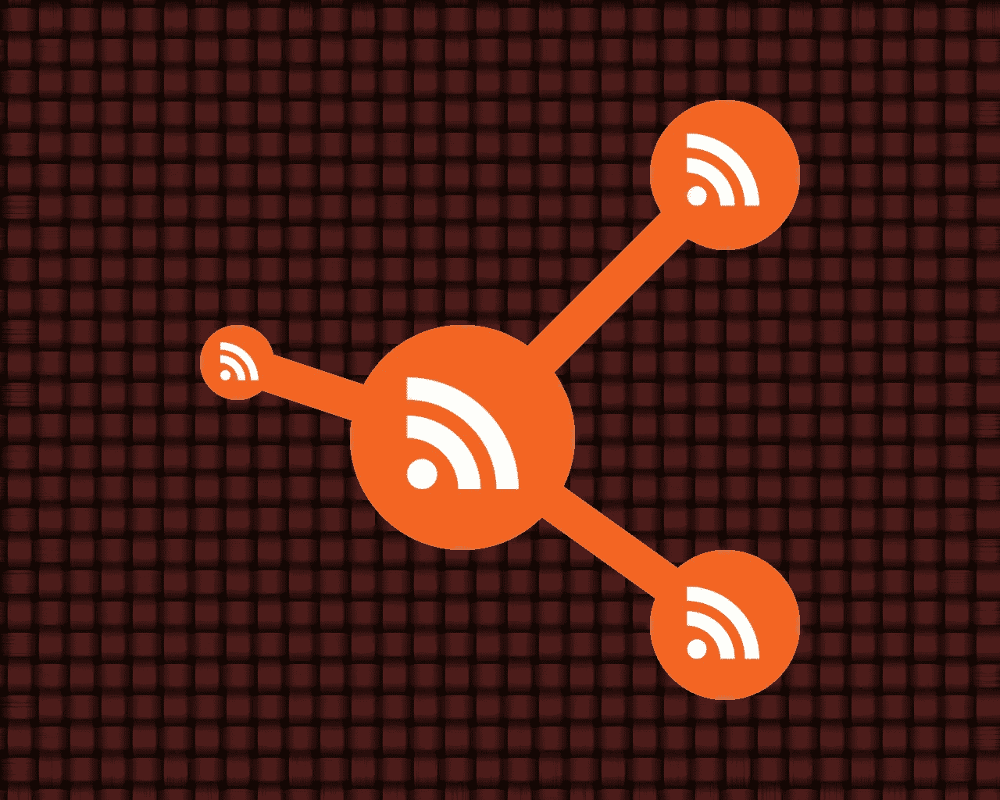

# RSS 能成为社交吗？

> 原文：<https://medium.com/hackernoon/can-rss-become-social-d94acb0152d7>

## 我们用它来跟踪订阅源，但它还有更多潜力！

> 编者按:黑客正午 RSS 是[https://hackernoon.com/feed](https://hackernoon.com/feed)

Image composed using icons by [P.J Onori](https://www.iconfinder.com/icons/118607/share_icon) and [Abhishek Pipalva](https://www.iconfinder.com/icons/1632493/circle_round_icon_rss_icon) on [Iconfinder](https://www.iconfinder.com/)

几周前，在中断了很长时间之后，我又回到了 RSS。

我最后一次停下来是在社交媒体繁荣时期，当时每个人都在脸书，后来又在 Google+上。然后是链接，链接分享，还有*糟糕，我的追随者没有发表任何有趣的东西，所以让我关注这些分享他们最新文章的页面*。

然后，脸书变得毫无意义、爱做广告、注意力持续时间太短，更不用说日益壮大的老大哥了。

那时我发现了 Medium，这里鼓励你写原创作品，每个人都用合理的长度说话。Medium 还具有社交功能，如关注人群、突出段落，甚至在文本的空白处放置评论。(以前没听过？现在就试试吧！).

这很好，但问题是:不是每个人都在中等水平。当然，我喜欢这里的社区，但是我也想读其他的东西。

就在那时，我发现了这篇名为 [*的文章，是 RSS 复兴的时候了*](https://www.wired.com/story/rss-readers-feedly-inoreader-old-reader/) ，于是我决定重新激活我的阅读器。

 [## 是 RSS 复兴的时候了

### 从无处不在的广告追踪器到各种消费平台，再到 YouTube，现代网络不缺恐怖的东西

www.wired.com](https://www.wired.com/story/rss-readers-feedly-inoreader-old-reader/) 

现在我可以找到大多数人错过的所有有趣的花絮，因为算法认为它们不值得观看。

因为，RSS 是这样的:*没有算法*。

RSS 代表“真正简单的联合”(或“丰富的站点摘要，取决于你问谁”)。这个想法真的很简单。您可以使用阅读器应用程序或在线服务来决定想要订阅哪些 RSS 源。

然后，只要你愿意，你就可以查看那个 feed，看到上面发布的所有最新消息。我说的“全部”指的是所有的:每一篇发表的文章都会显示在你的阅读器上——没有算法过滤掉任何东西。

当然，这个*可能会让*有点不知所措。但是通过一点微调和(最重要的！)一个好的用户界面，你可以阅读、收听和观看你最喜欢的网站的内容，而不用担心你背后的算法。

但是这些“RSS 提要”是什么，在哪里可以找到它们呢？好的方面是，几乎每个人都使用 RSS。它已经存在了很长时间，人们可能会认为它已经过时了，但是 RSS 仍然存在。你可以发现它以不引人注目的方式隐藏在主要渠道，比如纽约时报，一直到最小的 WordPress 博客，Tumblr feed，媒体出版物，是的，甚至是 T2 的 Gmail 收件箱。

与人们讨论脸书或 Flipboard 的方式相比，RSS 并不是一件值得谈论的大事。它不是一项服务或一家公司，只是一种基于 XML 的标准格式，用于发布更新。这可能是帮助它存活如此之久的原因。那些使用 RSS 的人发现它很有用，但它是如此的安静和隐蔽，以至于各大平台都不认为它是一个威胁。他们把它包含在服务中，只是因为。

RSS 有一点我很怀念，就是社交方面。像[口袋](https://getpocket.com)这样的过会儿读服务让我不仅可以保存文章，还可以分享(“推荐”)我真正喜欢的文章，或者把它们发送给一个特定的朋友。

一些 RSS 阅读器也有共享服务，但是你仍然需要一个外部服务。如果有一种方法可以使用 RSS 来分享你的 RSS 阅读呢？

我以前从未考虑过这个问题(RSS 是如此的深入人心，以至于没有人会更早考虑它)，但是我在探索 gPodder.net 的时候有了这个想法。

gPodder 是一个桌面播客客户端，所以你可以订阅和管理你听的播客。另一方面，gPodder.net 是一个网络服务，让人们发现播客并与他人分享。

我最近意识到，播客也是 RSS 源。他们有一些额外的元数据，还有一些花哨的应用程序和界面来帮助你“发现”和“订阅”播客，但最终，你所做的只是订阅一个 RSS 提要。您的播客订阅列表是一个 RSS 提要列表。

如果您有 gPodder 兼容软件和 gPodder.net 帐户，您可以在不同设备之间同步您的订阅列表。(因为 gPodder.net 有一个开放的 API，除了 gPodder 本身，还有很多兼容的客户端)。该网站还允许您发布您的播客列表，以便其他人知道您订阅了什么。

但让我兴奋的是最受欢迎的功能。你可以标记你最喜欢的剧集，gPodder.net 可以让你发布收藏夹列表…以 RSS 的形式！

对我来说，gPodder.net 收藏夹列表就像是一个 RSS 版的媒体推荐。(“推荐”是 Medium 对喜欢的文章的称呼，后来他们把它改成了“鼓掌”，让你可以不止一次地这样做)。

因为，关注播客与关注收藏夹列表有点像关注出版物与关注*人*。你跟着播客听最新的剧集；你跟着一个收藏夹列表去听你的*朋友*在听什么。

这给了我一个想法:如果其他功能也这样工作呢？如果您可以订阅某人的重点内容或评论，以及他们写了什么或发表了什么，会怎么样？这不需要成为另一个集中的出版物。这可以是一种分散的分享 feeds 的方式，任何人都可以把他们喜欢的东西作为 RSS 文件发送出去，就像他们一直做的那样。

我们需要让提要和阅读器变得更加智能。feeds 可以判断一个项目是原创的还是重新分享的。feed-reader 应该能够发现重复的内容(我相信有些人已经可以了)，并留下一个便条，说“这个人也推荐了这个”或“那个人在这里发表了评论”。

(当然，如果人们不想要社交内容，他们可以不订阅社交内容，像往常一样继续使用旧的内容)。

已经有一些平台在他们的服务上做了这些。 [Feedly](http://feedly.com/) 告诉你有多少人订阅了一个 feedin reader 让你与朋友分享文章。gPodder 可以让你发布你的收藏列表。

RSS 平台已经开始社会化了。现在，我们以一种 RSS 的方式去社交怎么样？

黑客正午 RSS:[https://hackernoon.com/feed](https://hackernoon.com/feed)