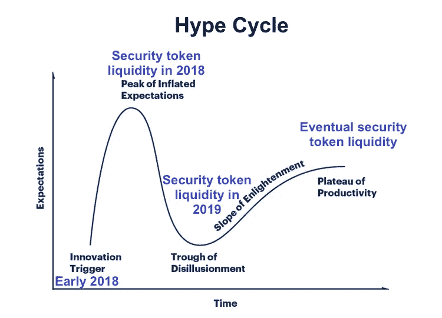
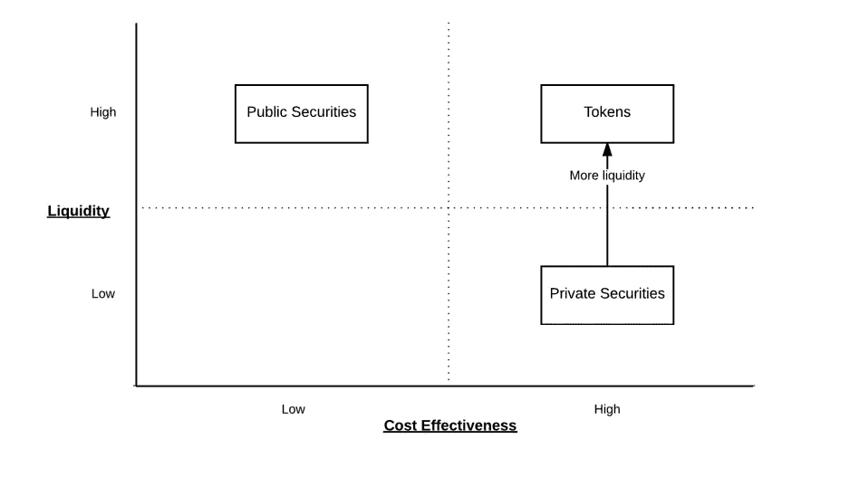

# 证券代币能兑现其流动性承诺吗？

> 原文：<https://medium.com/hackernoon/can-security-tokens-fulfill-their-promise-of-liquidity-938022e53133>

证券代币流动性炒作正如火如荼。我们一次又一次地听到:令牌化让非流动性资产变得具有流动性。但是，证券代币流动性到底有多现实，有多梦幻呢？

我决定从三个主要方面来解决这个问题:

1.  **安全令牌如何创造私人资产流动性？**

**2。今天证券代币的流动性状况如何？**

**3。未来证券代币流动性会是什么样子？**

## TLDR:流动性正在到来，但还没有到来。

# **安全令牌如何创造私有资产流动性？**

流动性是将资产转化为现金的能力。传统上，私人证券的流动性非常差。以房地产为例。即使你一觉醒来就下定决心要卖掉一处房产，你甚至已经准备好了买家，也很可能需要几周甚至几个月才能完成交易。另一方面，你某天早上醒来想卖掉一处房产——你可以在几分钟内完成交易。

令牌化的私人证券可以在二级市场上交易，而没有传统私人证券的管理负担。区块链技术可以创建简化的自动化所有权转让，同时仍然遵守传统的私人证券法。

证券令牌化领域的领先技术公司之一 Harbor 在其白皮书中概述了导致传统私人证券缺乏流动性的当前市场低效状况:

*“私募证券的二级交易往往需要各种中间商(如券商、交易所)。此外，跟踪交易活动的过程是手动的，成本很高，而且发行者防范潜在监管风险的负担很重。这些低效率往往会导致发行者施加交易限制，使得私人证券缺乏流动性。由于缺乏流动性，私人证券的价值被贴现(即“非流动性贴现”)，阻止发行人获得基础资产的全部价值。”* [海港白皮书](https://harbor.com/rtokenwhitepaper.pdf)

他们的白皮书甚至有这样一个漂亮的小图表:

区块链技术有可能通过安全令牌解决这种市场效率低下的问题。证券法规遵从性和监管的整个范围都可以在“链”上发生买方和卖方管辖区内所有必要的反洗钱/KYC 检查、投资者认证检查、合规检查。与经纪交易商、托管人和转账代理等机构的自动集成可以让这些受信任的中介机构在没有任何摩擦的情况下执行其必要的角色。

区块链和安全令牌**创造流动性**，同时保持**的成本效益**，因为它们减少了管理负担，消除了中间商。

另一家安全令牌市场领导者 Securitize 的联合创始人兼总裁洁咪·林恩说:

> “我毫不怀疑未来会被符号化。我不知道什么时候会发生…这只是从根本上更好。”[来源](https://www.crowdfundinsider.com/2018/07/135411-join-the-tokenization-revolution-securitize-offers-a-turnkey-securities-token-platform/)

# **如今证券代币的流动性状况如何？**

很多人承诺了很多事情，但实际数据支持的安全令牌流动性的证据并不真的在这里。

2018 年 6 月 28 日，OpenFinance 是第一个推出的安全令牌交易所。OpenFinance 通过为安全令牌提供合规高效的交易平台，带来了流动性。

在他们首席执行官的一封信中，他宣称:

> *“除了证券代币交易，OpenFinance Network 已经着手从根本上改变发行者和投资者处理另类资产的方式。我们的目标是实现金融民主化，打破我们今天所知的金融市场。”* [来源](/@openfinance/letter-from-the-ceo-openfinance-network-is-now-live-e11e915dbc7d)

OpenFinance 的推出标志着安全令牌生态系统的重大发展，因为它是安全令牌交易在现实世界中测试的开始。虽然 OpenFinance 的初始交易量尚未公布，但他们的首席采购官托马斯·麦金内内在 OpenFinance 电报频道中表示，他们“注册人数比预期多得多”需求是存在的。

虽然 OpenFinace 率先推出，但它绝不是安全令牌交换领域的唯一公司。有一些主要参与者正试图从安全令牌交易中分得一杯羹——这对流动性来说是个好消息。

## **一些荣誉奖:**

[比特币基地:](https://www.coinbase.com/)

你知道，拥有数千万用户的独角兽企业比特币基地在 6 月份宣布，他们打算经营一家受监管的经纪自营商。在他们的总裁首席运营官的博客中，Asiff Hirji he 解释说他们已经获得了一个经纪交易商许可证(B-D)，一个替代交易系统许可证(ATS)，和一个注册投资顾问(RIA)许可证。他们希望与监管机构合作，将现有证券令牌化，带来好处，如:24/7 交易、实时结算和所有权链。

[**未来 Bnk:**](https://bnktothefuture.com/)

BnkToTheFuture 是一家自 2015 年开始交易的交易所。他们在三年多的时间里从来自美国的 50，000 多名合格投资者那里筹集了超过 3 亿美元。他们现在专注于安全令牌。

2018 年 2 月，他们又筹集了 3300 万美元，用于建设一个分散式证券交易所。他们的目标是:推出一个合规驱动、基于区块链、透明的流动性证券二级市场。他们的目标是在 2018 年底推出。查看他们的代币发售页面:【https://bf-token.bnktothefuture.com/ 

[**切罗:**](https://www.tzero.com/)

Overstock.com 的子公司 tZero 正在建立一个安全令牌交易所，旨在以“简单、合规和用户友好的方式”交易安全令牌他们相信，他们将有助于提高美国和海外资本市场的效率和透明度。投资者已经注意到，在 tZero 的证券代币发行中，他们筹集了 1 . 34 亿英镑。此外，2018 年 8 月，中国私募股权公司 GSR Capital 宣布，他们将在 tZero 投资 2.7 亿美元。

[**瑞士证券交易所:**](https://www.six-swiss-exchange.com/index.html)

2018 年 7 月，瑞士六大交易所[宣布了](https://www.six-group.com/en/home/media/releases/2018/20180706-six-digitalexchange.html)他们的最新计划——称为六大数字交易所(SDX)——他们的首要目标是建立一个受监管的交易所平台。他们的目标是:拥有完整的端到端和完全集成的数字资产交易、结算和托管服务。

根据证券交易主管 Thomas Zeeb 的说法，

> “数字空间目前面临着许多关键挑战。这些问题包括缺乏确保官员安全、安保、稳定、透明和问责的监管——所有这些都导致信任的缺乏。挑战不在于资产交易，而在于托管和资产服务，包括资产安全。您是采用有许多子托管人的模式，包括低效的接口和固有的风险，还是选择公认的、受监管的基础设施提供商，该提供商以集成和安全的模式提供链中的所有步骤？我们认为后者具有重要价值。作为瑞士的证券交易所基础设施，我们知道如何构建和运行任务关键型、可扩展、具有系统重要性的服务。”

首批服务将于 2019 年年中推出。

[**纳斯达克(？！):**](https://www.nasdaq.com/)

虽然纳斯达克还没有正式宣布建立他们自己的安全令牌交易所，但这个受监管的交易所已经向其他加密交易所提供了技术。纳斯达克首席执行官 Adena Friedman 在《美国消费者新闻与商业频道》上说:

> *“随着时间的推移，纳斯达克肯定会考虑成为一个加密交易所，”*她继续强调*“我相信数字货币将会继续存在，”*弗莱德曼补充道。至于 crypto 需要多长时间才能成熟，只是时间问题。[来源](https://www.crowdfundinsider.com/2018/04/132595-nasdaq-is-open-to-becoming-a-cryptocurrency-exchange/)

# **未来安全令牌流动性会是什么样子？**

在安全令牌中，一天是一周，一周是一个月，一个月是一年。事情进展得很快…但是，**现在还为时过早。**

证券代币流动性仍然更多的是一种承诺，而不是一个可验证的现实。也就是说，越来越多的主要参与者——想想政府和独角兽——宣布他们打算进入安全令牌领域。越来越多的利益相关者决心让安全令牌成为加密资产与更广泛的金融生态系统之间的桥梁。

目前，安全令牌仍处于萌芽状态。5 年后，它们可能会成为你融资的标准。然而，要做到这一点，需要解决安全令牌生态系统中的主要差距。为了让安全令牌流动性的承诺成为现实，越来越多的人需要站出来解决这些基础设施层面的问题。该行业需要更多在技术、金融和监管方面深谙如何构建安全令牌基础设施的人才。

令人欣慰的是，在这个规模虽小但强大的安全令牌社区中，已经出现了大规模合作的迹象，这是一种合作颠覆一个酝酿了数百年的金融系统的兴奋感。

## IMO:证券代币实现流动性的潜力看起来很大。💡

*关于作者:朱丽安是*[*Leaseum Partners*](https://www.leaseumpartners.com/)*的分析师。Leaseum Partners 是一家总部位于区块链的房地产投资管理公司。*