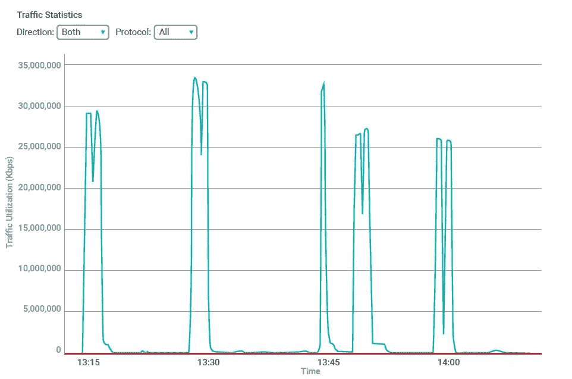
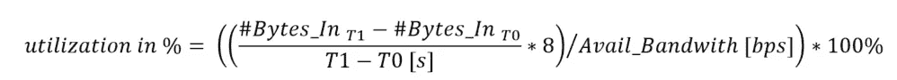
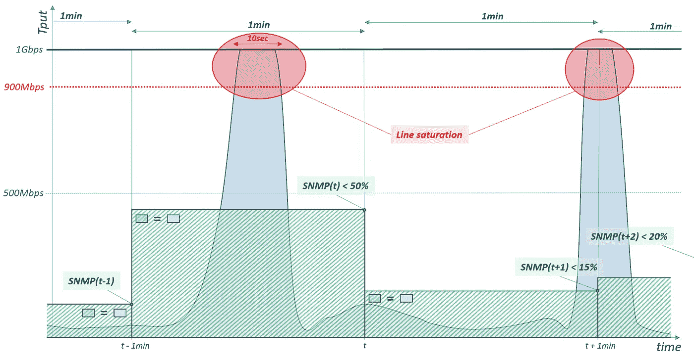
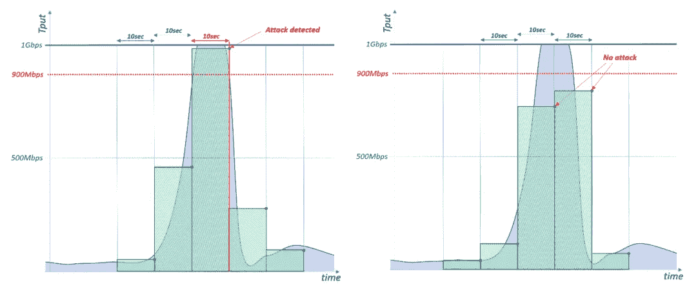

# SNMP(仍然)可以用来检测 DDoS 攻击吗？

> 原文：<https://medium.com/hackernoon/can-snmp-still-be-used-to-detect-ddos-attacks-32b03aa9df8a>

SNMP 是一种互联网标准协议，用于收集 IP 网络上被管理设备的信息。SNMP 成为许多网络中监控设备和连接的健康和资源利用的重要组件。很长一段时间，SNMP 是监控带宽和接口利用率的工具。在这种情况下，它用于检测由组织的互联网连接上的容量 DDoS 攻击引起的线路饱和事件。SNMP 足以作为基于阈值的容量攻击检测的传感器，并允许在[受到攻击](https://www.radware.com/underattack)时通过云清理中心自动重定向互联网流量。通过自动化检测流程，可以显著缩短缓解时间，并通过按需云 DDoS 服务缓解容量攻击。SNMP 对设备配置的影响极小，几乎可以与任何网络设备和供应商一起工作。因此，它非常方便，并获得了自动分流部署的普及。

然而，近年来， [DDoS 攻击](https://security.radware.com/ddos-knowledge-center/ddospedia/ddos-attack/)不断发展，攻击者变得更加自动化。典型的持续高容量洪水攻击已经演变成更有效的[自动攻击活动](https://blog.radware.com/security/2018/02/42-of-organizations-experienced-burst-attacks/)，由不断变化的攻击媒介的重复短时间、高容量爆发组成。这些[突发攻击](https://blog.radware.com/security/2018/02/burst-attack-protection/)，也称为打了就跑的 DDoS，由几个非常短的突发组成，持续时间只有几秒钟，间隔随机。

# 使用 SNMP 监控带宽利用率

SNMP 协议提供对管理信息库(MIB)中收集的(网络)设备系统计数器的访问。MIB 包含一组描述可访问对象的分层组织的对象标识符(OID)。接口计数器在接口 MIB (IF-MIB)中被描述为进出的八位字节(字节)数。这些计数器可以是 32 位(ifInOctets)或 64 位(ifHCInOctets)，当它们达到最大整数范围时会翻转。对于接口带宽监控，定期收集这些字节计数器，并在一段时间内取平均值。查询接口计数器的典型时间间隔以分钟为单位。

为了计算 T1 时刻的入口带宽利用率，从 T1 时刻的计数器中减去 T0 时刻的字节数，得出接口在采样周期(T1-T0)内接收的字节数。将这个数字除以以秒为单位的采样周期，并将其归一化为可用带宽或以每秒位数(bps)表示的接口速度，就可以计算出 T1 的带宽利用率。下面的公式说明了这一点:

# 规避基于 SNMP 的阈值检测

利用突发攻击，攻击者找到了规避基于 SNMP 的检测系统的方法。不是通过限制流量水平或流量，而是通过缩短攻击持续时间。

假设一台路由器连接的下行互联网容量为 1Gbps。SNMP 检测器配置有一分钟的定期采样间隔，当总入口带宽超过 900Mbps (90%利用率)时，它将根据阈值检测容量攻击事件。现在考虑一个单个突发，作为更大的突发攻击的一部分，在完全饱和水平(100%利用率)下持续 10 秒钟。下图说明了这种情况。

蓝色区域对应实际入口带宽利用率，而绿色区域代表 SNMP 测量的带宽利用率。对于每个轮询间隔，蓝色曲线下的面积和绿线下的面积相等。

从图中可以清楚地看出，攻击突发不会被检测为饱和级别事件。此攻击(1Gbps 持续 10 秒)对 SNMP 计算带宽的净影响为 10 秒/60 秒* 1Gbps = 167Mbps。很明显，SNMP 监控的级别没有接近之前定义的 900Mbps 阈值。

缩短 SNMP 的轮询间隔(更高的采样率)将对检测灵敏度产生积极影响。但是，在系统能够充分检测到 10 秒的小突发之前，我们需要将轮询周期减少多少呢？

为了便于说明，让我们缩短上一个示例的轮询周期，以匹配攻击本身的持续时间，即 10 秒。从下面的两幅图中，我们可以清楚地看到，如果大部分突发发生在轮询间隔内，我们将检测到饱和级别事件。但是，如果超过 10%的攻击发生在轮询周期之外，则在该周期内不会被检测到。您可能会注意到，如果只有 10%的攻击在采样周期之外，这意味着 90%的攻击将在随后的采样周期内发生，因此我们将在下一次轮询中检测到 90%的饱和。如果超过 10%,在极端情况下为 50%,与轮询周期重叠，如下图所示，将不会检测到攻击。

那么，SNMP 不遗漏攻击的适当轮询周期是多长呢？

# 将奈奎斯特应用于 SNMP 采样

奈奎斯特采样定理是数字信号处理领域的基础。奈奎斯特采样定理指出:

> *“如果波形的采样速度是其最高频率分量的两倍，则可以对带宽受限的连续时间信号进行采样，并从其样本中完美地重建信号。”*

或者换句话说:如果你想把模拟信号转换成数字信号，采样周期需要是模拟信号中最高频率分量周期的一半。

现在，将传入流量曲线(上图中的蓝色区域)视为连续信号，我们希望将其转换为采样表示，这种表示有助于我们检测突发攻击。我们对波的实际形式不感兴趣，仅仅能够确定地检测它的水平。因此，构成波形的高阶频率可以安全地忽略，我们想要检测的波形周期可以视为上升沿和下降沿之间的时间。在这种情况下，我们认为攻击的持续时间是我们想要重建的信号中最高频率成分的周期。鉴于此，SNMP 的采样周期应该是最小攻击突发持续时间的一半。换句话说:

> *使用 SNMP 可以检测到的最小突发攻击是其轮询周期的两倍。*

在上面的例子中，为了 100%确定地检测 10 秒钟的攻击爆发，我们需要提高 SNMP 的轮询速率，以便每 5 秒钟收集一个新样本。

# 走在坏人的前面

每五秒钟从云中轮询一次可能不是构建攻击检测的方式。即使有，也仅限于检测最小突发不超过 10 秒的攻击。当突发时间为六秒或更短时，该怎么办？SNMP 轮询方法根本无法扩展到突发攻击的检测，我们需要从拉动分析转向基于事件的实时方法。

带有阈值检测的 On-box RMON 规则生成 SNMP 陷阱，提供了一种替代方案，而无需引入新的技术或协议。但是，检测和触发 SNMP 陷阱的可能性取决于您设备的功能。也就是说，大多数网络设备制造商提供的性能管理和流分析远远超过了 SNMP 的可能性。现在是时候考虑这些替代方案，实现攻击检测的机上或机下自动化，并通过对云服务的 API 调用触发流量重定向。

已经过实战测试且随时可用的“自行检测”的现成替代方案是[混合 DDoS](https://www.radware.com/solutions/cloud-automation/) 和基于 Netflow 的监控。[混合 DDoS 防护](https://blog.radware.com/security/2018/04/choosing-the-right-ddos-solution-hybrid-protection/)涵盖的范围远远不止容量和突发攻击检测，还提供了最高级别的集成和检测可信度，并向云发送实时消息。

随着攻击者越来越成熟，他们的攻击越来越自动化和复杂，我们需要继续发展我们的解决方案和架构，以保持领先地位。

*原载于 2018 年 8 月 9 日*[*blog.radware.com*](https://blog.radware.com/security/2018/08/snmp-ddos-attack-detection/)*。*