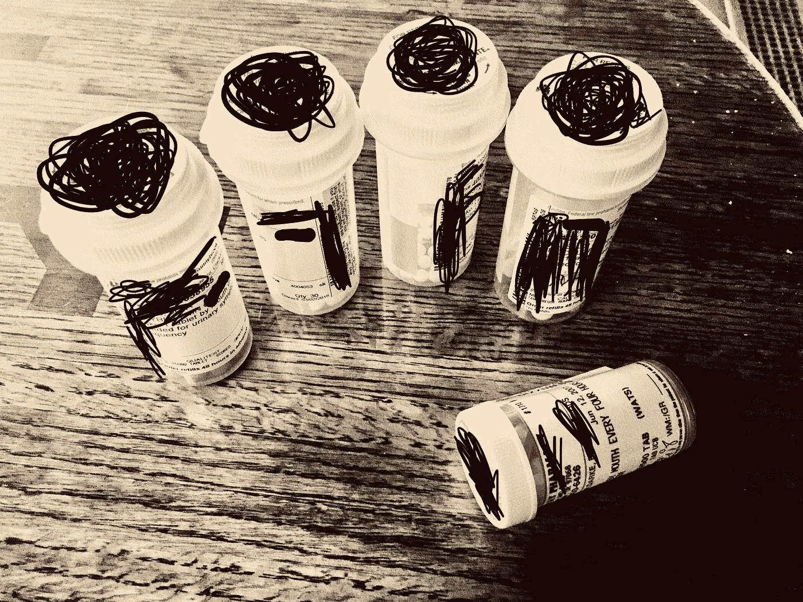

# VR 能解决阿片类药物的流行吗？

> 原文：<https://medium.com/hackernoon/can-vr-tackle-the-opioid-epidemic-ed9b009c225>

> “一年前，我亲眼观察到，经验丰富的临床专业人士在普罗维登斯的一个会议室里极度恐惧，害怕向前迈出哪怕一步。那为什么呢？为什么会这样？是不是有什么危险的东西，在他们面前有热煤？不，一点也不。
> 
> 他们正在享受虚拟现实体验，这种体验有效地控制了他们的大脑，并使他们相信，如果他们迈出这一步，他们就会从 30 层的高楼上摔下来。他们中的许多人实际上被锁了起来，即使是在平地上，他们也无法迈出那一步。——[达伦·康纳，普罗维登斯健康专家](https://www.facebook.com/DesignReality/videos/1803941073241212/?q=design%20reality%20-%20pdx%27s%20immersive%20tech%20community)

# 这是真的:

虚拟现实做了这件神奇的事情[，它把人们带走，让他们相信他们正在做别的事情](https://www.youtube.com/watch?v=ru8pLuxLSAg&t=166s)。当 HMD 完全覆盖佩戴者的头部并重定向他们的感官时，人们不能责怪身体说服大脑“我在这里”

为什么这在上下文中很重要？嗯，很简单。我们中的许多人在一生中都会生病或受伤，可以理解的是，这些伤害和疾病会伴随着一段时间的剧烈或虚弱的疼痛。人类想对衰弱性疼痛做些什么？

假设你是人类，你直接知道我在说什么——我们想让*尽快摆脱那种痛苦，这样我们就可以回到我们富有成效的生活中的重要事情上。*

## 不好意思，什么流行病？

当我 15 岁需要拔掉我的智齿时，我非常痛苦，结果我花了 5 天时间躺在我父母楼上的沙发上，因为服用维柯丁而昏昏欲睡。这是完全正常的，[问问任何拔过智齿的人](https://www.colgate.com/en-us/oral-health/conditions/wisdom-teeth/what-is-the-recovery-time-after-wisdom-teeth-removal-0913)。

阿片类药物，如维柯丁，是将患者从痛苦中转移出来的制药行业标准。不幸的是，使它们高效的品质也使它们令人痛苦地上瘾。

这类止痛药因对两种合法产品([吗啡、羟考酮、氢可酮等)的全球高成瘾率而臭名昭著。](https://www.naabt.org/faq_answers.cfm?ID=4))和非法产品(海洛因)，现在是罪魁祸首[少至四分之一的患者](http://www.narconon-suncoast.org/blog/why-are-so-many-people-addicted-to-opiates.html)在更长的时间内被开出类似的药物。

一般来说，人们将成瘾依赖从一种阿片类药物转移到另一种阿片类药物的情况并不少见。结果，西方社会[默默地忍受着阿片类药物的流行](http://www.independent.co.uk/news/world/americas/heroin-overdose-parents-car-photo-boy-finds-new-home-ohio-a7307391.html)，而这种流行只会随着时间的推移而升级。

# 那么，虚拟现实又与什么联系在一起呢？

嗯，毒品可能不会很快消失。[有太多的钱在这条线上](https://www.fool.com/investing/2016/07/31/12-big-pharma-stats-that-will-blow-you-away.aspx)，我还没有大胆到相信我可以通过做出诸如“虚拟现实将绝对、完全取代阿片类药物”这样的愚蠢声明来破解这个难题或者类似的。

坦白地说，这甚至不是本文的主题。而是让我们回到 VR 的吸引力的根本:体验。

## 想象一下:

镜头遮住你的眼睛，一副舒适的耳机盖住你的耳朵，最好你拿着某种“手”控制器，如 Rift 的[触摸](https://www.youtube.com/watch?v=p1MpU2IVsk0)系统或 Vive 的[魔杖](https://www.roadtovr.com/ces-2018-htc-vive-pro-controllers-updated-wand-design-not-valve-knuckles/)。你正在做一些感觉既真实又非常奇妙的事情。也许你正在通过 [Oculus 的第一次接触](https://www.oculus.com/experiences/rift/1217155751659625/)应用程序游览，你发现物体对你对它们的处理有逻辑反应，或者[也许你第一次体验零重力](https://www.youtube.com/watch?v=2pmV2mwAV9k)，你向下看，你*看到*你的新身体。

然后咔嚓一声；你在那里。或者至少你认同自己就在那里，这使得这些经历在事后看起来如此真实。这不仅仅是屏幕上的一个角色——不，这是你。

你的大脑不再停留在一个痛苦的人的身体里，而仅仅依靠药物来度过痛苦。你确信你是以一个不痛苦的人的身份去旅行的，并且当你在那里的时候，你有一个可信的存在。

*这是一次地狱般的旅行。你迫不及待地想回去。*

## 天佑

某些医疗从业者开始赶上虚拟现实中的真实的 T4。

在普罗维登斯的研究中，包括管理第一手技术的治疗应用程序“酷！”和“发光！”对于一个相对较小的 50 名以下参与者的样本来说，在探索虚拟现实后，飞行员患者的静息痛减少了 29%,比他们缺乏虚拟现实的同行多。

诚然，数据受到样本量的限制，但我们观察到的是安慰剂效应在起作用。这里有一个结论:我们知道虚拟现实对疼痛有所帮助，而且“一些东西”对那些受影响的人来说是真实的。

PORTLAND, OR — FEB 26, 2018: [Joshua Young (Design Reality PDX) prepares to transition after Raina Tamakawa & Darren Connor (Providence Health) present their findings to a crowd of VR enthusiasts at New Relic’s office in Portland, OR on February 26, 2018](https://impactflow.com/event/changing-lives-emerging-applications-in-health-care-6935) (Gabriel Moss)

## 同样，这又在哪里转化为阿片类药物的流行呢？

如果瘾君子开始戒除他们对阿片类药物的渴望，因为他们可以将他们的生理依赖转移到一些东西上，这些东西既可以完全将他们从自己的大脑中移除，又可以提供长期的健康益处，会怎么样？

如果这种生理依赖在某些患者身上从未开始，因为由于虚拟现实治疗在改善其预后方面的有效性，他们被开了较小剂量的阿片类药物，会怎么样？

目前，很难判断是否/何时会以这样的规模进行虚拟现实治疗。然而，我们**所知道的是，这种虚拟现实的迭代仍然年轻，相邻的行业有足够的空间与它一起成长和学习。**

有一天，这项技术的出现可能会让你的朋友或爱人的世界变得不同。这才是重点，不是吗？