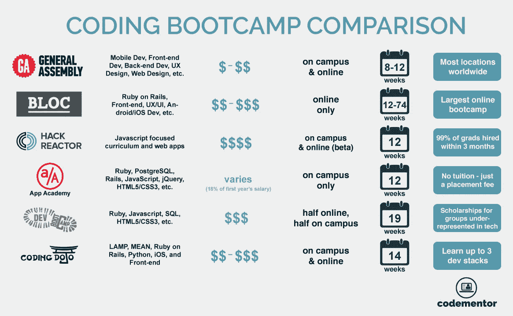

# 不到 100 美元能学会编码吗？

> 原文：<https://medium.com/hackernoon/can-you-learn-to-code-for-less-than-100-da06576e2bb5>

## 事实上，是的

不到 100 美元真的能学会编码吗？你当然可以。

这不仅可行，而且我认为明智地花 100 美元(或更少)可以教会你如何比训练营或昂贵的课程更好地编程。

让我解释一下…

网上有大量价格不等的教程和课程。有些信息丰富，值得你花时间，但许多格式很差，是浪费你时间的**。**

我们不要忘记，还有*吨**[编程](https://hackernoon.com/tagged/programming)语言可供选择…*

**

*那么，如何挑选正确的课程或教程呢？关键是要对自己非常诚实和坦率…*

> ***人们在学习如何编码时最常犯的错误是关注错误的事情。***

*一个朋友告诉我的次数我都数不清了，*

> *“我想学习编码，但不知道从哪里开始。”*

*这个问题太普遍太真实了。**你想学习编码，却不知道从何下手。***

*在网上课程购物时，你如何确保你的钱花得最值？*

*许多人报名参加约**、10，000 美元**的训练营**、**或约**~ 400 美元**的在线课程，成为一名百事通。也就是 boot camp/课程会教你一点点 [JavaScript](https://hackernoon.com/tagged/javascript) ，一点点 NodeJS，一点点 MySQL，可能还会撒一点 REST API 的工作。*

*这里有一个问题:*

> *你将离开这样的训练营/课程，成为一无是处的专家，但却接触到软件的所有组件。你会损失几百甚至几千美元。*

***“那又怎样？理解软件开发的所有部分是很重要的。当然是了。但是让我告诉你一些事情…***

*当你得到第一份编码工作时，你很可能*而不是*使用你学到的所有技能，并且你很可能*而不是*在技术栈的所有部分工作。*

*相反，你将专注于堆栈的**一个**部分，而暂时忘记其余部分。几周或几个月后，您可能会被要求处理堆栈的另一部分。这是你学习的主要部分。当你受到压力，需要交付时，就会发生这种情况。*

*那么，这一切与花不到 100 美元学习编码有什么关系呢？*

*答案在于明确你想学习技术堆栈的哪一部分。*

> *当你不知道自己想要什么的时候，你更有可能在那些对你的进步没有帮助的课程上花大钱。*

*当“我想学习编码”的想法突然出现时，问自己以下问题:*

> *什么软件让我兴奋？*

*通过回答这个问题，你会立刻知道应该关注什么！因此，您也将避免新开发人员最常犯的错误。*

*所以，假设你想学习软件的 UI/UX。很好——专注于一门教你 CSS 和 HTML 的课程。*

**

***“好吧，但是怎么做？”**……你问。*

*我决定用我的话来投资。以下是我在 Udemy 上快速搜索后找到的几个便宜且信息丰富的课程:*

1.  *[用 HTML5 和 CSS3 构建反应灵敏的真实世界网站](https://www.udemy.com/design-and-develop-a-killer-website-with-html5-and-css3/)*

**

*注意两件事:*

*   *价格——在本文发表时，它的定价为 17.99 加元，相当于~ **$14 美元***
*   *4.7 星级及以上**7.3 万学生**入学*

*为了证明这不是侥幸，我找到了另一条路线:*

*[2。用 HTML & CSS](https://www.udemy.com/build-website-scratch/) 从头开始构建网站*

**

*注意两件事:*

*   *价格—在本文发表时，它的定价为 17.99 加元，相当于~ **$14 美元***
*   *4.7 星级及以上**5.3 万学生**入学*

> *这是我在 **3 分钟**的搜索后发现的。这两个视频都有很好的收视率，公平的价格，以及大量满意的学生。*
> 
> *想象一下，如果你多花几分钟时间搜索一些非常具体的东西，而不是一些普通的东西，你会对结果感到惊讶。*

*如果你想要免费的东西，YouTube 是你的朋友。例如，在 YouTube 上快速搜索，我发现:*

1.  *[建立一个具有响应式布局的 HTML5 网站](https://www.youtube.com/watch?v=Wm6CUkswsNw)*
2.  *[HTML 和 CSS 初学者教程|学习 HTML 和 CSS 的终极指南](https://www.youtube.com/watch?v=y3UH2gAhwPI)*

*同样，这是我经过一分钟的搜索后发现的。这两个视频都有很高的喜欢率和不喜欢率，深受公众欢迎。*

*而且谁说你仅限于 Udemy 和 YouTube？你有整个互联网来寻找内容！但是这只有在你知道你在找什么的时候才有用。*

*所以我找到的这些资源是针对 HTML 和 CSS 的。但是如果你想学 JavaScript 呢？*

*好吧，我留给你一个挑战。我给你 20 分钟。关于 JavaScript，你具体想学什么？棱角分明？反应？只是一般的 JavaScript？*

*一旦你有了这些问题的答案，就开始搜索吧。当你发现一个有价值的资源时，在这篇文章上留下你的发现吧！我向你保证，**你会对你发现的东西感到惊喜。***

# *主要外卖…*

> *不要让不确定性左右你的购买决定，对自己诚实一点，20 分钟的定制研究可以为你节省数百甚至数千美元。*

*学习编码应该不贵，幸运的是，它*不*贵。你需要清楚你想学什么，并花几分钟时间对特定主题进行量身定制的研究。*

# *那么，这些课程会让我成为一名优秀的开发者吗？*

*这是一个关键问题。*

*仅仅因为你几乎没有花任何钱学习如何编码，你不会立刻成为一名优秀的开发人员。Udemy 上的一门课程，或者 YouTube 上的一系列视频可以教给你的东西，如果不比一个训练营或学位所能教给你的更多的话，但是你仍然需要做一件至关重要的事情来成为一名优秀的开发人员…*

***练习。***

*在网上发现价值并不意味着你不必花时间磨练你的手艺。*

> *所以请记住，没有什么可以代替传统的好习惯。*

*我希望这篇文章对你有所帮助。如果你看到了，请转发、分享和评论。另外**轻击👏50 次(或者更少，如果你想的话)。***

*哦，关于 100 美元教育的话题，我正在做一件小事。这是一个独家的、内容丰富的社区，教你如何在花费不到 100 美元的情况下建立一个持久的科技职业生涯。叫做 [100 美元教育](https://100dollareducation.com)。如果你对此感兴趣，你可以在这里申请成为会员！*

*不管怎样，如果你能走到这一步，我感谢你。回头见。*