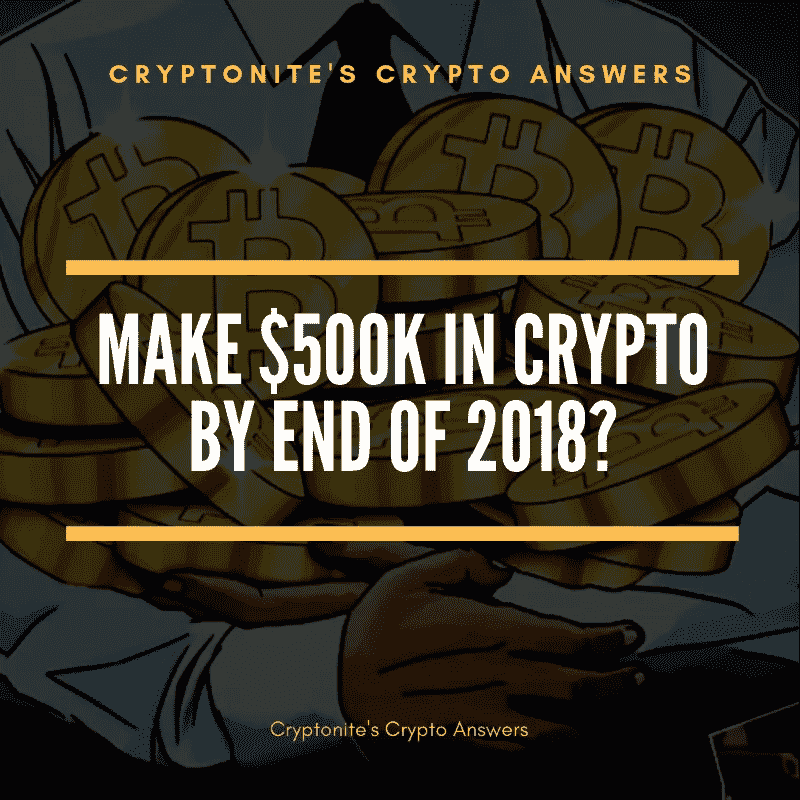

# 你能用 1 万美元投资 cryptocurency 一年赚 50 万美元吗？

> 原文：<https://medium.com/hackernoon/can-you-make-500k-in-one-year-from-investing-in-cryptocurency-with-10k-8420451f65ac>

## 仅投资 1 万美元，一年内从加密货币中赚 50 万美元可能吗？

现在我们是在九月，所以如果你开始投资，你只有 3 个月的时间来实现你的目标。

现在，仅在 3 个月内从 1 万美元的投资中获得 50 万美元的回报是非常不可能的，尤其是在我们目前经历的熊市中。

这里有一些例子来帮助我阐明我的观点。

去年 2017 年，比特币增长超过 28 倍，目前是有史以来第二大“比特币泡沫”。在最高的“泡沫”时期，比特币在 2011 年增长了 100 多倍。

比特币在 2017 年增长了 28 倍，从 900 美元增长到 2 万美元。那是在牛市中，仍然没有达到 50 倍的增长。

因此，在不到一年的时间里增长 50 倍的可能性非常小，尤其是对于像比特币这样历史更久的加密货币。

**但是山寨币呢？**

现在事情变得有趣了。2017 年，Ripple (XRP)的增长率超过 35，000%，约为 350 倍。

因此，如果你在 2017 年初投资了 Ripple，你可能已经超过了你的目标。

另一种在 2017 年增长超过 50 倍的加密货币是恒星流明(XLM)。Stellar 从 0.002 美元增长到 0.23 美元，增长了 100 多倍。

这两种加密货币的爆炸式增长是像**这样的基于现金的交易所将它们作为投资选项的一个原因。**

**但是，我们需要记住的一件事是，2017 年是加密货币非常乐观的一年。目前，我们正处于一个漫长的熊市，这降低了大幅上涨的可能性。**

**与此同时，许多加密货币可以打折购买。在我看来，这是现在买入的最佳时机。**

**对于我们当前的市场来说，更现实的策略是识别在未来 5 年内有 100 倍增长潜力的加密货币。**

**是的，五年了。这将允许你尽可能多地积累加密货币，并利用任何额外的增长，而不是在一年后卖掉所有东西。**

**比特币花了近 10 年时间才达到 2 万美元，获利最多的人是那些在无人感兴趣时早期投资的人。**

**要像这些早期投资者一样，你需要知道如何发现具有 100 倍增长潜力的加密货币。**

**问题是，如果你知道哪些加密货币可能会有 100 倍的增长，你就不会在 Quora 上问了，你应该已经知道了。**

**为了有最好的机会发现具有高增长潜力的加密货币，你需要做一些认真的研究。**

****最终想法****

**到 2018 年底，你从 1 万美元的投资中赚到 50 万美元的可能性非常小。事实上，这几乎是不可能的，除非你真的很幸运，投资一个不起眼的 altcoin，一夜之间就能上天。**

**我建议一个不同的策略，使用这个在线指南研究一些好的加密货币: [**如何在加密货币中获利——Medium**](/@cryptonitecj900/how-to-profit-in-cryptocurrency-6a0728f9397c)**。****

**接下来，瞄准未来 5 年的投资，并紧紧抓住不放。**

## **我的“Cryptonites Crypto Answers”系列的一部分，摘自我在 Quora 上回答的问题。**