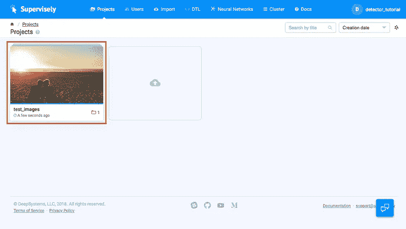

# 你能在 10 分钟内解决一个人的检测任务吗？

> 原文：<https://medium.com/hackernoon/can-you-solve-a-person-detection-task-in-10-minutes-74fba061194c>

剧透:当然可以！💪

# 动机

人物检测任务真的无处不在。如果你从事计算机视觉领域的工作，很可能你以前也面临过这个任务。你可以采取几乎任何行业和个人检测将出现。这些例子是:

*   **自驾。**识别道路场景中的行人
*   **零售。**分析超市内顾客的行为
*   **时尚。**识别特定品牌和穿着它们的人
*   **安全。限制某些人进入某些地方**
*   **手机应用。**找到一个人，应用酷滤镜

但是今天的任务有多难呢？

嗯，5 年前，主流解决方案是使用 opencv 构建的，基于 Haar-like 特征之上的级联分类器。这些检测器需要时间和精力来建造，而且以今天的标准来看，检测质量并不是很好。

在深度学习时代，特征工程和简单分类器的结合被抛在脑后(至少在涉及计算机视觉时)，神经网络主导了该领域。

实际上，在 github 上有很多人检测的实现。比如看一下[这个](https://github.com/rbgirshick/py-faster-rcnn)和[这个](https://github.com/tensorflow/models/tree/master/research/object_detection)回购。

尽管如此，即使在今天，仍有公司不断联系我们( [DeepSystems.ai](https://deepsystems.ai/) )，要求我们帮助他们完成这项特殊的任务。希望在读完这篇博文后，您会发现运行 person detector 来完成您的任务是可行的。

# 让我们选择工具

我们将使用 [Supervise.ly 平台](https://supervise.ly/)来处理人员检测任务。除了促销之外，还有以下原因:

*   我们需要 5 分钟来得到初始解
*   无需编写代码并在各种开发工具之间来回切换
*   我们开箱即用:一堆预先训练好的模型、可视化和部署

# 如何完成这项任务

实际上，我们有两种方法来解决这个任务:(1)使用预先训练的模型或者(2)训练我们自己的人检测器。

有了 Supervise.ly，你可以两种方式都做，但是，为了简单起见，我们将专注于第一种——我们将使用基于 [NASNet 的更快的 R-CNN 模型，它是在 COCO 数据集](https://github.com/tensorflow/models/blob/master/research/object_detection/g3doc/detection_model_zoo.md)上预先训练的。

因此，我们的高级计划如下:

**一、设置人员探测器模型**

**二世。检测图像上的人物以检查质量**

**三世。为生产应用部署模型**

让我们开始…

# 逐步指南

首先我们需要去 [Supervise.ly](https://supervise.ly/) 网站，唱进去。然后，只需遵循下面的逐步指南。

## **一、设置人员探测器模型**

设置检测机模型很容易。为此，我们需要将您的 GPU 机器连接到 Supervise.ly，然后选择一个预先训练好的模型。

**1。将您的 GPU 机器连接到 Supervise.ly 平台**


(1) click “connect your first node” button (2) run selected command in your terminal (3) check that your computer is connected to the platform

转到群集页面，单击“连接您的第一个节点”按钮(1)。然后，您将看到以下窗口(2)。只需复制命令并在您的终端中执行它。Python 代理将安装在您的机器上，并显示在可用节点列表中(3)。

**2。选择一个预先训练好的模型**


(1) go to Model Zoo page (2) pick your detector (3) check “My Models” list

转到“神经网络”->“模型动物园”页面(1)。你会看到一堆预先训练好的模型，用于语义分割和对象检测任务。如果您将光标悬停在“FasterRCNN NasNet”上，您将看到“添加型号”按钮(2)。点击后，该型号将出现在“我的型号”列表中(3)。

现在，更快的 R-CNN 探测器已经准备好了。下一步是检查它如何适用于您的图像。

## 二。检测图像上的人物以检查质量

在将模型部署为 API 之前，最好将神经网络预测可视化，以了解它是否符合您的要求。超级简单:拖放你的图片，点击几下就可以运行推理过程。

**1。导入您的图像**



(1) go to “Import”->”Upload” page and drag&drop your images (2) define project name and start import (3) check “Projects” page

转到导入页面，拖放包含测试图像的文件夹(1)。命名保存图像的项目。在我们的例子中，项目名称是“test_images”。然后单击开始导入按钮(2)。导入过程完成后，转到“项目”页面，检查您的图像项目已创建(3)。

**2。运行推理过程**


(1) click “Test” button (2) choose a project (3) define inference parameters

现在让我们在您的图像上测试我们的人员检测器。转到“我的车型”页面，点击“测试”按钮(1)。然后你选择一个带有图像的项目来探测人物。在我们的例子中，它是“test_images”项目，然后单击“Next”按钮(2)。然后，我们应该指定存储检测结果的项目的名称。在我们的例子中，它是“inf_test_images”项目(3)。

剩下的唯一事情就是选择一个推理模式。在列表中选择“推理 _ 完整 _ 图像”。最后一步是替换该行:

```
“save_classes”: “__all__”,
```

使用这一行:

```
“save_classes”: [“person”],
```

然后，点击“开始推理”按钮。

**3。检查结果**


(1) click to the resulting project (2) look at predictions

推理过程完成后，您将在项目页面(1)上看到“inf_test_images”。要直观地检查结果(2)，请单击“inf_test_images”项目，然后单击该项目中的数据集。

既然我们已经理解了我们的模型满足需求，那么让我们进入最后一步——模型部署。

## 三。为生产应用程序部署模型

在大多数情况下，一旦我们对检测质量感到满意，我们就需要通过 API 使用定制环境中的模型。下面的说明描述了如何为生产应用程序部署模型。

**1。部署人员检测模型**


(1) click “Deploy” button (2) specify and submit deployment parameters (3) make sure the task is completed

转到“我的型号”页面，然后单击“部署”按钮(1)。然后，在指定目标 GPU 机器和设备后，单击“提交”按钮(2)。结果，一个新的任务将被创建，并且，一旦它被完成(3)您可以发送 API 请求到您的人员检测模型。

**2。发送 API 请求**


(1) click “Deploy API Info” item (2) get deployment information

在调用 API 之前，我们需要获取令牌和 url 信息。为此，在“集群->任务”页面上，从上下文菜单(1)中单击“部署 API 信息”。在下一页，您将看到通过 API (2)使用我们的检测模型所需的所有信息。

更具体地说，在这里②我们可以看到:

1.  **API 令牌。***rsiytrsbsye 5 bixryycfbljf 13 jqvq 4 neeuuxx 2 OE 1 sdkwgdpmerjz 0 thekljadilv 8 cqrosxmvmirjvoof 025 mr8 XB 88 fesrdbbeaypk L2 mwj 1 maztj 2 fiden 4 umnp*
2.  **网址。**https://app . supervise . ly/public/API/v1/models/435/deploy/upload

3.**用法举例。**

很明显，但我还是要说，你的 API 令牌和 URL 与上面的不同。

例如，假设您有“dl_heroes.jpg”图像


Yann LeCun, Geoffrey Hinton, Yoshua Bengio, Andrew Ng

因此，如果您在终端中运行以下命令:

```
curl -XPOST -H ‘X-API-KEY: **YourToken**’ -F ‘image=[@](http://twitter.com/mypicture)**dl_heroes.jpg**;type=image/jpeg’ **YourUrl**
```

然后，Supervise.ly 会以 json 格式给你回检测结果:

```
[{"tags":[],"description":"","objects":[{"bitmap":{"origin":[],"np":[]},"type":"rectangle","classTitle":"person","description":"","tags":[],"points":{"exterior":[[343,87],[493,375]],"interior":[]},"score":0.999502420425415},{"bitmap":{"origin":[],"np":[]},"type":"rectangle","classTitle":"person","description":"","tags":[],"points":{"exterior":[[0,94],[149,375]],"interior":[]},"score":0.9994213581085205},{"bitmap":{"origin":[],"np":[]},"type":"rectangle","classTitle":"person","description":"","tags":[],"points":{"exterior":[[247,96],[367,377]],"interior":[]},"score":0.9987866282463074},{"bitmap":{"origin":[],"np":[]},"type":"rectangle","classTitle":"person","description":"","tags":[],"points":{"exterior":[[138,96],[256,378]],"interior":[]},"score":0.99868243932724},{"bitmap":{"origin":[],"np":[]},"type":"rectangle","classTitle":"person","description":"","tags":[],"points":{"exterior":[[100,133],[129,177]],"interior":[]},"score":0.9136056900024414}],"size":{"width":506,"height":380}}]
```

上面的 Json 对应于所有检测到的对象，包括坐标和置信度。可视化之后，我们得到


Visualization of predictions returned by API

为了使生活更加简单，我们提供了一个 [python 笔记本](https://github.com/supervisely/supervisely/blob/master/tutorials/01_person_detector_api/src/deploy_faster-rcnn_as_api.ipynb)，它实现 API 调用并可视化检测结果。我们鼓励你玩它！


Jupyter notebook (not much code here)

# 回到主要问题

回想一下题目中的问题“你能在 10 分钟内解决一个人的检测任务吗？”

*   快速回答是肯定的，按照上面的说明做就行了。
*   更周到的回答是“看情况”，魔鬼一如既往地在细节中。

同样，需要进行人员检测的应用程序数量巨大。以下是导致头痛的三个最常见的因素:

1.  **硬件限制**。对于一些应用程序来说，使用板载高端 GPU 的台式计算机是可以的。其他应用程序应该可以在手机或机器人内部运行。在这种情况下，我们需要使用小的&快速神经网络，代价是模型精度。
2.  **实时需求**。例如，在自动驾驶行业，软件应该实时工作。在这种情况下，最新的 GPU 仍然不够强大，无法运行更快的 R-CNN 的最新实现。因此，我们不得不再次牺牲准确性，选择更简单的模型。
3.  **具体情况**。如果我们开发一个安全应用程序，那么，很有可能，我们必须在晚上发现不受欢迎的人。不能保证开箱即用的检测机能够解决这个问题。很多其他的变化都是可能的——不同的天气，不同的拍摄角度或者一个人只有一小部分是可见的。好消息是，我们可以训练模型在特定的条件下很好地工作，但这可能需要我们做一些额外的工作。

在未来，我们将发表一系列的博客文章来解决更复杂的情况，包括自定义对象检测器的训练

如果你觉得这篇文章有趣，给它一些👏，让更多的人可以看到它！