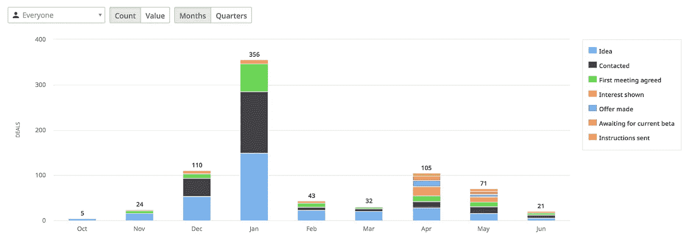

# 你能“按常规”验证一个创业想法吗？下面是 Outfunnel 是如何开始的

> 原文：<https://medium.com/hackernoon/can-you-validate-a-startup-idea-by-the-book-heres-how-outfunnel-got-started-70e490fd5c40>

现在是 2017 年 9 月。我刚刚辞去了销售 CRM 公司 [Pipedrive](https://www.pipedrive.com) 的营销主管这份令人兴奋的工作。我对应该存在的营销工具有一个相当模糊的想法，但我不想浪费我自己或他人的时间。(这些年来，我已经在 4-5 个 wantrepreneurship 项目上浪费了足够多的时间。我做好了失败的准备，但如果我失败了，我希望这是一个比“哎呀，看来我们已经建立的产品不需要了”更好的理由。

我知道我需要证实这个想法。这意味着我需要与大量相关人员交谈，我需要一个好的系统来完成这项工作。事情是这样的。

# **我是如何找到谈话对象名单的**

我想和不同岗位的人交流，因为我不确定该解决哪个具体问题。这个问题需要精确，因为已经有 7000 种营销工具。

我还想与多个国家的人交谈，最好是电话和面对面采访的良好结合，以便更好地了解我的目标客户。

当时，我在 LinkedIn 上有 1700 个左右的联系人，快速浏览一下就能发现 a .那里有些人可能是目标受众 b .我并不真正了解他们中的大多数人。

所以我把我的 LinkedIn 一级联系人下载成了电子表格。我在寻找首席执行官、企业家、销售和营销领导以及商业顾问。浏览这份名单，我留下了大约 120 个联系人，我将它们导入到我的 CRM 工具中。从那里开始新的对话非常容易，因为我已经有了所有的联系方式和浏览列表时的笔记。

(请注意，自 2018 年 11 月起，LinkedIn 不再将电子邮件地址作为包含字段，这既是好消息，也是坏消息)。

第二，每当我想起并敢于做介绍时，我就要求介绍。通常回答是礼貌的“不确定”，但总的来说，不管你是面对面聊天、打电话还是发邮件，古老的公理“问一问没有坏处”仍然有效。几个人把我的要求告诉了他们所属的营销或创业团队，这让我获得了 5+条可靠的线索。

第三，我有一些演讲演出，我知道我会通过这种方式认识一些全新的人。因此，我用一些自动化功能设置了联系人捕获表单，我将在下面进行描述。

第四，我从社交媒体和一个相关的脸书团体的相关对话中收集了一些联系人。

第五，我还用谷歌广告把一些人逼到了测试版登陆页面。

# **我如何使用 Pipedrive、Calendly、Zapier 和其他工具实现工作流程自动化**

我首先将我所有的潜在面试者整理到 Pipedrive 中，因为我希望所有的信息都在一个地方，并且我希望能够跟踪我的进展。

当我给人们发电子邮件时，我几乎总是会添加一个[日历](http://calendly.com)链接，这样那些有兴趣和我交谈的人就可以选择一个合适的位置，而不需要背面和价值。瞧啊。只要我坚持每天做 10 次以上的第一步，面试就开始出现在我的日历上。我至少跟踪了一次没有回音的人，给我真正想联系的人发了五封邮件。

为了从演讲演出和其他来源获取入站兴趣，我用 [Voog](https://www.voog.com/) 建立了一个简单的登录页面，并添加了一个纸质表单注册表单。当人们注册时，他们的数据会自动发送到滴滴，这样他们就会收到一封欢迎邮件和一封后续邮件。如果他们打开这两封邮件中的任何一封，他们的数据就会被发送到我的客户开发渠道的创意阶段。然后，我可以联系那些看起来半认真地想要改进漏斗游戏的人。

事实证明，在注册表单中询问资格确认问题非常有用。我询问了他们的主要营销挑战和他们使用的营销工具，这两者都有助于后来理解哪些潜在客户值得追逐，谁“只是看看而已”

# **我是如何进行采访的**

我从第一天开始就在学习，但我也觉得在我的一些对话中我没有尽可能地利用时间。然后有人向我推荐了[《妈妈测试》](http://momtestbook.com/)，这是一本漂亮、简洁、不乏味的关于客户访谈的书。我也读过《顿悟的四个步骤》,但后者比大多数纳税申报更枯燥，所以我更喜欢《妈妈测试》。

如果我可以尝试用一句话来总结“妈妈测试”，那就是*“不要相信他们说的话，只关注他们已经做了什么和正在做什么。”好了，我帮你节省了 10 美元和几个小时的阅读时间。(但我还是建议买这本书)。*

我想分享的一个元学习是，如果我只是做笔记，而不是从这些笔记中创建结构化数据，那么在短时间内进行 100 多次对话将是浪费时间。

每次电话或会议后，或者在一天结束时记忆犹新的时候，我都会把笔记输入 Pipedrive。我还在 Pipedrive 中设置了一些自定义字段，这样我以后就可以有直升机视图的洞察力。更具体地说，我打算在每次面试中填写以下字段:

*   **主要挑战**，或此人表达的核心业务需求(或有时由您的真实推断)
*   **惊人的见解。**我对竞争对手、未来可能的功能或服务有任何意想不到的了解
*   **需要**。可能对该公司有用的(我的计划产品的)特征

我还收集了销售和营销、行业和销售线索来源中使用的工具的数据。

# **在大约 30 场面试中，我碰壁了**

事情开始得很好。不乐观但很好。我走出了我的舒适区，做冷方法。我开始接受采访和进行对话，其中一些是和非常聪明有趣的人。

我在问有用的问题，并得到有见地的答案。我在做笔记和创建结构化数据。

一个小问题是:我并没有更进一步了解要造什么，以及我是否应该造点什么，或者只是找份工作。

我收集的见解无处不在。我与之交谈的人有着非常不同的渠道、目标和关注点。几乎没有共同的线索。经过大约 30 次对话，我觉得我应该开发 30 种不同的产品。

疑虑开始潜伏在我脑海的角落。也许我不擅长客户开发？或者企业家精神..

我记得一个客户研究公理，你应该继续做采访，直到你得到的答案开始重复，所以我继续下去。幸运的是，围绕几个相关主题的回答很快开始重复。大约在第 70 次面试的时候，我已经有了一个很好的想法。

# 所以我进行了 100 次采访。接下来发生了什么？

首先，我们来看一些数字，如果你使用 Pipedrive 这样的 CRM 工具，这很容易。正如你所看到的，我整理了一份 317 人的联系名单，我和其中三分之二的人取得了联系。大约一半的人作出了回应，可以和我聊天了。在这些受访者中，有 58 人的需求没有得到满足，而这些需求本来可以通过我为 Outfunnel 设计的产品功能之一来解决。

接下来，我联系了其中的 21 个人，邀请他们试用我们的早期测试版，但迄今为止只有其中一个人开始付费订阅。我想这证明了我之前的观点，人们做的和他们说的很不一样。

正如你所看到的，我从去年 11 月开始，在 12 月全速前进，但是随着圣诞节的临近，速度慢了下来。(更多的情况是人们不想和我说话，而不是相反)。

一月份是一个面试满满的月份，我的记录是每天 10 个预定的面试。我之前提到的低迷也出现在一月份，几周后就消失了。到二月初，我已经对构建什么有了一个很好的想法，当我把注意力转移到寻找帮助我构建原型的人时，我在二月和三月继续做一些拓展和采访。

我们在 4 月份开始建设，我开始重新接触一些人，提议他们试用我们在 5 月份推出的测试版。

8 月份，我们推出了我们的[网络跟踪功能](https://outfunnel.com/web-tracking-future-vision/)，在我们建立以销售为中心的营销工具的其余部分的时候，我没有停止过与客户的讨论。

# **大团圆结局？**

客户开发过程和这篇文章有一个美好的结局。我验证了这个问题，一些解决方案的想法，我们建立并推出了一个原型。我们现在有 50 多个付费客户在使用 Outfunnel，我们已经从顶级投资者那里筹集了一轮种子资金，所以我们可以继续前进。

问题是，这远不是一个快乐或任何其他类型的 Outfunnel 的结局。很高兴已经推出了一些东西，并看到几十家公司使用该产品，但这篇文章中描述的过程的结束只是 Outfunnel 的开始——所以祝我好运吧。

我希望这个故事对你有用。如果你想为 Outfunnel 的其他故事做出贡献，请[联系](mailto:andrus@outfunnel.com)。

PS。我们在招人！我们目前有五个人以不同的方式参与 Outfunnel，我们正在积极寻找早期员工，甚至是已故的联合创始人。在接下来的六个月里，我们需要雇佣[前端开发人员](https://outfunnel.com/senior-front-end-developer/)、全栈工程师、产品经理、设计师、营销人员和客户成功人士。理想的是喜欢营销和营销自动化的人。(我猜这可能会排除我们雇佣系统操作员的可能性……)

*这篇文章基于我最近在 SaaStock 的演讲和我个人博客* 上的

*[Alex Iby](https://unsplash.com/photos/dGDmRqzPID0?utm_source=unsplash&utm_medium=referral&utm_content=creditCopyText) 在 [Unsplash](https://unsplash.com/search/photos/path?utm_source=unsplash&utm_medium=referral&utm_content=creditCopyText) 上拍摄的照片*