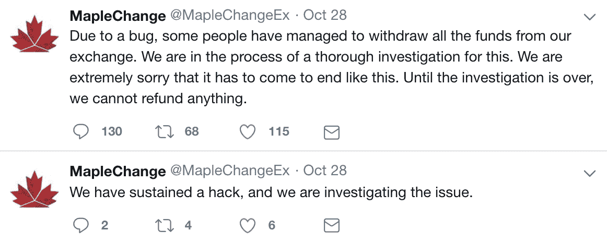
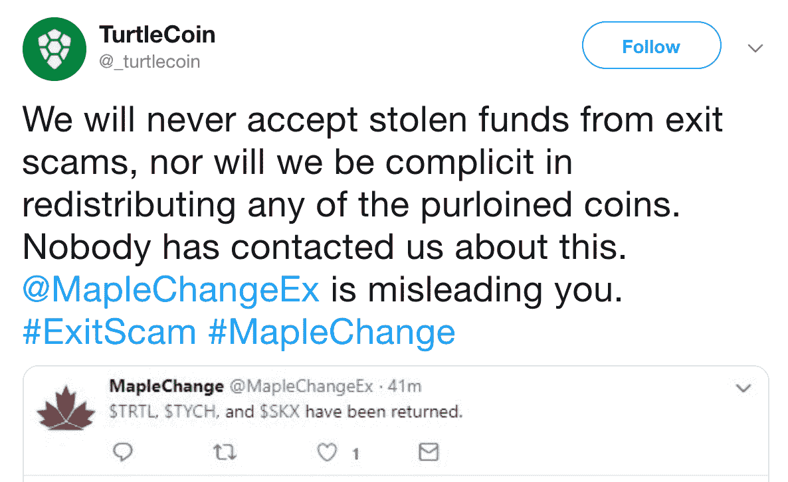
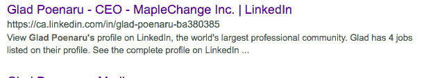
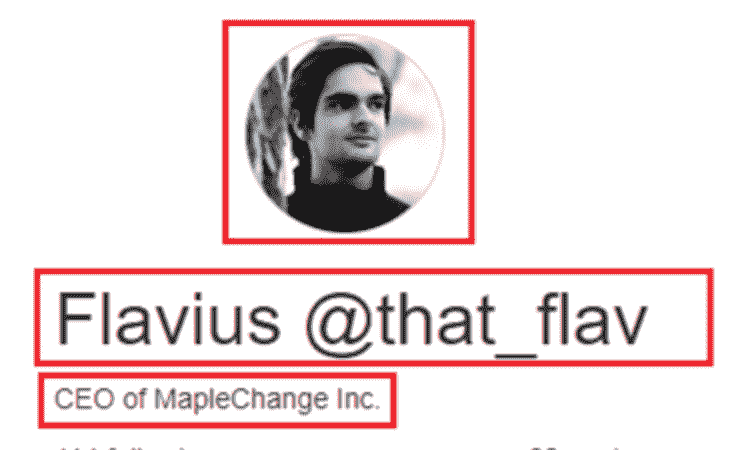

# 一个加拿大的密码交易所窃取了它所有的用户资金吗？

> 原文：<https://medium.com/hackernoon/canadian-crypto-exchange-steals-all-user-funds-6c98441e30d5>

## 加拿大刚刚重新谈判北美自由贸易协定，大麻合法化，现在是加密的最新退出骗局的现场

加拿大的一个小型加密交易所正在叫嚣“黑客入侵”,但看起来他们完成了一个退出骗局，价值约 600 万美元的 T2 比特币消失了。

退出骗局是指交易所建立起用户加密储备，然后声称资金被盗，而实际上创始人已经控制了硬币。

# 细节

10 月 28 日，MapleChange 的市场被操纵，用户的硬币被强制兑换成 BTC。该交易所的官方推特账户随后发布了以下推文:

在一条后来被删除的推文中，MapleChange 荒谬地声称，由于黑客攻击，该交易所将关闭，不偿还任何人，并关闭其社交媒体账户。

> “因为我们没有更多的资金偿还任何人，交易所不得不不幸关闭。这包括我们所有的社交媒体。”

# 更多的谎言

MapleChange 已重新激活其 twitter 账户，以努力为自己辩护，并声称一些较小的替代硬币已退还给领导这些项目的开发商。虽然这一说法已经被驳斥，但据推测他们返回的一个 alt 在推特上写道:

# 谁是幕后黑手？

虽然位于埃德蒙顿的交易所在其网站上没有公共团队，但互联网上的好心人决定进行调查，并设法找到了创始人。Glad 和 Flavius Poenaru 两兄弟已经清理了他们的 Linkedin 和社交媒体页面，但仍有一些链接。

一个名为 [@maplechang'ed](https://twitter.com/Maplechanged) 的 twitter 账户，在向臭名昭著的 Bitfinex/Tether sleuth[Bitfinex ' ed](https://twitter.com/Bitfinexed)致敬的过程中，一直带头揭露 MapleChange 是一个退出骗局。如果你感兴趣或者个人受到黑客攻击的影响，可以查看他们的账户更新。

小型加密交易所 100%专注于最大化盈利能力，而不是安全性，因为它们通常没有监管。与此形成对比的是，日本的交易所 Zaif 和 Coincheck 在被黑客攻击后都与当地政府合作，帮助追回被盗资金。

# 如何保护自己

目前的证据表明 MapleChange 是一个骗局，但即使这只是一个沟通不畅的黑客攻击，类似的教训也适用:

## 避免低容量交换

*   历史上，日交易量较高的交易所更有可能在遭遇黑客攻击后偿还用户。

## 避免与历史黑客交流

*   过去遭受黑客攻击的交易所更有可能再次遭受攻击。

## 使用做 KYC 的交易所

*   对用户执行 KYC 的交易所不太可能被监管机构关闭或冻结资产。

## 可能的话，为你的交易所资产投保

*   [将于明年推出的 CDx 协议](/cdx-project/everything-you-need-to-know-about-cdx-updated-regularly-41c5467c7a84)，将允许用户在交易所交易保险，保护用户免受黑客攻击和退出欺诈。