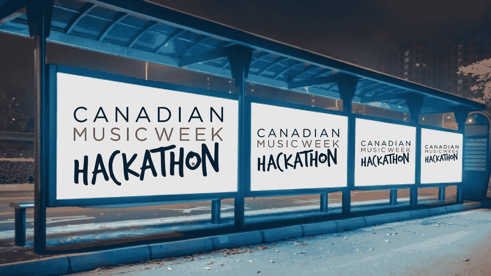

# 加拿大音乐周黑客马拉松快到了！

> 原文：<https://medium.com/hackernoon/canadian-music-week-hackathon-is-approaching-914dd392b33e>

An event filled with Music, Blockchain, AI and VR = A once-in-a-lifetime opportunity!

5 月 8 日对于所有铁杆黑客、区块链极客和虚拟现实专家来说将是一个非同寻常的时刻。这将是最勇敢的球员(勇士)在几个小时的艰苦工作后寻求赢得一切的地方，在这里血、汗和泪将被展示。好吧，也许不是血，但会有所收获的。加拿大音乐周很荣幸举办他们的第一次年度黑客马拉松！

加拿大音乐周黑客马拉松将有 24 小时的紧张工作、辩论、头脑风暴、创新、友情和乐趣。如果你是音乐、VR/AR、区块链或人工智能方面的专家，并且是编码、开发、黑客或只是设计方面的奇才，那么这就是你全力以赴的地方！[每个团队都被邀请](https://www.eventbrite.com/e/canadian-music-week-hackathon-tickets-44951552303)制定问题的解决方案，并创造推动音乐产业前进的新途径。

此外，黑客马拉松将由业内知名的几个知名人士担任评委:受人尊敬的评委包括**杰伊·罗森茨威格**(罗森茨威格&公司的首席执行官)**乔迪·科维兹**(# movethe dial 的创始人&首席执行官)**肖恩·威尔逊**(Muzooka 的首席执行官)**格雷格·尼斯贝特**(MEDIAZOIC 的创始人&首席执行官)**大卫·杜弗伦(**帕纳的合伙人)黑客马拉松的主持人包括 Travis Laurendine，他已经为 SXSW 、Outside Lands、Bonnaroo、White House、Super Bowl 等组织了黑客马拉松。

更不用说，我很自豪成为将在五月份报道黑客马拉松的两位 Hacker Noon 作者之一。我的同事亚当·温菲尔德将是第二个参与撰写这一年一度的事件的人。为黑客中午的机会干杯！

因此，对于所有愿意接受挑战的黑客来说，请确保在活动门票售罄之前，迅速找到你的团队并[注册](https://www.eventbrite.com/e/canadian-music-week-hackathon-tickets-44951552303)！你还在等什么？*获取编程！*